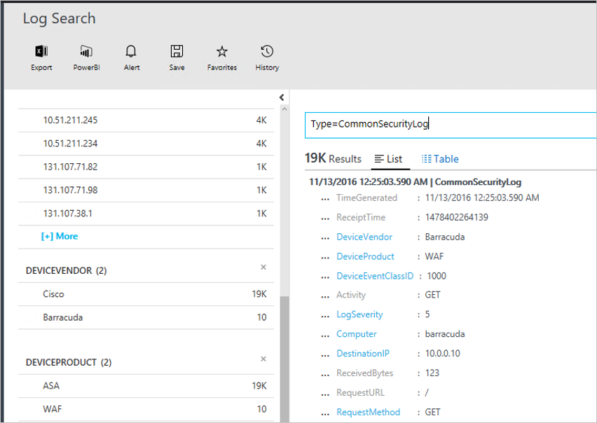

# Connecting your security products to the Operations Management Suite (OMS) Security and Audit Solution 
This document helps you connect your security products into the OMS Security and Audit Solution. The following sources are supported:

- Common Event Format (CEF) events
- Cisco ASA events


## What is CEF?
Common Event Format (CEF) is an industry standard format on top of Syslog messages, used by many security vendors to allow event interoperability among different platforms. OMS Security and Audit Solution support data ingestion using CEF, which enables you to connect your security products with OMS Security. 

By connecting your data source to OMS, you are able to take advantage of the following capabilities that are part of this platform:

- Search & Correlation
- Auditing
- Alert
- Threat Intelligence
- Notable Issues

## Collection of security solution logs

OMS Security supports collection of logs using CEF over Syslogs and [Cisco ASA](https://blogs.technet.microsoft.com/msoms/2016/08/25/add-your-cisco-asa-logs-to-oms-security/) logs. In this example, the source (computer that generates the logs) is a Linux computer running syslog-ng daemon and the target is OMS Security. To prepare the Linux computer you will need to perform the following tasks:

- Download the OMS Agent for Linux, version 1.2.0-25 or above.
- Follow the section **Quick Install Guide** from [this article](https://github.com/Microsoft/OMS-Agent-for-Linux/blob/master/docs/OMS-Agent-for-Linux.md#steps-to-install-the-oms-agent-for-linux) to install and onboard the agent to your workspace.

Typically, the agent is installed on a different computer from the one on which the logs are generated. Forwarding the logs to the agent machine will usually require the following steps:

- Configure the logging product/machine to forward the required events to the syslog daemon (rsyslog or syslog-ng) on the agent machine.
- Enable the syslog daemon on the agent machine to receive messages from a remote system.

On the agent machine, the events need to be sent from the syslog daemon to local UDP port 25226. The agent is listening for incoming events on this port. The following is an example configuration for sending all events from the local system to the agent (you can modify the configuration to fit your local settings):

1. Open the terminal window, and go to the directory */etc/syslog-ng/* 
2. Create a new file *security-config-omsagent.conf* and add the following content:
	OMS_facility = local4
	
	filter f_local4_oms { facility(local4); };

	destination security_oms { tcp("127.0.0.1" port(25226)); };

	log { source(src); filter(f_local4_oms); destination(security_oms); };
	
3. Download the file *security_events.conf* and place at */etc/opt/microsoft/omsagent/conf/omsagent.d/* in the OMS Agent computer.
4. Type the command below to restart the syslog daemon:
	*For syslog-ng run:*
	
	```
	sudo service rsyslog restart
	```

	*For rsyslog run:*
	
	```
	/etc/init.d/syslog-ng restart
	```
5. Type the command below to restart the OMS Agent:

	*For syslog-ng run:*
	
	```
	sudo service omsagent restart
	```

	*For rsyslog run:*
	
	```
	systemctl restart omsagent
	```
6. Type the command below and review the result to confirm that there are no errors in the OMS Agent log:

	```	
	tail /var/opt/microsoft/omsagent/log/omsagent.log
	```

## Reviewing collected security events

After the configuration is over, the security event will start to be ingested by OMS Security. To visualize those events, open the Log Search, type the command *Type=CommonSecurityLog* in the search field and press ENTER. The following example shows the result of this command, notice that in this case OMS Security already ingested security logs from multiple vendors:
   


You can refine this search for one single vendor, for example, to visualize online Cisco logs, type: *Type=CommonSecurityLog DeviceVendor=Cisco*. The “CommonSecurityLog” has predefined fields for any CEF header including the basic extensios, while any other extension whether it’s “Custom Extension” or not, will be inserted into "AdditionalExtensions" field. You can use the Custom Fields feature to get dedicated fields from it. 

### Accessing computers missing baseline assessment
OMS supports the domain member baseline profile on Windows Server 2008 R2 up to Windows Server 2012 R2. Windows Server 2016 baseline isn’t final yet and will be added as soon as it is published. All other operating systems scanned via OMS Security and Audit baseline assessment appear under the **Computers missing baseline assessment** section.

## See also
In this document, you learned how to connect your CEF solution to OMS. To learn more about OMS Security, see the following articles:

* [Operations Management Suite (OMS) overview](operations-management-suite-overview.md)
* [Monitoring and Responding to Security Alerts in Operations Management Suite Security and Audit Solution](oms-security-responding-alerts.md)
* [Monitoring Resources in Operations Management Suite Security and Audit Solution](oms-security-monitoring-resources.md)

