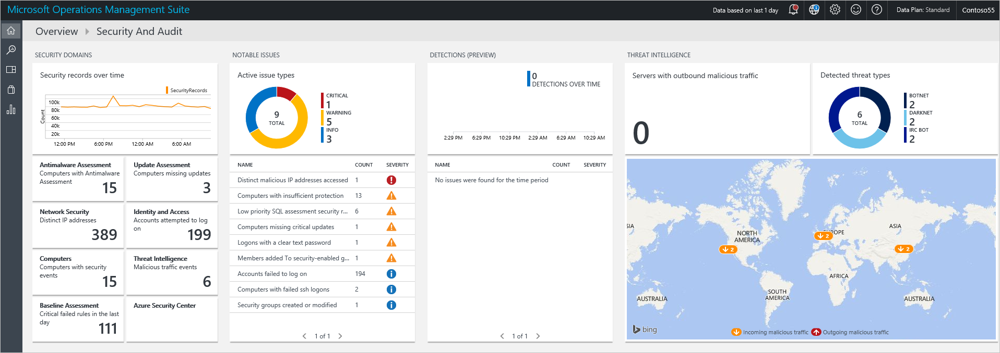
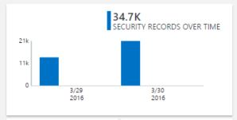
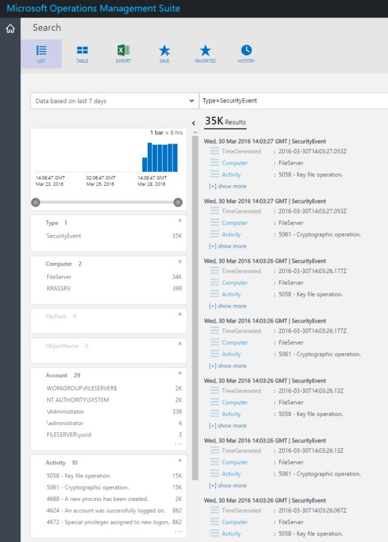
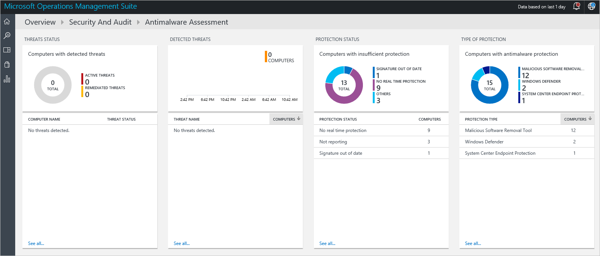
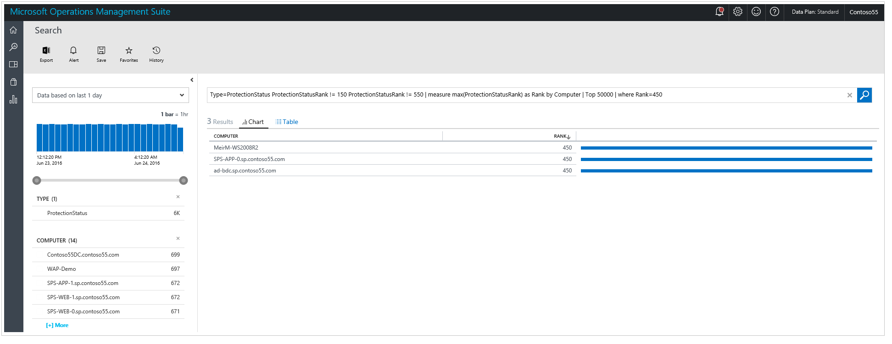
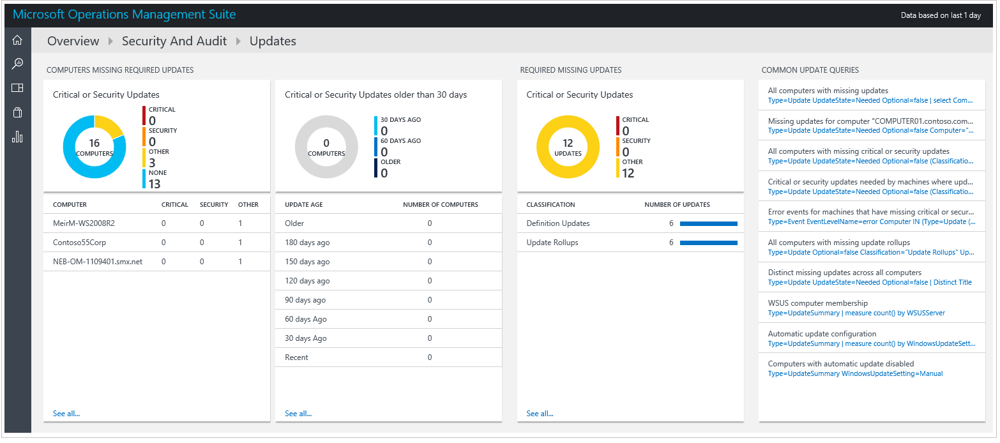
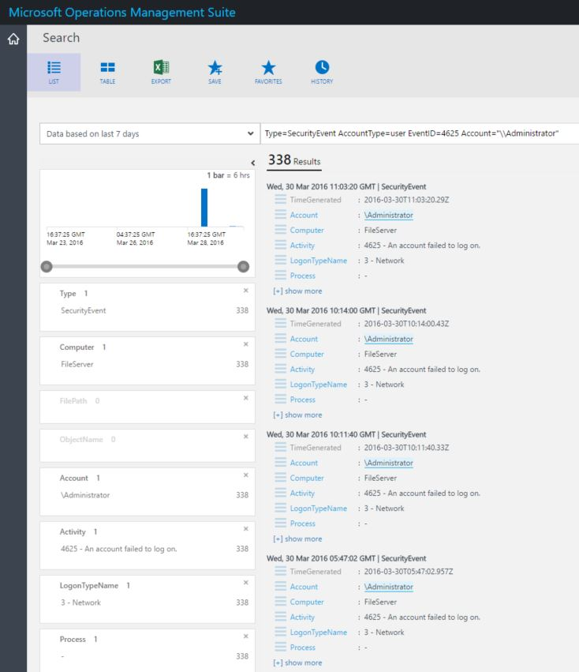
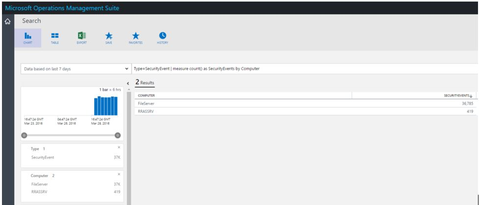
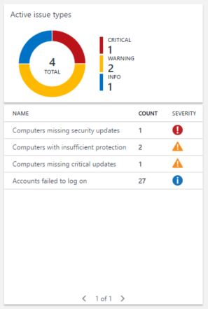
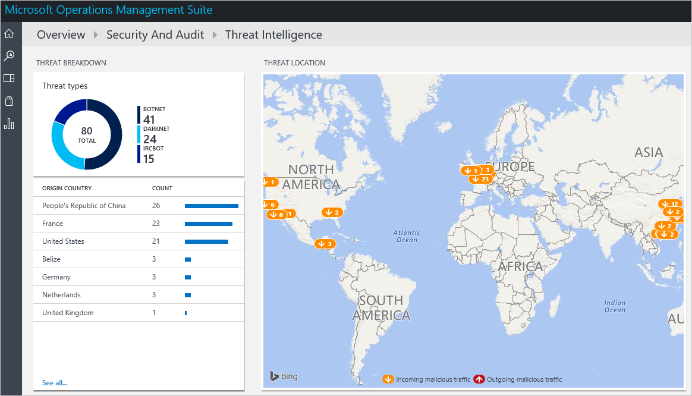

<properties
   pageTitle="Getting started with Operations Management Suite Security and Audit Solution | Microsoft Azure"
   description="This document helps you to get started with Operations Management Suite Security and Audit solution capabilities to monitor your hybrid cloud."
   services="operations-management-suite"
   documentationCenter="na"
   authors="YuriDio"
   manager="swadhwa"
   editor=""/>

<tags
   ms.service="operations-management-suite"
   ms.topic="get-started-article" 
   ms.devlang="na"
   ms.tgt_pltfrm="na"
   ms.workload="na"
   ms.date="08/02/2016"
   ms.author="yurid"/>
 
# Getting started with Operations Management Suite Security and Audit Solution
This document helps you get started quickly with Operations Management Suite (OMS) Security and Audit solution capabilities by guiding you through each option.

## What is OMS?
Microsoft Operations Management Suite (OMS) is Microsoft's cloud based IT management solution that helps you manage and protect your on-premises and cloud infrastructure. For more information about OMS, read the article [Operations Management Suite](https://technet.microsoft.com/library/mt484091.aspx).

## OMS Security and Audit dashboard

The OMS Security and Audit solution provides a comprehensive view into your organization’s IT security posture with built-in search queries for notable issues that require your attention. The **Security and Audit** dashboard is the home screen for everything related to security in OMS. It provides high-level insight into the security state of your computers. It also includes the ability to view all events from the past 24 hours, seven days or any other custom time frame. To access the **Security and Audit** dashboard, follow the steps below:

1. In the **Microsoft Operations Management Suite** main dashboard click **Settings** tile in the left.
2. In the **Settings** blade, under **Solutions** click **Security and Audit** option.
3. The **Security and Audit** dashboard will appear as shown below:

	

If you are accessing this dashboard for the first time and you don’t have devices monitored by OMS, the tiles will not be populated with data obtained from the agent. Once you install the agent, it can take some time to populate, therefore what you see initially may be missing some data as they are still uploading to the cloud.  In this case it will be normal to see some tiles without tangible information. Read [Connect Windows computers directly to OMS](https://technet.microsoft.com/library/mt484108.aspx) for more information on how to install OMS agent in a Windows system and [Connect Linux computers to OMS](https://technet.microsoft.com/library/mt622052.aspx) for more information on how to perform this task in a Linux system.

> [AZURE.NOTE] The agent will collect the information based on the current events that are enabled, for instance computer name, IP address and user name. However no document/files, database name or private data are collected.   

Solutions are a collection of logic, visualization and data acquisition rules that address key customer challenges. Security and Audit is one solution, others can be added separately. Read the article [Add solutions](https://technet.microsoft.com/library/mt674635.aspx) for more information on how to add a new solution.

The OMS Security and Audit dashboard is organized in four major categories:

- **Security Domains**: in this area you will be able to further explore security records over time, access malware assessment, update assessment, network security, identity and access information, computers with security events and quickly have access to Azure Security Center dashboard.
- **Notable Issues**: this option will allow you to quickly identify the amount of active issues and the severity of these issues.
- **Threat Intelligence**: enables you to identify attack patterns by visualizing the total number of servers with outbound malicious IP traffic, the malicious threat type and a map that shows where these IPs are coming from. 
- **Common security queries**: this option provides you a list of the most common security queries that you can use to monitor your environment. When you click in one of those queries, it will open the Search blade with the results for that query.

> [AZURE.NOTE] for more information on how OMS keeps your data secure, read How OMS secures your data.

## Security domains

When monitoring resources, it is important to be able to quickly access the current state of your environment. However it is also important to be able to track back events that occurred in the past that can lead to a better understanding of what’s happening in your environment at certain point in time. 

> [AZURE.NOTE] data retention is according to the OMS pricing plan. For more information visit the [Microsoft Operations Management Suite](https://www.microsoft.com/server-cloud/operations-management-suite/pricing.aspx) pricing page.

Incident response and forensics investigation scenarios will directly benefit from the results available in the **Security Records over Time** tile.

When you click on this tile, the **Search** blade will open, showing a query result for **Security Events** (Type=SecurityEvents) with data based on the last seven days, as shown below:

The search result is divided in two panes: the left pane gives you a breakdown of the amount of security events that were found, the computers in which these events were found, the amount of accounts that were discovered in these computers and the types of activities. The right pane provides you the total results and a chronological view of the security events with the computer’s name and event activity. You can also click **Show More** to view more details about this event, such as the event data, the event ID and the event source.

> [AZURE.NOTE] for more information about OMS search query, read [OMS search reference](https://technet.microsoft.com/library/mt450427.aspx).

### Antimalware assessment

This option enables you to quickly identify computers with insufficient protection and computers that are compromised by a piece of malware. Malware assessment status and detected threats on the monitored servers are read, and then the data is sent to the OMS service in the cloud for processing. Servers with detected threats and servers with insufficient protection are shown in the malware assessment dashboard, which is accessible after you click in the **Antimalware Assessment** tile. 

Just like any other live tile available in OMS Dashboard  , when you click on it, the **Search** blade will open with the query result. For this option, if you click in the **Not Reporting** option under **Protection Status**, you will have the query result that shows this single entry that contains the computer’s name and its rank, as shown below:

> [AZURE.NOTE] *rank* is a grade giving to reflect the status of the protection (on, off, updated, etc) and threats that are found. Having that as a number helps to make aggregations.

If you click in the computer’s name, you will have the chronological view of the protection status for this computer. This is very useful for scenarios in which you need to understand if the antimalware was once installed and at some point it was removed.   

### Update assessment 

This option enables you to quickly determine the overall exposure to potential security problems, and whether or how critical these updates are for your environment. OMS Security and Audit solution only provides the visualization of these updates, the real data comes from [System Updates Solutions](https://technet.microsoft.com/library/mt484096.aspx), which is a different module within OMS. Here an example of the updates:

> [AZURE.NOTE] for more information about Updates solution, read [Update servers with the System Updates solution](https://technet.microsoft.com/library/mt484096.aspx).

### Identity and Access

Identity should be the control plane for your enterprise, protecting your identity should be your top priority. While in the past there were perimeters around organizations and those perimeters were one of the primary defensive boundaries, nowadays with more data and more apps moving to the cloud the identity becomes the new perimeter. 

> [AZURE.NOTE] currently the data is based only on Security Events login data (event ID 4624) in the future Office365 logins and Azure AD data will also be included.

By monitoring your identity activities you will be able to take proactive actions before an incident takes place or reactive actions to stop an attack attempt. The **Identity and Access** dashboard provides you an overview of your identity state, including the amount of failed attempts to logon, the user’s account that were used during those attempts, accounts that were locked out, accounts with changed or reset password and currently amount of accounts that are logged in. 

When you click in the **Identity and Access** tile you will see the following dashboard:

The information available in this dashboard can immediately assist you to identify a potential suspicious activity. For example, there are 338 attempts to logon as **Administrator** and 100% of these attempts failed. This can be caused by a brute force attack against this account. If you click on this account you will obtain more information that can assist you to determine the target resource for this potential attack:

The detailed report provides important information about this event, including: the target computer, the type of logon (in this case Network logon), the activity (in this case event 4625) and a comprehensive timeline of each attempt. 

### Computers

This tile can be used to access all computers that actively have security events. When you click in this tile you will see the list of computers with security events and the amount of events on each computer:

You can continue your investigation by clicking on each computer and review the security events that were flagged.

### Azure Security Center

This tile is basically a shortcut to access Azure Security Center dashboard. Read [Getting started with Azure Security Center](../security-center/security-center-get-started.md) for more information about this solution.

## Notable issues

The main intent of this group of options is to provide a quick view of the issues that you have in your environment, by categorizing them in Critical, Warning and Informational. The Active issue type tile it’s a visualization of these issues, but it doesn’t allow you to explore more details about them, for that you need to use the lower part of this tile that has the name of the issue (NAME), how many objects had this happen (COUNT) and how critical it is (SEVERITY).

You can see that these issues were already covered in different areas of the **Security Domains** group, which reinforces the intent of this view: visualize the most important issues in your environment from a single place. 

## Threat Intelligence

The new threat intelligence section of the Security and Audit solution visualizes the possible attack patterns in several ways: the total number of servers with outbound malicious IP traffic, the malicious threat type and a map that shows where these IPs are coming from  . You can interact with the map and click on the IPs for more information.

Yellow pushpins on the map indicate incoming traffic from malicious IPs. It is not uncommon for servers that are exposed to the internet to see incoming malicious traffic, but we recommend reviewing these attempts to make sure none of them was successful. These indicators are based on IIS logs, WireData and Windows Firewall logs.  

## Common security queries

The list of common security queries available can be useful for you to rapidly access resource’s information and customize it based on your environment’s needs. These common queries are:

- All Security Activities
- Security Activities on the computer "computer01.contoso.com" (replace with your own computer name)
- Security Activities on the computer "computer01.contoso.com" for account "Administrator" (replace with your own computer and account names)
- Logon Activity by Computer
- Accounts who terminated Microsoft antimalware on any computer
- Computers where the Microsoft antimalware process was terminated
- Computers where "hash.exe" was executed (replace with different process name)
- All Process names that were executed
- Logon Activity by Account
- Accounts who remotely logged on the computer "computer01.contoso.com" (replace with your own computer name)

## See also

In this document, you were introduced to OMS Security and Audit solution. To learn more about OMS Security, see the following articles:

- [Operations Management Suite (OMS) overview](operations-management-suite-overview.md)
- [Monitoring and Responding to Security Alerts in Operations Management Suite Security and Audit Solution](oms-security-responding-alerts.md)
- [Monitoring Resources in Operations Management Suite Security and Audit Solution](oms-security-monitoring-resources.md)
