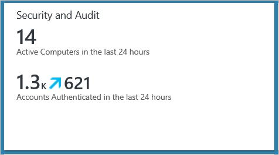
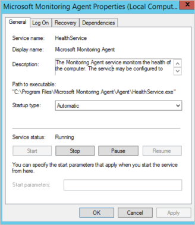
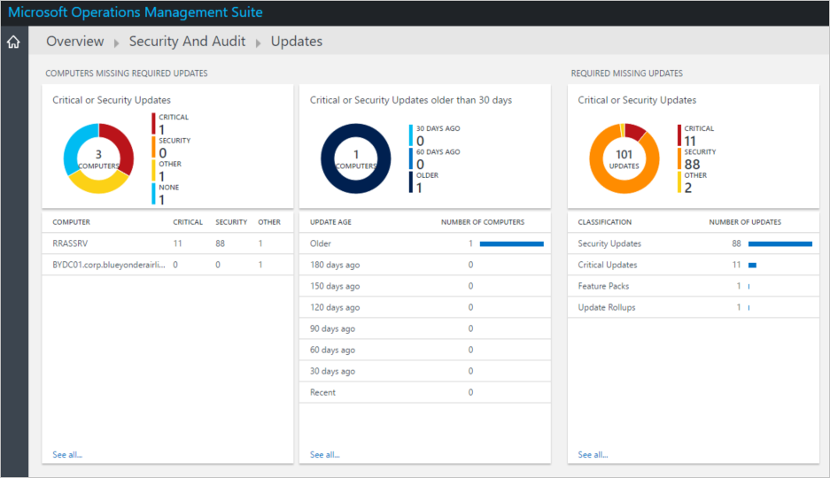
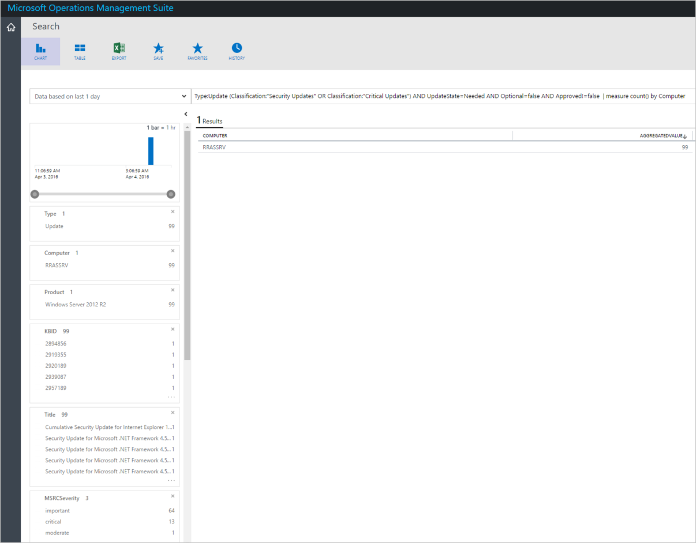
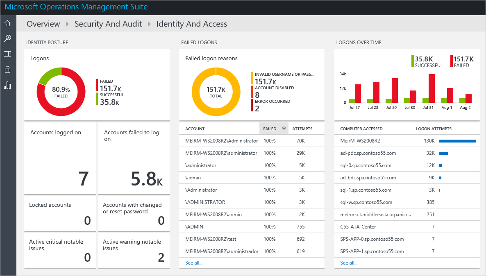
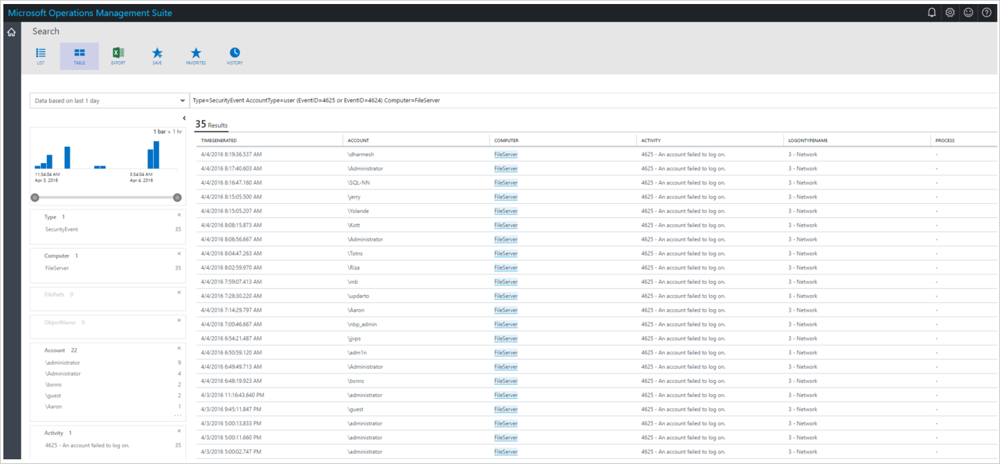

<properties
   pageTitle="Monitoring Resources in Operations Management Suite Security and Audit Solution | Microsoft Azure"
   description="This document helps you to use OMS Security and Audit capabilities to monitor your resources and identify security issues."
   services="operations-management-suite"
   documentationCenter="na"
   authors="YuriDio"
   manager="swadhwa"
   editor=""/>

<tags
   ms.service="operations-management-suite"
   ms.topic="article" 
   ms.devlang="na"
   ms.tgt_pltfrm="na"
   ms.workload="na"
   ms.date="08/02/2016"
   ms.author="yurid"/>

# Monitoring resources in Operations Management Suite Security and Audit Solution

This document helps you use OMS Security and Audit capabilities to monitor your resources and identify security issues.

## What is OMS?

Microsoft Operations Management Suite (OMS) is Microsoft's cloud based IT management solution that helps you manage and protect your on-premises and cloud infrastructure. For more information about OMS, read the article [Operations Management Suite](https://technet.microsoft.com/library/mt484091.aspx).

## Monitoring resources

Whenever is possible, you will want to prevent security incidents from happening in the first place. However, it is impossible to prevent all security incidents. When a security incident does happen, you will need to ensure that its impact is minimized.  There are three critical recommendations that can be used to minimize the number and the impact of security incidents:

- Routinely assess vulnerabilities in your environment.
- Routinely check all computer systems and network devices to ensure that they have all of the latest patches installed.
- Routinely check all logs and logging mechanisms, including operating system event logs, application specific logs and intrusion detection system logs.

OMS Security and Audit solution enables IT to actively monitor all resources, which can help minimize the impact of security incidents. OMS Security and Audit has security domains that can be used for monitoring resources. The security domains provides quick access to a options, for security monitoring the following domains will be covered in more details:

- Malware assessment
- Update assessment
- Identity and Access

> [AZURE.NOTE] for an overview of all these options, read [Getting started with Operations Management Suite Security and Audit Solution](oms-security-getting-started.md).

### Monitoring system protection

In a defense in depth approach, every layer of protection is important for the overall security state of your asset. Computers with detected threats and computers with insufficient protection are shown in the Malware Assessment tile under Security Domains. By using the information on the Malware Assessment, you can identify a plan to apply protection to the servers that need it. To access this option follow the steps below:

1. In the **Microsoft Operations Management Suite** main dashboard click **Security and Audit** tile.

	

2. In the **Security and Audit** dashboard, click **Antimalware Assessment** under **Security Domains**. The **Antimalware Assessment** dashboard appears as shown below:

You can use the **Malware Assessment** dashboard to identify the following security issues:

- **Active threats**: computers that were compromised and have active threats in the system.
- **Remediated threats**: computers that were compromised but the threats were remediated.
- **Signature out of date**: computers that have malware protection enabled but the signature is out of date.
- **No real time protection**: computers that don’t have antimalware installed.

### Monitoring updates 

Applying the most recent security updates is a security best practice and it should be incorporated in your update management strategy. Microsoft Monitoring Agent service (HealthService.exe) reads update information from monitored computers and then sends this updated information to the OMS service in the cloud for processing. The Microsoft Monitoring Agent service is configured as an automatic service and it should be always running in the target computer.

Logic is applied to the update data and the cloud service records the data. If missing updates are found, they are shown on the **Updates** dashboard. You can use the **Updates** dashboard to work with missing updates and develop a plan to apply them to the servers that need them. Follow the steps below to access the **Updates** dashboard:

1. In the **Microsoft Operations Management Suite** main dashboard click **Security and Audit** tile.
2. In the **Security and Audit** dashboard, click **Update Assessment** under **Security Domains**. The Update dashboard appears as shown below:

In this dashboard you can perform an update assessment to understand the current state of your computers and address the most critical threats. By using the **Critical or Security Updates** tile, IT administrators will be able to access detailed information about the updates that are missing as shown below:

This report include critical information that can be used to identify the type of threat this system is vulnerable to, which includes the Microsoft KB articles associated with the security update and the MS Bulletin that has more details about the vulnerability.

### Monitoring identity and access

With users working from anywhere, using different devices and accessing a vast amount of cloud and on-premises apps, it is imperative that their credentials are protected. Credential theft attacks are those in which an attacker initially gains access to a regular user’s credentials to access a system within the network. Many times, this initial attack is only a way to get access to the network, the ultimate goal is to discover privilege accounts. 

Attackers will stay in the network, using freely available tooling to extract credentials from the sessions of other logged-on accounts. Depending on the system configuration, these credentials can be extracted in the form of hashes, tickets, or even plaintext passwords.  

> [AZURE.NOTE] machines that are directly exposed to the Internet will see many failed attempts that try to login using all kind of well-known usernames (e.g. Administrator). In most cases it is OK if the well-known usernames are not used and if the password is strong enough.

It is possible to identify these intruders before they compromise a privilege account. You can leverage **OMS Security and Audit Solution** to monitor identity and access. Follow the steps below to access the **Identity and Access** dashboard:

1. In the **Microsoft Operations Management Suite** main dashboard click Security and Audit tile.
2. In the **Security and Audit** dashboard, click **Identity and Access** under **Security Domains**. The **Identity and Access** dashboard appears as shown below:

As part of your regular monitoring strategy, you must include identity monitoring. IT Admin should look if there is a specific valid username that has many attempts. This might indicate either attacker that acquired the real username and try to brute force or an automatic tool that uses hard-coded password that expired.

This dashboard enable IT to quickly identify potential threats related to identity and access to company’s resources. It is particular important to also identify potential trends, for example in the Logons Over Time tile, you can see over period of time how many times a failed logon attempt was performed. In this case the computer **FileServer** received 35 logon attempts. You can explore more details about this computer by clicking on it. 

The report generated for this computer brings valuable details about this pattern. Noticed that the **ACCOUNT** column gives you the user account that was used to try to access the system, the **TIMEGENERATED** column gives you the time interval in which the attempt was done and the **LOGONTYPENAME** column gives you the location where this attempt was done. If these attempts were performed locally in the system by a program, the **PROCESS** column would be showing the process’s name. In scenarios where the logon attempt is coming from a program, you already have the process name available and now you can perform further investigation in the target system.

## See also

In this document, you learned how to use OMS Security and Audit solution to monitor your resources. To learn more about OMS Security, see the following articles:

- [Operations Management Suite (OMS) overview](operations-management-suite-overview.md)
- [Getting started with Operations Management Suite Security and Audit Solution](oms-security-getting-started.md)
- [Monitoring and Responding to Security Alerts in Operations Management Suite Security and Audit Solution](oms-security-responding-alerts.md)
