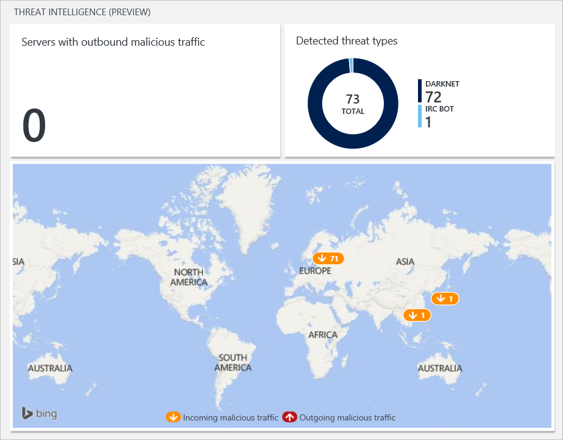
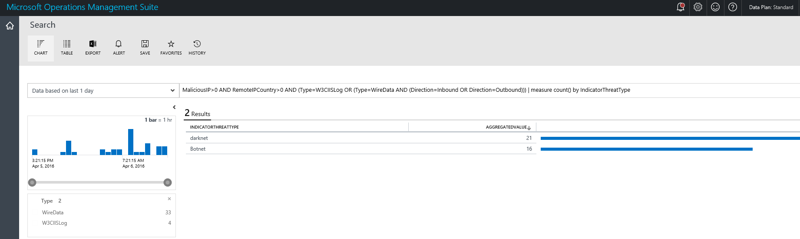
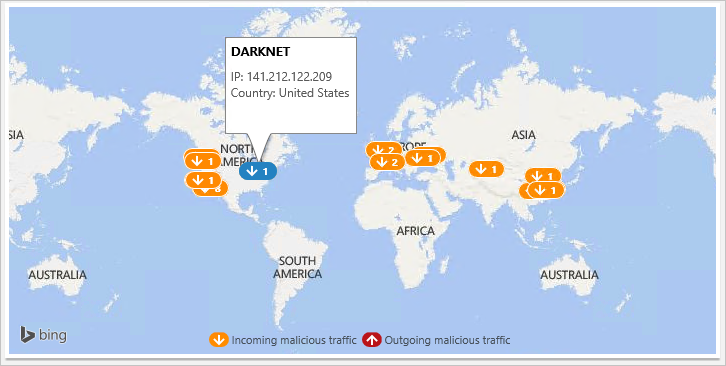

<properties
   pageTitle="Monitoring and Responding to Security Alerts in Operations Management Suite Security and Audit Solution | Microsoft Azure"
   description="This document helps you to use the threat intelligence option available in OMS Security and Audit to monitor and respond to security alerts."
   services="operations-management-suite"
   documentationCenter="na"
   authors="YuriDio"
   manager="swadhwa"
   editor=""/>

<tags
   ms.service="operations-management-suite"
   ms.topic="article" 
   ms.devlang="na"
   ms.tgt_pltfrm="na"
   ms.workload="na"
   ms.date="06/24/2016"
   ms.author="yurid"/>

# Monitoring and responding to security alerts in Operations Management Suite Security and Audit Solution

This document helps you use the threat intelligence option available in OMS Security and Audit to monitor and respond to security alerts.

## What is OMS?

Microsoft Operations Management Suite (OMS) is Microsoft's cloud based IT management solution that helps you manage and protect your on-premises and cloud infrastructure. For more information about OMS, read the article [Operations Management Suite](https://technet.microsoft.com/library/mt484091.aspx).

## Threat intelligence

In an enterprise environment where users have broad access to the network and use a variety of devices to connect to corporate data, it is imperative that you can actively monitor your resources and quickly respond to security incidents. This is particular important from the security lifecycle perspective because some cybersecurity threats may not raise alerts or suspicious activities that can be identified by traditional security technical controls. 

By using the **Threat Intelligence** option available in OMS Security and Audit, IT administrators can identify security threats against the environment, for example, identify if a particular computer is part of a [botnet](https://www.microsoft.com/security/sir/story/default.aspx#!botnetsection). Computers can become nodes in a botnet when attackers illicitly install malware that secretly connects this computer to the command and control. It can also identify potential threats coming from underground communication channels, such as [darknet](https://www.microsoft.com/security/sir/story/default.aspx#!botnetsection_honeypots_darkents). 

In order to build this threat intelligence, OMS Security and Audit use data coming from multiple sources within Microsoft. OMS Security and Audit will leverage this data to identify potential threats against your environment.

The Threat Intelligence pane is composed by three major options:
- Servers with outbound malicious traffic
- Detected threats types
- Threat intelligence map

> [AZURE.NOTE] for an overview of all these options, read [Getting started with Operations Management Suite Security and Audit Solution](oms-security-getting-started.md).

### Responding to security alerts

One of the steps of a [security incident response](https://technet.microsoft.com/library/cc512623.aspx) process is to identify the severity of the compromise system(s). In this phase you should perform the following tasks:

- Determine the nature of the attack
- Determine the attack point of origin
- Determine the intent of the attack. Was the attack specifically directed at your organization to acquire specific information, or was it random?
- Identify the systems that have been compromised
- Identify the files that have been accessed and determine the sensitivity of those files

You can leverage **Threat Intelligence** information in OMS Security and Audit solution to help with these tasks. Follow the steps below to access this **Threat Intelligence** options:

1. In the **Microsoft Operations Management Suite** main dashboard click **Security and Audit** tile.

	

2. In the **Security and Audit** dashboard, you will see the **Threat Intelligence** options in the right, as shown below:

	

These three tiles will give you an overview of the current threats. In the **Server with outbound malicious traffic** you will be able to identify if there is any computer that you are monitoring (inside or outside of your network) that is sending malicious traffic to the Internet. 

The **Detected threat types** tile shows a summary of the threats that are current “in the wild”, if you click on this tile you will see more details about these threats as show below:

You can extract more information about each threat by clicking on it. The example below shows more details about Botnet:

As described in the beginning of this section, this information can be very useful during an incident response case. It can also be important during a forensic investigation, where you need to find the source of the attack, which system was compromised and the timeline. In this report you can easily identify some key details about the attack, such as: the source of the attack, the local IP that was compromised and the current session state of the connection. 

The **threat intelligence map** will help you to identify the current locations around the globe that have malicious traffic. There are orange (incoming) and red (outgoing) arrows in this map that identify the traffic direction, if you click in one of these arrows, it will show the type of threat and the traffic direction as shown below:

## Next steps

In this document, you learned how to use the **Threat Intelligence** option in OMS Security and Audit solution to respond to security alerts. To learn more about OMS Security, see the following articles:

- [Operations Management Suite (OMS) overview](operations-management-suite-overview.md)
- [Getting started with Operations Management Suite Security and Audit Solution](oms-security-getting-started.md)
- [Monitoring Resources in Operations Management Suite Security and Audit Solution](oms-security-monitoring-resources.md)
