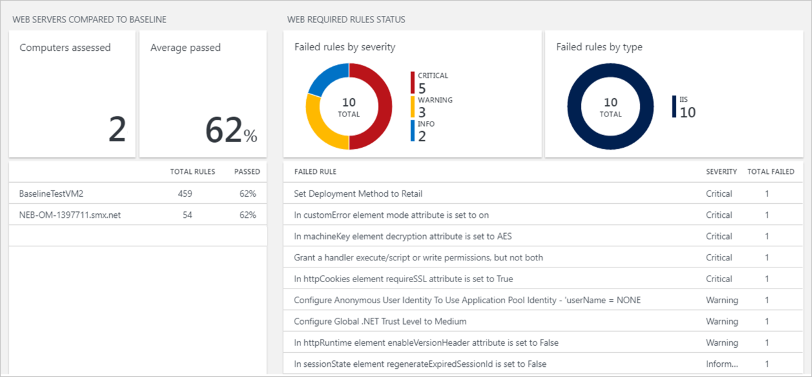
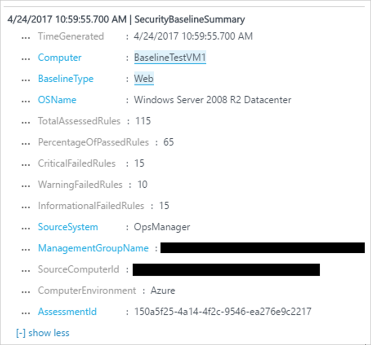
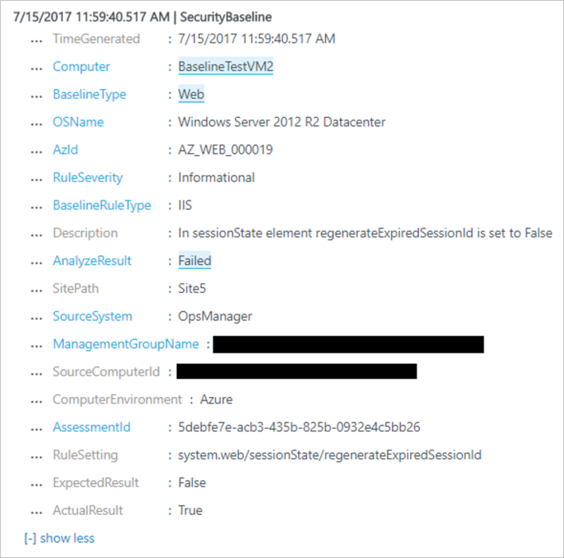

# Web Baseline Assessment in Operations Management Suite Security and Audit Solution
This document helps you use OMS Security and Audit web baseline assessment capabilities to access the secure state of your monitored resources.

## What is web baseline assessment?
Currently OMS Security provides security baseline assessment for operating systems. It scans the OS settings of your servers every 24 hours, and provides a view into potentially vulnerable settings. Read [Baseline Assessment in Operations Management Suite Security and Audit Solution](https://docs.microsoft.com/azure/operations-management-suite/oms-security-baseline) for more information on this.

The goal of the Web Baseline assessment is to find potentially vulnerable web server settings. The three primary sources for the web baseline configurations are: .NET, ASP.NET, and IIS configuration.  Just like the operating system baseline assessment, OMS Security is going to scan your web servers every 24hrs and provide a view into security state of them.  In Internet Information Service (IIS), configurations are highly customizable, which allows various site and application levels to be overridden. The scanner checks the settings at each application/site level in addition to the default root level. This helps you to identify potentially vulnerable settings and quickly remediate, along with our recommendations for those settings.

>[!NOTE] 
>You can download the Common Configuration Identifiers and Baseline Rules used by OMS Security in this [page](https://gallery.technet.microsoft.com/Azure-Security-Center-a789e335?redir=0).

## Web security baseline assessment

For this preview the feature can be accessed via the OMS Search option, and the OMS Security and Audit Dashboard. Follow the steps below to perform the appropriated query:

1. In the **Microsoft Operations Management Suite** main dashboard, click **Security and Audit** tile.
2. In the **Security and Audit** dashboard, you can see the Web Baseline perspective next to the OS baseline perspective.
   
    

3. The left pane shows the number of Web Servers compared to the baseline, the average percentage of rules that passed on all the evaluated servers, and the list of Servers that were assessed.
4. The right pane lists the unique rules that failed by *Severity*, and *RuleType*. Clicking on any of the right pane rules will show the details of that rule. An example is shown in the below image. The rule that is evaluated is listed under *Rule Setting*. The *AzId* field which is a unique identifier for each rule used by Microsoft for tracking the baseline rules. In addition to that users can see the *Expected Result* (Microsoft’s recommended value), and other details regarding the security impact of the rule.
	
	

5. You can create your own queries to review the results. 

The first query that you can use is the **Web Baseline Assessment Summary**. In the **Begin search here** field, type this query: *Type=SecurityBaselineSummary BaselineType=Web*. The following is an output sample:

>[!NOTE] 
>In this query, each record indicates assessment summary on a single server.

Once you are in the **Log Search**, you can type different queries to obtain more information about the web baseline assessment. In addition to the previous query, you can also use the following ones in this preview:

**Web Baseline Rule Assessment**: Each record represents a single web baseline rule evaluation on a single server. It includes all data for a failed rule, the *SitePath* on which the rule was evaluated, the *Expected Result*, and the *Actual Result*.

Query: *Type=SecurityBaseline BaselineType=Web AnalyzeResult=Failed*

**Show all results for a specific server**: This query shows how to see results of a specific server:
Query: *Type=SecurityBaseline BaselineType=Web Computer=BaselineTestVM1*

You can use these records/queries to create your own dashboards, reports, or alerts. Here is a sample UI control that you can add to your dashboard. You can learn how to visualize your data using OMS View Designer [here](https://blogs.technet.microsoft.com/msoms/2016/06/30/oms-view-designer-visualize-your-data-your-way/). The screen below is an example of how the tile will look like once you make this customization.

## See also
In this document, you learned about OMS Security and Audit Web Baseline assessment. To learn more about OMS Security, see the following articles:

* [Operations Management Suite (OMS) overview](operations-management-suite-overview.md)
* [Monitoring and Responding to Security Alerts in Operations Management Suite Security and Audit Solution](oms-security-responding-alerts.md)
* [Monitoring Resources in Operations Management Suite Security and Audit Solution](oms-security-monitoring-resources.md)

