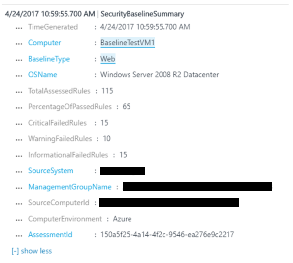
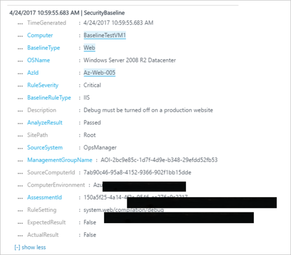
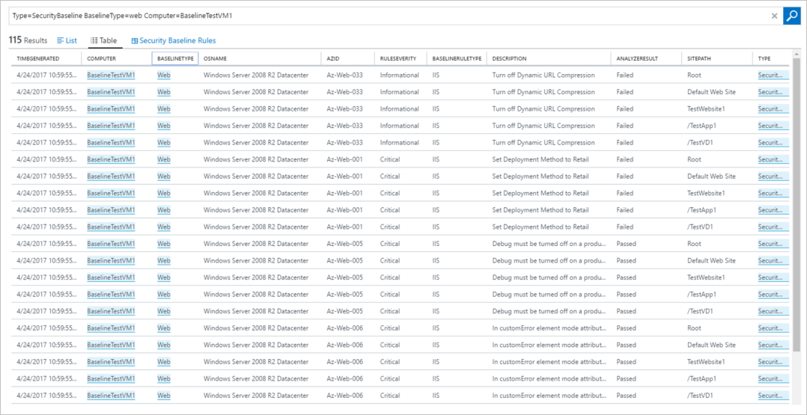
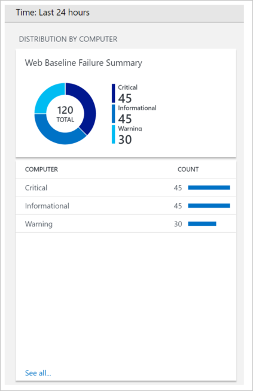

# Web Baseline Assessment in Operations Management Suite Security and Audit Solution
This document helps you to use [Operations Management Suite (OMS) Security and Audit Solution](operations-management-suite-overview.md) web baseline assessment capabilities to access the secure state of your monitored resources.

## What is Web Baseline Assessment?
Currently OMS Security provides security baseline assessment for operating systems. It scans the operating system settings of your servers every 24 hours and provides a view into potentially vulnerable settings. Read [Baseline Assessment in Operations Management Suite Security and Audit Solution](oms-security-baseline.md) for more information on this.

The goal of the web baseline assessment is to find potentially vulnerable web server settings. The three primary sources for the web baseline configurations are: .NET, ASP.NET, and IIS configuration.  Just like the operating system baseline assessment, OMS Security is going to scan your web servers every 24hrs and provide a view into security state of them.  In Internet Information Service (IIS), configurations are highly customizable, which allows various site and application levels to be overridden. The scanner checks the settings at each application/site level in addition to the default root level. This helps you to identify potential vulnerability settings locations and quickly remediate.

## Web Security Baseline Assessment
For this preview this feature is going to be accessed using the OMS Search option. Follow the steps below to perform the appropriated query:

1. In the **Microsoft Operations Management Suite** main dashboard click **Security and Audit** tile.
2. In the **Security and Audit** dashboard, click **Log Search** button.
3. The first query that you can use is the **Web Baseline Assessment Summary**. In the **Begin search here** field, type this query: Type*=SecurityBaselineSummary BaselineType=web*. The following screen has an output sample:

> [!NOTE]
> In this query, each record indicates assessment summary on a single server.

Once you are in the **Log Search**, you can type different queries to obtain more information about the web baseline assessment. In addition to the previous query, you can also use the following ones in this preview.

**Web Baseline Rule Assessment**: Each record represents a single web baseline rule evaluation on a single server. It includes all data for the rule, location, the expected result, and the actual result.

**Query**: Type*=SecurityBaseline BaselineType=web*

**Show all results for a specific server**: This query shows how to see results of a specific server.

**Query**: *Type=SecurityBaseline BaselineType=web Computer=BaselineTestVM1*

You can also use these records/queries to create your own dashboards, reports, or alerts. The screen below has a sample UI control that you can add to your dashboard. You can learn how to visualize your data using OMS View Designer [here](https://blogs.technet.microsoft.com/msoms/2016/06/30/oms-view-designer-visualize-your-data-your-way/). The screen below is an example of how the tile will look like once you make this customization.

> [!NOTE]
> If you would like to know the settings that are checked for the baseline assessment, you can download [this Excel spreadsheet](https://gallery.technet.microsoft.com/OMS-Web-Baseline-1e811690) that contains these settings.

## See also
In this document, you learned about OMS Security and Audit web baseline assessment. To learn more about OMS Security, see the following articles:

* [Operations Management Suite (OMS) overview](operations-management-suite-overview.md)
* [Monitoring and Responding to Security Alerts in Operations Management Suite Security and Audit Solution](oms-security-responding-alerts.md)
* [Monitoring Resources in Operations Management Suite Security and Audit Solution](oms-security-monitoring-resources.md)

