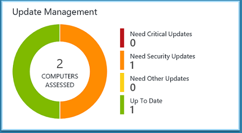
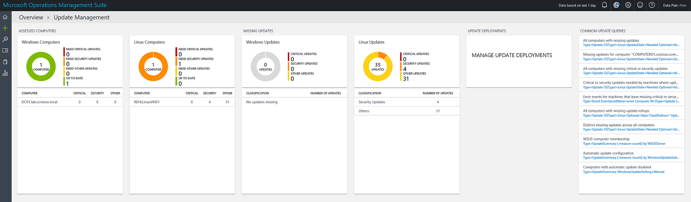
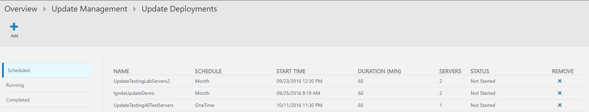
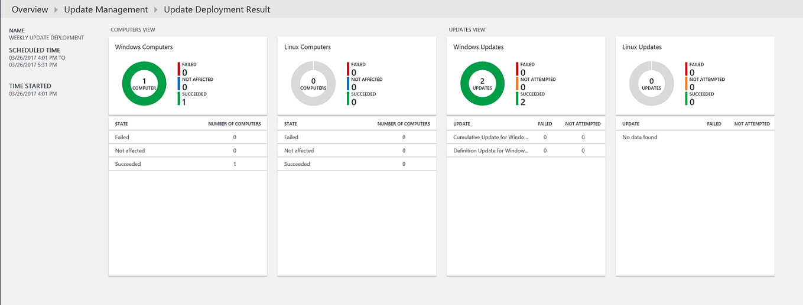
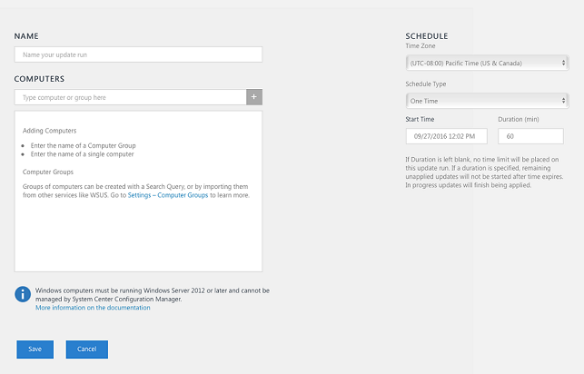
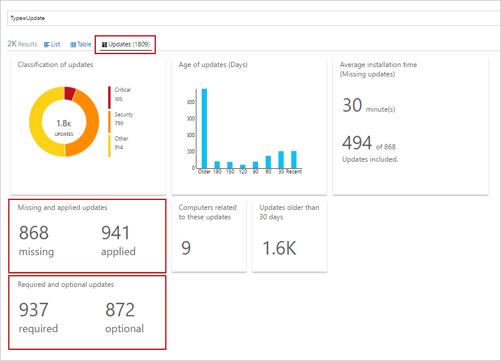
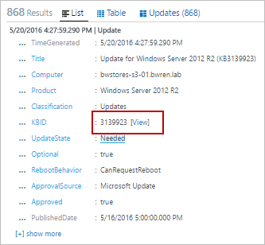
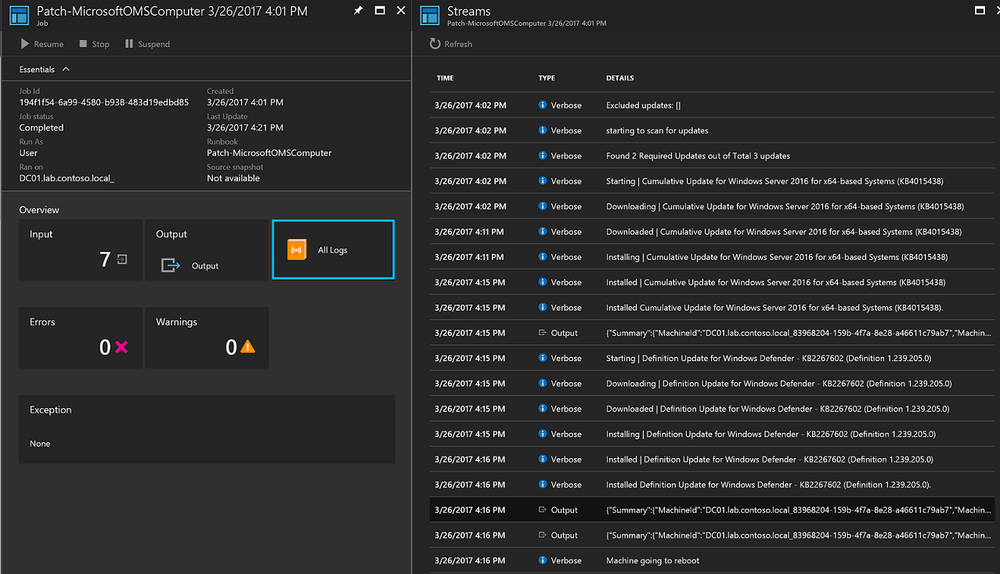

# Office 365 solution in Operations Management Suite (OMS)

The Office 365 solution for Operations Management Suite (OMS) allows you to monitor you Office 365 environment in Log Analytics.  

- Monitor user activities on your Office 365 accounts to analyze usage patterns as well as identify behavioral trends. For example, you can extract specific usage scenarios, such as files that are shared outside your organization or the most popular SharePoint sites.
- Monitor administrator activities to track configuration changes or high privilege operations.
- Detect and investigate unwanted user behavior, which can be customized for your organizational needs.
- Demonstrate audit and compliance. For example, you can monitor file access operations on confidential files, which can help you with the audit and compliance process.
- Perform operational troubleshooting by using OMS Search on top of Office 365 activity data of your organization.

## Prerequisites
The only prerequisite for this solution is an Office 365 subscription and the credentials for a user account that is a Global Administrator. 

## Management packs

  

## Configuration
Once you add the Office 365 solution to your subscription, you have to connect it to your Office 365 subscription.

1. Add the Alert Management solution to your OMS workspace using the process described in [Add solutions](log-analytics-add-solutions.md).
2. Go to **Settings** in the OMS portal.
3. Under **Connected Sources**, select **Office 365**.
4. Click on **Connect Office 365**. 
5. Sign in to Office 365 with an account that is a Global Administrator for your subscription. 
6. The subscription will be listed with the workloads that the solution will monitor.  

## Data collection
### Supported agents
The following table describes the connected sources that are supported by this solution.

| Connected Source | Supported | Description |
| --- | --- | --- |
| Windows agents |Yes |The solution collects information about system updates from Windows agents and initiates installation of required updates. |
| Linux agents |Yes |The solution collects information about system updates from Linux agents and initiates installation of required updates on supported distros. |
| Operations Manager management group |Yes |The solution collects information about system updates from agents in a connected management group. A direct connection from the Operations Manager agent to Log Analytics is not required. Data is forwarded from the management group to the OMS repository. |
| Azure storage account |No |Azure storage does not include information about system updates. |

### Collection frequency
For each managed Windows computer, a scan is performed twice per day. Every 15 minutes the Windows API is called to query for the last update time to determine if status has changed, and if so a compliance scan is initiated.  For each managed Linux computer, a scan is performed every 3 hours.

It can take anywhere from 30 minutes up to 6 hours for the dashboard to display updated data from managed computers.   

## Using the solution
When you add the Update Management solution to your OMS workspace, the **Update Management** tile will be added to your OMS dashboard. This tile displays a count and graphical representation of the number of computers in your environment and their update compliance.  
  

## Viewing update assessments
Click on the **Update Management** tile to open the **Update Management** dashboard.    

This dashboard provides a detailed breakdown of update status categorized by type of operating system and update classification - critical, security, or other (such as a definition update). The **Update Deployments** tile when selected, redirects you to the Update Deployments page where you can view schedules, deployments currently running, completed deployments, or schedule a new deployment.  

You can run a log search that returns all records by clicking on the specific tile or to run a query of a particular category and pre-defined criteria , select one from the list  available under the **Common Update Queries** column.    

## Installing updates
Once updates have been assessed for all of the Linux and Windows computers in your workspace, you can have required updates installed by creating an *Update Deployment*.  An Update Deployment is a scheduled installation of required updates for one or more  computers.  You specify the date and time for the deployment in addition to a computer or group of computers that should be included in the scope of a deployment.  To learn more about computer groups, see [Computer groups in Log Analytics](../log-analytics/log-analytics-computer-groups.md).  When you include computer groups in your update deployment, group memnbership is evaluated only once at the time of schedule creation.  Subsequent changes to a group are not reflected.  To work around this, delete the scheduled update deployment and recreate it.

> [!NOTE]
> Windows VMs deployed from the Azure Marketplace by default are set to receive automatic updates from Windows Update Service.  This behavior does not change after adding this solution or Windows VMs to your workspace.  If you do not actively managed updates with this solution, the default behavior (automatically apply updates) will apply.  

For virtual machines created from the on-demand Red Hat Enterprise Linux (RHEL) images available in Azure Marketplace, they are registered to access the [Red Hat Update Infrastructure (RHUI)](../virtual-machines/virtual-machines-linux-update-infrastructure-redhat.md) deployed in Azure.  Any other Linux distribution must be updated from the distros online file repository following their supported methods.  

### Viewing update deployments
Click the **Update Deployment** tile to view the list of existing Update Deployments.  They are grouped by status – **Scheduled**, **Running**, and **Completed**.      

The properties displayed for each Update Deployment are described in the following table.

| Property | Description |
| --- | --- |
| Name |Name of the Update Deployment. |
| Schedule |Type of schedule.  Options available are *One Time*, *Recurring Weekly*, or *Recurring Monthly*. |
| Start Time |Date and time that the Update Deployment is scheduled to start. |
| Duration |Number of minutes the Update Deployment is allowed to run.  If all updates are not installed within this duration, then the remaining updates must wait until the next Update Deployment. |
| Servers |Number of computers affected by the Update Deployment.  |
| Status |Current status of the Update Deployment.  Possible values are: - Not Started - Running - Finished |

Select a completed Update Deployment to view the detail screen which includes the columns in the following table.  These columns will not be populated if the Update Deployment has not yet started.   

| Column | Description |
| --- | --- |
| **Computers View** | |
| Windows Computers |Lists the number of Windows computers in the Update Deployment by status.  Click on a status to run a log search returning all update records with that status for the Update Deployment. |
| Linux Computers |Lists the number of Linux computers in the Update Deployment by status.  Click on a status to run a log search returning all update records with that status for the Update Deployment. |
| Computer Installation Status |Lists the computers involved in the Update Deployment and the percentage of updates that successfully installed. Click on one of the entries to run a log search returning all missing and critical updates. |
| **Updates View** | |
| Windows Updates |Lists Windows updates included in the Update Deployment and their installation status per each update.  Select an update to run a log search returning all update records for that specific update or click on the status to run a log search returning all update records for the deployment. |
| Linux Updates |Lists Linux updates included in the Update Deployment and their installation status per each update.  Select an update to run a log search returning all update records for that specific update or click on the status to run a log search returning all update records for the deployment. |

### Creating an Update Deployment
Create a new Update Deployment by clicking the **Add** button at the top of the screen to open the **New Update Deployment** page.  You must provide values for the properties in the following table.

| Property | Description |
| --- | --- |
| Name |Unique name to identify the update deployment. |
| Time Zone |Time zone to use for the start time. |
| Schedule Type | Type of schedule.  Options available are *One Time*, *Recurring Weekly*, or *Recurring Monthly*.  
| Start Time |Date and time to start the update deployment. **Note:** The soonest a deployment can run is 30 minutes from current time if you need to deploy immediately. |
| Duration |Number of minutes the Update Deployment is allowed to run.  If all updates are not installed within this duration, then the remaining updates must wait until the next Update Deployment. |
| Computers |Names of computers or computer groups to include and target in the Update Deployment.  Select one or more entries from the drop down list. |

   

### Time range
By default, the scope of the data analyzed in the Update Management solution is from all connected management groups generated within the last 1 day.

To change the time range of the data, select **Data based on** at the top of the dashboard. You can select records created or updated within the last 7 days, 1 day, or 6 hours. Or you can select **Custom** and specify a custom date range.

## Log Analytics records
The Update Management solution creates two types of records in the OMS repository.

### Update records
A record with a type of **Update** is created for each update that is either installed or needed on each computer. Update records have the properties in the following table.

| Property | Description |
| --- | --- |
| Type |*Update* |
| SourceSystem |The source that approved installation of the update. Possible values are: - Microsoft Update - Windows Update - SCCM - Linux Servers (Fetched from Package Managers) |
| Approved |Specifies whether the update has been approved for installation.  For Linux servers this is currently optional as patching is not managed by OMS. |
| Classification for Windows |Classification of the update. Possible values are: -    Applications - Critical Updates - Definition Updates - Feature Packs - Security Updates - Service Packs - Update Rollups - Updates |
| Classification for Linux |Cassification of the update. Possible values are: -Critical Updates - Security Updates - Other Updates |
| Computer |Name of the computer. |
| InstallTimeAvailable |Specifies whether the installation time is available from other agents that installed the same update. |
| InstallTimePredictionSeconds |Estimated installation time in seconds based on other agents that installed the same update. |
| KBID |ID of the KB article that describes the update. |
| ManagementGroupName |Name of the management group for SCOM agents.  For other agents, this is AOI-<workspace ID>. |
| MSRCBulletinID |ID of the Microsoft security bulletin describing the update. |
| MSRCSeverity |Severity of the Microsoft security bulletin. Possible values are: - Critical - Important - Moderate |
| Optional |Specifies whether the update is optional. |
| Product |Name of the product the update is for.  Click **View** to open the article in a browser. |
| PackageSeverity |The severity of the vulnerability fixed in this update, as reported by the  Linux distro vendors. |
| PublishDate |Date and time that the update was installed. |
| RebootBehavior |Specifies if the update forces a reboot. Possible values are: - canrequestreboot - neverreboots |
| RevisionNumber |Revision number of the update. |
| SourceComputerId |GUID to uniquely identify the computer. |
| TimeGenerated |Date and time that the record was last updated. |
| Title |Title of the update. |
| UpdateID |GUID to uniquely identify the update. |
| UpdateState |Specifies whether the update is installed on this computer. Possible values are: - Installed - The update is installed on this computer. - Needed - The update is not installed and is needed on this computer. |

When you perform any log search that returns records with a type of **Update** you can select the **Updates** view which displays a set of tiles summarizing the updates returned by the search. You can click on the entries in the **Missing and applied updates** and **Required and optional updates** tiles to scope the view to that set of updates. Select the **List** or **Table** view to return the individual records. 

  

In the **Table** view, you can click on the **KBID** for any record to open a browser with the KB article. This allows you to quickly read about the details of the particular update. 

In the **List** view, you click the **View** link next to the KBID to open the KB article. 

### UpdateSummary records
A record with a type of **UpdateSummary** is created for each Windows agent computer. This record is updated each time the computer is scanned for updates. **UpdateSummary** records have the properties in the following table.

| Property | Description |
| --- | --- |
| Type |UpdateSummary |
| SourceSystem |OpsManager |
| Computer |Name of the computer. |
| CriticalUpdatesMissing |Number of critical updates missing on the computer. |
| ManagementGroupName |Name of the management group for SCOM agents. For other agents, this is AOI-<workspace ID>. |
| NETRuntimeVersion |Version of the .NET runtime installed on the computer. |
| OldestMissingSecurityUpdateBucket |Bucket to categorize the time since the oldest missing security update on this computer was published. Possible values are: - Older -    180 days ago - 150 days ago -    120 days ago - 90 days ago - 60 days ago -    30 days go -    Recent |
| OldestMissingSecurityUpdateInDays |Number of days since the oldest missing security update on this computer was published. |
| OsVersion |Version of the operating system installed on the computer. |
| OtherUpdatesMissing |Number of other updates missing on the computer. |
| SecurityUpdatesMissing |Number of security updates missing on the computer. |
| SourceComputerId |GUID to uniquely identify the computer. |
| TimeGenerated |Date and time that the record was last updated. |
| TotalUpdatesMissing |Total number of updates missing on the computer. |
| WindowsUpdateAgentVersion |Version number of the Windows Update agent on the computer. |
| WindowsUpdateSetting |Setting for how the computer will install important updates. Possible values are: - Disabled - Notify before installation - Scheduled installation |
| WSUSServer |URL of WSUS server if the computer is configured to use one. |

## Sample log searches
The following table provides sample log searches for update records collected by this solution.

| Query | Description |
| --- | --- |
|Windows-based server computers that need updates |`Type:Update OSType!=Linux UpdateState=Needed Optional=false Approved!=false | measure count() by Computer` |
|Linux servers that need updates | `Type:Update OSType=Linux UpdateState!="Not needed" | measure count() by Computer` |
| All computers with missing updates |`Type=Update UpdateState=Needed Optional=false | select Computer,Title,KBID,Classification,UpdateSeverity,PublishedDate` |
| Missing updates for a specific computer (replace value with your own computer name) |`Type=Update UpdateState=Needed Optional=false Computer="COMPUTER01.contoso.com" | select Computer,Title,KBID,Product,UpdateSeverity,PublishedDate` |
| All computers with missing critical or security updates |`Type=Update UpdateState=Needed Optional=false (Classification="Security Updates" OR Classification="Critical Updates"`) |
| Critical or security updates needed by machines where updates are manually applied |`Type=Update UpdateState=Needed Optional=false (Classification="Security Updates" OR Classification="Critical Updates") Computer IN {Type=UpdateSummary WindowsUpdateSetting=Manual | Distinct Computer} | Distinct KBID` |
| Error events for machines that have missing critical or security required updates |`Type=Event EventLevelName=error Computer IN {Type=Update (Classification="Security Updates" OR Classification="Critical Updates") UpdateState=Needed Optional=false | Distinct Computer}` |
| All computers with missing update rollups |`Type=Update Optional=false Classification="Update Rollups" UpdateState=Needed| select Computer,Title,KBID,Classification,UpdateSeverity,PublishedDate` |
| Distinct missing updates across all computers |`Type=Update UpdateState=Needed Optional=false | Distinct Title` |
| Windows-based server computer with updates that failed in an update run | `Type:UpdateRunProgress InstallationStatus=failed | measure count() by Computer, Title, UpdateRunName` |
| Linux server with updates that failed an update run |`Type:UpdateRunProgress InstallationStatus=failed | measure count() by Computer, Product, UpdateRunName` |
| WSUS computer membership |`Type=UpdateSummary | measure count() by WSUSServer` |
| Automatic update configuration |`Type=UpdateSummary | measure count() by WindowsUpdateSetting` |
| Computers with automatic update disabled |`Type=UpdateSummary WindowsUpdateSetting=Manual` |
| List of all the Linux machines which have a package update available |`Type=Update and OSType=Linux and UpdateState!="Not needed" | measure count() by Computer` |
| List of all the Linux machines which have a package update available which addresses Critical or Security vulnerability |`Type=Update and OSType=Linux and UpdateState!="Not needed" and (Classification="Critical Updates" OR Classification="Security Updates") | measure count() by Computer` |
| List of all packages that have an update available |Type=Update and OSType=Linux and UpdateState!="Not needed" |
| List of all packages that have an update available which addresses Critical or Security vulnerability |`Type=Update  and OSType=Linux and UpdateState!="Not needed" and (Classification="Critical Updates" OR Classification="Security Updates")` |
| List what update deployments have modified computers |`Type:UpdateRunProgress | measure Count() by UpdateRunName` |
|Computers that were updated in this update run (replace value with your Update Deployment name |`Type:UpdateRunProgress UpdateRunName="DeploymentName" | measure Count() by Computer` |
| List of all the “Ubuntu” machines with any update available |`Type=Update and OSType=Linux and OSName = Ubuntu &| measure count() by Computer` |

## Troubleshooting

This section provides information to help troubleshoot issues with the Update Management solution.  

### How do I troubleshoot update deployments?
You can view the results of the runbook responsible for deploying the updates included in the scheduled update deployment from the Jobs blade of your Automation account that is linked with the OMS workspace supporting this solution.  The runbook **Patch-MicrosoftOMSComputer** is a child runbook that targets a specific managed computer, and reviewing the verbose Stream will present detailed information for that deployment.  The output will display which required updates are applicable, download status, installation status, and additional details.    

For further information, see [Automation runbook output and messages](../automation/automation-runbook-output-and-messages.md).   

## Next steps
* Use Log Searches in [Log Analytics](../log-analytics/log-analytics-log-searches.md) to view detailed update data.
* [Create your own dashboards](../log-analytics/log-analytics-dashboards.md) showing update compliance for your managed computers.
* [Create alerts](../log-analytics/log-analytics-alerts.md) when critical updates are detected as missing from computers or a computer has automatic updates disabled.  
