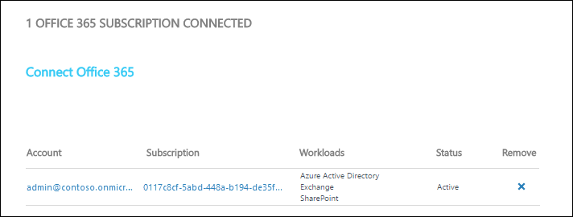

# Office 365 solution in Operations Management Suite (OMS)

The Office 365 solution for Operations Management Suite (OMS) allows you to monitor you Office 365 environment in Log Analytics.  

- Monitor user activities on your Office 365 accounts to analyze usage patterns as well as identify behavioral trends. For example, you can extract specific usage scenarios, such as files that are shared outside your organization or the most popular SharePoint sites.
- Monitor administrator activities to track configuration changes or high privilege operations.
- Detect and investigate unwanted user behavior, which can be customized for your organizational needs.
- Demonstrate audit and compliance. For example, you can monitor file access operations on confidential files, which can help you with the audit and compliance process.
- Perform operational troubleshooting by using OMS Search on top of Office 365 activity data of your organization.

## Prerequisites
The following is required prior to this solution being installed and configured.

- Office 365 subscription and  credentials for a user account that is a Global Administrator. 

## Management packs
This solution does not install any management packs in connected management groups.
  

## Configuration
Once you [add the Office 365 solution to your subscription](../log-analytics/log-analytics-add-solutions.md), you have to connect it to your Office 365 subscription.

1. Add the Alert Management solution to your OMS workspace using the process described in [Add solutions](../log-analytics/log-analytics-add-solutions.md).
2. Go to **Settings** in the OMS portal.
3. Under **Connected Sources**, select **Office 365**.
4. Click on **Connect Office 365**. 
5. Sign in to Office 365 with an account that is a Global Administrator for your subscription. 
6. The subscription will be listed with the workloads that the solution will monitor.  

## Data collection
### Supported agents
The Office 365 solution doesn't retrieve data from any of the [OMS agents](../log-analytics/log-analytics-data-sources.md).  It retrieves data directly from Office 365.

### Collection frequency
To be completed.   

## Using the solution
When you add the Office 365 solution to your OMS workspace, the **Office 365** tile will be added to your OMS dashboard. This tile displays a count and graphical representation of the number of computers in your environment and their update compliance.  
  

Click on the **Office 365** tile to open the **Office 365** dashboard.

  

The dashboard includes the columns in the following table. Each column lists the top ten alerts by count matching that column's criteria for the specified scope and time range. You can run a log search that provides the entire list by clicking See all at the bottom of the column or by clicking the column header.

| Column | Description |
|:--|:--|
| Operations | Provides information about the active users from your all monitored Office 365 subscriptions. You will also be able to see the number of activities that happen over time.
| Exchange | Shows the breakdown of Exchange Server activities such as Add-Mailbox Permission, or Set-Mailbox. |
| SharePoint | Shows the top activities that users perform on SharePoint documents. When you drill down from this tile, the search page shows the details of these activities, such as the target document and the location of this activity. For example, for a File Accessed event, you will be able to see the document that’s being accessed, its associated account name, and IP address. |
| Azure Active Directory | Includes top user activities, such as Reset User Password and Login Attempts. When you drill down, you will be able to see the details of these activities like the Result Status. This is mostly helpful if you want to monitor suspicious activities on your Azure Active Directory. |

## Log Analytics records

All records created in the Log Analytics workspace by the Office 365 solution have a **Type** of **OfficeActivity**.  The **OfficeWorkload** property determines which Office 365 service the record refers to - Exchange, AzureActiveDirectory or SharePoint.  The **RecordType** property specifies the type of operation.  The properties will vary for each operation type and are shown in the tables below.

### Common properties
The following properties are common to all Office 365 records.

| Property | Description |
|:--- |:--- |
| Type | *OfficeActivity* |
| ClientIP | The IP address of the device that was used when the activity was logged. The IP address is displayed in either an IPv4 or IPv6 address format. |
| OfficeWorkload | Office 365 service that the record refers to.  AzureActiveDirectory Exchange SharePoint|
| Operation | The name of the user or admin activity.  |
| OrganizationId | The GUID for your organization's Office 365 tenant. This value will always be the same for your organization, regardless of the Office 365 service in which it occurs. |
| RecordType | Type of of operation performed. |
| ResultStatus | Indicates whether the action (specified in the Operation property) was successful or not. Possible values are Succeeded, PartiallySucceded, or Failed. For Exchange admin activity, the value is either True or False. |
| UserId | The UPN (User Principal Name) of the user who performed the action that resulted in the record being logged; for example, my_name@my_domain_name. Note that records for activity performed by system accounts (such as SHAREPOINT\system or NTAUTHORITY\SYSTEM) are also included. | 
| UserKey | An alternative ID for the user identified in the UserId property.  For example, this property is populated with the passport unique ID (PUID) for events performed by users in SharePoint, OneDrive for Business, and Exchange. This property may also specify the same value as the UserID property for events occurring in other services and events performed by system accounts|
| UserType | The type of user that performed the operation.  Admin Application DcAdmin Regular Reserved ServicePrincipal System |

### Azure Active Directory base

| Property | Description |
|:--- |:--- |
| OfficeWorkload | AzureActiveDirectory |
| RecordType     | AzureActiveDirectory |
| AzureActiveDirectory_EventType | The type of Azure AD event. |
| ExtendedProperties | The extended properties of the Azure AD event. |
| ModifiedProperties | This property is included for admin events. The property includes the name of the property that was modified, the new value of the modified property, and the previous value of the modified property. |

### Azure Active Directory Account logon
These records are created when an Active Directory user attempts to logon.

| Property | Description |
|:--- |:--- |
| OfficeWorkload | AzureActiveDirectory |
| RecordType     | AzureActiveDirectoryAccountLogon |
| Application | The application that triggers the account login event, such as Office 15. |
| Client | Details about the client device, device OS, and device browser that was used for the of the account login event. |
| LoginStatus | This property is from OrgIdLogon.LoginStatus directly. The mapping of various interesting logon failures could be done by alerting algorithms. |
| UserDomain | The Tenant Identity Information (TII). | 

### Azure Active Directory
These records are created when change or additions are made to Azure Active Directory objects.

| Property | Description |
|:--- |:--- |
| OfficeWorkload | AzureActiveDirectory |
| RecordType     | AzureActiveDirectory |
| AADTarget | The user that the action (identified by the Operation property) was performed on. |
| Actor | The user or service principal that performed the action. |
| ActorContextId | The GUID of the organization that the actor belongs to. |
| ActorIpAddress | The actor's IP address in IPV4 or IPV6 address format. |
| InterSystemsId | The GUID that track the actions across components within the Office 365 service. |
| IntraSystemId | 	The GUID that's generated by Azure Active Directory to track the action. |
| SupportTicketId | The customer support ticket ID for the action in "act-on-behalf-of" situations. |
| TargetContextId | The GUID of the organization that the targeted user belongs to. |

### Data Center Security

| Property | Description |
|:--- |:--- |
| EffectiveOrganization | The name of the tenant that the elevation/cmdlet was targeted at. |
| ElevationApprovedTime | The timestamp for when the elevation was approved. |
| ElevationApprover | The name of a Microsoft manager. |
| ElevationDuration | The duration for which the elevation was active. |
| ElevationRequestId | 	A unique identifier for the elevation request. |
| ElevationRole | The role the elevation was requested for. |
| ElevationTime | The start time of the elevation. |
| Start_Time | The start time of the cmdlet execution. |

### Exchange Admin
These records are created when changes are made to Exchange configuration.

| Property | Description |
|:--- |:--- |
| OfficeWorkload | Exchange |
| RecordType     | ExchangeAdmin |
| ExternalAccess | 	Specifies whether the cmdlet was run by a user in your organization, by Microsoft datacenter personnel or a datacenter service account, or by a delegated administrator. The value False indicates that the cmdlet was run by someone in your organization. The value True indicates that the cmdlet was run by datacenter personnel, a datacenter service account, or a delegated administrator. |
| ModifiedObjectResolvedName | 	This is the user friendly name of the object that was modified by the cmdlet. This is logged only if the cmdlet modifies the object. |
| ModifiedProperties | The property is included for admin events. The property includes the name of the property that was modified, the new value of the modified property, and the previous value of the modified object. |
| OrganizationName | The name of the tenant. |
| OriginatingServer | The name of the server from which the cmdlet was executed. |
| Parameters | The name and value for all parameters that were used with the cmdlet that is identified in the Operations property. |

### Exchange Mailbox
These records are created when changes or additions are made to Exchange mailboxes.

| Property | Description |
|:--- |:--- |
| OfficeWorkload | Exchange |
| RecordType     | ExchangeItem |
| ClientInfoString | Information about the email client that was used to perform the operation, such as a browser version, Outlook version, and mobile device information. |
| Client_IPAddress | The IP address of the device that was used when the operation was logged. The IP address is displayed in either an IPv4 or IPv6 address format. |
| ClientMachineName | The machine name that hosts the Outlook client. |
| ClientProcessName | The email client that was used to access the mailbox. |
| ClientVersion | The version of the email client . |
| ExternalAccess | 	This is true if the logon user's domain is different from the mailbox owner's domain. |
| InternalLogonType | Reserved for internal use. |
| Logon_Type | Indicates the type of user who accessed the mailbox and performed the operation that was logged. |
| LogonUserDisplayName | 	The user-friendly name of the user who performed the operation. |
| LogonUserSid | The SID of the user who performed the operation. |
| MailboxGuid | The Exchange GUID of the mailbox that was accessed. |
| MailboxOwnerMasterAccountSid | Mailbox owner account's master account SID. |
| MailboxOwnerSid | The SID of the mailbox owner. |
| MailboxOwnerUPN | The email address of the person who owns the mailbox that was accessed. |
| OriginatingServer | This is from where the operation originated. |
| OrganizationName | 	The name of the tenant. |

### Exchange Mailbox Audit

| Property | Description |
|:--- |:--- |
| OfficeWorkload | Exchange |
| RecordType     | ExchangeItem |
| Item | Represents the item upon which the operation was performed | 
| SendAsUserMailboxGuid | The Exchange GUID of the mailbox that was accessed to send email as. |
| SendAsUserSmtp | SMTP address of the user who is being impersonated. |
| SendonBehalfOfUserMailboxGuid | The Exchange GUID of the mailbox that was accessed to send mail on behalf of. |
| SendOnBehalfOfUserSmtp | SMTP address of the user on whose behalf the email is sent. |

### Exchange Mailbox Audit Group
These records are created when changes or additions are made to Exchange groups.

| Property | Description |
|:--- |:--- |
| OfficeWorkload | Exchange |
| OfficeWorkload | ExchangeItemGroup |
| AffectedItems | Information about each item in the group. |
| CrossMailboxOperations | Indicates if the operation involved more than one mailbox. |
| DestMailboxId | Set only if the CrossMailboxOperations parameter is True. Specifies the target mailbox GUID. |
| DestMailboxOwnerMasterAccountSid | Set only if the CrossMailboxOperations parameter is True. Specifies the SID for the master account SID of the target mailbox owner. |
| DestMailboxOwnerSid | Set only if the CrossMailboxOperations parameter is True. Specifies the SID of the target mailbox. |
| DestMailboxOwnerUPN | Set only if the CrossMailboxOperations parameter is True. Specifies the UPN of the owner of the target mailbox. |
| DestFolder | The destination folder, for operations such as Move. |
| Folder | The folder where a group of items is located. |
| Folders | 	Information about the source folders involved in an operation; for example, if folders are selected and then deleted. |

### SharePoint Base

| Property | Description |
|:--- |:--- |
| OfficeWorkload | SharePoint |
| OfficeWorkload | SharePoint |
| EventSource | Identifies that an event occurred in SharePoint. Possible values are SharePoint or ObjectModel. |
| ItemType | The type of object that was accessed or modified. See the ItemType table for details on the types of objects. |
| MachineDomainInfo | Information about device sync operations. This information is reported only if it's present in the request. |
| MachineId | 	Information about device sync operations. This information is reported only if it's present in the request. |
| Site_ | The GUID of the site where the file or folder accessed by the user is located. |
| Source_Name | The entity that triggered the audited operation. Possible values are SharePoint or ObjectModel. |
| UserAgent | Information about the user's client or browser. This information is provided by the client or browser. |

### SharePoint Schema
These records are created when configuration changes are made to SharePoint.

| Property | Description |
|:--- |:--- |
| OfficeWorkload | SharePoint |
| OfficeWorkload | SharePoint |
| CustomEvent | Optional string for custom events. |
| Event_Data | 	Optional payload for custom events. |
| ModifiedProperties | The property is included for admin events, such as adding a user as a member of a site or a site collection admin group. The property includes the name of the property that was modified (for example, the Site Admin group), the new value of the modified property (such the user who was added as a site admin), and the previous value of the modified object. |

### SharePoint File Operations
These records are created in response to file operations in SharePoint.

| Property | Description |
|:--- |:--- |
| OfficeWorkload | SharePoint |
| OfficeWorkload | SharePointFileOperation |
| DestinationFileExtension | The file extension of a file that is copied or moved. This property is displayed only for FileCopied and FileMoved events. |
| DestinationFileName | The name of the file that is copied or moved. This property is displayed only for FileCopied and FileMoved events. |
| DestinationRelativeUrl | The URL of the destination folder where a file is copied or moved. The combination of the values for SiteURL, DestinationRelativeURL, and DestinationFileName parameters is the same as the value for the ObjectID property, which is the full path name for the file that was copied. This property is displayed only for FileCopied and FileMoved events. |
| SharingType | The type of sharing permissions that were assigned to the user that the resource was shared with. This user is identified by the UserSharedWith parameter. |
| Site_Url | The URL of the site where the file or folder accessed by the user is located. |
| SourceFileExtension | The file extension of the file that was accessed by the user. This property is blank if the object that was accessed is a folder. |
| SourceFileName | 	The name of the file or folder accessed by the user. |
| SourceRelativeUrl | The URL of the folder that contains the file accessed by the user. The combination of the values for the SiteURL, SourceRelativeURL, and SourceFileName parameters is the same as the value for the ObjectID property, which is the full path name for the file accessed by the user. |
| UserSharedWith | 	The user that a resource was shared with. |

## Sample log searches
The following table provides sample log searches for update records collected by this solution.

| Query | Description |
| --- | --- |
|Count of all the operations on your Office 365 subscription |`Type = OfficeActivity | measure count() by Operation` |
|Usage of SharePoint sites|`Type=OfficeActivity OfficeWorkload=sharepoint | measure count() as Count by SiteUrl | sort Count asc`|
|File access operations by user type|`Type=OfficeActivity OfficeWorkload=sharepoint Operation=FileAccessed | measure count() by UserType`|
|Search with a specific keyword|`Type=OfficeActivity OfficeWorkload=azureactivedirectory "MyTest"`|
|Monitor external actions on Exchange|`Type=OfficeActivity OfficeWorkload=exchange ExternalAccess = true`|

## Troubleshooting

This section provides information to help troubleshoot issues with the Update Management solution.  

To be completed.

## Next steps
* Use Log Searches in [Log Analytics](../log-analytics/log-analytics-log-searches.md) to view detailed update data.
* [Create your own dashboards](../log-analytics/log-analytics-dashboards.md) to display your favorite Office 365 search queries.
* [Create alerts](../log-analytics/log-analytics-alerts.md) to be proactively notified of important Office 365 activities.  
