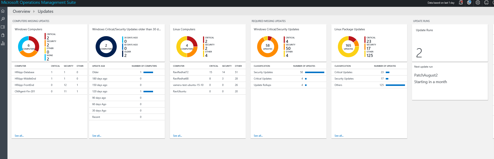
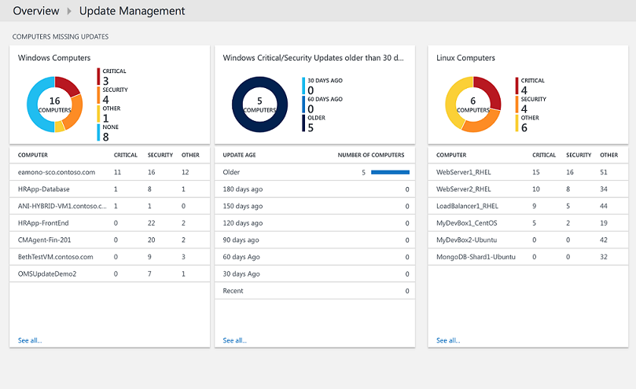
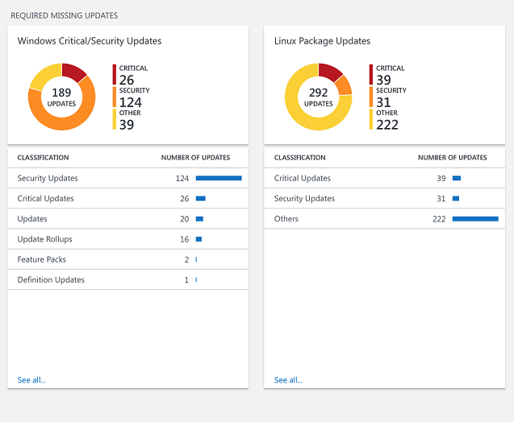
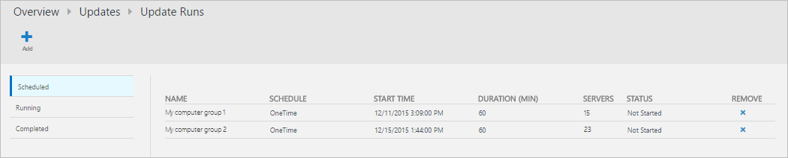
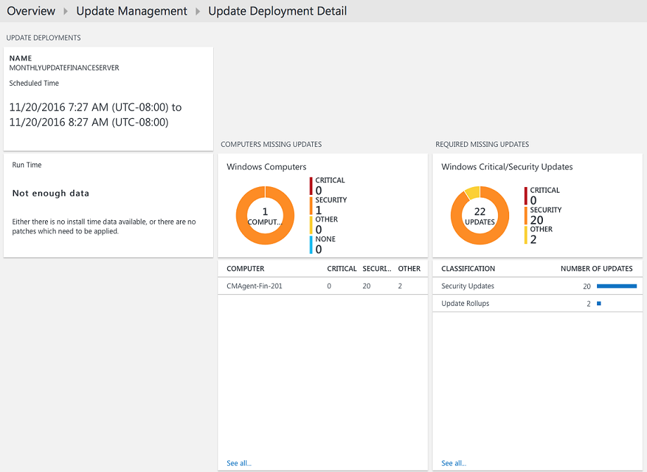
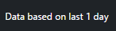

<properties
    pageTitle="Update Management solution in OMS | Microsoft Azure"
    description="This article is intended to help you understand how to use this solution to manage updates for your Windows and Linux computers."
    services="operations-management-suite"
    documentationCenter=""
    authors="MGoedtel"
    manager="jwhit"
    editor=""
	/>
<tags
    ms.service="operations-management-suite"
    ms.workload="tbd"
    ms.tgt_pltfrm="na"
    ms.devlang="na"
    ms.topic="get-started-article"
    ms.date="09/28/2016"
    ms.author="magoedte"/>

#  Update Management solution in OMS

The Update Management solution in OMS allows you to manage updates for your Windows and Linux computers.  You can quickly assess the status of available updates on all agent computers and initiate the process of installing required updates for servers. 

## Prerequisites

-   Windows agents must either be configured to communicate with a Windows Server Update Services (WSUS) server or have access to Microsoft Update.  

    >[AZURE.NOTE] The Windows agent cannot be managed concurrently by System Center Configuration Manager.  
  
-	Linux agents must have access to an update repository.  The OMS Agent for Linux can be downloaded from [GitHub](https://github.com/microsoft/oms-agent-for-linux). 

## Configuration

Perform the following steps to add the Update Management solution to your OMS workspace and add Linux agents.  Windows agents are added automatically with no additional configuration.

1.	Add the Update Management solution to your OMS workspace using the process described in [Add OMS solutions](../log-analytics/log-analytics-add-solutions.md) from the Solutions Gallery.  
2.	In the OMS portal, select **Settings** and then **Connected Sources**.  Note the **Workspace ID** and either the **Primary Key** or **Secondary Key**.
3.	Perform the following steps for each Linux computer.

    a.	Install the latest version of the OMS Agent for Linux by running the following commands.  Replace <Workspace ID> with the Workspace ID and <Key> with either the Primary or Secondary Key.

        cd ~
        wget https://github.com/Microsoft/OMS-Agent-for-Linux/releases/download/v1.2.0-75/omsagent-1.2.0-75.universal.x64.sh
        sudo bash omsagent-1.2.0-75.universal.x64.sh --upgrade -w <Workspace ID> -s <Key>

     b. To remove the agent, run the following command.

        sudo bash omsagent-1.2.0-75.universal.x64.sh --purge

## Management packs

If your System Center Operations Manager management group is connected to your OMS workspace, then the following management packs will be installed in Operations Manager when you add this solution. There is no configuration or maintenance of these management packs required. 

-   Microsoft System Center Advisor Update Assessment Intelligence Pack (Microsoft.IntelligencePacks.UpdateAssessment)
-   Microsoft.IntelligencePack.UpdateAssessment.Configuration (Microsoft.IntelligencePack.UpdateAssessment.Configuration)
-   Update Run MP

For more information on how solution management packs are updated, see [Connect Operations Manager to Log Analytics](../log-analytics/log-analytics-om-agents.md).

## Data collection

### Supported agents

The following table describes the connected sources that are supported by this solution.

Connected Source | Supported | Description|
----------|----------|----------|
Windows agents | Yes | The solution collects information about system updates from Windows agents and initiates installation of required updates.|
Linux agents | Yes | The solution collects information about system updates from Linux agents.|
Operations Manager management group | Yes | The solution collects information about system updates from agents in a connected management group. A direct connection from the Operations Manager agent to Log Analytics is not required. Data is forwarded from the management group to the OMS repository.|
Azure storage account | No | Azure storage does not include information about system updates.|  

### Collection frequency

For each managed Windows computer, a scan is performed twice per day.  When an update is installed, its information is updated within 15 minutes.  

For each managed Linux computer, a scan is performed every 3 hours.  

## Using the solution

When you add the Update Management solution to your OMS workspace, the **Update Management** tile will be added to your OMS dashboard. This tile displays a count and graphical representation of the number of computers in your environment currently requiring system updates.  
  

## Viewing Update Assessments

Click on the **Update Management** tile to open the **Update Management** dashboard. The dashboard includes the columns in the following table. Each column lists up to ten items matching that column's criteria for the specified scope and time range. You can run a log search that returns all records by clicking **See all** at the bottom of the column or by clicking the column header.

Column | Description|
----------|----------|
**Computers Missing Updates** ||
Critical or Security Updates | Lists the top ten computers that are missing updates sorted by the number of updates they're missing. Click on a computer name to run a log search returning all update records for that computer.|
Critical or Security Updates older than 30 days| Identifies number of computers that are missing critical or security updates grouped by the length of time since the update was published. Click on one of the entries to run a log search returning all missing and critical updates.|
**Required Missing Updates**||
Critical or Security Updates | Lists classifications of updates that computers are missing sorted by the number of computers missing updates in the category. Click a classification to run a log search returning all update records for that classification.|
**Update Runs**||
Update Runs | Number of currently scheduled update runs and the duration until the next scheduled run.  Click on the tile to view schedules, currently running, and completed updates or to schedule a new run.|  
   
   
 
   
 
   

## Installing updates

Once updates have been assessed for all of the computers in your environment, you can have required updates installed by creating an *Update Run*.  An Update Run is a scheduled installation of required updates for one or more Windows computers.  You specify the date and time for the run in addition to a computer or group of computers that should be included.  

Updates are installed by runbooks in Azure Automation.  You cannot currently view these runbooks, and they don’t require any configuration.  When an Update Run is created, it creates a schedule in that starts a master update runbook at the specified time for the included computers.  This master runbook starts a child runbook on each Windows agent that performs installation of required updates.  

### Viewing update runs

Click the **Update Runs** tile to view the list of existing Update Runs.  They are grouped by status – **Scheduled**, **Running**, and **Completed**.      

The properties displayed for each Update Run are described in the following table.

Property | Description|
----------|----------|
Name | Name of the Update Run.|
Schedule | Type of schedule.  *OneTime* is currently the only possible value.|
Start Time|Date and time that the Update Run is scheduled to start.|
Duration | Number of minutes the Update Run is allowed to run.  If all updates are not installed within this duration, then the remaining updates must wait until the next Update Run.|
Servers | Number of computers affected by the Update Run.|
Status | Current status of the Update Run.  Possible values are: -	Not Started - Running - Finished|  

Click on an Update Run to view its detail screen which includes the columns in the following table.  These columns will not be populated if the Update Run has not yet started. 

Column | Description|
----------|----------|
**Computer Results**||
Completed Successfully | Lists the number of computers in the Update Run by status.  Click on a status to run a log search returning all update records with that status for the Update Run.|
Computer Installation Status| Lists the computers involved in the Update Run and the percentage of updates that successfully installed. Click on one of the entries to run a log search returning all missing and critical updates.|
**Update Instance Results**||
Instance Installation Status | Lists classifications of updates that computers are missing sorted by the number of computers missing updates in the category. Click a computer to run a log search returning all update records for that computer.|  
   

### Creating an Update Run

Create a new Update Run by clicking the **Add** button at the top of the screen to open the **New Update Run** page.  You must provide values for the properties in the following table.

Property | Description|
----------|----------|
Name | Unique name to identify the update run.|
Time Zone | Time zone to use for the start time.|
Start Time | Date and time to start the update run.|
Duration | Number of minutes the Update Run is allowed to run.  If all updates are not installed within this duration, then the remaining updates must wait until the next Update Run.|
Computers | Names of computers or computer groups to include in the Update Run.  Select one or more entries from the drop down list.|
   

### Time range

By default, the scope of the data analyzed in the Update Management solution is from all connected management groups generated within the last 1 day. 

To change the time range of the data, select **Data based on** at the top of the dashboard. You can select records created or updated within the last 7 days, 1 day, or 6 hours. Or you can select **Custom** and specify a custom date range.     

## Log Analytics records

The Update Management solution creates two types of records in the OMS repository.

### Update records

A record with a type of **Update** is created for each update that is either installed or needed on each computer. Update records have the properties in the following table.

Property | Description|
----------|----------|
Type | *Update*|
SourceSystem | The source that approved installation of the update. Possible values are: - Microsoft Update -	Windows Update -	SCCM - Linux Servers (Fetched from Package Managers)|
Approved | Specifies whether the update has been approved for installation.  For Linux servers this is currently optional as patching is not managed by OMS.|
Classification for Windows | Classification of the update. Possible values are: -	Applications - Critical Updates - Definition Updates - Feature Packs - Security Updates - Service Packs - Update Rollups - Updates|
Classification for Linux | Cassification of the update. Possible values are: -Critical Updates - Security Updates - Other Updates|
Computer | Name of the computer.|
InstallTimeAvailable | Specifies whether the installation time is available from other agents that installed the same update.|
InstallTimePredictionSeconds | Estimated installation time in seconds based on other agents that installed the same update.|
KBID | ID of the KB article that describes the update.|
ManagementGroupName | Name of the management group for SCOM agents.  For other agents, this is AOI-<workspace ID>.|
MSRCBulletinID | ID of the Microsoft security bulletin describing the update.|
MSRCSeverity | Severity of the Microsoft security bulletin. Possible values are: - Critical - Important - Moderate|
Optional | Specifies whether the update is optional.|
Product | Name of the product the update is for.  Click **View** to open the article in a browser.|
PackageSeverity | The severity of the vulnerability fixed in this update, as reported by the  Linux distro vendors. | 
PublishDate | Date and time that the update was installed.|
RebootBehavior | Specifies if the update forces a reboot. Possible values are: - canrequestreboot - neverreboots|
RevisionNumber | Revision number of the update.|
SourceComputerId | GUID to uniquely identify the computer.|
TimeGenerated | Date and time that the record was last updated.|
Title | Title of the update.|
UpdateID | GUID to uniquely identify the update.|
UpdateState | Specifies whether the update is installed on this computer. Possible values are: - Installed - The update is installed on this computer. - Needed - The update is not installed and is needed on this computer.|  

 
When you perform any log search that returns records with a type of **Update** you can select the **Updates** view which displays a set of tiles summarizing the updates returned by the search. You can click on the entries in the **Missing and applied updates** and **Required and optional updates** tiles to scope the view to that set of updates. Select the **List** or **Table** view to return the individual records.  

  

In the **Table** view, you can click on the **KBID** for any record to open a browser with the KB article. This allows you to quickly read about the details of the particular update.  

In the **List** view, you click the **View** link next to the KBID to open the KB article. 

###UpdateSummary records

A record with a type of **UpdateSummary** is created for each Windows agent computer. This record is updated each time the computer is scanned for updates. **UpdateSummary** records have the properties in the following table.

Property | Description|
----------|----------|
Type | UpdateSummary|
SourceSystem | OpsManager |
Computer | Name of the computer.|
CriticalUpdatesMissing | Number of critical updates missing on the computer.|
ManagementGroupName | Name of the management group for SCOM agents. For other agents, this is AOI-<workspace ID>.|
NETRuntimeVersion | Version of the .NET runtime installed on the computer.|
OldestMissingSecurityUpdateBucket | Bucket to categorize the time since the oldest missing security update on this computer was published. Possible values are: - Older -	180 days ago - 150 days ago -	120 days ago - 90 days ago - 60 days ago -	30 days go -	Recent|
OldestMissingSecurityUpdateInDays | Number of days since the oldest missing security update on this computer was published.|
OsVersion | Version of the operating system installed on the computer.|
OtherUpdatesMissing | Number of other updates missing on the computer.|
SecurityUpdatesMissing | Number of security updates missing on the computer.|
SourceComputerId | GUID to uniquely identify the computer.|
TimeGenerated | Date and time that the record was last updated.|
TotalUpdatesMissing |Total number of updates missing on the computer.|
WindowsUpdateAgentVersion | Version number of the Windows Update agent on the computer.|
WindowsUpdateSetting | Setting for how the computer will install important updates. Possible values are: - Disabled - Notify before installation - Scheduled installation|
WSUSServer | URL of WSUS server if the computer is configured to use one.|  

## Sample log searches

The following table provides sample log searches for update records collected by this solution. 

Query | Description|
----------|----------|
All computers with missing updates | Type=Update UpdateState=Needed Optional=false &#124; select Computer,Title,KBID,Classification,UpdateSeverity,PublishedDate|
Missing updates for computer "COMPUTER01.contoso.com" (replace with your own computer name) | Type=Update UpdateState=Needed Optional=false Computer="COMPUTER01.contoso.com" &#124; select Computer,Title,KBID,Product,UpdateSeverity,PublishedDate|
All computers with missing critical or security updates | Type=Update UpdateState=Needed Optional=false (Classification="Security Updates" OR Classification="Critical Updates")|
Critical or security updates needed by machines where updates are manually applied | Type=Update UpdateState=Needed Optional=false (Classification="Security Updates" OR Classification="Critical Updates") Computer IN {Type=UpdateSummary WindowsUpdateSetting=Manual &#124; Distinct Computer} &#124; Distinct KBID|
Error events for machines that have missing critical or security required updates | Type=Event EventLevelName=error Computer IN {Type=Update (Classification="Security Updates" OR Classification="Critical Updates") UpdateState=Needed Optional=false &#124; Distinct Computer}|
All computers with missing update rollups | Type=Update Optional=false Classification="Update Rollups" UpdateState=Needed &#124; select Computer,Title,KBID,Classification,UpdateSeverity,PublishedDate|
Distinct missing updates across all computers | Type=Update UpdateState=Needed Optional=false &#124; Distinct Title|
WSUS computer membership | Type=UpdateSummary &#124; measure count() by WSUSServer|
Automatic update configuration | Type=UpdateSummary &#124; measure count() by WindowsUpdateSetting|
Computers with automatic update disabled | Type=UpdateSummary WindowsUpdateSetting=Manual|  
List of all the Linux machines which have a package update available | Type=Update and OSType=Linux and UpdateState!="Not needed" &#124; measure count() by Computer|
List of all the Linux machines which have a package update available which addresses Critical or Security vulnerability | Type=Update and OSType=Linux and UpdateState!="Not needed" and (Classification="Critical Updates" OR Classification="Security Updates") &#124; measure count() by Computer|
List of all packages that have an update available | Type=Update and OSType=Linux and UpdateState!="Not needed"|
List of all packages that have an update available which addresses Critical or Security vulnerability | Type=Update  and OSType=Linux and UpdateState!="Not needed" and (Classification="Critical Updates" OR Classification="Security Updates")|
List of all the “Ubuntu” machines with any update available | Type=Update and OSType=Linux and OSName = Ubuntu &#124; measure count() by Computer|

## Next steps

- Use Log Searches in [Log Analytics](../log-analytics/log-analytics-log-searches.md) to view detailed update data.

- [Create your own dashboards](../log-analytics/log-analytics-dashboards.md) showing update compliance for your managed computers.

- [Create alerts](../log-analytics/log-analytics-alerts.md) when critical updates are detected as missing from computers or a computer has automatic updates disabled.  

