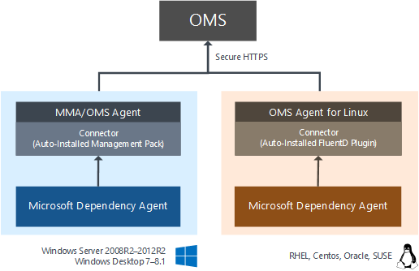
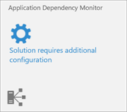

<properties
   pageTitle="Configuring Application Dependency Monitor (ADM) in Operations Management Suite (OMS) | Microsoft Azure"
   description="Application Dependency Monitor (ADM) is an Operations Management Suite (OMS) solution that automatically discovers application components on Windows and Linux systems and maps the communication between services.  This article provides details for deploying ADM in your environment and using it in a variety of scenarios."
   services="operations-management-suite"
   documentationCenter=""
   authors="daseidma"
   manager="jwhit"
   editor="tysonn" />
<tags
   ms.service="operations-management-suite"
   ms.devlang="na"
   ms.topic="article"
   ms.tgt_pltfrm="na"
   ms.workload="infrastructure-services"
   ms.date="09/28/2016"
   ms.author="daseidma;bwren" />

# Configuring Application Dependency Monitor solution in Operations Management Suite (OMS)
 Application Dependency Monitor (ADM) automatically discovers application components on Windows and Linux systems and maps the communication between services. It allows you to view your servers as you think of them – as interconnected systems that deliver critical services.  Application Dependency Monitor shows connections between servers, processes, and ports across any TCP-connected architecture with no configuration required other than installation of an agent.

This article describes the details of configuring Application Dependency Monitor and onboarding agents.  For information on using ADM, see [Using Application Dependency Monitor solution in Operations Management Suite (OMS)](operations-management-suite-application-dependency-monitor.md)

>[AZURE.NOTE]Application Dependency Monitor is currently in private preview.  You can request access to the ADM private preview at [https://aka.ms/getadm](https://aka.ms/getadm).
>
>During private preview, all OMS accounts have unlimited access to ADM.  ADM nodes are free, but Log Analytics data for AdmComputer_CL and AdmProcess_CL types will be metered like any other solution.
>
>After ADM enters public preview, it will be available only to free and paid customers of Insight & Analytics in the OMS Pricing Plan.  Free tier accounts will be limited to 5 ADM nodes.  If you are participating in the private preview and are not enrolled in the OMS Pricing Plan when ADM enters public preview, ADM will be disabled at that time. 

## Connected sources
The following table describes the connected sources that are supported by the ADM solution.

| Connected Source | Supported | Description |
|:--|:--|:--|
| [Windows agents](../log-analytics/log-analytics-windows-agents.md) | Yes | ADM analyzes and collects data from Windows agent computers.    Note that in addition to the OMS agent, Windows agents require the Microsoft Dependency Agent.  Please see the [Supported Operating Systems](#supported-operating-systems) for a complete list of operating system versions. |
| [Linux agents](../log-analytics/log-analytics-linux-agents.md) | Yes | ADM analyzes and collects data from Linux agent computers.    Note that in addition to the OMS agent, Linux agents require the Microsoft Dependency Agent.  Please see the [Supported Operating Systems](#supported-operating-systems) for a complete list of operating system versions. |
| [SCOM management group](../log-analytics/log-analytics-om-agents.md) | Yes | ADM analyzes and collects data from Windows and Linux agents in a connected SCOM management group.   A direct connection from the SCOM agent computer to OMS is required. Data is sent directly from forwarded from the management group to the OMS repository.|
| [Azure storage account](../log-analytics/log-analytics-azure-storage.md) | No | ADM collects data from agent computers, so there is no data from it to collect from Azure storage. |

Note that ADM only supports 64-bit platforms.

On Windows, the Microsoft Monitoring Agent (MMA) is used by both SCOM and OMS to gather and send monitoring data.  (This agent is called the SCOM Agent, OMS Agent, MMA, or Direct Agent, depending on context.)  SCOM and OMS provide different out of the box versions of MMA, but these versions can each report to SCOM, to OMS, or to both.  On Linux, the OMS Agent for Linux gathers and sends monitoring data to OMS.  You can use ADM on servers with OMS Direct Agents or on servers that are attached to OMS via SCOM Management Groups.  For the purpose of this documentation, we will refer to all of these agents – whether on Linux or Windows, whether connected to a SCOM MG or directly to OMS – as the "OMS Agent", unless the specific deployment name of the agent is needed for context.

The ADM agent does not transmit any data itself, and it does not require any changes to firewalls or ports.  ADM’s data is always transmitted by the OMS Agent to OMS, either directly or via the OMS Gateway.

If you are a SCOM customer with a Management Group connected to OMS:

- If your SCOM agents can access the internet to connect to OMS, no additional configuration is required.  
- If your SCOM agents cannot access OMS over the internet, you will need to configure the OMS Gateway to work with SCOM.
  
If you are using the OMS Direct Agent, you need to configure the OMS Agent itself to connect to OMS or to your OMS Gateway.  The OMS Gateway can be downloaded from [https://www.microsoft.com/en-us/download/details.aspx?id=52666](https://www.microsoft.com/en-us/download/details.aspx?id=52666)

### Avoiding duplicate data

If you are a SCOM customer, you should not configure your SCOM agents to communicate directly to OMS, or data will be reported twice.  In ADM, this will result in computers appearing twice in the Machine List.

Configuration of OMS should happen in only one of the following locations:

- The SCOM Console Operations Management Suite panel for Managed Computers
- Azure Operational Insights configuration in the MMA properties

Using both configurations with the same workspace in each will cause duplication of data. Using both with different workspaces can result in conflicting configuration (one with ADM solution enabled and the other without) that may prevent data from flowing to ADM completely.  

Note that even if the machine itself isn’t specified in the SCOM Console’s OMS configuration, if an Instance Group such as “Windows Server Instances Group” is active, it may still result in the machine receiving OMS configuration via SCOM.

## Management packs
When ADM is activated in an OMS workspace, a 300KB Management Pack is sent to all the Microsoft Monitoring Agents in that workspace.  If you are using SCOM agents in a [connected management group](../log-analytics/log-analytics-om-agents.md), the ADM Management Pack will be deployed from SCOM.  If the agents are directly connected, the MP will be delivered by OMS.

The MP is named Microsoft.IntelligencePacks.ApplicationDependencyMonitor*.  It is written to *%Programfiles%\Microsoft Monitoring Agent\Agent\Health Service State\Management Packs\*.  The data source used by the management pack is *%Program files%\Microsoft Monitoring Agent\Agent\Health Service State\Resources\<AutoGeneratedID>\Microsoft.EnterpriseManagement.Advisor.ApplicationDependencyMonitorDataSource.dll*.

## Configuration
In addition to Windows and Linux computers have an agent installed and connected to OMS, the Dependency Agent installer must be downloaded from the ADM solution and then installed as root or Admin on each managed server.  Once the ADM agent is installed on a server reporting to OMS, ADM dependency maps will appear within 10 minutes.  If you have any issues, please email [oms-adm-support@microsoft.com](mailto:oms-adm-support@microsoft.com).

### Migrating from BlueStripe FactFinder
Application Dependency Monitor will deliver BlueStripe technology into OMS in phases. FactFinder is still supported for existing customers but is no longer available for individual purchase.  This preview version of the Dependency Agent can only communicate with OMS.  If you are a current FactFinder customer, please identify a set of test servers for ADM that are not managed by FactFinder. 

### Download the Dependency Agent
In addition to the Microsoft Management Agent (MMA) and OMS Linux Agent which provide the connection between the computer and OMS, all computers analyzed by Application Dependency Monitor must have the Dependency Agent installed.  On Linux, the OMS Agent for Linux must be installed before the Dependency Agent. 

In order to download the Dependency Agent, click **Configure Solution** in the **Application Dependency Monitor** tile to open the **Dependency Agent** blade.  The Dependency Agent blade has links for the Windows and the Linux agents. Click the appropriate link to download each agent. See the following sections for details on installing the agent on different systems.

### Install the Dependency Agent

#### Microsoft Windows
Administrator privileges are required to install or uninstall the agent.

The Dependency Agent is installed on Windows computers with ADM-Agent-Windows.exe. If you run this executable without any options, then it will start a wizard that you can follow to perform the installation interactively.  

Use the following steps to install the Dependency Agent on each Windows computer.

1.	Ensure that the OMS agent is installed using the instructions at Connect computers directly to OMS.
2.	Download the Windows agent and run it with the following command. *ADM-Agent-Windows.exe*
3.	Follow the wizard to install the agent.
4.	If the Dependency Agent fails to start, check the logs for detailed error information. On Windows agents, the log directory is *C:\Program Files\BlueStripe\Collector\logs*. 

The Dependency Agent for Windows can be uninstalled by an Administrator through the Control Panel.

#### Linux
Root access is required to install or configure the agent.

The Dependency Agent is installed on Linux computers with ADM-Agent-Linux64.bin, a shell script with a self-extracting binary. You can run the file with sh or add execute permissions to the file itself.
 
Use the following steps to install the Dependency Agent on each Linux computer.

1.	Ensure that the OMS agent is installed using the instructions at [Collect and manage data from Linux computers.  This needs to be installed before the Linux Dependency Agent](https://technet.microsoft.com/library/mt622052.aspx).
2.	Install the Linux Dependency agent as root using the following command. *sh ADM-Agent-Linux64.bin*.
3.	If the Dependency Agent fails to start, check the logs for detailed error information. On Linux agents, the log directory is */var/opt/microsoft/dependency-agent/log*.

### Uninstalling the Dependency Agent on Linux
To completely uninstall the Dependency Agent from Linux, you must remove the agent itself and the proxy which is installed automatically with the agent.  You can uninstall both with the following single command.

	rpm -e dependency-agent dependency-agent-connector

### Installing from a Command Line
The previous section provides guidance on installing the Dependency Monitor agent using default options.  The sections below provide guidance for installing the agent from a command line using custom options.

#### Windows
Use options from the table below to perform the installation from a command line. To see a list of the installation flags run the installer with the /? flag as follows.

	ADM-Agent-Windows.exe /?

| Flag | Description |
|:--|:--|
| /S | Perform a silent installation with no user prompts. |

Files for the Windows Dependency Agent are placed in *C:\Program Files\BlueStripe\Collector* by default.

#### Linux
Use options from the table below to perform the installation. To see a list of the installation flags run the installation program with the -help flag as follows.

	ADM-Agent-Linux64.bin -help

| Flag	Description
|:--|:--|
| -s | Perform a silent installation with no user prompts. |
| --check | Checks permissions and operating system but does not install the agent. |

Files for the Dependency Agent are placed in the following directories.

| Files | Location |
|:--|:--|
| Core files | /usr/lib/bluestripe-collector |
| Log files | /var/opt/microsoft/dependency-agent/log |
| Config files | /etc/opt/microsoft/dependency-agent/config |
| Service executables | /sbin/bluestripe-collector /sbin/bluestripe-collector-manager |
| Binary storage files | /var/opt/microsoft/dependency-agent/storage |

## Troubleshooting
If you encounter problems with Application Dependency Monitor, you can gather troubleshooting information from multiple components using the following information.

### Windows Agents

#### Microsoft Dependency Agent
To generate troubleshooting data from the Dependency Agent, open a Command Prompt as administrator and run the CollectBluestripeData.vbs script using the following command.  You can add the --help flag to show additional options.

	cd C:\Program Files\Bluestripe\Collector\scripts
	cscript CollectDependencyData.vbs

The Support Data Package is saved in the %USERPROFILE% directory for the current user.  You can use the --file <filename> option to save it to a different location.

#### Microsoft Dependency Agent Management Pack for MMA
The Dependency Agent Management Pack runs inside Microsoft Management Agent.  It receives data from the Dependency Agent and forwards it to the ADM cloud service.
  
Verify that the management pack is downloaded by performing the following steps.

1.	Look for a file called Microsoft.IntelligencePacks.ApplicationDependencyMonitor.mp in C:\Program Files\Microsoft Monitoring Agent\Agent\Health Service State\Management Packs.  
2.	If the file is not present and the agent is connected to a SCOM management group, then verify that it has been imported into SCOM by checking Management Packs in the Administration workspace of the Operations Console.

The ADM MP writes events to the Operations Manager Windows event log.  The log can be [searched in OMS](../log-analytics/log-analytics-log-searches.md) via the system log solution, where you can configure which log files to upload.  If debug events are enabled, they are written to the Application event log, with the event source *AdmProxy*.

#### Microsoft Monitoring Agent
To collect diagnostic traces, open a Command Prompt as administrator and run the following commands: 

	cd \Program Files\Microsoft Monitoring Agent\Agent\Tools
	net stop healthservice 
	StartTracing.cmd ERR
	net start healthservice

Traces are written to c:\Windows\Logs\OpsMgrTrace.  You can stop the tracing with StopTracing.cmd.

### Linux Agents

#### Microsoft Dependency Agent
To generate troubleshooting data from the Dependency Agent, login with an account that has sudo or root privileges and run the following command.  You can add the --help flag to show additional options.

	/usr/lib/bluestripe-collector/scripts/collect-dependency-agent-data.sh

The Support Data Package is saved to /var/opt/microsoft/dependency-agent/log (if root) under the Agent's installation directory, or to the home directory of the user running the script (if non-root).  You can use the --file <filename> option to save it to a different location.

#### Microsoft Dependency Agent Fluentd Plug-in for Linux
The Dependency Agent Fluentd Plug-in runs inside the OMS Linux Agent.  It receives data from the Dependency Agent and forwards it to the ADM cloud service.  

Logs are written to the following two files.

- /var/opt/microsoft/omsagent/log/omsagent.log
- /var/log/messages

#### OMS Agent for Linux
A troubleshooting resource for connecting Linux servers to OMS can be found here: [https://github.com/Microsoft/OMS-Agent-for-Linux/blob/master/docs/Troubleshooting.md](https://github.com/Microsoft/OMS-Agent-for-Linux/blob/master/docs/Troubleshooting.md) 

The logs for the OMS Agent for Linux are located in */var/opt/microsoft/omsagent/log/*.  

The logs for omsconfig (agent configuration) are located in */var/opt/microsoft/omsconfig/log/*.
 
The log for the OMI and SCX components which provide performance metrics data are located in */var/opt/omi/log/* and */var/opt/microsoft/scx/log*.

## Data collection
You can expect each agent to transmit roughly 25MB per day, depending on how complex your system dependencies are.  ADM dependency data is sent by each agent every 15 seconds.  

The ADM Agent typically consumes 0.1% of system memory and 0.1% of system CPU.

## Supported Operating Systems
The following sections list the supported operating systems for the Dependency Agent.   32-bit architectures are not supported for any operating system.

### Windows Server
- Windows Server 2012 R2
- Windows Server 2012
- Windows Server 2008 R2 SP1

### Windows Desktop
- Note: Windows 10 is not yet supported
- Windows 8.1
- Windows 8
- Windows 7

### Red Hat Enterprise Linux, CentOS Linux and Oracle Linux (with RHEL Kernel)
- Only default and SMP Linux kernel releases are supported.
- Non-standard kernel releases, such as PAE and Xen, are not supported for any Linux distribution. For example, a system with the release string of "2.6.16.21-0.8-xen" is not supported.
- Custom kernels, including recompiles of standard kernels, are not supported
- Centos Plus kernel is not supported.
- Oracle Unbreakable Kernel (UEK) is covered in a different section below.

#### Red Hat Linux 7
| OS Version | Kernel Version |
|:--|:--|
| 7.0 | 3.10.0-123 |
| 7.1 | 3.10.0-229 |
| 7.2 | 3.10.0-327 |

#### Red Hat Linux 6
| OS Version | Kernel Version |
|:--|:--|
| 6.0 | 2.6.32-71 |
| 6.1 | 2.6.32-131 |
| 6.2 | 2.6.32-220 |
| 6.3 | 2.6.32-279 |
| 6.4 | 2.6.32-358 |
| 6.5 | 2.6.32-431 |
| 6.6 | 2.6.32-504 |
| 6.7 | 2.6.32-573 |
| 6.8 | 2.6.32-642 |

#### Red Hat Linux 5
| OS Version | Kernel Version |
|:--|:--|
| 5.8 | 2.6.18-308 |
| 5.9 | 2.6.18-348 |
| 5.10 | 2.6.18-371 |
| 5.11 | 2.6.18-398 2.6.18-400 2.6.18-402 2.6.18-404 2.6.18-406 2.6.18-407 2.6.18-408 2.6.18-409 2.6.18-410 2.6.18-411 |

#### Oracle Enterprise Linux w/ Unbreakable Kernel (UEK)

#### Oracle Linux 6
| OS Version | Kernel Version
|:--|:--|
| 6.2 | Oracle 2.6.32-300 (UEK R1) |
| 6.3 | Oracle 2.6.39-200 (UEK R2) |
| 6.4 | Oracle 2.6.39-400 (UEK R2) |
| 6.5 | Oracle 2.6.39-400 (UEK R2 i386) |
| 6.6 | Oracle 2.6.39-400 (UEK R2 i386) |

#### Oracle Linux 5

| OS Version | Kernel Version
|:--|:--|
| 5.8 | Oracle 2.6.32-300 (UEK R1) |
| 5.9 | Oracle 2.6.39-300 (UEK R2) |
| 5.10 | Oracle 2.6.39-400 (UEK R2) |
| 5.11 | Oracle 2.6.39-400 (UEK R2) |

#### SUSE Linux Enterprise Server

#### SUSE Linux 11
| OS Version | Kernel Version
|:--|:--|
| 11 | 2.6.27 |
| 11 SP1 | 2.6.32 |
| 11 SP2 | 3.0.13 |
| 11 SP3 | 3.0.76 |
| 11 SP4 | 3.0.101 |

#### SUSE Linux 10
| OS Version | Kernel Version
|:--|:--|
| 10 SP4 | 2.6.16.60 |

## Diagnostic and usage data
Microsoft automatically collects usage and performance data through your use of the Application Dependency Monitor service. Microsoft uses this Data to provide and improve the quality, security and integrity of the Application Dependency Monitor service. Data includes information about the configuration of your software like operating system and version and also includes IP address, DNS name, and Workstation name in order to provide accurate and efficient troubleshooting capabilities. We do not collect names, addresses or other contact information.

For more information on data collection and usage, please see the [Microsoft Online Services Privacy Statement](https://go.microsoft.com/fwlink/?LinkId=512132).

## Next steps
- Learn how to [use Application Dependency Monitor](operations-management-suite-application-dependency-monitor.md) once it has been deployed and configured.
