<properties
   pageTitle="Application Dependency Monitor (ADM) in Operations Management Suite (OMS) | Microsoft Azure"
   description="Application Dependency Monitor (ADM) is an Operations Management Suite (OMS) solution that automatically discovers application components on Windows and Linux systems and maps the communication between services.  This article provides details for deploying ADM in your environment and using it in a variety of scenarios."
   services="operations-management-suite"
   documentationCenter=""
   authors="daseidma"
   manager="jwhit"
   editor="tysonn" />
<tags
   ms.service="operations-management-suite"
   ms.devlang="na"
   ms.topic="article"
   ms.tgt_pltfrm="na"
   ms.workload="infrastructure-services"
   ms.date="09/28/2016"
   ms.author="daseidma;bwren" />

# Using Application Dependency Monitor solution in Operations Management Suite (OMS)
 Application Dependency Monitor (ADM) automatically discovers application components on Windows and Linux systems and maps the communication between services. It allows you to view your servers as you think of them – as interconnected systems that deliver critical services.  Application Dependency Monitor shows connections between servers, processes, and ports across any TCP-connected architecture with no configuration required other than installation of an agent.

This article describes the details of using Application Dependency Monitor.  For information on configuring ADM and onboarding agents, see [Configuring Application Dependency Monitor solution in Operations Management Suite (OMS)](operations-management-suite-application-dependency-monitor-configure.md)

>[AZURE.NOTE]Application Dependency Monitor is currently in private preview.  You can request access to the ADM private preview at [https://aka.ms/getadm](https://aka.ms/getadm).
>
>During private preview, all OMS accounts have unlimited access to ADM.  ADM nodes are free, but Log Analytics data for AdmComputer_CL and AdmProcess_CL types will be metered like any other solution.
>
>After ADM enters public preview, it will be available only to free and paid customers of Insight & Analytics in the OMS Pricing Plan.  Free tier accounts will be limited to 5 ADM nodes.  If you are participating in the private preview and are not enrolled in the OMS Pricing Plan when ADM enters public preview, ADM will be disabled at that time. 

## Use Cases: Make Your IT Processes Dependency Aware

### Discovery
ADM automatically builds a common reference map of dependencies across your servers, processes, and 3rd party services.  It discovers and maps all TCP dependencies, identifying surprise connections, remote 3rd party systems you depend on, and dependencies to traditional dark areas of your network such as DNS and AD.  ADM discovers failed network connections that your managed systems are attempting to make, helping you identify potential server misconfiguration, service outages, and network issues.

### Incident Management
ADM helps eliminate the guesswork of problem isolation by showing you how systems are connected and affecting each other.  In addition to failed connections, information about connected clients help identify misconfigured load balancers, surprising or excessive load on critical services, and rogue clients such as developer machines talking to production systems.  Integrated workflows with OMS Change Tracking also allows you to see whether a change event on a back-end machine or service explains the root cause of an incident.

### Migration Assurance
ADM allows you to effectively plan, accelerate, and validate Azure migrations, ensuring that nothing is left behind and there are no surprise outages.  You can discover all interdependent systems that need to migrate together, assess system configuration and capacity, and identify whether a running system is still serving users or is a candidate for decommissioning instead of migration.  After the move is done, you can check on client load and identity to verify that test systems and customers are connecting.  If your subnet planning and firewall definitions have issues, failed connections in ADM maps will point you to the systems that need connectivity.

### Business Continuity
If you are using Azure Site Recovery and need help defining the recovery sequence for your application environment, ADM can automatically show you how systems rely on each other to ensure that your recovery plan is reliable.  By choosing a critical server and viewing its clients, you can identify the front-end systems that should be recovered only after that critical server is restored and available.  Conversely, by looking at a critical server’s back-end dependencies, you can identify those systems that must be recovered before your focus system is restored.

### Patch Management
ADM enhances your use of OMS System Update Assessment by showing you which other teams and servers depend on your service, so you can notify them in advance before you take your systems down for patching.  ADM also enhances patch management in OMS by showing you whether your services are available and properly connected after they are patched and restarted. 

## Mapping Overview
ADM agents gather information about all TCP-connected processes on the server where they’re installed, as well as details about the inbound and outbound connections for each process.  Using the Machine List on the left side of the ADM solution, machines with ADM agents can be selected to visualize their dependencies over a selected time range.  Machine dependency maps focus on a specific machine, and show all the machines that are direct TCP clients or servers of that machine.

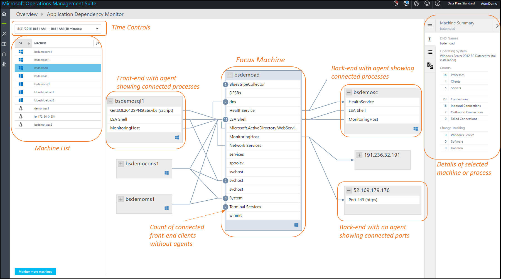

Machines can be expanded in the map to show the running processes with active network connections during the selected time range.  When a remote machine with an ADM agent is expanded to show process details, only those processes communicating with the focus machine are shown.  The count of agentless front-end machines connecting into the focus machine is indicated on the left side of the processes they connect to.  If the focus machine is making a connection to a back-end machine without an agent, that back-end is represented with a node in the map that shows its IPv4 address, and the node can be expanded to show individual ports and services that the focus machine is communicating with.

By default, ADM maps show the last 10 minutes of dependency information.  Using the time controls in the upper left, maps can be queried for historical time ranges, up to one-hour wide, to show how dependencies looked in the past, e.g. during an incident or before a change occurred.    ADM data is stored for 30 days in paid workspaces, and for 7 days in free workspaces.

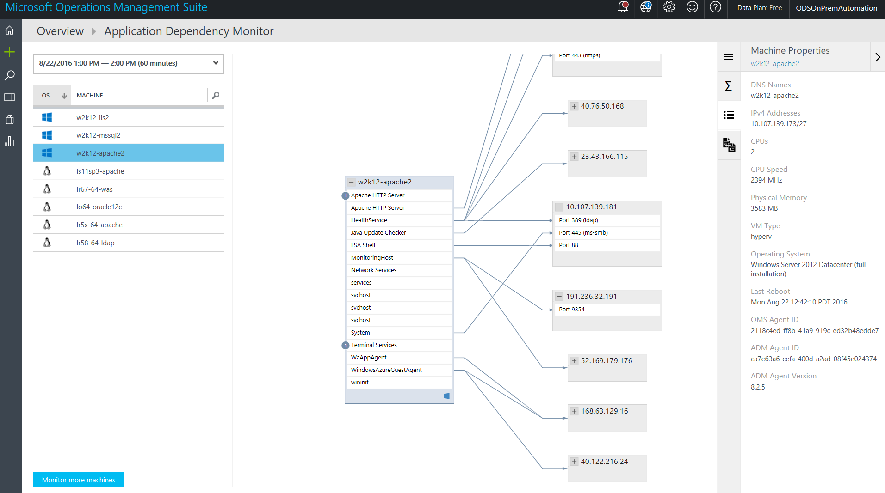

## Failed Connections
Failed Connections are shown in ADM maps for processes and computers, with a dashed red line showing if a client system is failing to reach a process or port.  Failed connections are reported from any system with a deployed ADM agent if that system is the one attempting the failed connection.  ADM measures this by observing TCP sockets that fail to establish a connection.  This could be due to a firewall, a misconfiguration in the client or server, or a remote service being unavailable. 

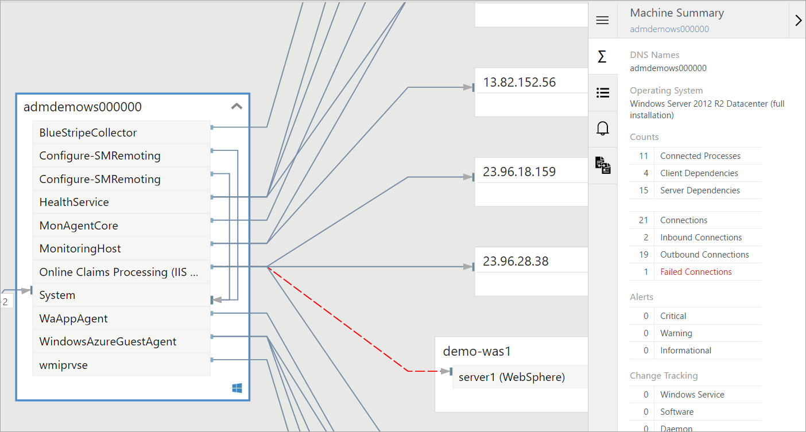

Understanding failed connections can help with troubleshooting, migration validation, security analysis, and overall architectural understanding.  Sometimes failed connections are harmless, but they often point directly to a problem, such as a failover environment suddenly becoming unreachable, …or two application tiers not being able to talk after a cloud migration.  In the image above, IIS and WebSphere are both running, but they can’t connect. 

## Computer and Process Properties
When navigating an ADM map, you can select machines and processes to gain additional context about their properties.  Machines provide information about DNS name, IPv4 addresses, CPU and Memory capacity, VM Type, Operating System version, Last Reboot time, and the IDs of their OMS and ADM agents.

Process	 details are gathered from Operating System metadata about running processes, including process name, process description, user name and domain (on Windows), company name, product name, product version, working directory, command line, and process start time.

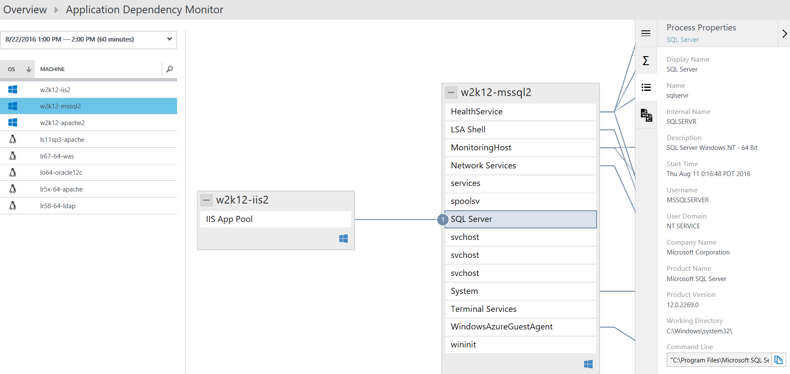

The Process Summary panel provides additional information about that process’s connectivity, including its bound ports, inbound and outbound connections, and failed connections. 

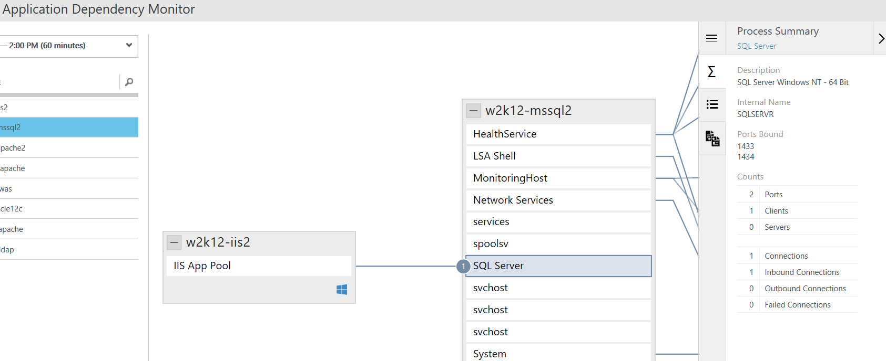

## OMS Change Tracking Integration
ADM’s integration with Change Tracking is automatic when both solutions are enabled and configured in your OMS workspace.

The Machine Summary Panel indicates whether Change Tracking events have occurred on the selected machine during the selected time range.

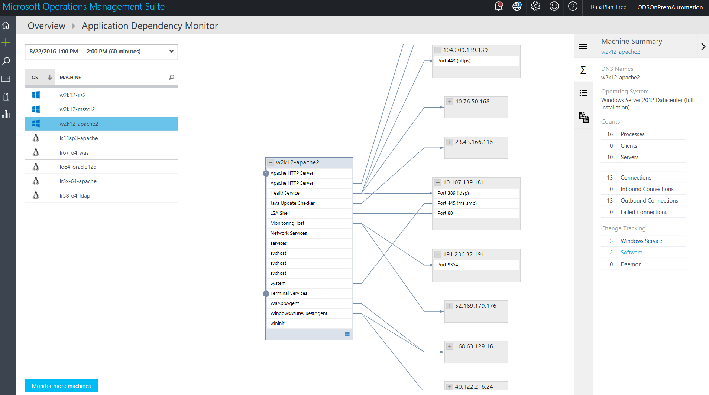

The Machine Change Tracking Panel shows a list of all changes, with the most recent first, along with a link to drill into Log Search for additional details.
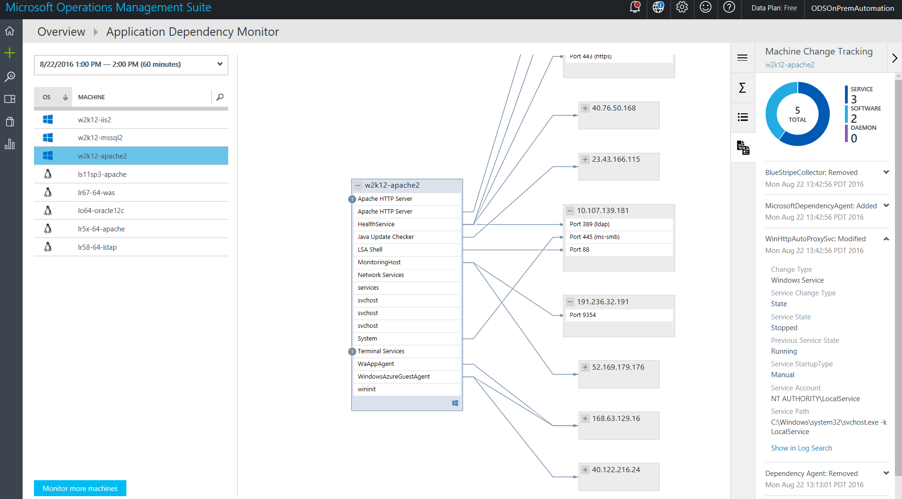

Following is a drill down view of Configuration Change event after selecting **Show in Log Analytics**.
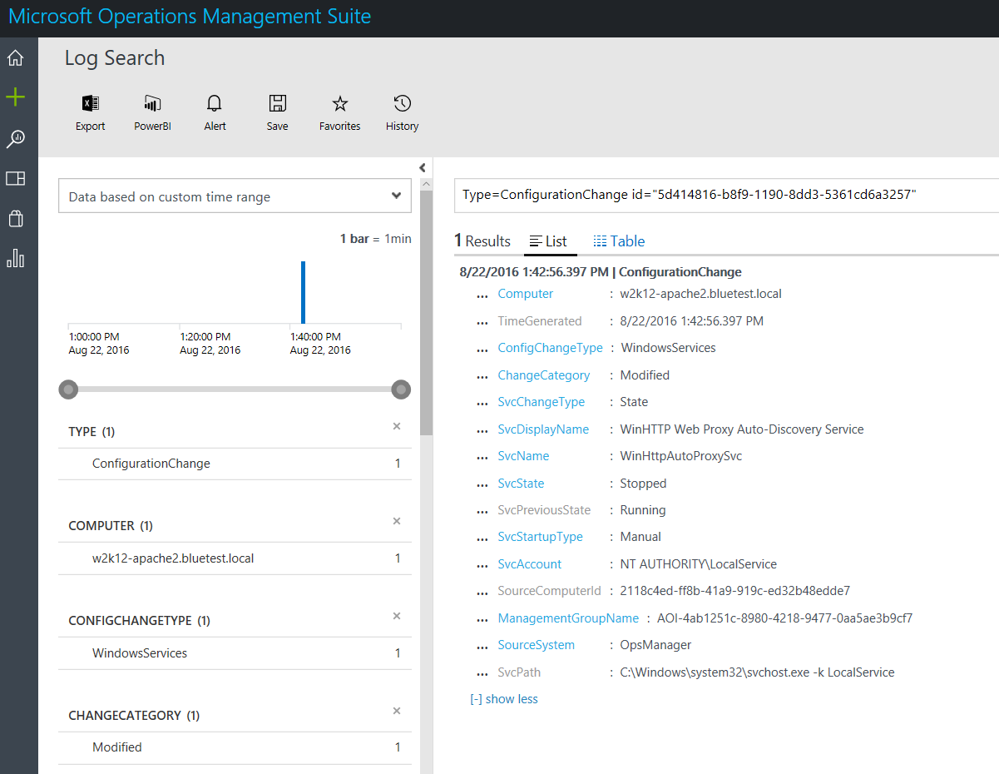

## Log Analytics records
ADM’s computer and process inventory data is available for [search](../log-analytics/log-analytics-log-searches.md) in Log Analytics.  This can be applied to scenarios including migration planning, capacity analysis, discovery, and ad hoc performance troubleshooting. 

One record is generated per hour for each unique computer and process in addition to records generated when that process or computer starts or is on-boarded to ADM.  These records have the properties in the following tables. 

There are internally generated properties you can use to identify unique processes and computers:

- PersistentKey_s is uniquely defined by the process configuration, e.g. command line and user ID.  It is unique for a given computer, but can be repeated across computers.
- ProcessId_s and ComputerId_s are globally unique in the ADM model.

### AdmComputer_CL records
Records with a type of **AdmComputer_CL** have inventory data for servers with ADM agents.  These records have the properties in the following table.  

| Property | Description |
|:--|:--|
| Type | *AdmComputer_CL* |
| SourceSystem | *OpsManager* |
| ComputerName_s | Windows or Linux computer name |
| CPUSpeed_d | CPU Speed in MHz |
| DnsNames_s | List of all DNS names for this computer |
| IPv4s_s | List of all IPv4 addresses in use by this computer |
| IPv6s_s | List of all IPv6 addresses in use by this computer.  (ADM identifies IPv6  addresses but does not discover IPv6 dependencies.) |
| Is64Bit_b | true or false based on OS type |
| MachineId_s | An internal GUID, unique across an OMS workspace  |
| OperatingSystemFamily_s | Windows or Linux |
| OperatingSystemVersion_s | Long OS version string |
| TimeGenerated | Date and time that the record was created. |
| TotalCPUs_d | Number of CPU cores |
| TotalPhysicalMemory_d | Memory capacity in MB |
| VirtualMachine_b | true or false based on whether OS is a VM guest |
| VirtualMachineID_g | Hyper-V VM ID |
| VirtualMachineName_g | Hyper-V VM Name |
| VirtualMachineType_s | Hyperv, Vmware, Xen, Kvm, Ldom, Lpar, Virtualpc |

### AdmProcess_CL Type records 
Records with a type of **AdmProcess_CL** have inventory data for TCP-connected processes on servers with ADM agents.  These records have the properties in the following table.

| Property | Description |
|:--|:--|
| Type | *AdmProcess_CL* |
| SourceSystem | *OpsManager* |
| CommandLine_s | Full command line of the process |
| CompanyName_s | Company name (from Windows PE or Linux RPM) |
| Description_s | Long process description (from Windows PE or Linux RPM) |
| FileVersion_s | Executable file version (from Windows PE, Windows only) |
| FirstPid_d | OS Process ID |
| InternalName_s | Executable file’s internal name (from Windows PE, Windows only) |
| MachineId_s | Internal GUID unique across an OMS workspace  |
| Name_s | The process executable name |
| Path_s | File system path of the process executable |
| PersistentKey_s | Internal GUID unique within this computer |
| PoolId_d | Internal ID for aggregating processes based on similar command lines. |
| ProcessId_s | Internal GUID unique across an OMS workspace  |
| ProductName_s | Product name string (from Windows PE or Linux RPM) |
| ProductVersion_s | Product version string (from Windows PE or Linux RPM) |
| StartTime_t | Process start time on local computer clock |
| TimeGenerated | Date and time that the record was created. |
| UserDomain_s | Domain of process owner (Windows only) |
| UserName_s | Name of process owner (Windows only) |
| WorkingDirectory_s | Process working directory |

## Sample log searches

### List the physical memory capacity of all managed computers. 
Type=AdmComputer_CL | select TotalPhysicalMemory_d, ComputerName_s | Dedup ComputerName_s

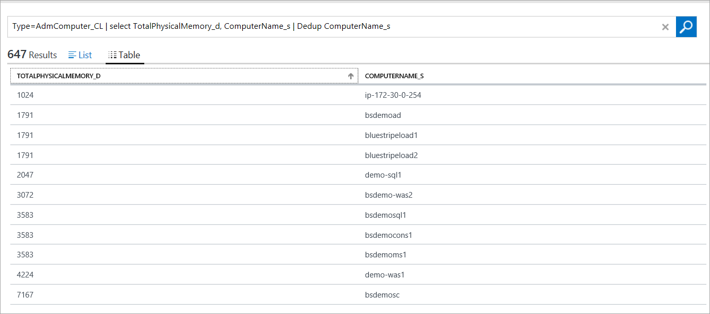

### List computer name, DNS, IP, and OS version.
Type=AdmComputer_CL | select ComputerName_s, OperatingSystemVersion_s, DnsNames_s, IPv4s_s  | dedup ComputerName_s

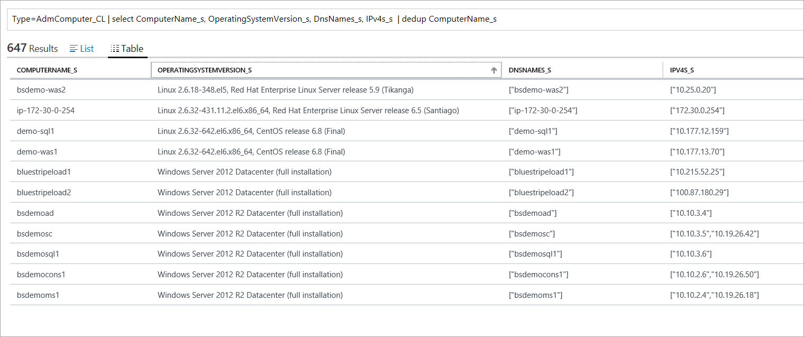

### Find all processes with "sql" in the command line
Type=AdmProcess_CL CommandLine_s = \*sql\* | dedup ProcessId_s

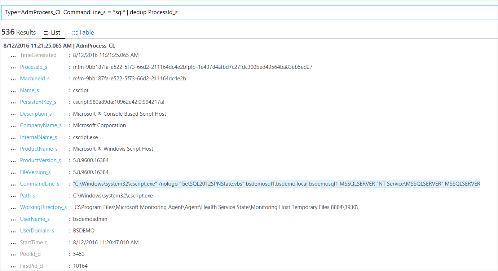

### After viewing event data for given process, use its machine ID to retrieve the computer’s name
Type=AdmComputer_CL "m!m-9bb187fa-e522-5f73-66d2-211164dc4e2b" | Distinct ComputerName_s

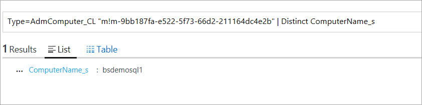

### List all computers running SQL
Type=AdmComputer_CL MachineId_s IN {Type=AdmProcess_CL \*sql\* | Distinct MachineId_s} | Distinct ComputerName_s

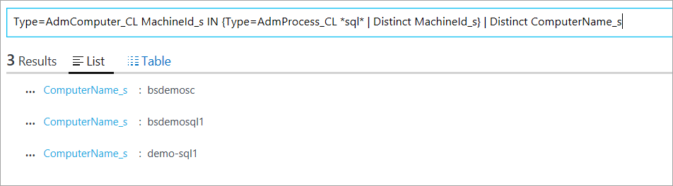

### List of all unique product versions of curl in my datacenter
Type=AdmProcess_CL Name_s=curl | Distinct ProductVersion_s

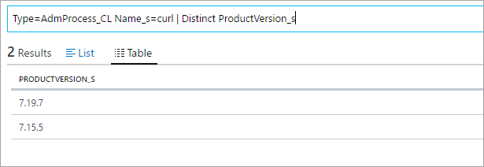

### Create a Computer Group of all computers running CentOS

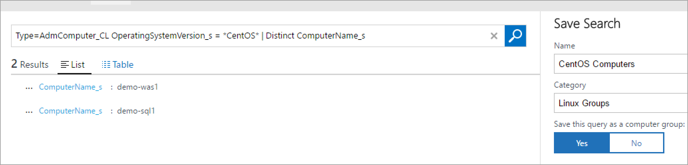

## Diagnostic and usage data
Microsoft automatically collects usage and performance data through your use of the Application Dependency Monitor service. Microsoft uses this Data to provide and improve the quality, security and integrity of the Application Dependency Monitor service. Data includes information about the configuration of your software like operating system and version and also includes IP address, DNS name, and Workstation name in order to provide accurate and efficient troubleshooting capabilities. We do not collect names, addresses or other contact information.

For more information on data collection and usage, please see the [Microsoft Online Services Privacy Statement](hhttps://go.microsoft.com/fwlink/?LinkId=512132).

## Next steps
- Learn more about [log searches](../log-analytics/log-analytics-log-searches.md] in Log Analytics to retrieve data collected by Application Dependency Monitor.)
