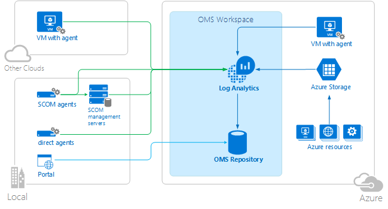
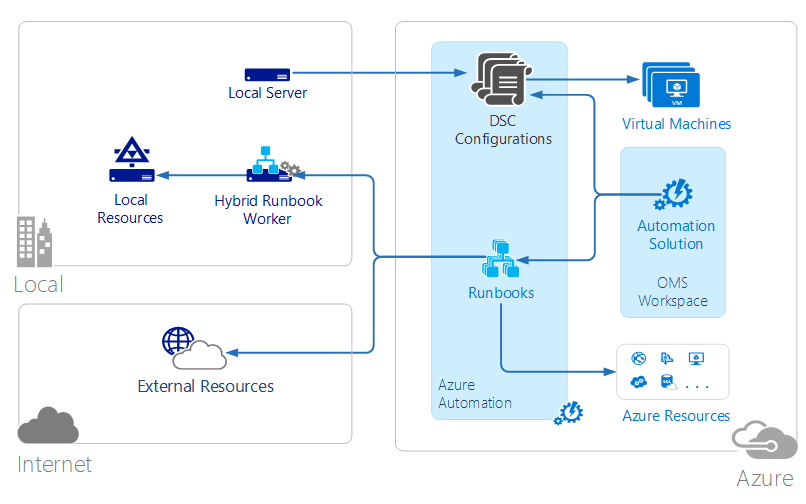
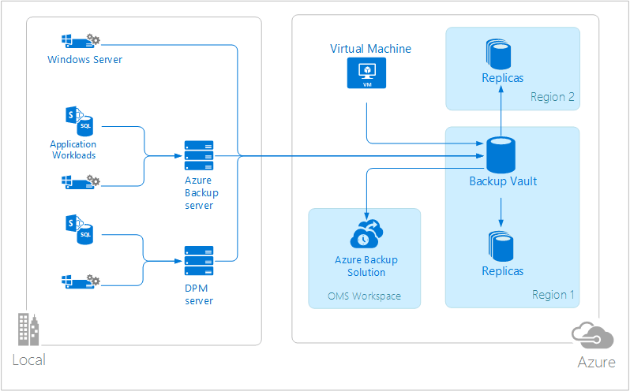
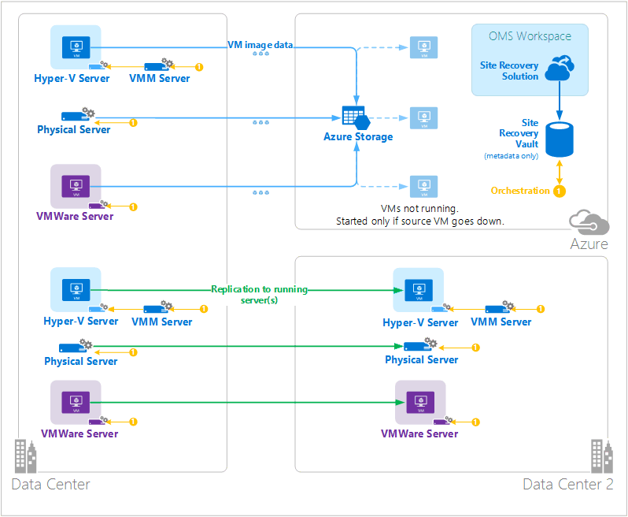

<properties 
   pageTitle="Operations Management Suite (OMS) architecture | Microsoft Azure"
   description="Microsoft Operations Management Suite (OMS) is Microsoft's cloud-based IT management solution that helps you manage and protect your on-premises and cloud infrastructure.  This article identifies the different services included in OMS and provides links to their detailed content."
   services="operations-management-suite"
   documentationCenter=""
   authors="bwren"
   manager="jwhit"
   editor="tysonn" />
<tags 
   ms.service="operations-management-suite"
   ms.devlang="na"
   ms.topic="get-started-article"
   ms.tgt_pltfrm="na"
   ms.workload="infrastructure-services"
   ms.date="05/16/2016"
   ms.author="bwren" />

# OMS architecture

[Operations Management Suite (OMS)](https://azure.microsoft.com/documentation/services/operations-management-suite/) is a collection of cloud-based services for managing your on-premises and cloud environments.  This article describes the different on-premises and cloud components of OMS and their high level cloud computing architecture.  You can refer to the documentation for each service for further details.

## Log Analytics

All data collected by [Log Analytics](https://azure.microsoft.com/documentation/services/log-analytics/) is stored in the OMS repository which is hosted in Azure.  Connected Sources generate data collected into the OMS repository.  There are currently three types of connected sources supported.

- An agent installed on a [Windows](../log-analytics/log-analytics-windows-agents.md) or [Linux](../log-analytics/log-analytics-linux-agents.md) computer connected directly to OMS.
- A System Center Operations Manager (SCOM) management group [connected to Log Analytics](../log-analytics/log-analytics-om-agents.md) .  SCOM agents continue to communicate with management servers which forward events and performance data to Log Analytics.
- An [Azure storage account](../log-analytics/log-analytics-azure-storage.md) that collects [Azure Diagnostics](../cloud-services/cloud-services-dotnet-diagnostics.md) data from a worker role, web role, or virtual machine in Azure.

Data sources define the data that Log Analytics collects from connected sources including event logs and performance counters.  Solutions add functionality to OMS and can easily be added to your workspace from the [OMS Solutions Gallery](../log-analytics/log-analytics-add-solutions.md).  Some solutions may require a direct connection to Log Analytics from SCOM agents while others may require an additional agent to be installed.

Log Analytics has a web-based portal that you can use to manage OMS resources, add and configure OMS solutions, and view and analyze data in the OMS repository.

## Azure Automation

[Azure Automation runbooks](http://azure.microsoft.com/documentation/services/automation) are executed in the Azure cloud and can access resources that are in Azure, in other cloud services, or accessible from the public Internet.  You can also designate on-premises machines in your local data center using [Hybrid Runbook Worker](../automation/automation-hybrid-runbook-worker.md) so that runbooks can access local resources.

[DSC configurations](../automation/automation-dsc-overview.md) stored in Azure Automation can be directly applied to Azure virtual machines.  Other physical and virtual machines can request configurations from the Azure Automation DSC pull server.

Azure Automation has an OMS solution that displays statistics and links to launch the Azure portal for any operations.

## Azure Backup

Protected data in [Azure Backup](http://azure.microsoft.com/documentation/services/backup) is stored in a backup vault located in a particular geographic region.  The data is replicated within the same region and, depending on the type of vault, may also be replicated to another region for further redundancy.

Azure Backup has three fundamental scenarios.

- Windows machine with Azure Backup agent.  This allows you to backup files and folders from any Windows server or client directly to your Azure backup vault.  
- System Center Data Protection Manager (DPM) or Microsoft Azure Backup Server. This allows you to leverage DPM or Microsoft Azure Backup Server to backup files and folders in addition to application workloads such as SQL and SharePoint to local storage and then replicate to your Azure backup vault.
- Azure Virtual Machine Extensions.  This allows you to backup Azure virtual machines to your Azure backup vault.

Azure Backup has an OMS solution that displays statistics and links to launch the Azure portal for any operations.

## Azure Site Recovery

[Azure Site Recovery](http://azure.microsoft.com/documentation/services/site-recovery) orchestrates replication, failover, and failback of virtual machines and physical servers. Replication data is exchanged between Hyper-V hosts, VMware hypervisors, and physical servers in primary and secondary datacenters, or between the datacenter and Azure storage.  Site Recovery stores metadata in vaults located in a particular geographic Azure region. No replicated data is stored by the Site Recovery service.

Azure Site Recovery has three fundamental replication scenarios.

**Replication of Hyper-V virtual machines**
- If Hyper-V virtual machines are managed in VMM clouds, you can replicate to a secondary data center or to Azure storage.  Replication to Azure is over a secure internet connection.  Replication to a secondary datacenter is over the LAN.
- If Hyper-V virtual machines aren’t managed by VMM, you can replicate to Azure storage only.  Replication to Azure is over a secure internet connection.
 
**Replication of VMWare virtual machines**
- You can replicate VMware virtual machines to a secondary datacenter running VMware or to Azure storage.  Replication to Azure can occur over a site-to-site VPN or Azure ExpressRoute or over a secure Internet connection. Replication to a secondary datacenter occurs over the InMage Scout data channel.
 
**Replication of physical Windows and Linux servers** 
- You can replicate physical servers to a secondary datacenter or to Azure storage. Replication to Azure can occur over a site-to-site VPN or Azure ExpressRoute or over a secure Internet connection. Replication to a secondary datacenter occurs over the InMage Scout data channel.  Azure Site Recovery has an OMS solution that displays some statistics, but you must use the Azure portal for any operations.

## Next steps

- Learn about [Log Analytics](http://azure.microsoft.com/documentation/services/log-analytics).
- Learn about [Azure Automation](https://azure.microsoft.com/documentation/services/automation).
- Learn about [Azure Backup](http://azure.microsoft.com/documentation/services/backup).
- Learn about [Azure Site Recovery](http://azure.microsoft.com/documentation/services/site-recovery).
