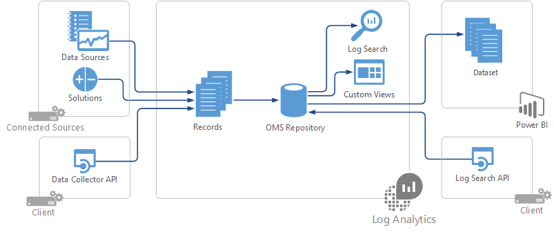
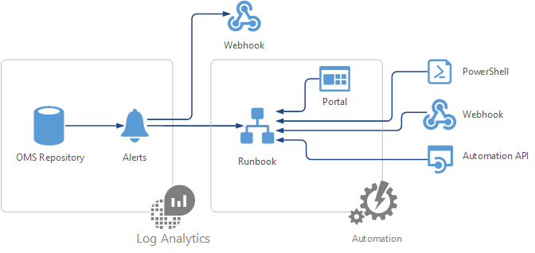

# Integrating with Operations Management Suite (OMS)
Operations Management Suite is Microsoft's cloud-based IT management solution that helps you manage and protect your on-premises and cloud infrastructure.  In addition to using the standard features of OMS, you can integrate it with other management applications and services to provide a hybrid management environment, to provide custom management scenarios unique to your environment, or to provide a custom management experience for your customers.  This article provides an overview of your different options for integrating with OMS services and links to articles providing detailed technical information. 

## Log Analytics
Management data collected by Log Analytics is stored in a repository which is hosted in Azure.  All data stored in the repository is available in log searches which provide quick analysis across extremely large amounts of data.  Your integration requirements may be to populate the repository with new data making it available for analysis, or to extract data in the repository to provide a new visualization or to integrate with another management tool.

Each piece of data in the repository is stored as a record.  When you populate the repository, you should provide users with the record type that your solution uses and a description of its properties.  When you retrieve data, you need this information about the data you’re working with.

### Populate the Log Analytics repository
There are multiple methods for populating the OMS repository.  The method that you use will depend on factors such as where the source data is located, the format of the data, and which clients you need to support.  Once data is stored in the repository, it makes no difference how it was collected.

The following sections describe the different options for populating the OMS repository.

#### Connected Sources and Data sources
Connected sources are the locations where data can be retrieved for the OMS repository.  Data Sources and Solutions run on Connected Sources and define the specific data that’s collected.  If your application writes data to one of these data sources, then you can collect it by configuring the data source.  For example, if your application creates Syslog events, then they can be collected by the Syslog data source on a Linux agent.

* [Data sources in Log Analytics](../log-analytics/log-analytics-data-sources.md)

#### Solutions
Solutions extend the capabilities of OMS.  A solution may collect data from the connected source or it may perform analysis on records already collected in the repository.  Each solution provided by Microsoft has an individual article that provides the details on the data that it collects.

* [Solutions in Log Analytics](../log-analytics/log-analytics-add-solutions.md)

#### HTTP Data Collector API
The Log Analytics HTTP Data Collector API is a REST API that allows you to add JSON data to the Log Analytics repository.  You can leverage this API when you have an application that doesn’t provide data through one of the other data sources or solutions.  It can be used to populate the repository from any client that can call the API and does not rely on the collection schedule of any data source or solution.

* [Log Analytics HTTP Data Collector API](../log-analytics/log-analytics-data-collector-api.md)

### Retrieve data from the Log Analytics repository
There are multiple methods for retrieving data from the OMS repository.  You may want users to retrieve data using the OMS console and provide them with different kinds of visualizations and analysis.  You can also retrieve the data from an external process such as another management solution.

#### Log searches
All data stored in the OMS repository is available through log searches.  Users may perform their own ad hoc analysis in the OMS console or create a dashboard with a visualization for a particular log search.  Solutions can contain custom views with visualizations based on predefined searches.  You can use the Log Search API to access data in the OMS repository from an external application or management tool.  

* [Log searches in Log Analytics](../log-analytics/log-analytics-log-searches.md)
* [Log Analytics log search REST API](../log-analytics/log-analytics-log-search-api.md)
* [Log Analytics cmdlets](https://msdn.microsoft.com/library/mt188224.aspx)

#### Custom views
The View Designer allows you to create custom views in the OMS console that provide users with visualization and analysis of the data in your solution.  Each view includes a tile that’s displayed on the main page of the console and any number of visualization parts that are based on log searches that you define.

* [Log Analytics View Designer](../log-analytics/log-analytics-view-designer.md)

#### Power BI
Log Analytics can automatically export data from the OMS repository into Power BI so you can leverage its visualizations and analysis tools.  It performs this export on a schedule so the data is kept up to date. 

* [Export Log Analytics data to Power BI](../log-analytics/log-analytics-powerbi.md)

## Automation
OMS can automate processes to react to collected data or to perform other management functions.  It may collect data from your application and insert it into the OMS repository, or you may automate the correction of a known issue in response to data found in the repository. 

### Runbooks
Runbooks in Azure Automation run PowerShell scripts and workflows in the Azure cloud.  You can use them to manage resources in Azure or any other resources that can be accessed from the cloud.  Runbooks can also be run in a local datacenter using Hybrid Runbook Worker.  You can start a runbook from the Azure portal or from external processes using a number of methods such as PowerShell or the Automation API.

* [Starting a runbook in Azure Automation](../automation/automation-starting-a-runbook.md)
* [Azure Automation cmdlets](https://msdn.microsoft.com/library/dn690262.aspx)
* [Automation REST API](https://msdn.microsoft.com/library/mt662285.aspx)
* [Automation .NET](https://msdn.microsoft.com//library/mt465763.aspx)

### Alerts
Alert rules automatically run log searches according to a schedule.  If the results match particular criteria the resulting alert can start a runbook in Azure Automation or call a webhook which can start an external process.  Both of these responses can include details of the alert including the data returned in the log search.

* [Alerts in Log Analytics](../log-analytics/log-analytics-alerts.md)
* [Log Analytics Alert API](../log-analytics/log-analytics-api-alerts.md)

## Backup and Site Recovery
Azure Backup and Site Recovery provide services for protecting your enterprise data and ensuring the availability of servers and applications.  You can leverage these services to perform such scenarios as providing backup services for your application or initiating a failover of a virtual machine.

* [Azure Backup cmdlets](https://msdn.microsoft.com/library/mt619253.aspx)
* [Azure Site Recovery REST API](https://msdn.microsoft.com/library/azure/mt750497.aspx)
* [Azure Site Recovery Cmdlets](https://msdn.microsoft.com/library/mt637930.aspx)

## Custom solutions
You can encapsulate integration logic into a custom solution to run in your workspace or in a customer's workspace.  Your solution can include any of the integration methods in this article in addition to other resources to provide a complete management scenario.  The resources in the solution are packaged such that when the solution is removed, all of the resources that it created are removed from the OMS workspace and Azure subscription.

For example, your solution could include an Automation runbook to gather and process data and then populate the Log Analytics repository using the HTTP Data Collector API.  You could also include a custom view that presents and analyzes the collected data.  

* Creating custom solutions (Coming soon)    

## Next steps
* Reference the [OMS SDK](operations-management-suite-sdk.md) for technical information on automating OMS services.  

