<properties 
   pageTitle="Microsoft monitoring product comparison | Microsoft Azure"
   description="Microsoft Operations Management Suite (OMS) is Microsoft's cloud based IT management solution that helps you manage and protect your on-premises and cloud infrastructure.  This article identifies the different services included in OMS and provides links to their detailed content."
   services="operations-management-suite"
   documentationCenter=""
   authors="bwren"
   manager="jwhit"
   editor="tysonn" />
<tags 
   ms.service="operations-management-suite"
   ms.devlang="na"
   ms.topic="article"
   ms.tgt_pltfrm="na"
   ms.workload="infrastructure-services"
   ms.date="08/05/2016"
   ms.author="bwren" />

# Microsoft monitoring product comparison

This article provides a comparison between System Center Operations Manager (SCOM) and Log Analytics in Operations Management Suite (OMS) in terms of their architecture, the logic of how they monitor resources, and how they perform analysis of the data they collect.  This is to give you a fundamental understanding of their differences and relative strengths.  

## Basic Architecture
### System Center Operations Manager

All SCOM components are installed in your data center.  [Agents are installed](http://technet.microsoft.com/library/hh551142.aspx) on Windows and Linux machines that are managed by SCOM.  Agents connect to [Management Servers](https://technet.microsoft.com/library/hh301922.aspx) which communicate with the SCOM database and data warehouse.  Agents rely on domain authentication to connect to management servers.  Those outside of a trusted domain can perform certificate authentication or connect to a [Gateway Server](https://technet.microsoft.com/library/hh212823.aspx).

SCOM requires two SQL databases, one for operational data and another data warehouse to support reporting and data analysis.  A [Reporting Server](https://technet.microsoft.com/library/hh298611.aspx) runs SQL Reporting Services to report on data from the data warehouse. 

SCOM can monitor cloud resources using management packs for products such as [Azure](https://www.microsoft.com/download/details.aspx?id=38414), [Office 365](https://www.microsoft.com/download/details.aspx?id=43708), and [AWS](http://docs.aws.amazon.com/AWSEC2/latest/WindowsGuide/AWSManagementPack.html).  These management packs use one or more local agents as proxies for discovering cloud resources and running workflows to measure their performance and availability.  Proxy agents are also used to [monitor network devices](https://technet.microsoft.com/library/hh212935.aspx) and other external resources.

The Operations Console is a Windows application that connects to one of the management servers and allows the administrator to view and analyze collected data and configure the SCOM environment .  A web-based console can be hosted on any IIS server and provides data analysis through a browser.

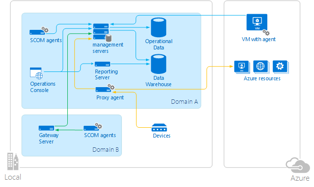

### Log Analytics

Most OMS components are in the Azure cloud so you can deploy and manage it with minimal cost and administrative effort.  All data collected by Log Analytics is stored in the OMS repository.

Log Analytics can collect data from one of three sources:

- Physical and virtual machines running Windows and the [Microsoft Monitoring Agent (MMA)](https://technet.microsoft.com/library/mt484108.aspx) or Linux and the [Operations Management Suite Agent for Linux](https://technet.microsoft.com/library/mt622052.aspx).  These machines can be on-premises or virtual machines in Azure or another cloud.
- An Azure Storage account with [Azure Diagnostics](../cloud-services/cloud-services-dotnet-diagnostics.md) data collected by Azure worker role, web role, or virtual machine.
- [Connection to a SCOM management group](https://technet.microsoft.com/library/mt484104.aspx).  In this configuration, the agents communicate with SCOM management servers which deliver the data to the SCOM database where it is then delivered to the OMS data store.
Administrators analyze collected data and configure Log Analytics with the OMS portal which is hosted in Azure and can be accessed from any browser.  Mobile apps to access this data are available for the standard platforms.

### Integrating SCOM and Log Analytics

When SCOM is used as a data source for Log Analytics you can leverage the features of both products in a hybrid monitoring environment.  You can configure existing SCOM agents through the Operations Console to be managed by OMS, in addition to continuing to run management packs from SCOM.  
Data from a connected SCOM management group is delivered to Log Analytics using one of four methods:

- Events and performance data are collected by the agent and delivered to SCOM.  Management servers in SCOM then deliver the data to Log Analytics.
- Some events such as IIS logs and security events continue to be delivered directly to Log Analytics from the agent.
- Some solutions will deliver additional software to the agent or require that software be installed to collect additional data.  This data will typically be sent directly to Log Analytics.
- Some solutions will collect data directly from SCOM management servers that does not originate from the agent.  For example, the [Alert Management solution](https://technet.microsoft.com/library/mt484092.aspx) collects alerts from SCOM after they have been created.

## Monitoring Logic
SCOM and Log Analytics work with similar data collected from agents but have fundamental differences in how they define and implement their logic for data collection and how they analyze the data that they collect.

### Operations Manager
Monitoring logic for SCOM is implemented in [management packs](https://technet.microsoft.com/library/hh457558.aspx) which contain logic for discovering components to monitor, measuring the health of those components, and for collecting data to analyze.  Monitoring data could be as simple as collecting an event or performance counter, or it could use complex logic implemented in a script.  Management packs that include complete monitoring are available for a variety of [Microsoft and third party applications](http://go.microsoft.com/fwlink/?LinkId=82105) in addition to hardware and network devices.  You can [author your own management packs](http://aka.ms/mpauthor) for custom applications.

Management packs contain multiple workflows that each performs some distinct monitoring function such as sampling a performance counter, checking the state of a service, or running a script.  Each workflow runs independently and defines its own results such as which database it will write to and whether it will generate an alert. 

You can override details of workflow such as the frequency they run, the threshold where they consider an error, and the severity of the alert they generate.  You can also provide additional functionality by adding your own workflows.

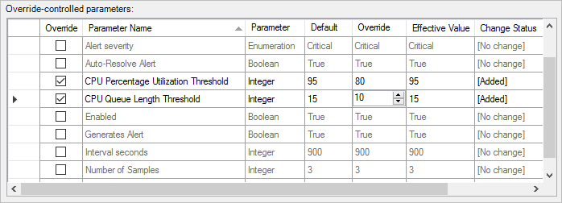

Management packs are installed in the Operations Manager database and automatically distributed to agents by management servers.  Each agent will automatically download management packs and load workflows relevant to the applications they have installed.  Data collected by the agent is delivered back to the management server for insertion into the SCOM database and data warehouse.  The Operations Console allows you to view and analyze this data through custom views, dashboards, and reports included in the management pack.

The distribution of management packs is illustrated in the following diagram.

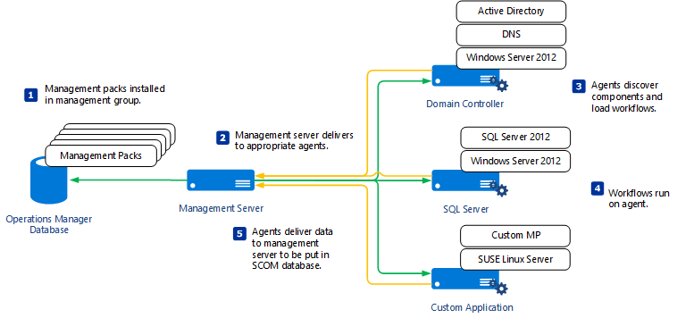

### Log Analytics
#### Event and Performance Collection
Log Analytics collects events and performance counters from agent systems using sources such as Windows event log, IIS logs, and Syslog.  You can define criteria for which data is collected through the Log Analytics portal and then create Log Queries to analyze the collected data.  A set of standard criteria is defined when you create your OMS workspace, and you can define additional data for particular applications. 

While SCOM has many detailed workflows that typically define specific criteria for data and the action that should be performed in response, Log Analytics has more general criteria for data collection.  Log queries and solutions provide more targeted criteria for analyzing and acting on specific data in the cloud after it’s been collected.

#### Solutions
Solutions provide additional logic for data collection and analysis.  You can select solutions to add to your OMS subscription from the Solution Gallery.

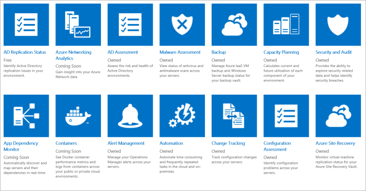

Solutions primarily run in the cloud providing analysis of events and performance counters collected in the OMS repository.  They may also define additional data to be collected that can be analyzed with Log Queries or by additional user interface provided by the solution in the OMS dashboard. 

For example, the [Change Tracking solution](https://technet.microsoft.com/library/mt484099.aspx) detects configuration changes on agent systems and writes events to the OMS repository that can be analyzed with several graphical views that summarize detected changes.  You can drill down from the summarized view into log queries that display the detailed data collected by the solution.

While you can select which solutions you add to your subscription, you don’t currently have the ability to create your own solutions.  You can select the events and performance counters to collect and create custom views based on your own log queries.

The monitoring logic for Log Analytics is summarized in the following diagram.

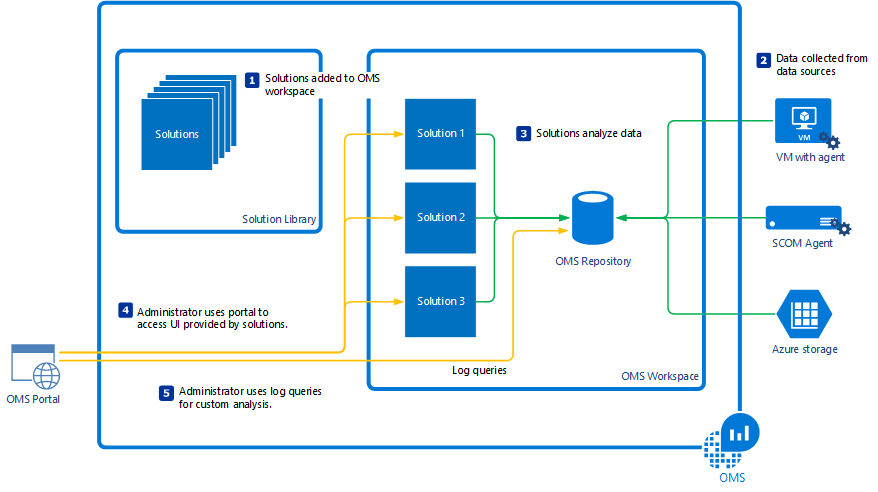

## Health Monitoring
### Operations Manager
SCOM can model the different components of an application and provide a real-time health for each.  This allows you to not only view detected errors and performance over time but also to validate the actual health of an application or system and each of its components at any given time.  Because it understands the time periods that an application is available, the health engine in SCOM also supports Service Level Agreements (SLA) which analyze and report on the availability of an application over time.

For example, the view below shows the real-time health of SQL database engines monitored by SCOM.  The health of each of the databases for one of the database engines is shown on the bottom half of the view.

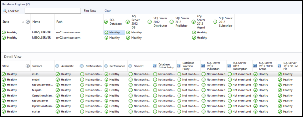

The Health Explorer for one of the database engines is shown below with the monitors that are used to determine its overall health.  These monitors are defined in the SQL management pack and run against all SQL database engines discovered by SCOM.

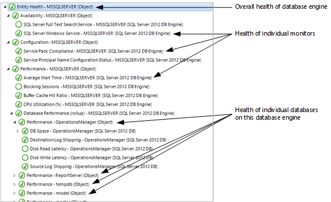

Components on multiple systems can be combined to measure the health of a distributed application.  This can be particularly useful for line of business applications that include multiple distributed components.  You can create a model that measures the health of each component that rollup into availability for the application.

Active Directory is an example of one management pack that provides a model to analyze its distributed components.  The sample diagram below shows the health of the overall environment and the relationship between forests, domains, and domain controllers.  Each of these components includes subcomponents and multiple monitors similar to the SQL example above.

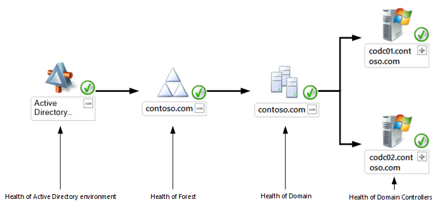

### Log Analytics
OMS does not include a common engine to model applications or measure their real-time health.  Individual solutions may assess the overall health of particular services based on collected data, and they may install custom logic on the agent to perform real-time analysis.  Because solutions run in the cloud with access to the OMS repository, they can often provide deeper analysis than is typically performed by management packs. 

For example, the [AD Assessment and SQL Assessment solutions](https://technet.microsoft.com/library/mt484102.aspx) analyze collected data and provide a rating for different aspects of the environment.  It includes recommendations for improvements that can be made to improve the availability and performance of the environment.

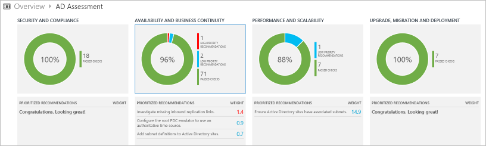

## Data Analysis
SCOM and Log Analytics each provide different features to analyze collected data.  SCOM has Views and Dashboards in the Operations Console for analyzing recent data in a variety of formats and reports for presenting data from the data warehouse in tabular form.  Log Analytics provides a complete log query language and interface for analyzing data in the OMS repository.  When SCOM is used as a data source for Log Analytics, the repository includes data collected by SCOM so the Log Analytics tools can be used to analyze data from both systems.

### Operations Manager

#### Views
Views in the Operations Console allow you to view different data types collected by SCOM in different formats, typically tabular for events, alerts, and state data, and line graphs for performance data.  Views perform minimal analysis or consolidation of the data but do allow you to filter according to particular criteria. 

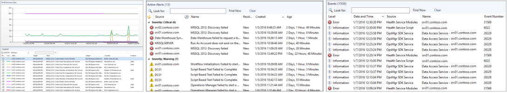

Management packs will typically provide multiple views supporting the application or system that it monitors.  This may include state views for the different objects that the management pack discovers, alert views for detected issues, and performance views for counters.

Views are particularly suitable for analyzing the current state of the environment including open alerts and the health state of monitored systems and objects.  You can drill down to detailed event or performance data supporting a particular alert in order to diagnose its root cause. Similarly, you can view the performance and health of different components of an application to assess its current health.

#### Dashboards
Dashboards in the Operations Console primarily work with the same data as views but are more customizable and can include richer visualizations.  A set of standard dashboards are available that you can easily customize for your own purposes.  You can also use a PowerShell widget which can display data returned from a PowerShell query.

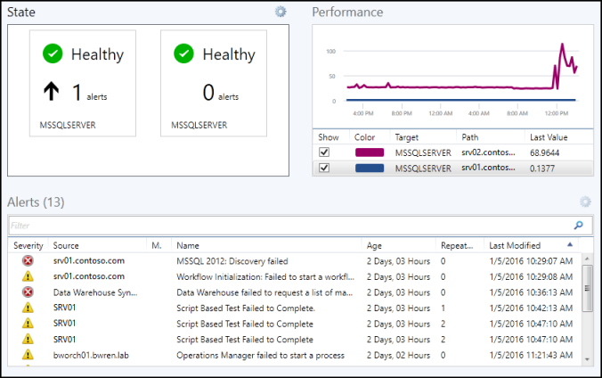

Developers have the ability to add custom components to dashboards they include in their management packs.  These may be highly specialized to a particular application such as the dashboard in the SQL management pack shown below.  This dashboard can also be used as a template for custom versions.

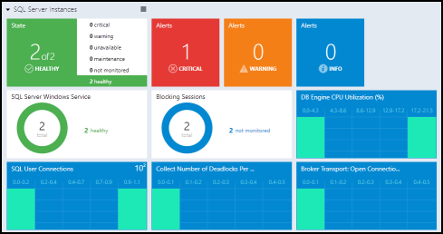

#### Reports
Reports in SCOM analyze data from the data warehouse in tabular form.  They can be printed and scheduled for automated delivery in different file formats including PDF, CSV, and Word.  Reports work with data from the data warehouse so they are especially suitable for analysis of long term trends.

Management packs will typically provide custom reports for a particular application.  You can also select from a library of generic reports that you can customize for your own applications or for performing ad hoc analysis.

Following is a sample performance report showing data collected by the Active Directory Management Pack.

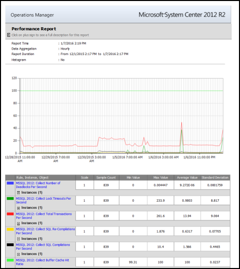

### Log Analytics
Log Analytics has a [query language](https://technet.microsoft.com/library/mt484120.aspx) that you can use to perform analysis across data from multiple applications without the need to create a custom view or report.  Because OMS is implemented in the cloud, performance of queries and data analysis are not subject to any hardware limitations and can quickly analyze queries including millions of records. 

Queries in Log Analytics are also the basis of other functionality.  You can save a query, export its results to Excel, or have it automatically run at regular intervals and generate an alert if its results match particular criteria.  

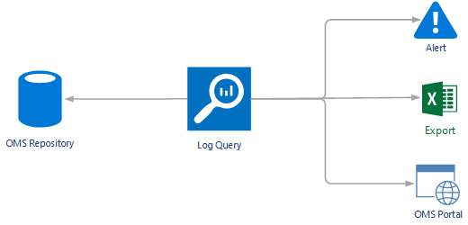

Below is an example of a Log Analytics query.  In this example all events with “started” in the name are returned and grouped by event ID.  The user simply provides the query, and Log Analytics dynamically generates the user interface to perform the analysis.  Selecting any item in the list will return the detailed event data.

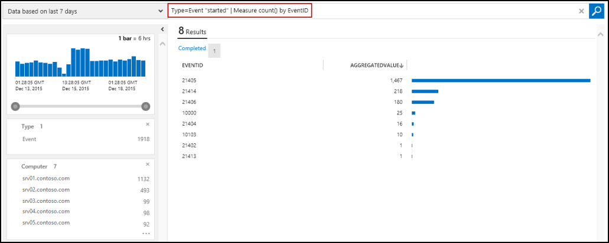

In addition to providing ad hoc analysis, queries in Log Analytics can be saved for future use and also added to your [OMS dashboard](http://technet.microsoft.com/library/mt484090.aspx) as shown in the following example.

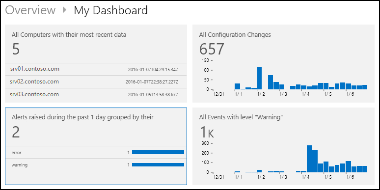

## Next Steps

- Deploy [System Center Operations Manager (SCOM)](https://technet.microsoft.com/library/hh205987.aspx).
- Sign up for [Log Analytics](https://azure.microsoft.com/documentation/services/log-analytics).  
