# What is Operations Management Suite (OMS)?
This article provides an introduction to Operations Management Suite (OMS) including a brief overview of the business value it provides, the services and management solutions it includes, and the offerings that package together different services and solutions.  Links are included to the detailed documentation on deploying and using each service and solution.

## From on-premises to the cloud
Microsoft has long been providing products for managing enterprise environments.  Multiple products were consolidated into the System Center suite of management products in 2007.  This included Configuration Manager which provides such features as software distribution and inventory, Operations Manager which provides proactive monitoring of systems and applications, Orchestrator which includes runbooks to automate manual processes, and Data Protection Manager for backup and recovery of critical data.

With more computing resources moving to the cloud, System Center products gained more cloud features such as Operations Manager and Orchestrator managing resources in Azure.  They were still fundamentally designed as on-premises solutions though and require a significant investment in deploying and maintaining on-premises management environment.  To completely leverage the cloud and support future applications, a new approach to management was required.

## Introducing Operations Management Suite
Operations Management Suite (also known as OMS) is a collection of management services that were designed in the cloud from the start.  Rather than deploying and managing on-premises resources, OMS components are entirely hosted in Azure.  Configuration is minimal, and you can be up and running literally in a matter of minutes.  

- **Minimal cost and complexity of deployment.**  Because all of the components and data for OMS are stored in Azure, you can be up and running in a short time without the complexity and investment in on-premises components.
- **Scale to cloud levels.**  You don't have to worry about paying for compute resources that you don't need or about running out of storage space since the cloud allows you to pay only for what you actually use and will readily scale to any load you require.  You can start by managing a few resources to get started and then scale up to your entire environment.
- **Take advantage of the latest features.**  Features in OMS services are continuously being added and updated.  You constantly have access to the latest features without any requirement to deploy updates.
- **Integrated services.**  While each of the OMS services provide significant value on their own, they can work together to solve complex management scenarios.  For example, a runbook in Azure Automation might drive a failover process with Azure Site Recovery and then log information to Log Analytics to generate an alert.
- **Global knowledge.**  Management solutions in OMS continuously have access to the latest information.  The Security and Audit solution for example, can perform a threat analysis using the latest threats being detected around the world.
- **Access from anywhere.**  Access your management environment from anywhere you have a browser.  Install the OMS app on your smartphone for ready access to your monitoring data.

### Is it just for the cloud?
Just because OMS services run in the cloud doesn't mean that they can't effectively manage your on-premises environment.  Put an agent on any Windows or Linux computer in your data center, and it will send data to Log Analytics where it can be analyzed along with all other data collected from cloud or on-premises services.  Use Azure Backup and Azure Site Recovery to leverage the cloud for backup and high availability for on-premises resources.  
Runbooks in the cloud can't typically access your on-premises resources, but you can install an agent on one or more computers too that will host runbooks in your data center.  When you start a runbook, you simply specify whether you want it to run in the cloud or on a local worker.

## Hybrid management with System Center
If you have an existing installation of System Center, you can integrate these components with OMS services to provide a hybrid solution for both your on-premises and cloud environments leveraging the relative specialties of each product.  Connect your existing Operations Manager management group to Log Analytics to analyze managed agents in the cloud.  Use your existing backup process with Data Protection Manager to backup your data to the cloud.  

## OMS services
The core functionality of OMS is provided by a set of services that run in Azure.  Each service provides a specific management function, and you can combine services to achieve different management scenarios.

|| Service | Description |
|:--|:--|:--|
|  | Log Analytics | Monitor and analyze the availability and performance of different resources including physical and virtual machines. |
|  | Automation | Automate manual processes and enforce configurations for physical and virtual machines. |
|  | Backup | Backup and restore critical data. |
|  | Site Recovery | Provide high availability for critical applications. |

### Log Analytics
[Log Analytics](http://azure.microsoft.com/documentation/services/log-analytics) provides monitoring services for OMS by collecting data from managed resources into a central repository.  This data could include events, performance data, or custom data provided through the API. Once collected, the data is available for alerting, analysis, and export.  This method allows you to consolidate data from a variety of sources so you can combine data from your Azure services with your existing on-premises environment.  It also clearly separates the collection of the data from the action taken on that data so that all actions are available to all kinds of data.  

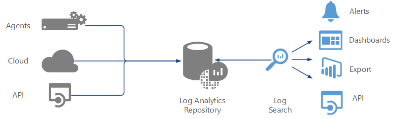

#### Collecting data
There are a variety of ways that you can get data into the repository for Log Analytics to analyze.

- **Windows or Linux computers and virtual machines.**  You install the Microsoft Monitoring Agent on [Windows](../log-analytics/log-analytics-windows-agents.md) and [Linux](../log-analytics/log-analytics-linux-agents.md) computers or virtual machines that you want to collect data from.  The agent will automatically download from Log Analytics configuration that defines events and performance data to collect.  You can easily install the agent on virtual machines running in Azure using the Azure portal.  If you have an existing Operations Manager environment, you can connect the management group to Log Analytics and automatically start collecting data from all existing agents.
- **Azure services.**  Log Analytics collects telemetry from [Azure Diagnostics and Azure Monitoring](../log-analytics/log-analytics-azure-storage.md) into the repository so that you can monitor Azure resources.
- **Data Collector API.**  Log Analytics has a [REST API for populating data from any client](../log-analytics/log-analytics-data-collector-api.md).  This allows you to collect data from third party applications or implement custom management scenarios.  A common method is to use a runbook in Azure Automation to collect data and then use the Data Collector API to write it to the repository.

#### Reporting and analyzing data
Log Analytics includes a powerful query language to extract data stored in the repository.  Since data from all sources are stored as records, you can analyze data from multiple sources in a single query.
  
In addition to ad hoc analysis, Log Analytics provides multiple ways to report and analyze data from a query.

- **Views and dashboards.**  [Views](../log-analytics/log-analytics-view-designer.md) and [dashboards](../log-analytics/log-analytics-dashboards.md) visualize the results of a query in the portal.  Management solutions will typically include views that analyze the data from the solution.  You can also create your own custom views to analyze data and make it readily available in your custom portal.
- **Export.**  You have the option to export the results of any query so that you can analyze it outside of Log Analytics.  You can even schedule a regular export to [Power BI](../log-analytics/log-analytics-powerbi.md) which provides significant visualization and analysis capabilities.
- **Log Search API.**  Log Analytics has a [REST API for collecting data from any client](../log-analytics/log-analytics-log-search-api.md).  This allows you to programmatically work with data collected in the repository or access it from another monitoring tool.

#### Alerting
Log Analytics can [proactively alert](../log-analytics/log-analytics-alerts.md) you or take corrective action when it detects an issue.  Like all other analysis in Log Analytics, this is done with a log search.  This search runs on a regular schedule, and an alert is created if the results match particular criteria.

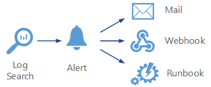

In addition to creating an alert record in the Log Analytics repository, alerts can take the following actions.

- **Email.**  Send an email to proactively notify you of a detected issue.
- **Runbook.**  An alert in Log Analytics can start a runbook in Azure Automation.  This is typically done to attempt to correct the detected issue.  The runbook can be started in the cloud in the case of an issue in Azure or another cloud, or it could be started on a local agent for an issue on a physical or virtual machine.
- **Webhook.**  An alert can start a webhook and pass it data from the results of the log search.  This allows integration with external services such as an alternate alerting system, or it may attempt to take corrective action for an external web site.

### Azure Automation
[Azure Automation](http://azure.microsoft.com/documentation/services/automation) provides process automation and configuration management to OMS.  It automates manual processes and helps to enforce configurations for physical and virtual computers.  

#### Process Automation
Azure Automation automates manual processes using [runbooks](../automation/automation-runbook-types.md) which are based on PowerShell script or PowerShell workflow.  It also includes assets supporting runbooks such as variables that can be shared between multiple runbooks and credentials and connections that allow you to store encrypted information that might be required for a runbook for authentication.
Runbooks offer process automation for the other services in the suite.  Since each of the other services can be accessed with PowerShell or through a REST API, you can create runbooks to perform such functions as collecting management data in Log Analytics or initiating a backup with Azure Backup.

##### Accessing resources
Since runbooks are based on PowerShell, they can manage any resource that can be accessed with PowerShell cmdlets.  When you [load a module](../automation/automation-integration-modules.md) into your Automation account, it becomes available to all runbooks in that account. 
 
When runbooks run in the cloud, they can access any resources accessible from the cloud.  This could be resources in your Azure subscription, in another cloud such as Amazon Web Services (AWS), or a service accessible through a REST API.  Runbooks in the cloud don't run under any credentials, but they can leverage Automation assets such as credentials, connections, and certificates to authenticate to resources they access.

Resources in your data center most likely cannot be accessed from a runbook running in the cloud.  You can install one or more [Hybrid Runbook Workers](../automation/automation-hybrid-runbook-worker.md) in your data center though to run runbooks that require access to local resources.  When you start a runbook, you specify whether it should run in the cloud or on a specific worker.

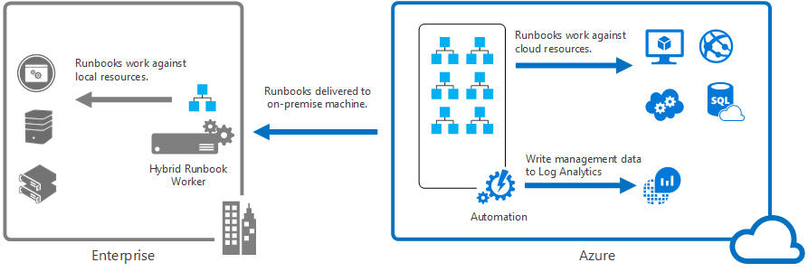

##### Starting a runbook
Runbooks can be [started through a number of methods](../automation/automation-starting-a-runbook.md) so that they can be included in a variety of management scenarios.  

- **Azure Portal.**  Like other Azure services, Azure Automation can be managed from the Azure Portal.  In addition to starting runbooks, you can import them or author your own.
- **Scheduled.**  You can schedule runbooks to start at regular intervals.  This allows you to automatically repeat a regular management process or collect data to Log Analytics.
- **PowerShell and API.**  You can start runbooks and pass them required parameter information from a PowerShell cmdlet or the Azure Automation REST API.  
- **Webhook.**  A webhook can be created for any runbook that allows it to be started from external applications or web sites.
- **Log Analytics Alert.**  An alert in Log Analytics can automatically start a runbook to attempt to correct the issue identified by the alert.

#### Configuration Management
[PowerShell Desired State Configuration (DSC)](../automation/automation-dsc-overview.md) is a management platform in Windows PowerShell that allows you to deploy and enforce the configuration of physical and virtual machines.  Azure Automation manages DSC configurations and provides a pull server in the cloud that agents can access to retrieve required configurations.

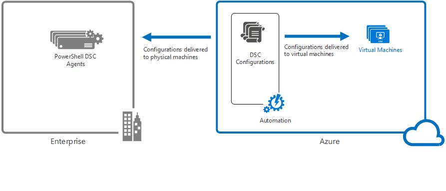

### Azure Backup and Azure Site Recovery
Azure Backup and Azure Site Recovery contribute to business continuity and disaster recovery.  They each have features that help you to ensure that applications remain available when outages occur and return to normal operations when systems come back online.  Both services contribute to the recovery point objectives (RPOs) and recovery time objectives (RTOs) defined for your organization. Your RPO defines the acceptable limit in which data isn't available during an outage, and the RTO limits the acceptable amount of time in which a service or app isn't available during an outage.

#### Azure Backup
[Azure Backup](http://azure.microsoft.com/documentation/services/backup) provides data backup and restore services for OMS.  It protects your application data and retains it for years without any capital investment and with minimal operating costs.  It can backup data from physical and virtual Windows servers in addition to application workloads such as SQL Server and SharePoint.  It can also be used by System Center Data Protection Manager (DPM) to replicate protected data to Azure for redundancy and long term storage.

Protected data in Azure Backup is stored in a backup vault located in a particular geographic region. The data is replicated within the same region and, depending on the type of vault, may also be replicated to another region for further resiliency .

Azure Backup has three fundamental scenarios.

- **Windows machine with Azure Backup agent.** Backup files and folders from any Windows server or client directly to your Azure backup vault.  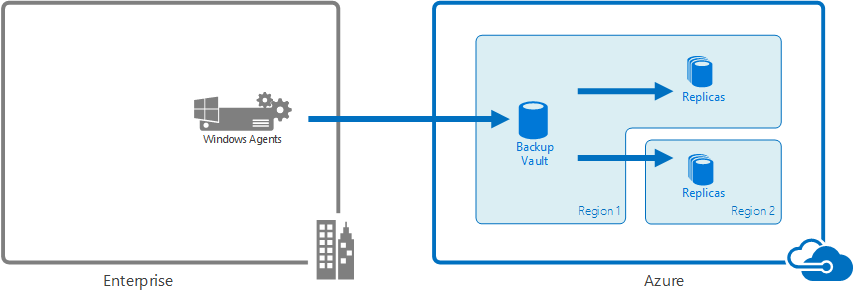
- **System Center Data Protection Manager (DPM) or Microsoft Azure Backup Server.** Leverage DPM or Microsoft Azure Backup Server to backup files and folders in addition to application workloads such as SQL and SharePoint to local storage and then replicate to your Azure backup vault. Supports Windows and Linux virtual machines on Hyper-V or VMware.  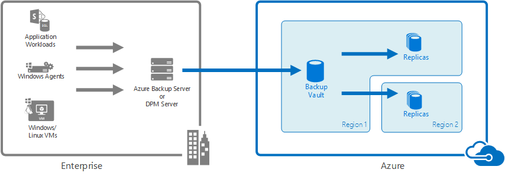
- **Azure Virtual Machine Extensions.** Backup Windows or Linux virtual machines in Azure to your Azure backup vault.  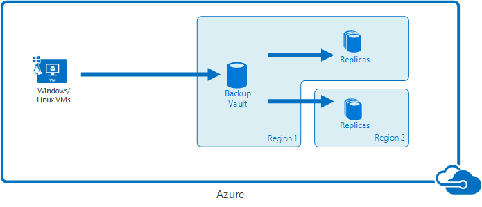

#### Azure Site Recovery
[Azure Site Recovery](http://azure.microsoft.com/documentation/services/site-recovery) provides business continuity by orchestrating replication of on-premises virtual and physical machines to Azure, or to a secondary site. If your primary site is unavailable, you fail over to the secondary location so that users can keep working, and fail back when systems return to working order. 

Azure Site Recovery provides high availability for servers and applications.  It contributes to your business continuity and a disaster recovery (BCDR) strategy by orchestrating replication, failover, and recovery of on-premises Hyper-V virtual machines, VMware virtual machines, and physical Windows/Linux servers. You can replicate machines to a secondary data center or extend your data center by replicating them to Azure. Site Recovery also provides simple failover and recovery for workloads. It integrates with disaster recovery mechanisms such as SQL Server AlwaysOn, and provides recovery plans for easy failover of workloads that are tiered across multiple machines.

Azure Site Recovery has three fundamental replication scenarios.

- **Replication of Hyper-V virtual machines.**  If Hyper-V virtual machines are managed in VMM clouds, you can replicate to a secondary data center or to Azure storage. Replication to Azure is over a secure internet connection. Replication to a secondary datacenter is over the LAN.  If Hyper-V virtual machines aren't managed by VMM, you can replicate to Azure storage only. Replication to Azure is over a secure internet connection.  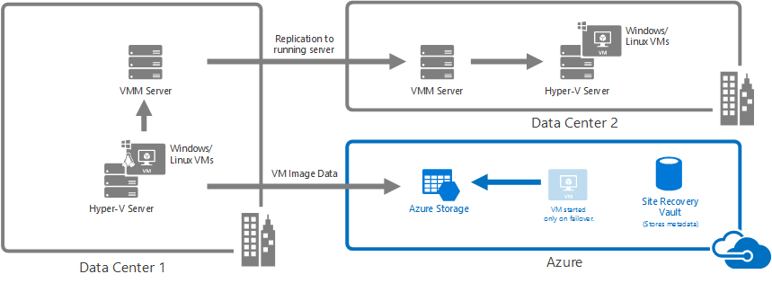
- **Replication of VMware virtual machines.**  You can replicate VMware virtual machines to a secondary datacenter running VMware or to Azure storage. Replication to Azure can occur over a site-to-site VPN or Azure ExpressRoute or over a secure Internet connection. Replication to a secondary datacenter occurs over the InMage Scout data channel.  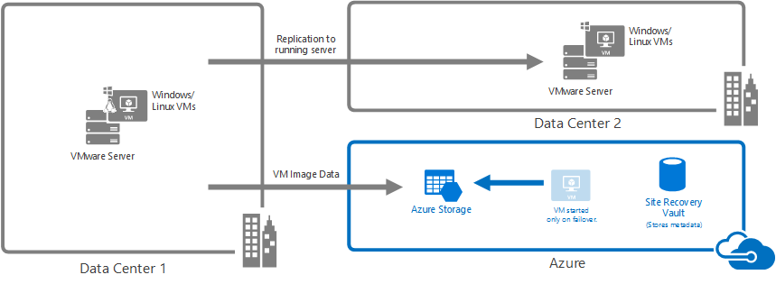
- **Replication of physical Windows and Linux servers.**  You can replicate physical servers to a secondary datacenter or to Azure storage. Replication to Azure can occur over a site-to-site VPN or Azure ExpressRoute or over a secure Internet connection. Replication to a secondary datacenter occurs over the InMage Scout data channel. Azure Site Recovery has an OMS solution that displays some statistics, but you must use the Azure portal for any operations.  

Site Recovery stores metadata in vaults located in a particular geographic Azure region. No replicated data is stored by the Site Recovery service .

## Management Solutions
[Management Solutions](operations-management-suite-solutions.md) are prepackaged sets of logic that implement a particular management scenario leveraging one or more OMS services.  Different solutions are available from Microsoft and from partners that you can easily add to your Azure subscription to increase the value of your investment in OMS.  As a partner you can create your own solutions to support your applications and services and provide them to users through the Azure Marketplace or Quickstart Templates.

A good example of a solution that leverages multiple services to provide additional functionality is the [Update Management solution](oms-solution-update-management.md).  This solution uses the Log Analytics agent for Windows and Linux to collect information about required updates on each agent.  It writes this data to the Log Analytics repository where you can analyze it with an included dashboard.  When you create a deployment, runbooks in Azure Automation are used to install required updates.  You manage this entire process in the portal and don't need to worry about the underlying details.

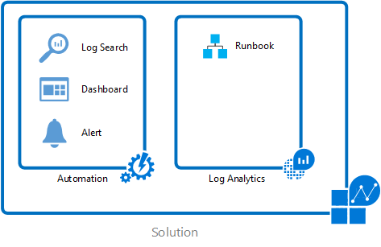

Most solutions may perform one or more of the following functions.

- Collect additional information.  Log Analytics collects a variety of data from clients and services including events and performance data.  A management solution may collect additional information not available from other data sources, often using Azure Automation runbooks.
- Provide additional analysis of collected information.  Management solutions include dashboards and views that provide analysis and visualization of data.  These link back to predefined log searches that allow you to drill into the detailed data.  They may also perform analysis on data that's already been collected into the repository, for example searching across security events for patterns that indicate a threat.
- Add functionality.  Some solutions provided by Microsoft may build upon the capabilities of the core services to provide additional functionality.  Service Map for example provides its own console to discover and maps server and process dependencies in real time.
Solutions are regularly being added to OMS by Microsoft and partners allowing you to continuously increase the value of your investment.  You can browse and install Microsoft solutions through the Solutions Catalog in the OMS portal or browse and install both Microsoft and partner solutions through the Azure Marketplace in the Azure Portal.  

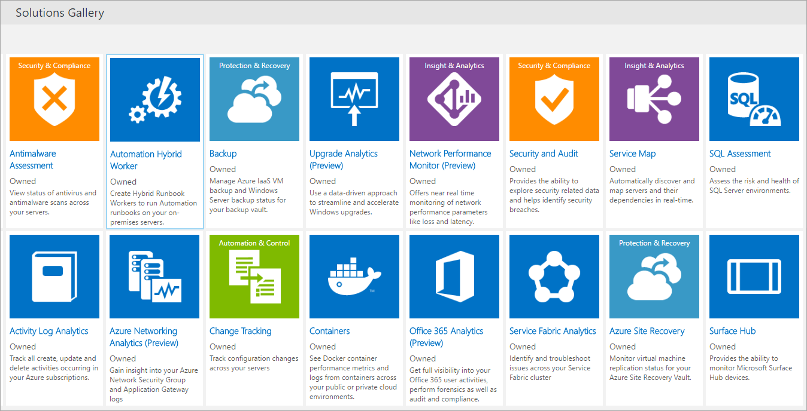

## Next steps
* Learn about [Log Analytics](http://azure.microsoft.com/documentation/services/log-analytics).
* Learn about [Azure Automation](../automation/automation-intro.md).
* Learn about [Azure Backup](http://azure.microsoft.com/documentation/services/backup).
* Learn about [Azure Site Recovery](http://azure.microsoft.com/documentation/services/site-recovery).
* Discover the [solutions that are available](../log-analytics/log-analytics-add-solutions.md) in the different OMS offerings. 

