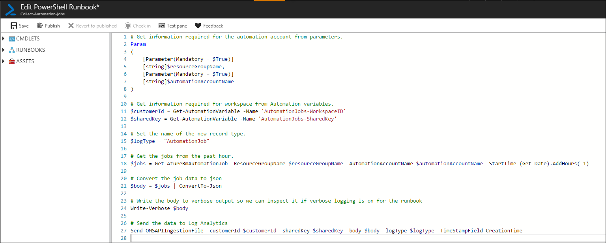
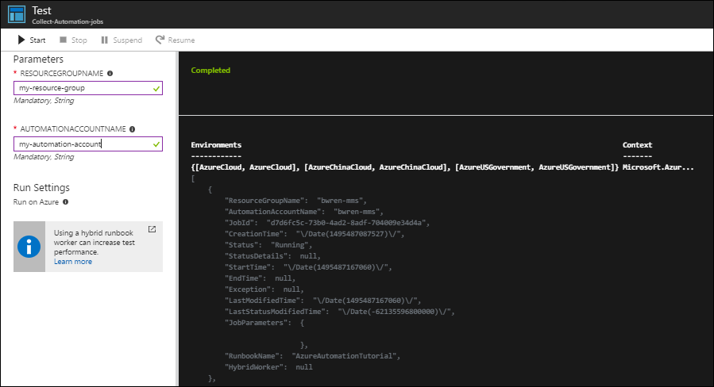
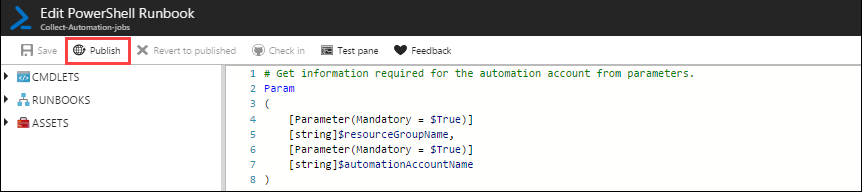
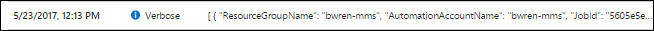

# OMS tutorial - Collect data in Log Analytics with an Azure Automation runbook
You can collect a significant amount of data in Log Analytics from the different [data sources](../log-analytics/log-analytics-data-sources.md) collected from agents and also [data collected from Azure](../log-analytics/log-analytics-azure-storage.md).  There are a scenarios though where you need to collect data that isn't accessible through these standard sources.

In these cases, you can use the [HTTP Data Collector API](../log-analytics/log-analytics-data-collector-api.md) to write data to Log Analytics from any REST API client.  A common method to perform this data collection is using a runbook in Azure Automation.  The runbook collects data from some source which can be any service or application accessible from a runbook.  It then uses the Data Collector API to write this data to Log Analaytics using a data type custom to your solution.  

This article explains scenario and walks through writing and scheduling a sample runbook.

## Technologies used in scenario

- [Log Analytics](https://docs.microsoft.com/azure/log-analytics/)
- [HTTP Data Collector API](../log-analytics/log-analytics-data-collector-api.md)
- [Azure Automation](https://docs.microsoft.com/azure/automation/)

## Prerequisites
This scenario requires the following resources configured in your Azure subscription.  

- [Log Analytics workspace](../log-analytics/log-analytics-get-started.md).  Can be a free account.
- [Azure automation account](../automation/automation-offering-get-started.md).  Can be a free account.

## Overview
Runbooks in Azure Automation are implemented with PowerShell, so we'll start by writing and testing our script in the Azure Automation editor.  Once we verify that we're collecting the required information, we'll write that data to Log Analytics and verify our custom data type.  Finally, we'll create a schedule to start the runbook at regular intervals.

For this tutorial, we'll write a runbook that collects information about Automation jobs.  For another runbook, you would use the identical process with a script that collects different data.

## Process

### 1. Install Data Collector API module
Every [request from the HTTP Data Collector API](../log-analytics/log-analytics-data-collector-api.md#create-a-request) must be formatted appropriately and include an authorization header.  You can do this in your runbook, but you can make it simpler and reduce the amount of code required by using a module that provides these functions.  One module that you can use is [OMSIngestionAPI module](https://www.powershellgallery.com/packages/OMSIngestionAPI) in the PowerShell Gallery.

To use a [module](../automation/automation-integration-modules.md) in a runbook, it must be installed in your Automation account.  Any runbook in the same account can then use the functions in the module.  You can install a new module by selecting **Assets** > **Modules** > **Add a module** in your Automation account.  

The PowerShell Gallery though gives us a quick option to deploy a module directly to our automation account so we can use that option for our example.
Since we're installing a module from the PowerShell Gallery for our example, you can just click on the **Deploy to Azure Automation** button on the modules page which will launch the Azure portal to install the module.

1. Go to [PowerShell Gallery](https://www.powershellgallery.com/).
2. Search for **OMSIngestionAPI**
3. Click on the **Deploy to Azure Automation** button.
4. Select your automation account and click **OK** to install the module.

### 2. Create Automation variables
[Automation variables](..\automation\automation-variables.md) hold values that can be used by all runbooks in your Automation account.  They make runbooks more flexible by allowing you to change these values without editing the actual runbook. Every request from the HTTP Data Collector API requires the ID and key of the OMS workspace.  Variable assets are ideal to store this information.  

1. In your Automation account, select **Variables** under **Shared Resources**.
2. Click **Add a variable** and create the following two variables.

| Property | Value |
|:--|:--|
| Name | WorkspaceId |
| Type | String |
| Value | Paste in the Workspace ID of your Log Analytics workspace. |
| Encrypted | No |
 
| Property | Value |
|:--|:--|
| Name | WorkspaceKey |
| Type | String |
| Value | Paste in with the Primary or Secondary Key of your Log Analytics workspace. |
| Encrypted | Yes |

### 3. Create runbook

Azure Automation has an editor in the portal, so we can go ahead and create and edit our runbook there.  

1. Navigate to your Automation account.  
2. Click **Runbooks** > ** Add a runbook** > **Create a new runbook**.
3. For the runbook name, type **Collect-Automation-jobs**.  For the runbook type, select **PowerShell**.
4. Click **Create** to create the runbook and start the editor.
5. Paste the following code into the runbook.

	
	# Get information required for the automation account from parameters.
	Param
	(
	    [Parameter(Mandatory = $True)]
	    [string]$resourceGroupName,
	    [Parameter(Mandatory = $True)]
	    [string]$automationAccountName
	)

	# Get information required for workspace from Automation variables.
	$customerId = Get-AutomationVariable -Name 'AutomationJobs-WorkspaceID'
	$sharedKey = Get-AutomationVariable -Name 'AutomationJobs-SharedKey'
	
	# Set the name of the new record type.
	$logType = "AutomationJob"
	
	# Get the jobs from the past hour.
	$jobs = Get-AzureRmAutomationJob -ResourceGroupName $resourceGroupName -AutomationAccountName $automationAccountName -StartTime (Get-Date).AddHours(-1)
	
	# Convert the job data to json
	$body = $jobs | ConvertTo-Json
	
	# Write the body to verbose output so we can inspect it if verbose logging is on for the runbook
	Write-Verbose $body
	
	# Send the data to Log Analytics
	Send-OMSAPIIngestionFile -customerId $customerId -sharedKey $sharedKey -body $body -logType $logType -TimeStampField CreationTime

6. Click **Save** to save the runbook.

### 4. Test the runbook
Azure Automation includes a test environment to test a runbook before we publish it.  We can also inspect the data collected by the runbook and verify that it writes to Log Analytics as expected. 
 

1. Click **Test pane** to open the runbook in the test pane.
2. Click **Start** to start the runbook.
3. Since our runbook has parameters, you're prompted to enter values for them.  Enter the name of the resource group and the automation account that your going to collect job information from.
4. Click **Start** to the start the runbook.
3. The runbook will start with a status of **Queued** before it goes to **Running**.  
3. The runbook should display output with the jobs collected in json format.  If no jobs are listed, then there may have been no jobs created in the automation account in the last hour.  Try starting any runbook in the automation account and then perform the test again.
4. Ensure that the output doesn't show any errors in the post command to Log Analytics.  You should have a message similar to the following.

### 5. Verify records created in Log Analytics
Once we've run the runbook and verified that the output was successfully received, we can verify that the records have been created in Log Analytics.

1. In the Azure portal, select your Log Analytics workspace.
2. Click on **Log Search**.
3. Type the following command. `Type=AutomationJob_CL` and click the search button. Note that the record type includes _CL that we didn't specify in the script.  That suffix is automatically appended to the log type.
4. You should see output similar to the following indicating that we have successfully created records.

### 5. Publish the runbook
Once you've verified that the runbook is working correctly, you need to publish it so you can run it in production.  You can continue to edit and test the runbook without modifying the published version.  

1. Return to your automation account.
2. Click on **Runbooks** and select **Collect-Automation-jobs**.
3. Click **Publish**.
4. Click **Yes** when asked to verify that you want to overwrite the previously published version.

### 6. Schedule the runbook
The final step is to schedule your runbook so it runs every hour.  You do this by creating a schedule in Azure Automation and attaching it to your runbook.

1. In the properties for your runbook, select **Schedules** under **Resources**.
2. Click **Add a schedule**.
3. Click **Link a schedule to your runbook**.
4. Click **Create a new schedule**.
5. Type in the following values for the schedule and click **Create**.

| Property | Value |
|:--|:--|
| Name | AutomationJobs-Hourly |
| Starts | Select any time at least 5 minutes past the current time. |
| Recurrence | Recurring |
| Recur every | 1 hour |
| Set expiration | No |

Once the schedule is created, you need to set the parameter values that will be used each time this schedule starts the runbook.

6. Click **Parameters and run settings**.
7. Fill in values for **ResourceGroupName** and **AutomationAccountName**.
8. Click **OK**. 

### 7. Verify that the runbook starts on schedule
Everytime a runbook is started, a job is created and any output logged.  You can verify that the runbook starts as expected by checking the jobs for the runbook after the start time has passed.

1. In the properties for your runbook, select **Jobs** under **Resources**.
2. You should see a listing of each time the runbook was started.
3. Click on one of the jobs to view its details.
4. Click on **All logs** to view the logs and output from the runbook.
5. Scroll to the bottom to find an entry similar to the image below. 
6. Click on this entry to view the detailed json that was sent to Log Analytics.

## Next steps
- Use the [Log Search API](../log-analytics/log-analytics-log-search-api.md) to retrieve data from the Log Analytics repository.

