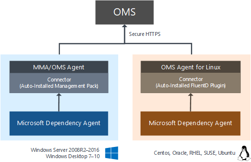
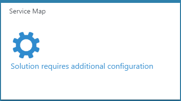

# Configuring Service Map solution in Operations Management Suite (OMS)
Service Map automatically discovers application components on Windows and Linux systems and maps the communication between services. It allows you to view your servers as you think of them – as interconnected systems that deliver critical services.  Service Map shows connections between servers, processes, and ports across any TCP-connected architecture with no configuration required other than installation of an agent.

This article describes the details of configuring Service Map and onboarding agents.  For information on using Service Map, see [Using Service Map solution in Operations Management Suite (OMS)](operations-management-suite-service-map.md)

## Dependency Agent downloads
| File | OS | Version | SHA-256 |
|:--|:--|:--|:--|
| [InstallDependencyAgent-Windows.exe](https://aka.ms/dependencyagentwindows) | Windows | 9.0.5 | 73B3F6A2A76A08D58F72A550947FF839B588591C48E6EDDD6DDF73AA3FD82B43 |
| [InstallDependencyAgent-Linux64.bin](https://aka.ms/dependencyagentlinux) | Linux | 9.0.5 | A1BAD0B36EBF79F2B69113A07FCF48C68D90BD169C722689F9C83C69FC032371 |

## Connected sources
Service Map gets its data from the Microsoft Dependency Agent.  The Dependency Agent is dependent on the OMS Agent for its connections to OMS.  This means that a server must have the OMS Agent installed and configured first, and then the Dependency Agent can be installed.  The following table describes the connected sources that are supported by the Service Map solution.

| Connected Source | Supported | Description |
|:--|:--|:--|
| Windows agents | Yes | Service Map analyzes and collects data from Windows agent computers.    In addition to the [OMS Agent](../log-analytics/log-analytics-windows-agents.md), Windows agents require the Microsoft Dependency Agent.  See the [Supported Operating Systems](#supported-operating-systems) for a complete list of operating system versions. |
| Linux agents | Yes | Service Map analyzes and collects data from Linux agent computers.    In addition to the [OMS Agent](../log-analytics/log-analytics-linux-agents.md), Linux agents require the Microsoft Dependency Agent.  See the [Supported Operating Systems](#supported-operating-systems) for a complete list of operating system versions. |
| SCOM management group | Yes | Service Map analyzes and collects data from Windows and Linux agents in a connected [System Center Operations Manager (SCOM) management group](../log-analytics/log-analytics-om-agents.md).   A direct connection from the SCOM agent computer to OMS is required. Data is sent directly from forwarded from the management group to the OMS repository.|
| Azure storage account | No | Service Map collects data from agent computers, so there is no data from it to collect from Azure storage. |

Service Map only supports 64-bit platforms.

On Windows, the Microsoft Monitoring Agent (MMA) is used by both SCOM and OMS to gather and send monitoring data.  (This agent is called the SCOM Agent, OMS Agent, MMA, or Direct Agent, depending on context.)  SCOM and OMS provide different out of the box versions of MMA, but these versions can each report to SCOM, to OMS, or to both.  On Linux, the OMS Agent for Linux gathers and sends monitoring data to OMS.  You can use Service Map on servers with OMS Direct Agents or on servers that are attached to OMS via SCOM Management Groups.  In this documentation, we will refer to all agents – whether Linux or Windows, whether connected to a SCOM MG or directly to OMS – as the "OMS Agent", unless the specific deployment name of the agent is needed for context.

The Service Map agent does not transmit any data itself, and it does not require any changes to firewalls or ports.  Service Map’s data is always transmitted by the OMS Agent to OMS, either directly or via the OMS Gateway.

If you are a SCOM customer with a Management Group connected to OMS:

- If your SCOM agents can access the internet to connect to OMS, no additional configuration is required.  
- If your SCOM agents cannot access OMS over the internet, you need to configure the OMS Gateway to work with SCOM.
  
If you are using the OMS Direct Agent, you need to configure the OMS Agent itself to connect to OMS or to your OMS Gateway.  The OMS Gateway can be downloaded from [https://www.microsoft.com/download/details.aspx?id=52666](https://www.microsoft.com/download/details.aspx?id=52666)

### Avoiding duplicate data

If you are a SCOM customer, you should not configure your SCOM agents to communicate directly to OMS, or data will be reported twice.  In Service Map, this will result in computers appearing twice in the Machine List.

Configuration of OMS should happen in only one of the following locations:

- The SCOM Console Operations Management Suite panel for Managed Computers
- Azure Operational Insights configuration in the MMA properties

Using both configurations with the *same* workspace in each will cause duplication of data. Using both configurations with *different* workspaces can result in conflicting configuration (one with the Service Map solution enabled and the other without) that may prevent data from flowing to Service Map completely.  

Even if the machine itself isn’t specified in the SCOM Console’s OMS configuration, if an Instance Group such as “Windows Server Instances Group” is active, it may still result in the machine receiving OMS configuration via SCOM.

## Management packs
When Service Map is activated in an OMS workspace, a 300KB Management Pack is sent to all the Microsoft Monitoring Agents in that workspace.  If you are using SCOM agents in a [connected management group](../log-analytics/log-analytics-om-agents.md), the Service Map Management Pack will be deployed from SCOM.  If the agents are directly connected, the MP will be delivered by OMS.

The MP is named Microsoft.IntelligencePacks.ApplicationDependencyMonitor*.  It is written to *%Programfiles%\Microsoft Monitoring Agent\Agent\Health Service State\Management Packs\*.  The data source used by the management pack is *%Program files%\Microsoft Monitoring Agent\Agent\Health Service State\Resources\<AutoGeneratedID>\Microsoft.EnterpriseManagement.Advisor.ApplicationDependencyMonitorDataSource.dll*.

## Configuration
In addition to Windows and Linux computers have an agent installed and connected to OMS, the Dependency Agent installer must be downloaded from the Service Map solution and then installed as root or Admin on each managed server.  Once the Service Map agent is installed on a server reporting to OMS, Service Map dependency maps will appear within 10 minutes.

### Migrating from BlueStripe FactFinder
Service Map will deliver BlueStripe technology into OMS in phases. FactFinder is still supported for existing customers but is no longer available for individual purchase.  This preview version of the Dependency Agent can only communicate with OMS.  If you are a current FactFinder customer, please identify a set of test servers for Service Map that are not managed by FactFinder. 

### Download the Dependency Agent
In addition to the Microsoft Management Agent (MMA) and OMS Linux Agent, which provide the connection between the computer and OMS, all computers analyzed by Service Map must have the Dependency Agent installed.  On Linux, the OMS Agent for Linux must be installed before the Dependency Agent. 

To download the Dependency Agent, click **Configure Solution** in the **Service Map** tile to open the **Dependency Agent** blade.  The Dependency Agent blade has links for the Windows and the Linux agents. See the following sections for details on installing the agent on different systems.

### Install the Dependency Agent

#### Microsoft Windows
Administrator privileges are required to install or uninstall the agent.

The Dependency Agent is installed on Windows computers with InstallDependencyAgent-Windows.exe. If you run this executable without any options, then it will start a wizard that you can follow to install interactively.  

Use the following steps to install the Dependency Agent on each Windows computer:

1.	Ensure that the OMS Agent is installed using the instructions at Connect computers directly to OMS.
2.	Download the Windows agent and run it with the following command:  *InstallDependencyAgent-Windows.exe*
3.	Follow the wizard to install the agent.
4.	If the Dependency Agent fails to start, check the logs for detailed error information. On Windows agents, the log directory is *C:\Program Files\Microsoft Dependency Agent\logs*. 

The Dependency Agent for Windows can be uninstalled by an Administrator through the Control Panel.

#### Linux
Root access is required to install or configure the agent.

The Dependency Agent is installed on Linux computers with InstallDependencyAgent-Linux64.bin, a shell script with a self-extracting binary. You can run the file with sh or add execute permissions to the file itself.
 
Use the following steps to install the Dependency Agent on each Linux computer:

1.	Ensure that the OMS Agent is installed using the instructions at [Collect and manage data from Linux computers.  The OMS Agent needs to be installed before the Linux Dependency Agent](https://technet.microsoft.com/library/mt622052.aspx).
2.	Install the Linux Dependency agent as root using the following command: *sh InstallDependencyAgent-Linux64.bin*.
3.	If the Dependency Agent fails to start, check the logs for detailed error information. On Linux agents, the log directory is */var/opt/microsoft/dependency-agent/log*.

### Uninstalling the Dependency Agent on Linux
To completely uninstall the Dependency Agent from Linux, you must remove the agent itself and the Connector, which is installed automatically with the agent.  You can uninstall both with the following single command:

	rpm -e dependency-agent dependency-agent-connector

### Installing from a command line
The previous section provides guidance on installing the Dependency Monitor agent using default options.  The following sections provide guidance for installing the agent from a command line using custom options.

#### Windows
Use options from the following table to install from a command line. To see a list of the installation flags run the installer with the /? flag as follows.

	InstallDependencyAgent-Windows.exe /?

| Flag | Description |
|:--|:--|
| /S | Perform a silent installation with no user prompts. |

Files for the Windows Dependency Agent are placed in *C:\Program Files\Microsoft Dependency Agent* by default.

#### Linux
Use options from the following table to install. To see a list of the installation flags run the installation program with the -help flag as follows.

	InstallDependencyAgent-Linux64.bin -help

| Flag | Description |
|:--|:--|
| -s | Perform a silent installation with no user prompts. |
| --check | Checks permissions and operating system but does not install the agent. |

Files for the Dependency Agent are placed in the following directories:

| Files | Location |
|:--|:--|
| Core files | /opt/microsoft/dependency-agent |
| Log files | /var/opt/microsoft/dependency-agent/log |
| Config files | /etc/opt/microsoft/dependency-agent/config |
| Service executables | /opt/microsoft/dependency-agent/bin/microsoft-dependency-agent /opt/microsoft/dependency-agent/bin/microsoft-dependency-agent-manager |
| Binary storage files | /var/opt/microsoft/dependency-agent/storage |

## Troubleshooting
If you run into any problems installing or running Service Map, this section can help you get up and running.  If you still can't resolve your issue, please contact Microsoft Support.

### Dependency Agent installation issues
#### Installer asks for a reboot
The Dependency Agent *generally* does not require a reboot upon installation or uninstallation.  However, in certain rare cases, a Windows Server will require a reboot to continue with an installation.  This happens when a dependency, usually the Microsoft VC++ Redistributables, requires a reboot due to a locked file.

#### Message "Unable to install Dependency Agent: Visual Studio Runtime libraries failed to install (code = [code_number])."

The Microsoft Dependency Agent is built upon the Microsoft Visual Studio Runtime Libraries. An issue was encountered while trying to install the libraries. The runtime library installers create logs in the %LOCALAPPDATA%\temp folder. The file will be dd_vcredist_arch_yyyymmddhhmmss.log, where arch will be "x86" or "amd64" and yyyymmddhhmmss will be the date and time (24 hour clock) when the log was created. The log will provide details about the issue blocking installation.

It might be useful to install the [latest Runtime Libraries](https://support.microsoft.com/help/2977003/the-latest-supported-visual-c-downloads) yourself first.

Below are some code_numbers and suggested resolutions.

| Code | Description | Resolution |
|:--|:--|:--|
| 0x17 | The library installer requires a Windows update that hasn't been installed. | Look in the most recent library installer log (see above).  If a reference to "Windows8.1-KB2999226-x64.msu" is followed by a line "Error 0x80240017: Failed to execute MSU package.", then you do not have the necessary prerequisites installed to install KB2999226.  Follow the instructions in the prerequisites section in https://support.microsoft.com/kb/2999226.  Note that you may need to run Windows Update and reboot multiple times in order to install the necessary prerequisites.  Run the Microsoft Dependency Agent installer again. |

### Post-Installation issues
#### Server doesn't show in Service Map
If your Dependency Agent installation succeeded, but you don't see your server in the Service Map solution:
1. Is the Dependency Agent installed successfully?  You can validate this by checking to see if the service is installed and running.  
**Windows**: Look for the Service named "Microsoft Dependency Agent" 
**Linux**: Look for the running process "microsoft-dependency-agent"

2. Are you on the [Free Pricing Tier of OMS/Log Analytics](https://docs.microsoft.com/azure/log-analytics/log-analytics-add-solutions#offers-and-pricing-tiers)?  The Free plan allows for up to five unique Service Map servers.  Any subsequent servers won't show up in Service Map, even if the prior five are no longer sending data.

3. Is your server sending log and perf data to OMS?  Go to Log Search and run the following query for your computer: 

		* Computer="<your computer name here>" | measure count() by Type
		
Did you get a variety of events in the results?  Is the data recent?  If so, your OMS Agent is operating correctly and communicating to the OMS service. If not, check the OMS Agent on your server: [OMS Agent for Windows troubleshooting](https://support.microsoft.com/help/3126513/how-to-troubleshoot-operations-management-suite-onboarding-issues).  [OMS Agent for Linux troubleshooting](https://github.com/Microsoft/OMS-Agent-for-Linux/blob/master/docs/Troubleshooting.md).

#### Server shows in Service Map, but has no processes
If you see your server in Service Map, but it has no process or connection data, that indicates that the Dependency Agent is installed and running, but the kernel driver didn't load.  To find out why your driver didn't load, check the wrapper.log file (Windows) or service.log file (Linux).  The last lines of the file should indicate why (e.g. kernel not supported, which can happen on Linux if you updated your kernel) the kernel didn't load.

Windows: C:\Program Files\Microsoft Dependency Agent\logs\wrapper.log

Linux: /var/opt/microsoft/dependency-agent/log/service.log

## Data collection
You can expect each agent to transmit roughly 25 MB per day, depending on how complex your system dependencies are.  Service Map dependency data is sent by each agent every 15 seconds.  

The Dependency Agent typically consumes 0.1% of system memory and 0.1% of system CPU.

## Supported operating systems
The following sections list the supported operating systems for the Dependency Agent.   32-bit architectures are not supported for any operating system.

### Windows Server
- Windows Server 2016
- Windows Server 2012 R2
- Windows Server 2012
- Windows Server 2008 R2 SP1

### Windows Desktop
- WIndows 10
- Windows 8.1
- Windows 8
- Windows 7

### Red Hat Enterprise Linux, CentOS Linux, and Oracle Linux (with RHEL Kernel)
- Only default and SMP Linux kernel releases are supported.
- Non-standard kernel releases, such as PAE and Xen, are not supported for any Linux distribution. For example, a system with the release string of "2.6.16.21-0.8-xen" is not supported.
- Custom kernels, including recompiles of standard kernels, are not supported
- Centos Plus kernel is not supported.
- Oracle Unbreakable Kernel (UEK) is covered in a different section below.

#### Red Hat Linux 7
| OS Version | Kernel Version |
|:--|:--|
| 7.0 | 3.10.0-123 |
| 7.1 | 3.10.0-229 |
| 7.2 | 3.10.0-327 |
| 7.3 | 3.10.0-514 |

#### Red Hat Linux 6
| OS Version | Kernel Version |
|:--|:--|
| 6.0 | 2.6.32-71 |
| 6.1 | 2.6.32-131 |
| 6.2 | 2.6.32-220 |
| 6.3 | 2.6.32-279 |
| 6.4 | 2.6.32-358 |
| 6.5 | 2.6.32-431 |
| 6.6 | 2.6.32-504 |
| 6.7 | 2.6.32-573 |
| 6.8 | 2.6.32-642 |

#### Red Hat Linux 5
| OS Version | Kernel Version |
|:--|:--|
| 5.8 | 2.6.18-308 |
| 5.9 | 2.6.18-348 |
| 5.10 | 2.6.18-371 |
| 5.11 | 2.6.18-398 2.6.18-400 2.6.18-402 2.6.18-404 2.6.18-406 2.6.18-407 2.6.18-408 2.6.18-409 2.6.18-410 2.6.18-411 2.6.18-412 2.6.18-416 2.6.18-417 2.6.18-419 |

#### Oracle Enterprise Linux w/ Unbreakable Kernel (UEK)

#### Oracle Linux 6
| OS Version | Kernel Version
|:--|:--|
| 6.2 | Oracle 2.6.32-300 (UEK R1) |
| 6.3 | Oracle 2.6.39-200 (UEK R2) |
| 6.4 | Oracle 2.6.39-400 (UEK R2) |
| 6.5 | Oracle 2.6.39-400 (UEK R2 i386) |
| 6.6 | Oracle 2.6.39-400 (UEK R2 i386) |

#### Oracle Linux 5

| OS Version | Kernel Version
|:--|:--|
| 5.8 | Oracle 2.6.32-300 (UEK R1) |
| 5.9 | Oracle 2.6.39-300 (UEK R2) |
| 5.10 | Oracle 2.6.39-400 (UEK R2) |
| 5.11 | Oracle 2.6.39-400 (UEK R2) |

#### SUSE Linux Enterprise Server

#### SUSE Linux 11
| OS Version | Kernel Version
|:--|:--|
| 11 | 2.6.27 |
| 11 SP1 | 2.6.32 |
| 11 SP2 | 3.0.13 |
| 11 SP3 | 3.0.76 |
| 11 SP4 | 3.0.101 |

#### SUSE Linux 10
| OS Version | Kernel Version
|:--|:--|
| 10 SP4 | 2.6.16.60 |

## Diagnostic and usage data
Microsoft automatically collects usage and performance data through your use of the Service Map service. Microsoft uses this Data to provide and improve the quality, security and integrity of the Service Map service. Data includes information about the configuration of your software, like operating system and version, and also includes IP address, DNS name, and Workstation name in order to provide accurate and efficient troubleshooting capabilities. We do not collect names, addresses, or other contact information.

For more information on data collection and usage, please see the [Microsoft Online Services Privacy Statement](https://go.microsoft.com/fwlink/?LinkId=512132).

## Next steps
- Learn how to [use Service Map](operations-management-suite-service-map.md) once it has been deployed and configured.
