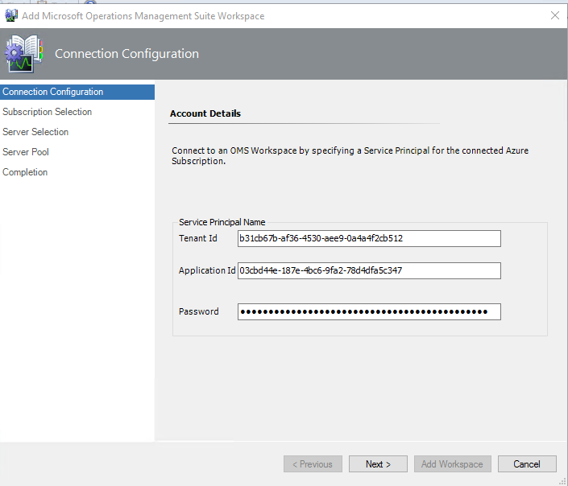
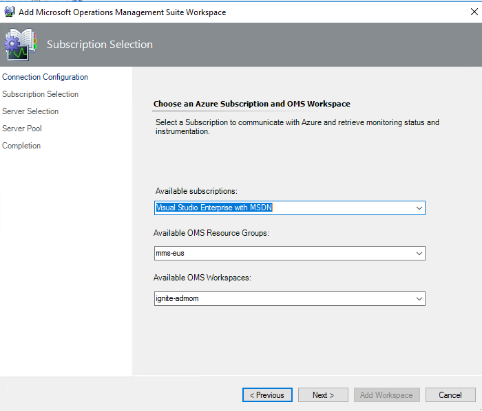
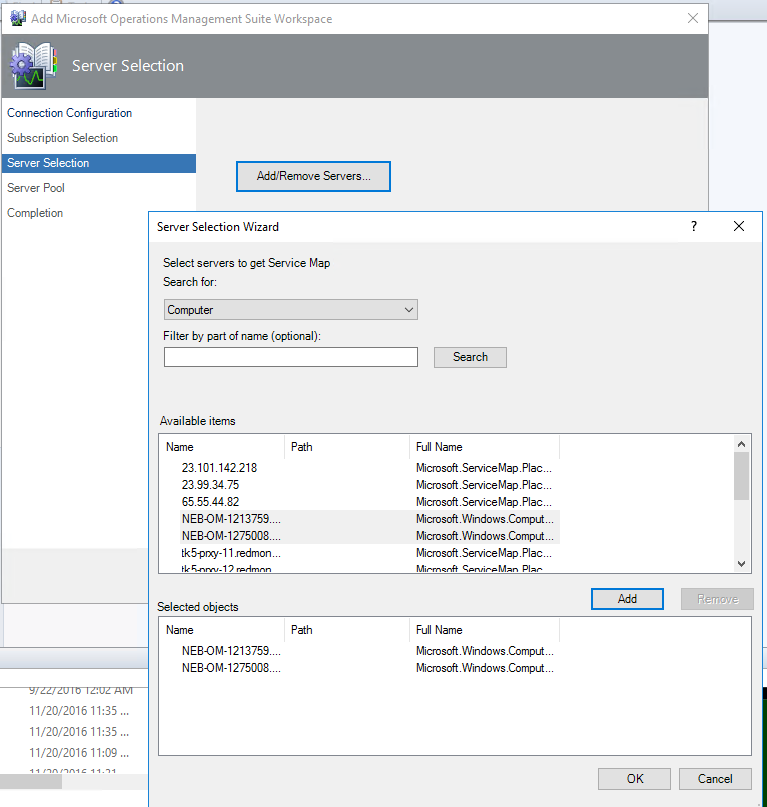
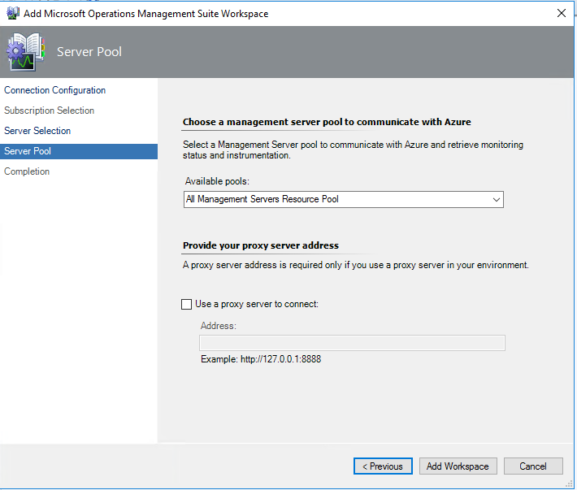
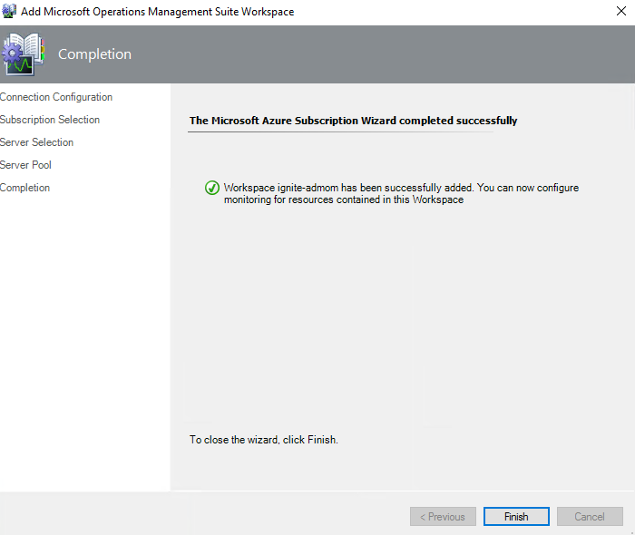
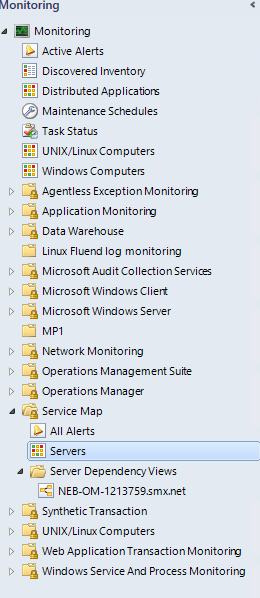
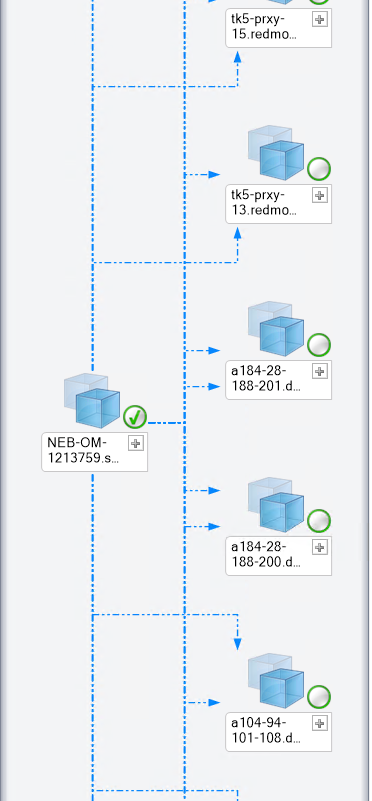
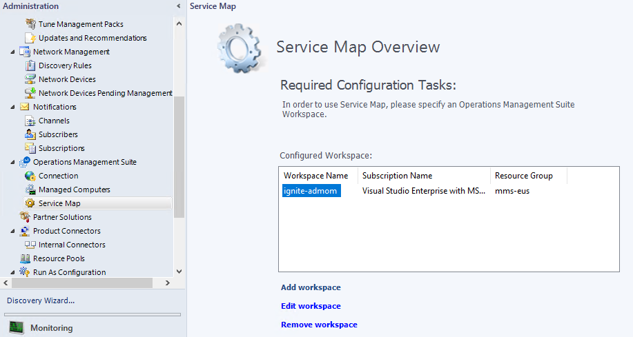

# Service Map integration with System Center Operations Manager
  > [!NOTE]
  > Because this feature is in private preview, it should not be used on production systems.
  > 
  
Operations Management Suite Service Map automatically discovers application components on Windows and Linux systems and maps the communication between services. Service Map allows you to view your servers the way you think of them, as interconnected systems that deliver critical services. Service Map shows connections between servers, processes, and ports across any TCP-connected architecture, with no configuration required besides the installation of an agent. For more information, see the [Service Map documentation](operations-management-suite-service-map.md).

With this integration between Service Map and System Center Operations Manager, you can automatically create distributed application diagrams in Operations Manager that are based on the dynamic dependency maps in Service Map.

## Prerequisites
* An Operations Manager management group that is managing a set of servers.
* An Operations Management Suite workspace with the Service Map solution enabled.
* A set of servers (at least one) that are being managed by Operations Manager and sending data to Service Map. Windows and Linux servers are supported.
* A service principal with access to the Azure subscription that is associated with the Operations Management Suite workspace. For more information, go to [Create a service principal](#creating-a-service-principal).

## Install the Service Map management pack
You enable the integration between Operations Manager and Service Map by importing the Microsoft.SystemCenter.ServiceMap management pack bundle (Microsoft.SystemCenter.ServiceMap.mpb). The bundle contains the following management packs:
* Microsoft Service Map Application Views
* Microsoft System Center Service Map Internal
* Microsoft System Center Service Map Overrides
* Microsoft System Center Service Map

## Configure the Service Map integration
After you install the Service Map management pack, a new node, **Service Map**, is displayed under **Operations Management Suite** in the **Administration** pane. 

To configure Service Map integration, do the following:

1. To open the configuration wizard, in the **Service Map Overview** pane, click **Add workspace**.  

    

2. In the **Connection Configuration** window, enter the tenant name or ID, application ID (also known as the username or clientID), and password of the service principal, and then click **Next**. For more information, go to [Create a service principal](#creating-a-service-principal).

    

3. In the **Subscription Selection** window, select the Azure subscription, Azure resource group (the one that contains the Operations Management Suite workspace), and Operations Management Suite workspace, and then click **Next**.

    

4. In the **Server Selection** window, you configure the Service Map Servers Group with the servers that you want to sync between Operations Manager and Service Map. Click **Add/Remove Servers**.   
    
    For the integration to build a distributed application diagram for a server, the server must be:

    * Managed by Operations Manager.
    * Managed by Service Map.
    * Listed in the Service Map Servers Group.

    

5. Optional: Select the Management Server resource pool to communicate with Operations Management Suite, and then click **Add Workspace**.

    

    It might take a minute to configure and register the Operations Management Suite workspace. After it is configured, Operations Manager initiates the first Service Map sync from Operations Management Suite.

    

    >[!NOTE]
    >The default sync interval is set to 60 minutes. You can configure overrides to change the sync interval. You can also add servers to the Service Map Servers Group manually through the **Authoring** pane. To do so, select **Groups**, and then search for **Service Map Servers Group**. The server maps for those servers are synced with the next sync, which is based on the configured sync interval.

## Monitor Service Map
After the Operations Management Suite workspace is connected, a new folder, Service Map, is displayed in the **Monitoring** pane of the Operations Manager console.

The Service Map folder has three nodes:
* **Active Alerts**: Lists all the active alerts about the communication between Operations Manager and Service Map solution in Operations Management Suite.

    >[!NOTE]
    >These alerts are not the Operations Management Suite alerts that are surfaced in Operations Manager.

* **Servers**: Lists the monitored servers that are configured to sync from Service Map.

    

* **Server Dependency Views**: Lists all servers that are synced from Service Map. You can click any server to view its distributed application diagram.

    

## Edit or delete the workspace
You can edit or delete the configured workspace through the **Service Map Overview** pane (**Administration** pane > **Operations Management Suite** > **Service Map**). You can configure only one Operations Management Suite workspace for now.

## Configure rules and overrides
A rule, _Microsoft.SystemCenter.ServiceMapImport.Rule_, is created to periodically fetch information from Service Map. To change sync timings, you can configure overrides of the rule (**Authoring** pane > **Rules** > **Microsoft.SystemCenter.ServiceMapImport.Rule**).

* **Enabled**: Enable or disable automatic updates. 
* **IntervalMinutes**: Reset the time between updates. The default interval is one hour. If you want to sync server maps more frequently, you can change the value.
* **TimeoutSeconds**: Reset the length of time before the request times out. 
* **TimeWindowMinutes**: Reset the time window for querying data. Default is a 60-minute window. The maximum value allowed by Service Map is 60 minutes.

## Known issues and limitations

The current design presents the following issues and limitations:
* Although you can add servers to the Service Map Servers Group manually through the **Authoring** pane, the maps for those servers are synced from Service Map only during the next sync cycle. The default setting is 60 minutes, but you can override the timing. 
* You can connect to a single Operations Management Suite workspace.

## Create a service principal
For official Azure documentation about creating a service principal, see:
* [Create a service principal by using PowerShell](https://docs.microsoft.com/en-us/azure/azure-resource-manager/resource-group-authenticate-service-principal)
* [Create a service principal by using Azure CLI](https://docs.microsoft.com/en-us/azure/azure-resource-manager/resource-group-authenticate-service-principal-cli)
* [Create a service principal by using the Azure portal](https://docs.microsoft.com/en-us/azure/azure-resource-manager/resource-group-create-service-principal-portal)

### Feedback
Do you have any feedback for us about Service Map or this documentation? Visit our [user voice page](https://feedback.azure.com/forums/267889-log-analytics/category/184492-service-map), where you can suggest features or vote on existing suggestions.
