# Use the Service Map solution in Operations Management Suite
Service Map automatically discovers application components on Windows and Linux systems and maps the communication between services. With Service Map, you can view your servers in the way that you think of them: as interconnected systems that deliver critical services. Service Map shows connections between servers, processes, and ports across any TCP-connected architecture, with no configuration required other than the installation of an agent.

This article describes the details of using Service Map. For information about configuring Service Map and onboarding agents, see [Configuring Service Map solution in Operations Management Suite](operations-management-suite-service-map-configure.md).

## Use cases: Make your IT processes dependency aware

### Discovery
Service Map automatically builds a common reference map of dependencies across your servers, processes, and third-party services. It discovers and maps all TCP dependencies, identifying surprise connections, remote third-party systems you depend on, and dependencies to traditional dark areas of your network, such as Active Directory. Service Map discovers failed network connections that your managed systems are attempting to make, helping you identify potential server misconfiguration, service outage, and network issues.

### Incident management
Service Map helps eliminate the guesswork of problem isolation by showing you how systems are connected and affecting each other. In addition to identifying failed connections, it helps identify misconfigured load balancers, surprising or excessive load on critical services, and rogue clients, such as developer machines talking to production systems. By using integrated workflows with Operations Management Suite Change Tracking, you can also see whether a change event on a back-end machine or service explains the root cause of an incident.

### Migration assurance
By using Service Map, you can effectively plan, accelerate, and validate Azure migrations, which helps ensure that nothing is left behind and surprise outages do not occur. You can discover all interdependent systems that need to migrate together, assess system configuration and capacity, and identify whether a running system is still serving users or is a candidate for decommissioning instead of migration. After the move is complete, you can check on client load and identity to verify that test systems and customers are connecting. If your subnet planning and firewall definitions have issues, failed connections in Service Map maps point you to the systems that need connectivity.

### Business continuity
If you are using Azure Site Recovery and need help defining the recovery sequence for your application environment, Service Map can automatically show you how systems rely on each other to ensure that your recovery plan is reliable. By choosing a critical server or group and viewing its clients, you can identify which front-end systems to recover after the server is restored and available. Conversely, by looking at critical servers’ back-end dependencies, you can identify which systems to recover before your focus systems are restored.

### Patch management
Service Map enhances your use of the Operations Management Suite System Update Assessment by showing you which other teams and servers depend on your service, so you can notify them in advance before you take down your systems for patching. Service Map also enhances patch management in Operations Management Suite by showing you whether your services are available and properly connected after they are patched and restarted.

## Mapping overview
Service Map agents gather information about all TCP-connected processes on the server where they’re installed and details about the inbound and outbound connections for each process. In the list in the left pane, you can select machines or groups that have Service Map agents to visualize their dependencies over a specified time range. Machine dependency maps focus on a specific machine, and they show all the machines that are direct TCP clients or servers of that machine.  Machine Group maps show sets of servers and their dependencies.

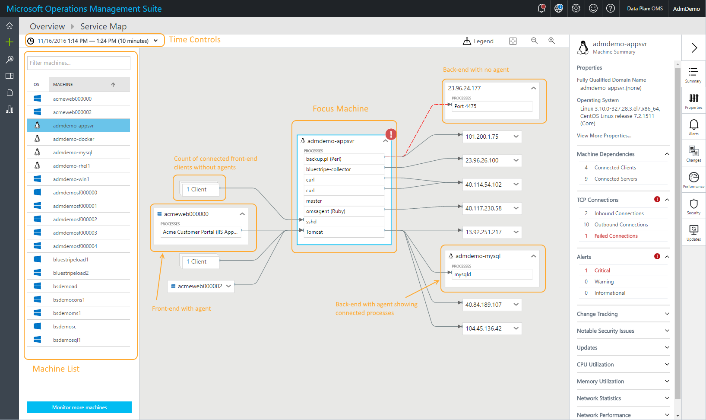

Machines can be expanded in the map to show the running processes with active network connections during the selected time range. When a remote machine with a Service Map agent is expanded to show process details, only those processes that communicate with the focus machine are shown. The count of agentless front-end machines that connect into the focus machine is indicated on the left side of the processes they connect to. If the focus machine is making a connection to a back-end machine that has no agent, the back-end server is included in a Server Port Group, along with other connections to the same port number.

By default, Service Map maps show the last 30 minutes of dependency information. By using the time controls at the upper left, you can query maps for historical time ranges of up to one hour to show how dependencies looked in the past (for example, during an incident or before a change occurred). Service Map data is stored for 30 days in paid workspaces, and for 7 days in free workspaces.

## Status badges and border coloring
At the bottom of each server in the map can be a list of status badges conveying status information about the server. The badges indicate that there is some relevant information for the server from one of the Operations Management Suite solution integrations. Clicking a badge takes you directly to the details of the status in the right pane. The currently available status badges include Alerts, Service Desk, Changes, Security, and Updates.

Depending on the severity of the status badges, machine node borders can be colored red (critical), yellow (warning), or blue (informational). The color represents the most severe status of any of the status badges. A gray border indicates a node that has no status indicators.

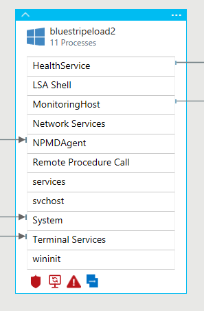

## Machine Groups
Machine Groups allow you to see maps centered around a set of servers, not just one so you can see all the members of a multi-tier application or server cluster in one map.

Users select which servers belong in a group together and choose a name for the group.  You can then choose to view the group with all of its processes and connections, or view it with only the processes and connections that directly relate to the other members of the group.

### Creating a Machine Group
To create a group, select the machine or machines you want in the Machines list and click **Add to group**.

There, you can choose **Create new** and give the group a name.

>[!NOTE]
>Machine groups are currently limited to 10 servers, but we plan to increase this limit soon.

### Viewing a Group
Once you’ve created some groups, you can view them by choosing the Groups tab.

Then select the Group name to view the map for that Machine Group.
 
The machines that belong to the group are outlined in white in the map.

Expanding the Group will list the machines that make up the Machine Group.

### Filter by processes
You can toggle the map view between showing all processes and connections in the Group and only the ones that directly relate to the Machine Group.  The default view is to show all processes.  You can change the view by clicking the filter icon above the map.

When **All processes** is selected, the map will include all processes and connections on each of the machines in the Group.

If you change the view to show only **group-connected processes**, the map will be narrowed down to only those processes and connections that are directly connected to other machines in the group, creating a simplified view.

 
### Adding machines to a group
To add machines to an existing group, check the boxes next to the machines you want and then click **Add to group**.  Then, choose the group you want to add the machines to.
 
### Removing machines from a group
In the Groups List, expand the group name to list the machines in the Machine Group.  Then, click on the ellipsis menu next to the machine you want to remove and choose **Remove**.

### Removing or renaming a group
Click on the ellipsis menu next to the group name in the Group List.

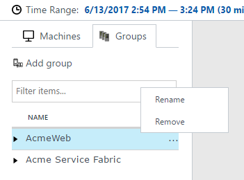

## Role icons
Certain processes serve particular roles on machines: web servers, application servers, database, and so on. Service Map annotates process and machine boxes with role icons to help identify at a glance the role a process or server plays.

| Role icon | Description |
|:--|:--|
|  | Web server |
|  | Application server |
|  | Database server |
|  | LDAP server |
|  | SMB server |

## Failed connections
Failed connections are shown in Service Map maps for processes and computers, with a dashed red line indicating that a client system is failing to reach a process or port. Failed connections are reported from any system with a deployed Service Map agent if that system is the one attempting the failed connection. Service Map measures this process by observing TCP sockets that fail to establish a connection. This failure could result from a firewall, a misconfiguration in the client or server, or a remote service being unavailable.

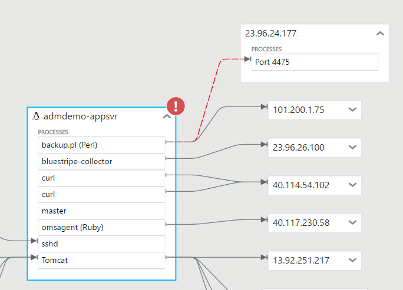

Understanding failed connections can help with troubleshooting, migration validation, security analysis, and overall architectural understanding. Failed connections are sometimes harmless, but they often point directly to a problem, such as a failover environment suddenly becoming unreachable, or two application tiers being unable to talk after a cloud migration.

## Client Groups
Client Groups are boxes on the map that represent client machines that do not have Dependency Agents. A single Client Group represents the clients for an individual process or machine.

To see the IP addresses of the servers in a Client Group, select the group. The contents of the group are listed in the **Client Group Properties** pane.

## Server Port Groups
Server Port Groups are boxes that represent server ports on servers that do not have Dependency Agents. The box contains the server port and a count of the number of servers with connections to that port. Expand the box to see the individual servers and connections. If there is only one server in the box, the name or IP address is listed.

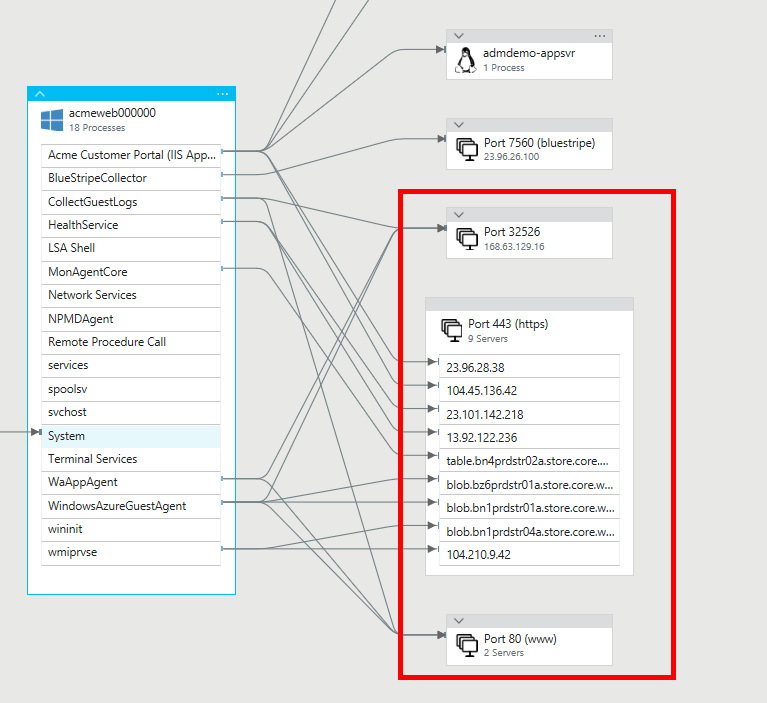

## Context menu
Clicking the ellipsis (...) at the top right of any server displays the context menu for that server.

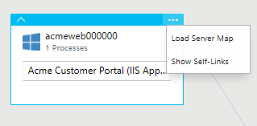

### Load server map
Clicking **Load Server Map** takes you to a new map with the selected server as the new focus machine.

### Show self-links
Clicking **Show Self-Links** redraws the server node, including any self-links, which are TCP connections that start and end on processes within the server. If self-links are shown, the menu command changes to **Hide Self-Links**, so that you can turn them off.

## Computer summary
The **Machine Summary** pane includes an overview of a server's operating system, dependency counts, and data from other Operations Management Suite solutions. Such data includes performance metrics, service desk tickets, change tracking, security, and updates.

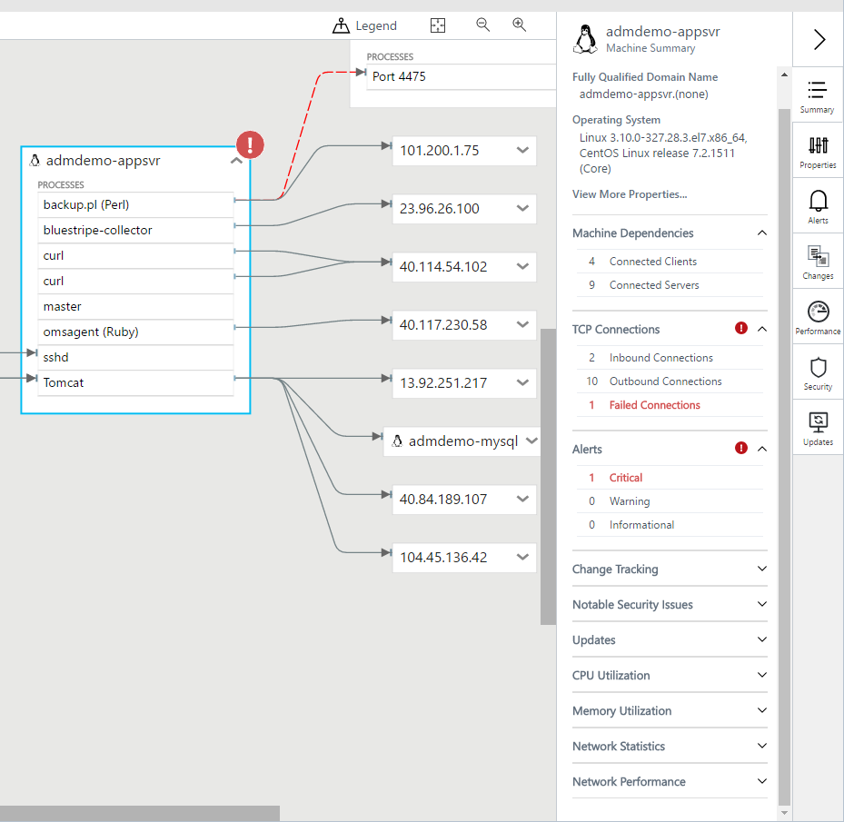

## Computer and process properties
When you navigate a Service Map map, you can select machines and processes to gain additional context about their properties. Machines provide information about DNS name, IPv4 addresses, CPU and memory capacity, VM type, operating system and version, last reboot time, and the IDs of their Operations Management Suite and Service Map agents.

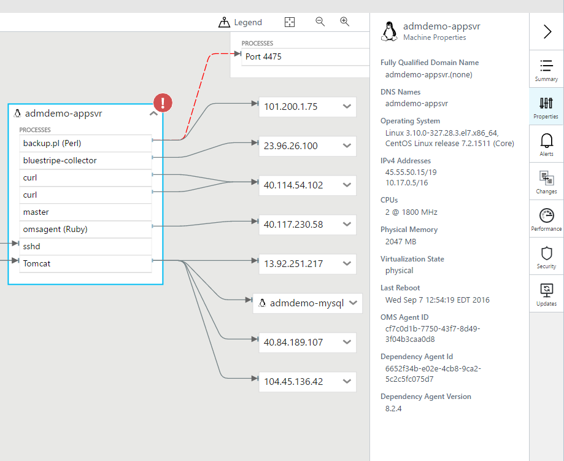

You can gather process details from operating-system metadata about running processes, including process name, process description, user name and domain (on Windows), company name, product name, product version, working directory, command line, and process start time.

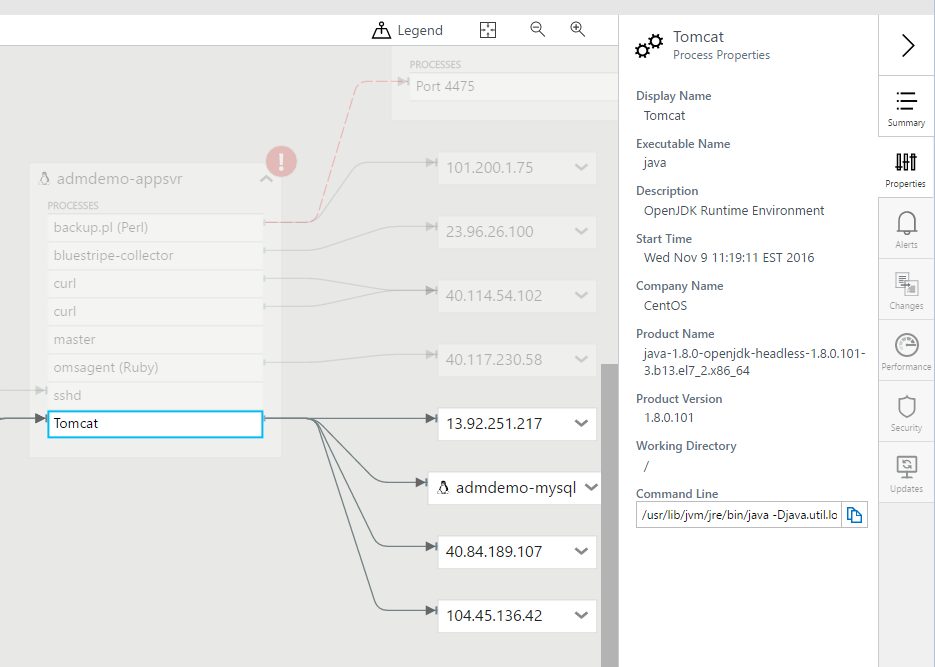

The **Process Summary** pane provides additional information about the process’s connectivity, including its bound ports, inbound and outbound connections, and failed connections.

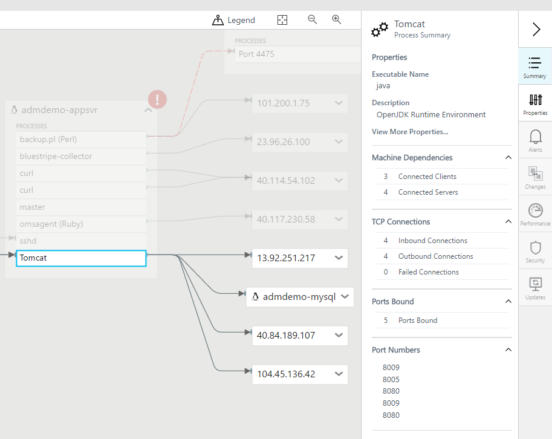

## Operations Management Suite Alerts integration
Service Map integrates with Operations Management Suite Alerts to show fired alerts for the selected server in the selected time range. The server displays an icon if there are current alerts, and the **Machine Alerts** pane lists the alerts.

To enable Service Map to display relevant alerts, create an alert rule that fires for a specific computer. To create proper alerts:
- Include a clause to group by computer (for example, **by Computer interval 1minute**).
- Choose to alert based on metric measurement.

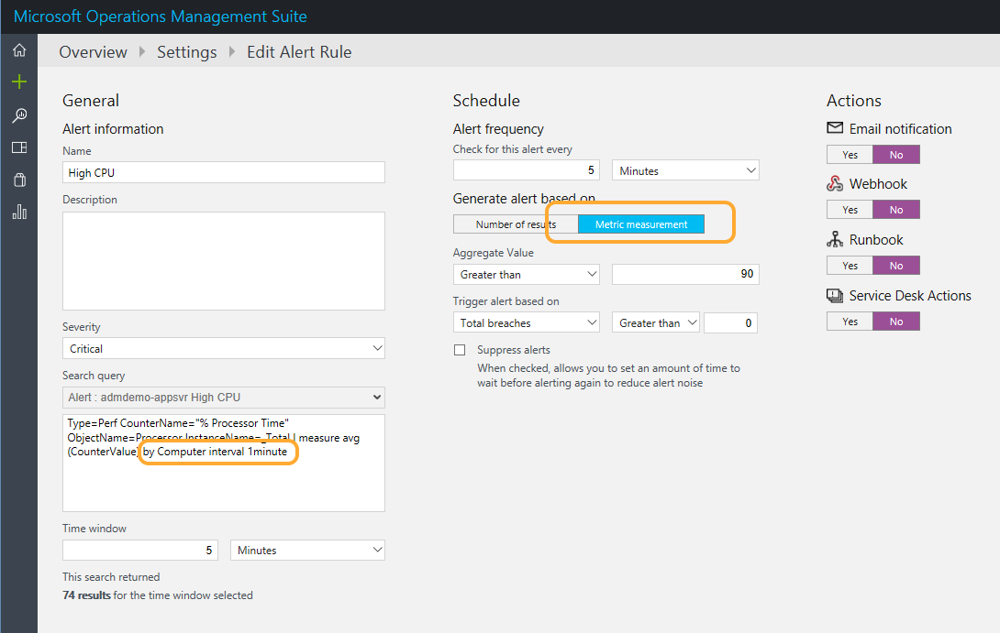

## Operations Management Suite log events integration
Service Map integrates with Log Search to show a count of all available log events for the selected server during the selected time range. You can click any row in the list of event counts to jump to Log Search and see the individual log events.

## Operations Management Suite Service Desk integration
Service Map integration with the IT Service Management Connector is automatic when both solutions are enabled and configured in your Operations Management Suite workspace. The integration in Service Map is labeled "Service Desk." For more information, see [Centrally manage ITSM work items using IT Service Management Connector](https://docs.microsoft.com/azure/log-analytics/log-analytics-itsmc-overview).

The **Machine Service Desk** pane lists all IT Service Management events for the selected server in the selected time range. The server displays an icon if there are current items and the Machine Service Desk pane lists them.

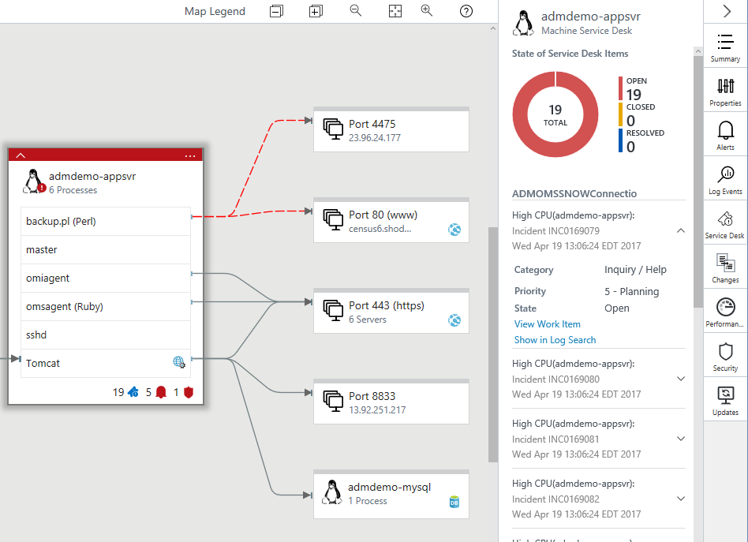

To open the item in your connected ITSM solution, click **View Work Item**.

To view the details of the item in Log Search, click **Show in Log Search**.

## Operations Management Suite Change Tracking integration
Service Map integration with Change Tracking is automatic when both solutions are enabled and configured in your Operations Management Suite workspace.

The **Machine Change Tracking** pane lists all changes, with the most recent first, along with a link to drill down to Log Search for additional details.

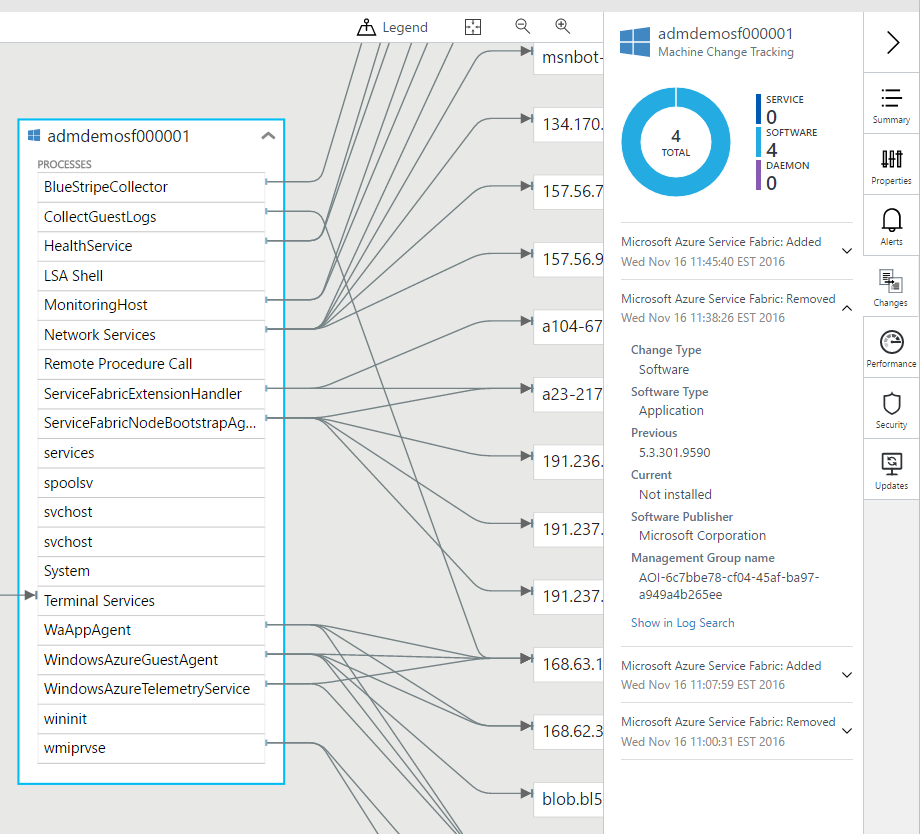

The following image is a detailed view of a ConfigurationChange event that you might see after you select **Show in Log Analytics**.

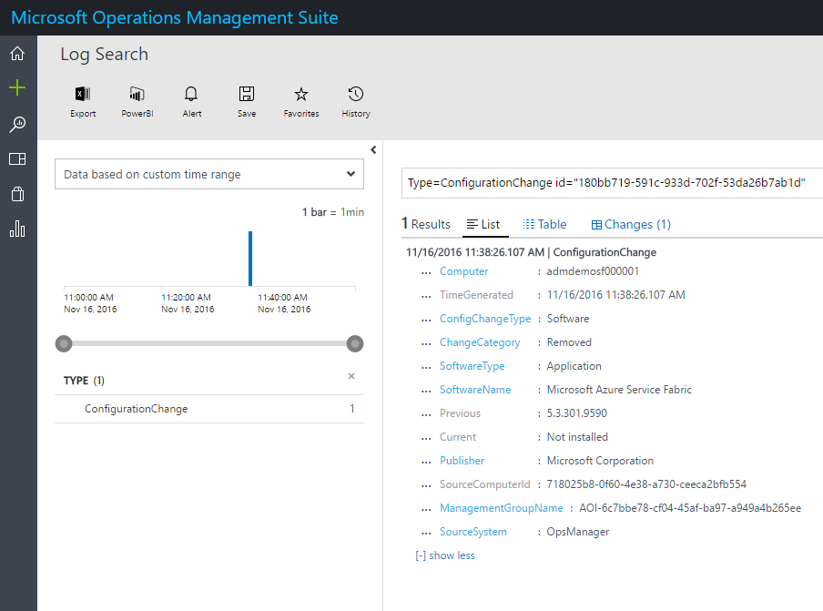

## Operations Management Suite performance integration
The **Machine Performance** pane displays standard performance metrics for the selected server. The metrics include CPU utilization, memory utilization, network bytes sent and received, and a list of the top processes by network bytes sent and received. To get the network performance data, you must also have enabled the Wire Data 2.0 solution in Operations Management Suite.

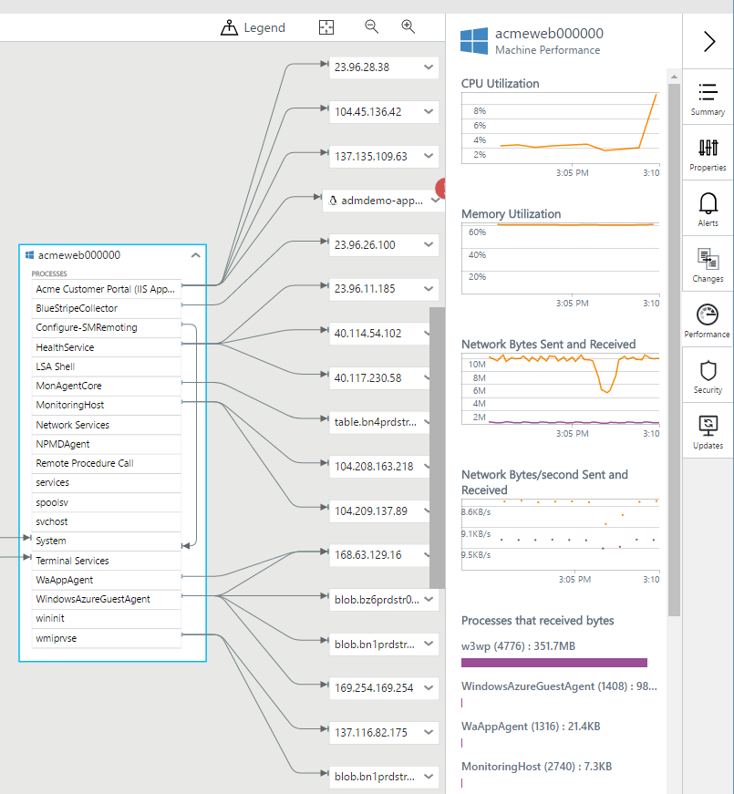

## Operations Management Suite Security integration
Service Map integration with Security and Audit is automatic when both solutions are enabled and configured in your Operations Management Suite workspace.

The **Machine Security** pane shows data from the Operations Management Suite Security and Audit solution for the selected server. The pane lists a summary of any outstanding security issues for the server during the selected time range. Clicking any of the security issues drills down into a Log Search for details about them.

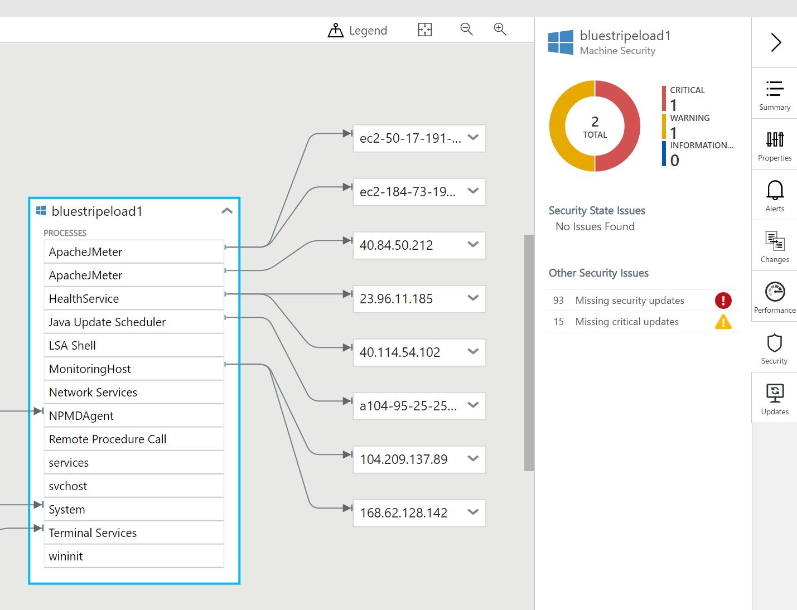

## Operations Management Suite Updates integration
Service Map integration with Update Management is automatic when both solutions are enabled and configured in your Operations Management Suite workspace.

The **Machine Updates** pane displays data from the Operations Management Suite Update Management solution for the selected server. The pane lists a summary of any missing updates for the server during the selected time range.

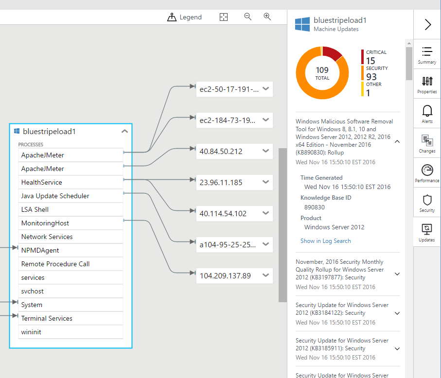

## Log Analytics records
Service Map computer and process inventory data is available for [search](../log-analytics/log-analytics-log-searches.md) in Log Analytics. You can apply this data to scenarios that include migration planning, capacity analysis, discovery, and on-demand performance troubleshooting.

One record is generated per hour for each unique computer and process, in addition to the records that are generated when a process or computer starts or is on-boarded to Service Map. These records have the properties in the following tables. The fields and values in the ServiceMapComputer_CL events map to fields of the Machine resource in the ServiceMap Azure Resource Manager API. The fields and values in the ServiceMapProcess_CL events map to the fields of the Process resource in the ServiceMap Azure Resource Manager API. The ResourceName_s field matches the name field in the corresponding Resource Manager resource. 

>[!NOTE]
>As Service Map features grow, these fields are subject to change.

There are internally generated properties you can use to identify unique processes and computers:

- Computer: Use ResourceId or ResourceName_s to uniquely identify a computer within an Operations Management Suite workspace.
- Process: Use ResourceId to uniquely identify a process within an Operations Management Suite workspace. ResourceName_s is unique within the context of the machine on which the process is running (MachineResourceName_s) 

Because multiple records can exist for a specified process and computer in a specified time range, queries can return more than one record for the same computer or process. To include only the most recent record, add "| dedup ResourceId" to the query.

### ServiceMapComputer_CL records
Records with a type of *ServiceMapComputer_CL* have inventory data for servers with Service Map agents. These records have the properties in the following table:

| Property | Description |
|:--|:--|
| Type | *ServiceMapComputer_CL* |
| SourceSystem | *OpsManager* |
| ResourceId | The unique identifier for a machine within the workspace |
| ResourceName_s | The unique identifier for a machine within the workspace |
| ComputerName_s | The computer FQDN |
| Ipv4Addresses_s | A list of the server's IPv4 addresses |
| Ipv6Addresses_s | A list of the server's IPv6 addresses |
| DnsNames_s | An array of DNS names |
| OperatingSystemFamily_s | Windows or Linux |
| OperatingSystemFullName_s | The full name of the operating system  |
| Bitness_s | The bitness of the machine (32-bit or 64-bit)  |
| PhysicalMemory_d | The physical memory in MB |
| Cpus_d | The number of CPUs |
| CpuSpeed_d | The CPU speed in MHz|
| VirtualizationState_s | *unknown*, *physical*, *virtual*, *hypervisor* |
| VirtualMachineType_s | *hyperv*, *vmware*, and so on |
| VirtualMachineNativeMachineId_g | The VM ID as assigned by its hypervisor |
| VirtualMachineName_s | The name of the VM |
| BootTime_t | The boot time |

### ServiceMapProcess_CL Type records
Records with a type of *ServiceMapProcess_CL* have inventory data for TCP-connected processes on servers with Service Map agents. These records have the properties in the following table:

| Property | Description |
|:--|:--|
| Type | *ServiceMapProcess_CL* |
| SourceSystem | *OpsManager* |
| ResourceId | The unique identifier for a process within the workspace |
| ResourceName_s | The unique identifier for a process within the machine on which it is running|
| MachineResourceName_s | The resource name of the machine |
| ExecutableName_s | The name of the process executable |
| StartTime_t | The process pool start time |
| FirstPid_d | The first PID in the process pool |
| Description_s | The process description |
| CompanyName_s | The name of the company |
| InternalName_s | The internal name |
| ProductName_s | The name of the product |
| ProductVersion_s | The product version |
| FileVersion_s | The file version |
| CommandLine_s | The command line |
| ExecutablePath _s | The path to the executable file |
| WorkingDirectory_s | The working directory |
| UserName | The account under which the process is executing |
| UserDomain | The domain under which the process is executing |

## Sample log searches

### List all known machines
Type=ServiceMapComputer_CL | dedup ResourceId

### List the physical memory capacity of all managed computers.
Type=ServiceMapComputer_CL | select PhysicalMemory_d, ComputerName_s | Dedup ResourceId

### List computer name, DNS, IP, and OS.
Type=ServiceMapComputer_CL | select ComputerName_s, OperatingSystemFullName_s, DnsNames_s, IPv4Addresses_s  | dedup ResourceId

### Find all processes with "sql" in the command line
Type=ServiceMapProcess_CL CommandLine_s = \*sql\* | dedup ResourceId

### Find a machine (most recent record) by resource name
Type=ServiceMapComputer_CL "m-4b9c93f9-bc37-46df-b43c-899ba829e07b" | dedup ResourceId

### Find a machine (most recent record) by IP address
Type=ServiceMapComputer_CL "10.229.243.232" | dedup ResourceId

### List all known processes on a specified machine
Type=ServiceMapProcess_CL MachineResourceName_s="m-4b9c93f9-bc37-46df-b43c-899ba829e07b" | dedup ResourceId

### List all computers running SQL
Type=ServiceMapComputer_CL ResourceName_s IN {Type=ServiceMapProcess_CL \*sql\* | Distinct MachineResourceName_s} | dedup ResourceId | Distinct ComputerName_s

### List all unique product versions of curl in my datacenter
Type=ServiceMapProcess_CL ExecutableName_s=curl | Distinct ProductVersion_s

### Create a computer group of all computers running CentOS
Type=ServiceMapComputer_CL OperatingSystemFullName_s = \*CentOS\* | Distinct ComputerName_s

## REST API
All the server, process, and dependency data in Service Map is available via the [Service Map REST API](https://docs.microsoft.com/rest/api/servicemap/).

## Diagnostic and usage data
Microsoft automatically collects usage and performance data through your use of the Service Map service. Microsoft uses this data to provide and improve the quality, security, and integrity of the Service Map service. To provide accurate and efficient troubleshooting capabilities, the data includes information about the configuration of your software, such as operating system and version, IP address, DNS name, and workstation name. Microsoft does not collect names, addresses, or other contact information.

For more information about data collection and usage, see the [Microsoft Online Services Privacy Statement](https://go.microsoft.com/fwlink/?LinkId=512132).

## Next steps
Learn more about [log searches](../log-analytics/log-analytics-log-searches.md) in Log Analytics to retrieve data that's collected by Service Map.

## Troubleshooting
See the [Troubleshooting section of the Configuring Service Map document](operations-management-suite-service-map-configure.md#troubleshooting).

## Feedback
Do you have any feedback for us about Service Map or this documentation?  Visit our [User Voice page](https://feedback.azure.com/forums/267889-log-analytics/category/184492-service-map), where you can suggest features or vote up existing suggestions.
