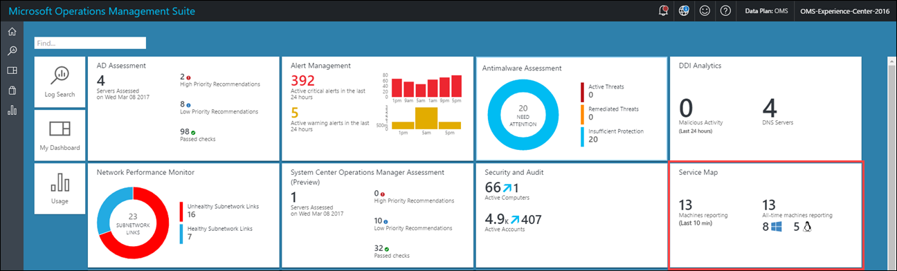
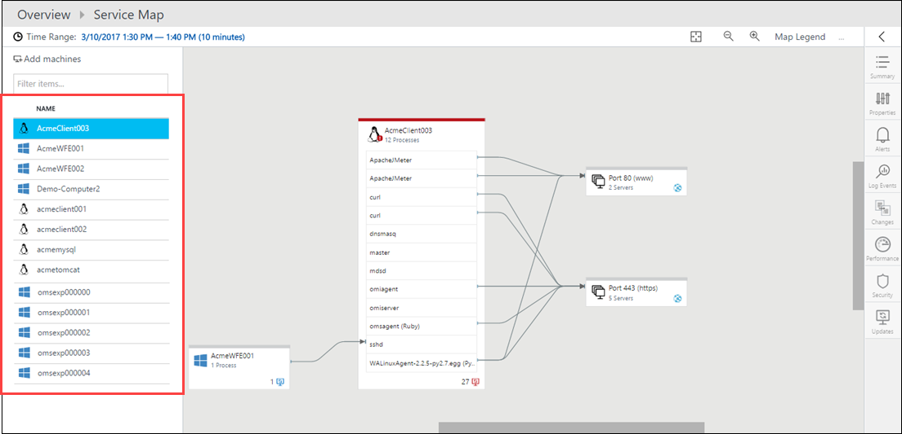
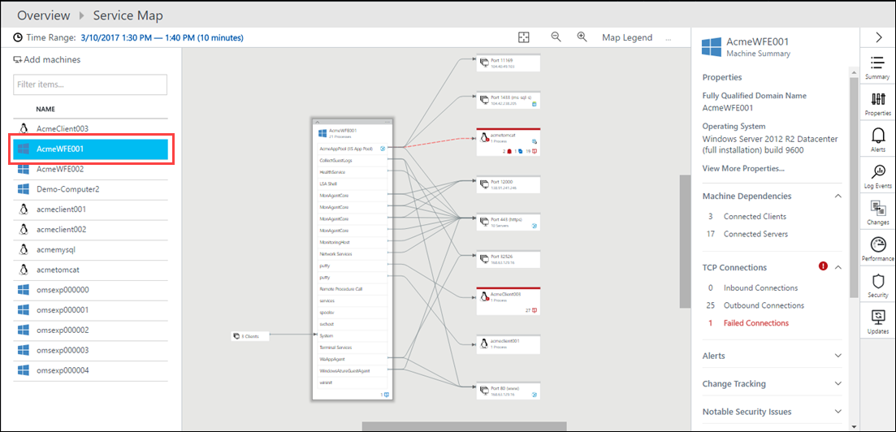
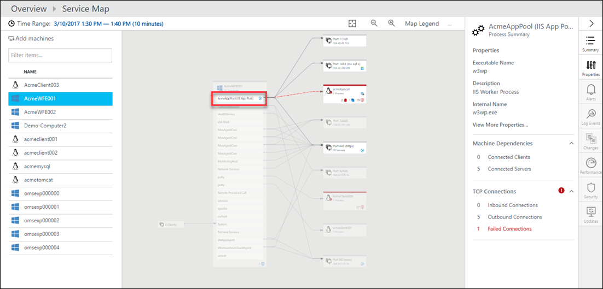
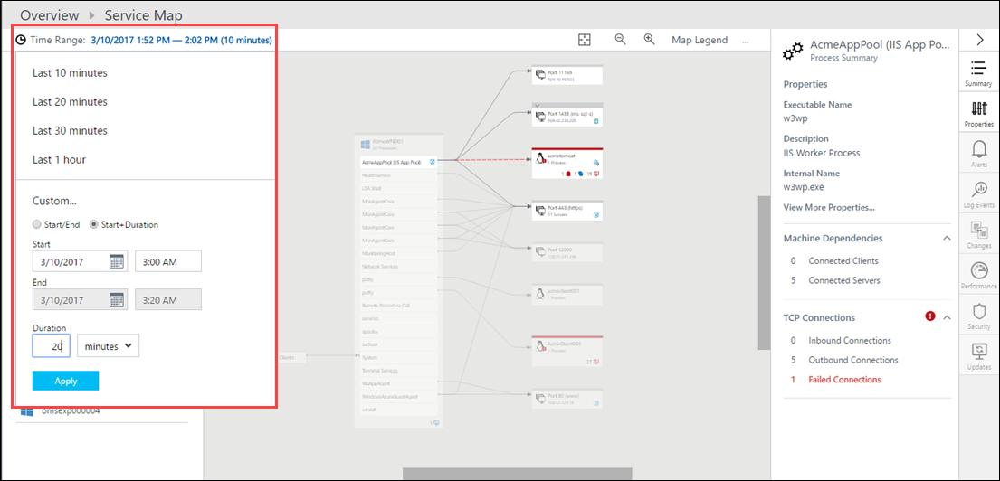
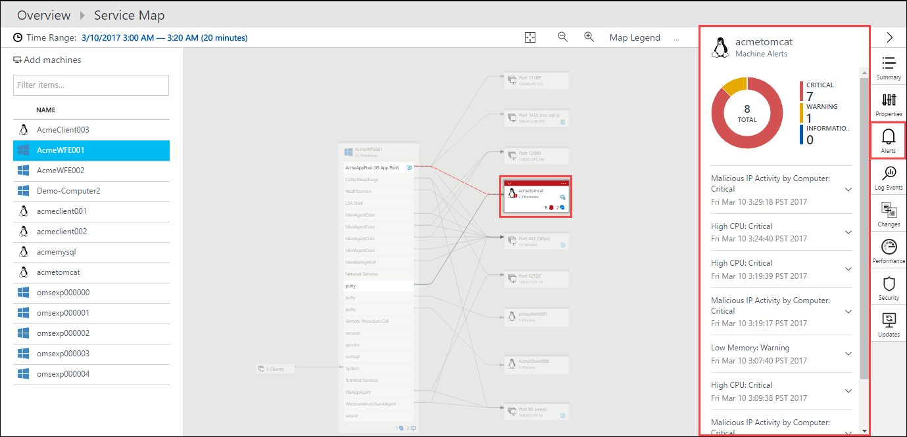
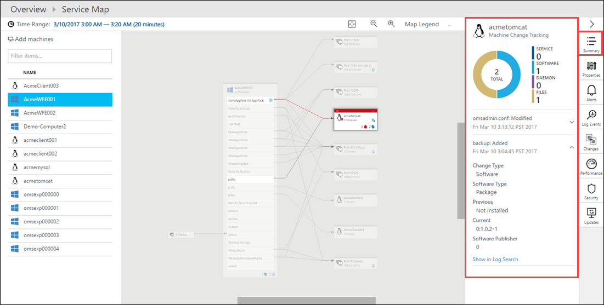
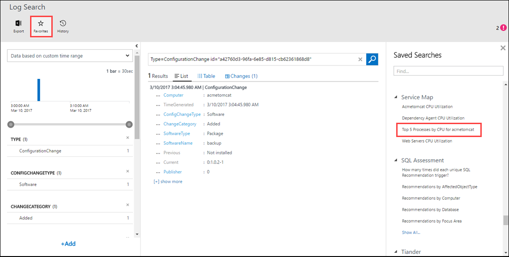

# Service Map Demo Overview

* Log into OMS-Experience-Center-2016 Workspace in OMS Portal using your MSFT alias:
 * https://oms-experience-center-2016.portal.mms.microsoft.com/#Workspace/overview/index

* Incident management
 * Show Service Map for discovery and dependency alerting
 * Change tracking integration showing backup process being added
 * Drill into Log Search
 * Isolate backup process

## Demo Scenario Setup
You're the administrator for ACME Co.  You've just received a notification that the ACME Customer Portal application is having performance issues.  The only information that you have is that these issues started about 3:00 am PST today.

We're going to walk through a scenario of how you could use Service Map to identify this problem.

## Walkthrough
The only information you have is that the portal is experiencing slow performance.  You aren't entirely sure of all the components that the portal is dependent on other than a set of web servers.

Start the Service Map solution by clicking on the **Service Map** tile.

The Service Map console is displayed.  In the left pane is a list of computers in your environment with the Service Map agent installed.

We know that the web servers are called AcmeWFE001 and AcmeWFE002, so this seems like a reasonable place to start.  Click on **AcmeWFE001**.  This displays the map for AcmeWFE001 and all of its dependencies.

We're concerned about the performance of our web application so click on **AcmeAppPool (IIS App Pool)**.  This displays the details for this process and highlights its dependencies.  

We heard that the problem started at 3:00 AM so let's have a look at what was happening at that time. Click on **Time Range** and change the time to 3:00 AM PST (keep the current date and adjust for your local time zone) with a duration of 20 minutes.

We now see that the **acmetomcat** dependency has an alert displayed so that's our potential problem.  Click on the alert icon in **acmetomcat**.  This shows the details for the alert.  We can see that we have critical CPU utilization and a warning for low memory.  This is probably what's causing our slow performance. 

Let's look a bit more into those performance counters to verify our suspicion.  Select the **Performance** tab to display the performance counters over the time range.  We can see that we're getting periodic spikes in the processor and memory for this computer.

Let's see if we can find out what might have caused this high utilization.  Click on the **Summary** tab.  This provides information that OMS has collected from the computer such as failed connections, critical alerts, and software changes.  Sections with interesting recent information should already be expanded, and you can expand other sections to inspect information that they contain.

If **Change Tracking** isn't already open, then expand it.  This shows information collected by the Change Tracking solution.  It looks like there was a software change made during this time window.  Click on **Software** to get details.

It appears the someone added a backup process to the machine just after 3:00 AM, so it appears that identified the culprit for the excessive resources being consumed.

We can further verify this by looking at the detailed performance information collected in the Log Analytics repository.  Click on the **Alerts** tab again and then on one of the **High CPU** alerts.  Click on  **Show in Log Search**.

This opens the Log Search window where you can perform queries against any data stored in the repository.  We already have a query filled in to retrieve the alert we're interested in, and you can inspect its details here.  Let's see if we can get some more detail on the performance collection that generated this alert and verify our suspicion that the problems are being caused by that backup process.  Change the time range to **6 hours**.  Then click on **Favorites** and scroll down to the saved searches for **Service Map**.  These are queries that we created specifically for this analysis.  Click on **Top 5 Processes by CPU for acmetomcat**.

This query returns a list of the top 5 processes consuming processor on **acmetomcat**.  You can inspect the query to get an introduction to the query language used for log searches.  If you were interested in the processes on other computers, you could easily modify the query for that information.

In this case, we can see that the backup process is consistently consuming about 60% of the app server’s CPU.  It's pretty obvious that this new process is responsible for our performance problem.

Our solution would obviously be to remove this new backup software off the application server.  We could actually leverage Desired State Configuration (DSC) managed by Azure Automation to define policies that ensure this process never runs on these critical systems.

## Demo Conclusions
- Service Map provides you with a view of your entire application even if you don't know all of its servers and dependencies.
- Service Map surfaces data collected by other OMS solutions to help you identify issues with your application and its underlying infrastructure.
- Log searches allow you to drill down into specific data collected in the Log Analytics repository.    

