## Microsoft OMS Service Map - Demo Instructions

>Latest update: 1/19/2017

>Author: dairwin (OMS PM)

### Service Map Demo Overview

* Log into OMS-Experience-Center-2016 Workspace in OMS Portal using your MSFT alias:
 * https://oms-experience-center-2016.portal.mms.microsoft.com/#Workspace/overview/index

* Incident management
 * Show Service Map for discovery and dependency alerting
 * Change tracking integration showing backup process being added
 * Drill into Log Search
 * Isolate backup process

### Demo Scenario Setup
Let’s assume I’m a web server admin for ACME Co, and I’ve just received a notification that the ACME Customer Portal Application is having performance issues.

I was told that these issues started around 3:00 am today, Pacific Time **[Note: you will need to adjust this to your local time where you are giving the demo]**

Now, instead of just jumping in to look at a list of alerts, what if I can get a live view of my ACME Customer Portal systems, starting with the web tier that I own?

With Service Map I get list of all the systems in our environment, and automatic discovery of all dependencies for those systems.

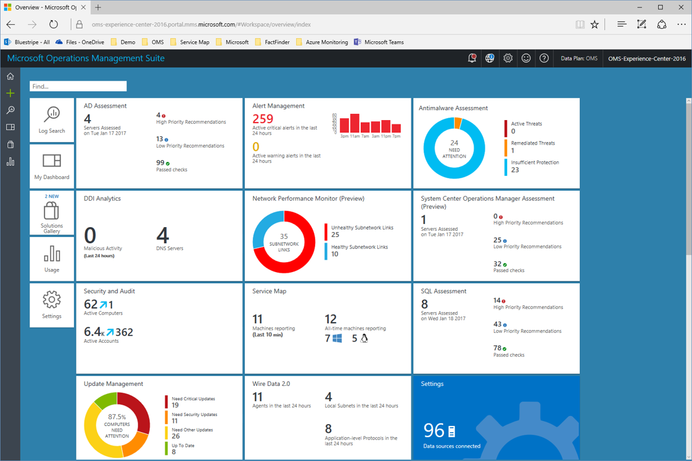

[click on Service Map]

[Click on the AcmeWFE001 machine in list on left]

Here’s a map of one of my web servers, and we can see the Acme App Pool running here, as well as all of this machine’s back-end dependencies.

[Click on the AcmeAppPool process]

By selecting the app pool, I can see path highlighting for just those dependencies for this one process, including my acmetomcat.

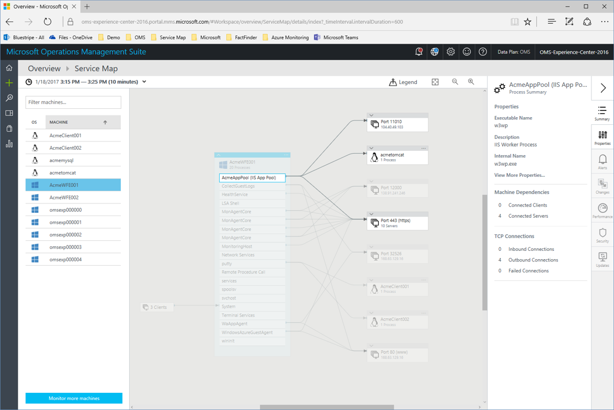

[Expand acmetomcat to show the Tomcat process]

By expanding this machine, I can see that my app pool depends on Tomcat running on that system. 

Now, I heard that customers starting having issues this morning around 3:00 am PST, so let’s change the time range.

[Select the time picker, and change to 3:00 am PST for 20 mins. You will need to adjust based on your local time range.]
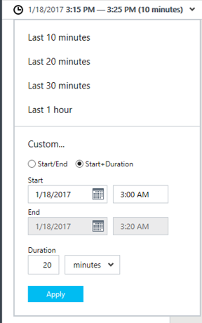

[when the map loads, there will be a small delay before the alert icon shows on the acmetomcat machine]

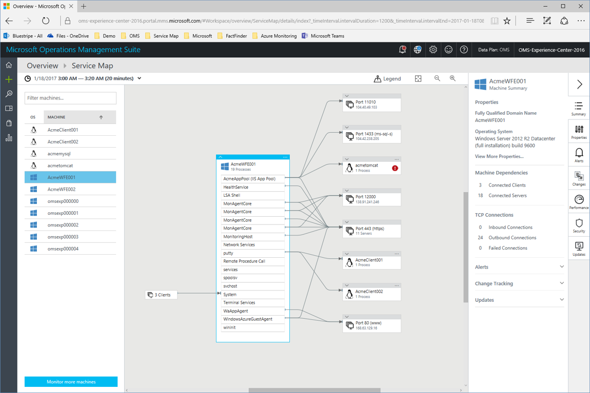

Now that I’ve loaded a broader time range, we can see if there are any issues on my web server or it’s back-end dependencies.

In fact, we can see that my app server has an alert.

[Expand the acmetomcat machine and click on the alert icon]

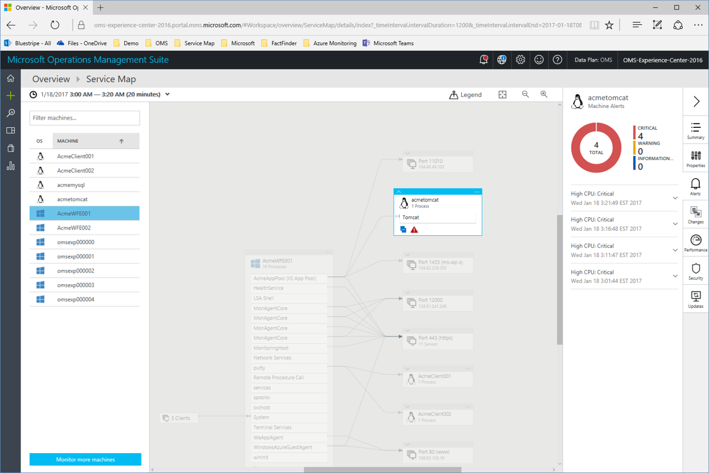

Here we can see that the app server is showing high CPU alerts. Given that, let’s take a closer look at that machine.

[Click on the … on the top right of the acmetomcat machine and select Load Server Map]

Looking at the app server, we can see our front-end web servers, back-end dependencies, and a failed connection shown by the dotted red lines coming from a backup process.

[Click on the Performance tab on the right]

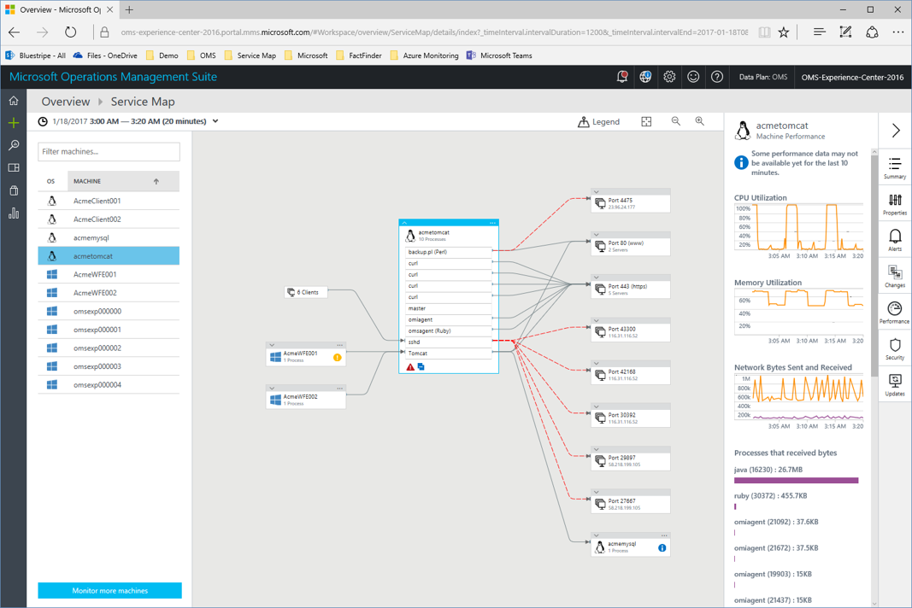

Here we can see the periodic spikes in CPU and memory for this machine, which clearly triggered the high CPU alerts.

[Click on the summary tab on the right panel]

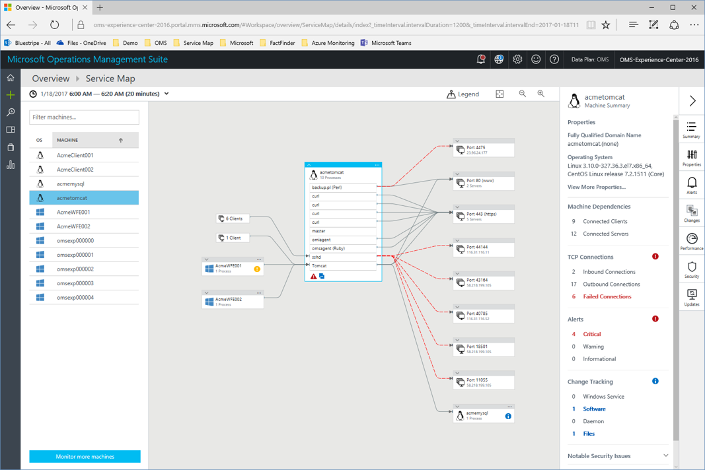

Looking at the summary we can see those failed connections, the critical alerts, and, interestingly, a software change was made.

[Click on the Software change highlighted in blue]

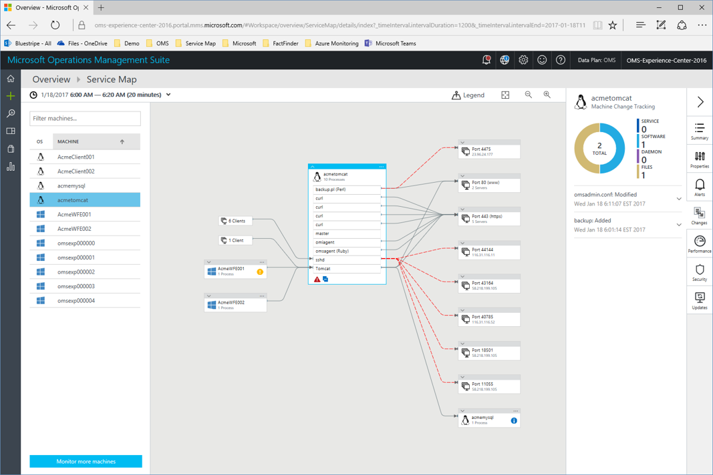

Looking at the changes for this system, we can see that someone added a backup process to the machine this morning.

I don’t know about you, but I don’t know many backup products written in Perl. 

This is starting to look suspicious. Let’s now take a closer look at the performance of this machine in Log Analytics. 

[Click on the alerts icon, then on one of the High CPU alerts nearest the bottom to expand it, and click the **Show in Log Search** link] 

[you will see the alert event in Log search, and now you talk about how you want to drill in and look at performance for that app server.]

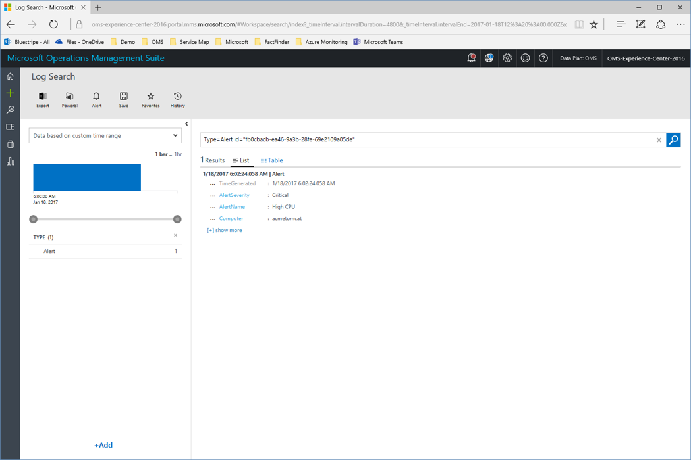

We know that we were seeing high CPU utilization for our acmetomcat machine, so let’s take a look at what might be causing this.

Let’s expand our time range to look at the last 6 hours and see what’s using CPU on acmetomcat.

[Change time range to last 6 hours, then click on Favorites, search for “Service Map”, and click on the Top 5 Processes by CPU for acmetomcat]

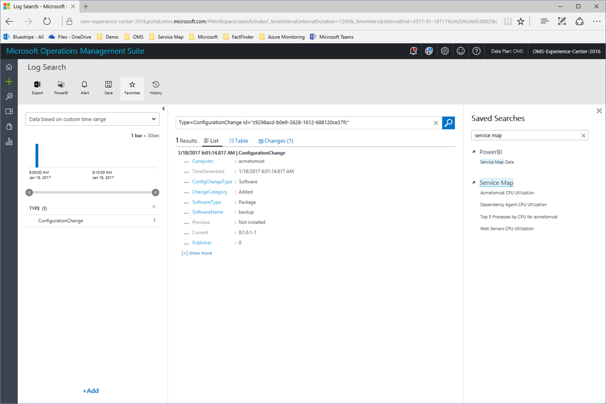

Here I’ve clicked on a saved search that will show me the top 5 processes on our app server based on process CPU utilization.

This clearly shows me that our backup process is consistently chewing up around 60% of the app server’s CPU.

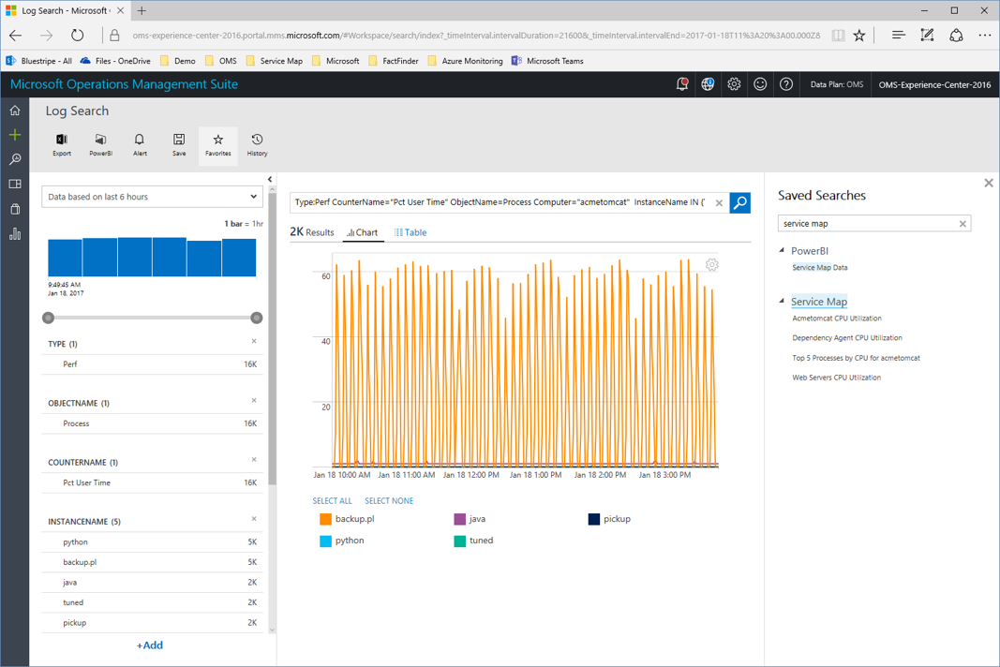

It’s time to get the app server admin to kill that process, and even better, using desired state configuration we could define policies to ensure this process never runs on these critical systems.

### Demo Conclusion
In summary, Service Map can help you see your whole application, from end-to-end, even if you don’t know which servers are in your app.

Service Map can then help you combine that dynamic dependency view with app and infrastructure data to help find problems whether they are in the app itself or the underlying infrastructure.
