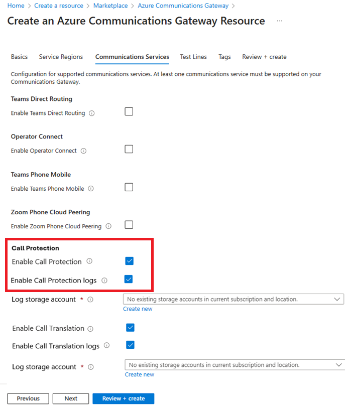

# Overview of deploying Azure Operator Call Protection

Azure Operator Call Protection is built on Azure Communications Gateway.
You need to deploy an Azure Communications Gateway resource and enable Azure Operator Call Protection to use this feature.

## Prerequisites

[!INCLUDE [operator-call-protection-tsp-restriction](includes/operator-call-protection-tsp-restriction.md)]

## Running Azure Operator Call Protection

[!INCLUDE [operator-call-protection-ucaas-restriction](includes/operator-call-protection-ucaas-restriction.md)]

The following articles explain how to deploy an Azure Communications Gateway resource.
When given the option, you must enable the Call Protection settings.

The connection to Azure Operator Call Protection is over SIPREC.
The Call Protection service takes the role of the SIPREC Session Recording Server (SRS).
An element in your network, typically a session border controller (SBC), is set up as a SIPREC Session Recording Client (SRC).

This SIPREC connection is different to other Azure Communication Gateway services - make sure that your network design takes this into account.

> TODO - fix picture below.

## Next step

> [!div class="nextstepaction"]
> [Prepare to deploy Operator Call Protection on Azure Communications Gateway](../communications-gateway/prepare-to-deploy.md?toc=/azure/operator-call-protection/toc.json&bc=/azure/operator-call-protection/breadcrumb/toc.json)
