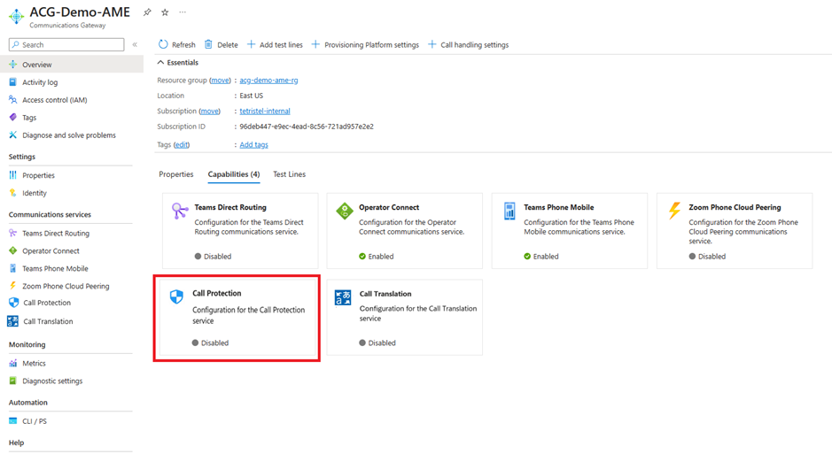

# Set up Azure Operator Call Protection

Before you can launch your Azure Operator Call Protection service, you and your onboarding team must:

- Provision your subscribers.
- Test your service.
- Prepare for launch.

In this article, you learn about the steps that you and your Azure Communications Gateway onboarding team must take.

> [!IMPORTANT]
> Some steps can require days or weeks to complete. We recommend that you read through these steps in advance to work out a timeline.

## Prerequisites

You must have completed the following procedures.

- [Prepare to deploy Azure Communications Gateway](../communications-gateway/prepare-to-deploy.md)
- [Deploy Azure Communications Gateway](../communications-gateway/deploy.md) - with Azure Operator Call Protection enabled

## Enable Azure Operator Call Protection

> [!NOTE]
> If you selected Azure Operator Call Protection when you [deployed Azure Communications Gateway](../communications-gateway/deploy.md), skip this step and go to [Provision subscribers](#provision-subscribers).

Navigate to your Azure Communications Gateway resource and find the "Call Protection" tab.
If it is currently set to Disabled, update it to be Enabled and notify your Microsoft onboarding team.

TODO: Replace this picture with the actual one.

## Provision subscribers

[!INCLUDE [operator-call-protection-sub-ucaas-restriction](includes/operator-call-protection-sub-ucaas-restriction.md)]

Proivsion your chosen subscribers with the Azure Operator Call Protection service on your subscribers by using the [Number Management Portal](../communications-gateway/manage-enterprise-operator-connect.md).

## Carry out integration testing and request changes

Network integration includes identifying SIP interoperability requirements and configuring devices to meet these requirements. For example, this process often includes interworking header formats and/or the signaling & media flows used for call hold and session refresh.

The connection to Azure Operator Call Protection is over SIPREC.  The Call Protection service takes the role of the SIPREC Session Recording Server (SRS).  An element in your network, typically a session border controller (SBC), is set up as a SIPREC Session Recording Client (SRC).

Work with your onboarding team to produce a network architecture plan where an element in your network can act as an SRC for calls being routed to your Azure Operator Call Protection enabled subscribers.

- If you decide that you need changes to Azure Communications Gateway, ask your onboarding team. Microsoft must make the changes for you.
- If you need changes to the configuration of devices in your core network, you must make those changes.

## Test raising a ticket

You must test that you can raise tickets in the Azure portal to report problems with Azure Communications Gateway. See [Get support or request changes for Azure Communications Gateway](../communications-gateway/request-changes.md).

## Learn about monitoring Azure Operator Call Protection

Your staff can use a selection of key metrics to monitor Azure Operator Call Protection through your Azure Communications Gateway. These metrics are available to anyone with the Reader role on the subscription for Azure Communications Gateway. See [Monitoring Azure Communications Gateway](../communications-gateway/monitor-azure-communications-gateway.md).

## Next steps

- Learn about [monitoring Azure Operator Call Protection with Azure Communications Gateway](../communications-gateway/monitor-azure-communications-gateway.md).
