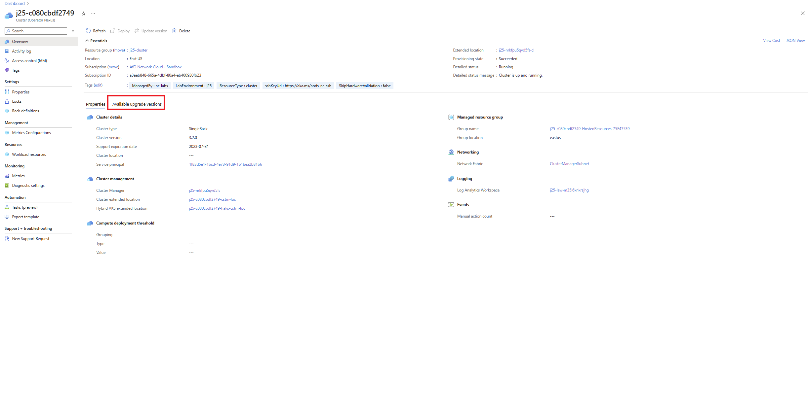
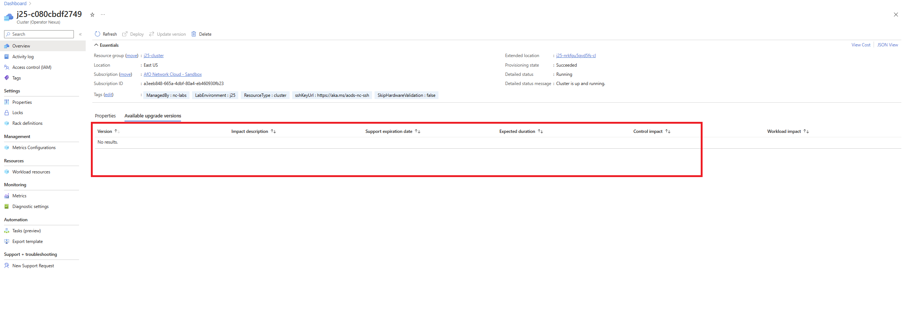
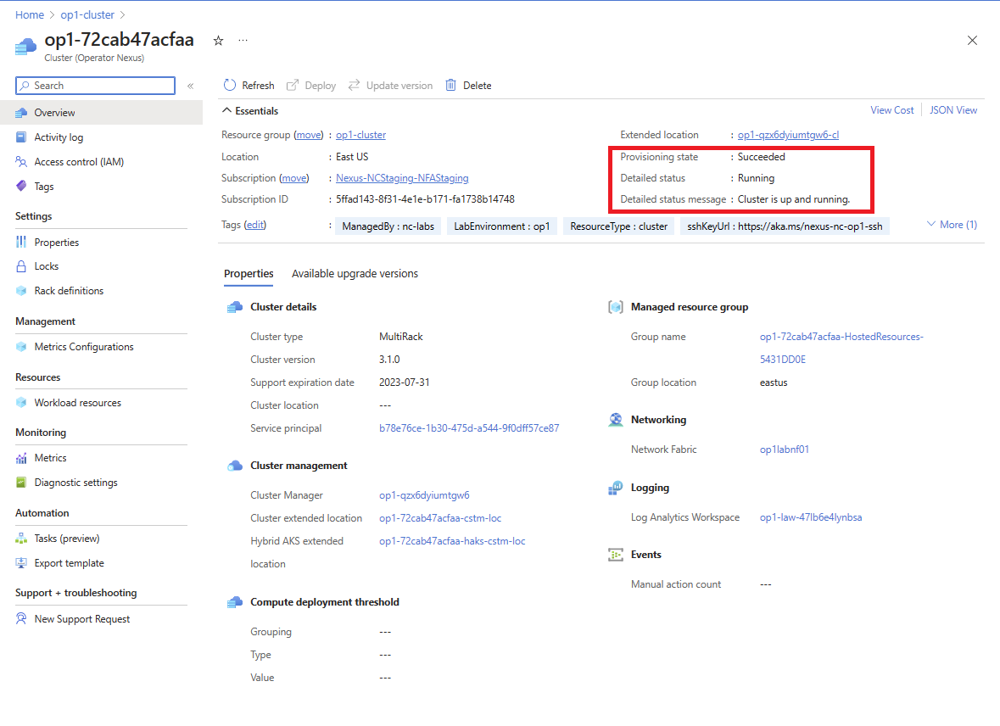

# Upgrading Platform Runtime from Azure CLI

This how-to guide explains the steps for installing the required az CLI and extensions required to interact with Operator Nexus.

If you haven't already installed the Azure CLI: [Install Azure CLI][installation-instruction]. The aka.ms links download the latest available version of the extension.

Installation of the `networkcloud` extension is required to run a version upgrade. If the `networkcloud` extension isn't installed, it can be installed following the steps listed [here](https://github.com/MicrosoftDocs/azure-docs-pr/blob/main/articles/operator-nexus/howto-install-cli-extensions.md).

## Finding available runtime versions

To find available upgradeable runtime versions, navigate to the target cluster in the Azure portal. In the cluster's overview pane, navigate to the ***Available upgrade versions*** tab.



From the **Available upgrade versions** tab, we're able to see the different cluster versions that are currently available to upgrade. To choose the target runtime version, and proceed to upgrade the cluster.



## Upgrading Runtime using CLI

Before executing the runtime upgrade, ensure that you're logged in to the same subscription as your target cluster via `az login`

To perform an upgrade of the runtime, use the following az CLI command:

```azurecli
az networkcloud cluster update-version --cluster-name "clusterName" --target-cluster-version
  "versionNumber" --resource-group "resourceGroupName"
```

The runtime upgrade is a long process. The upgrade is considered to be finished 80% of compute nodes and 75% of management/control nodes have been successfully upgraded.

Upgrading all the nodes can conservatively take 6 hours but can take more if other processes, like firmware updates, are also part of the upgrade.
Due to the length of the upgrade process, it's advised to check the Cluster's detail status periodically for the current state of the upgrade.
To check on the status of the upgrade observe the detailed status of the cluster. This check can be done via the portal or az CLI.

To view the upgrade status through the Azure portal, navigate to the targeted cluster resource. In the cluster's *Overview* screen, the detailed status is provided along with a detailed status message.



To view the upgrade status through the Azure CLI, use `az networkcloud cluster show`.

```azurecli
az networkcloud cluster show --cluster-name "clusterName" --resource-group "resourceGroupName"
```

The output should be the target cluster's information and the cluster's detailed status and detail status message should be present.

## Frequently Asked Questions

### Identifying Runtime Upgrade Timeout

During a runtime upgrade it's possible that the upgrade fails to move forward but, the detail status reflects that the upgrade is still ongoing. **Because the runtime upgrade may take a very large time to successfully finish, there is no set timeout length currently specified**.
Hence, it's advisable to also check periodically on your cluster's detail status and logs to determine if your upgrade is indefinitely attempting to upgrade.

We can identify when this is the case by looking at the Cluster's logs, detailed message, and detailed status message. If a timeout has occurred, we would observe that the Cluster is continuously reconciling over the same indefinitely and not moving forward. The Cluster's detailed status message would reflect, `"Cluster is in the process of being updated."`.
From here, we recommend checking Cluster logs or configured LAW, to see if there's failure, or a specific upgrade that is causing the lack of progress.

### Hardware Failure doesn't require Upgrade re-execution

If hardware failure during an upgrade has occurred, the runtime upgrade continues as long as the set thresholds are met for the compute and management/control nodes. Once the machine is fixed or replaced, it gets provisioned with the current platform runtime's OS, which contains the newer version of the runtime.

If a hardware failure occurs, and the runtime upgrade has failed because thresholds weren't met for compute and control nodes, re-execution of the runtime upgrade may be needed depending on when the failure occurred and the state of the node pool. If the node pool spec was updated before a failure, then the upgraded OS would be used when the nodes are reprovisioned.
If the node pool's spec wasn't updated to the upgraded OS before the hardware failure, the machine would be provisioned with the previous OS version. To upgrade to the new runtime version, a new ClusterUpdateVersionAction (CUVA) would need to be submitted. When the new CUVA is submitted, only the nodes with the previous OS version will upgrade Hosts that were successful in the previous upgrade action won't.
<!-- LINKS - External -->
[installation-instruction]: https://aka.ms/azcli
