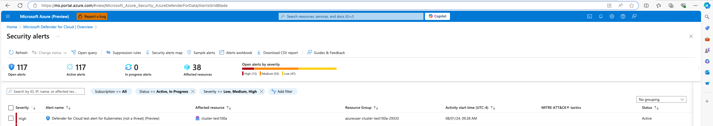

# Install Microsoft Defender for Containers on Azure Operator Nexus Kubernetes Cluster 

This article describes how to install Microsoft Defender for Containers inside a Nexus Kubernetes Cluster. [Microsoft Defender](/azure/defender-for-cloud/defender-for-cloud-introduction) can be used to monitor Kubernetes API Server audit logs and trigger alerts when appropriate. The audit logs are sent to the Defender backend and aren't directly accessible. They can't be queried through Kusto or in the Log Analytics Workspace associated with the installed Defender extension. Visit [Alerts for containers - Kubernetes clusters](/azure/defender-for-cloud/alerts-containers) for a list of alerts that are currently defined for Kubernetes Clusters.

## Prerequisites

Before proceeding with this how-to guide, it's recommended that you:

* Refer to the Operator Nexus Kubernetes cluster [QuickStart guide](./quickstarts-kubernetes-cluster-deployment-bicep.md) for a comprehensive overview and steps involved.
* Ensure that you meet the outlined prerequisites in the quickstart to ensure smooth implementation of the guide.

> [!NOTE]
> This guide assumes that you already have an existing Operator Nexus Kubernetes cluster that was created using the quickstart guide, and that you have access to the Azure CLI. Additionally, along with the networkcloud Azure CLI extension, the k8s-extension Azure CLI extension needs to be installed:

```
az extension add --name k8s-extension
```

## Installing Microsoft Defender for Containers in Nexus Kubernetes Cluster using Azure CLI

Reference the Microsoft Defender for Containers documentation to [install Defender](/azure/defender-for-cloud/defender-for-containers-enable?tabs=aks-deploy-portal%2Ck8s-deploy-cli%2Ck8s-verify-asc%2Ck8s-remove-arc%2Caks-removeprofile-api&pivots=defender-for-container-arc#use-azure-cli-to-deploy-the-defender-sensor) on a Nexus Kubernetes Cluster.

Refer to the Azure CLI command to install the extension in the provided link:

```azurecli
az k8s-extension create --name microsoft.azuredefender.kubernetes --cluster-type connectedClusters --cluster-name <cluster-name> --resource-group <resource-group> --extension-type microsoft.azuredefender.kubernetes
```

In the Azure CLI command, the cluster-name refers to the ARC connected cluster, of type Kubernetes - Azure ARC, representing the Nexus Kubernetes Cluster. As mentioned in the Microsoft Defender for Containers documentation, by default the Kubernetes API Server audit logs should exist in ```/var/log/kube-apiserver/audit.log``` otherwise the path to the audit log must be specified when installing Defender for Containers using the ```--auditLogPath``` flag. Reference the Microsoft Defender for Containers documentation previously linked for more detailed installation information and alternative methods of installation.

## Microsoft Defender for Containers Security Alert Simulation

Reference the documentation here on how to [simulate security alerts](/azure/defender-for-cloud/alert-validation#simulate-alerts-on-kubernetes-) for Microsoft Defender for Containers. This simulation has been performed on a Nexus Kubernetes Cluster and the corresponding alert appeared in the Microsoft Defender for Cloud Dashboard in the Azure portal:

[ ](media/defender-for-cloud-alerts.png#lightbox)