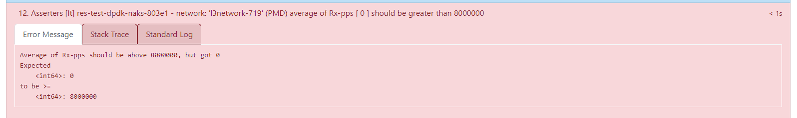
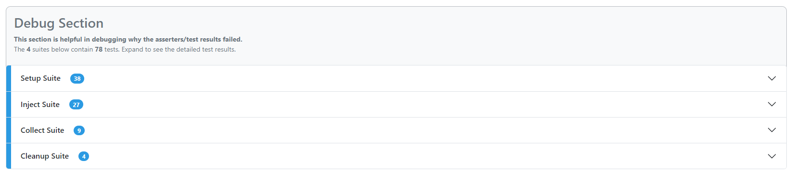

# Azure Operator Nexus Instance Readiness Test (IRT)

The Instance Readiness Test (IRT) framework is an optional/add-on tool for the Nexus platform. It enables operators to verify the successful deployment and readiness of the Azure Operator Nexus instance for workload deployment. This verification applies to both initial deployment and subsequent upgrades of the Nexus. It runs a series of tests and provides the test results as an html report.

## Key benefits

- Self-Service: IRT enables users to independently initiate and execute tests.
- Repeatable: Users can execute IRT on the Nexus instance multiple times to verify the reliability and consistency of test results.
- Abilities:
  - IRT provides generic functionality that all operators can use.
  - It enables validation of new Nexus deployments and post-upgrade states.
  - It allows testing of Network Function infrastructure components.
  - It facilitates workload deployment.
  - Users execute the IRT test framework using the command line and an input file. The framework then creates an Azure Container Instance in the customer's subscription.

## Tests executed with IRT
- Validate that l3 domains in the fabric subscription and resource group exist after all tests on the resources under test are done.
- Validate that there are l3 networks created in the testing resource group after all tests on the resources under test are done.
- Validate that FelixClusterNumHosts metric data is present within the last 10 minutes.
  Every average metric should be greater than 0.
- Validate that NodeOsInfo metric data for a baremetal machine is present within the last 10 minutes.
  Every count metric should be greater than 0.
- Test the transmission of IPv4 TCP data between two virtual machines using iPerf3 and affinity settings in the ARM template.
  The test ensures that the data throughput exceeds 60 Mbps.
- Test the transmission of IPv6 TCP data between two virtual machines using iPerf3 and affinity settings in the ARM template.
  The test ensures that the data throughput exceeds 60 Mbps.
- Test the transmission of IPV4 UDP data between two virtual machines using iPerf3 and affinity settings in the ARM template.
  The test ensures that the data throughput exceeds 1 Mbps.
- Test the transmission of IPV6 UDP data between two virtual machines using iPerf3 and affinity settings in the ARM template.
  The test ensures that the data throughput exceeds 1 Mbps.
- Test the transmission of IPV4 TCP data between two virtual machines using iPerf3 and anti-affinity settings in the ARM template.
  The test ensures that the data throughput exceeds 60 Mbps.
- Test the transmission of IPV6 TCP data between two virtual machines using iPerf3 and anti-affinity settings in the ARM template.
  The test ensures that the data throughput exceeds 60 Mbps.
- Test the transmission of IPV4 UDP data between two virtual machines using iPerf3 and anti-affinity settings in the ARM template.
  The test ensures that the data throughput exceeds 1 Mbps.
- Test the transmission of IPV6 UDP data between two virtual machines using iPerf3 and anti-affinity settings in the ARM template.
  The test ensures that the data throughput exceeds 1 Mbps.
- Test IPv4 ping between two virtual machines with jumbo frames enabled.
  Stderr should be empty and no packet loss should be observed.
- Test IPv6 ping between two virtual machines with jumbo frames enabled.
  Stderr should be empty and no packet loss should be observed.
- Validate IPV4 routes are configured correctly.
- Validate IPV6 routes are configured correctly.
- Validate that network interfaces are configured as expected.
- Validate DNS ability to resolve Azure Portal endpoint with nslookup.
- Validate dpdk-testpmd on L2 interface within NAKS cluster for vlan.
- Validate dpdk-testpmd on L2 interface within NAKS cluster, data captured for vlan.
- Validate dpdk-testpmd on trunk interface within NAKS cluster, data captured for trunk.
- Validate dpdk-testpmd on L3 interface within NAKS cluster, data captured for L3 network.
- Validate the status of all pods in NAKS cluster to be in 'Completed' or 'Running' state.
- Test IPv4 ping between a NAKS cluster pod and a VM with jumbo frames enabled.
  Stderr should be empty and no packet loss should be observed.
- Test IPv6 ping between a NAKS cluster pod and a VM with jumbo frames enabled.
  Stderr should be empty and no packet loss should be observed.
- Validate PVC has been created successfully.
- Validate PV has been created successfully.
- Test creating  a PVC with volumeMode Block and accessMode RWO.
- Validate that all the nexus-shared and nexus-volume volumes that were added are mounted in sts 0
- Validate that all the nexus-shared and nexus-volume volumes that were added are mounted in sts 1.
- Validate that nfs storage mounted on sts 0 is writable.
- Validate that nfs storage file written to sts 0 can be read.
- Validate that shared nfs storage mounted on sts 0 is writable.
- Validate that shared nfs file written to sts 0 can be read.
- Validate that nfs storage mounted on sts 1 is writable.
- Validate that shared file written to sts 0 can be read in sts 1
- Validate that shared nfs storage mounted on sts 1 is writable.
- Validate that shared file written to sts 0 and sts 1 can be read from sts 1.
- Validate that shared file written to in sts 0 and sts 1 can be read from sts 0.
- Validate that Block storage is mounted and writable.
- Validate that Block storage is mounted and can be read.
- Validate that Block storage is mounted and writable.
- Validate that Block storage is mounted and can be read.
- Validate deleting a PVC before removing the pod using it (scale down sts), remove pod naks-storage-statefulset-1.
- Validate that Block Storage PVC can be deleted.

## How to Run IRT

IRT requires gaining access to the software package hosted in the GitHub Nexus-Samples repository. Users should navigate to the 'Releases' section and choose the release with the 'latest' tag. A copy of this README is also available inside the release package for convenient reference in the execution environment.

### Request Access to Nexus-samples GitHub repository
-------------------------------------------------

For access to the nexus-samples GitHub repository

1. Link your GitHub account to the Microsoft GitHub Org <https://repos.opensource.microsoft.com/link>

2. Join the Microsoft Org <https://repos.opensource.microsoft.com/orgs/Microsoft/join>

3. Send an email request to be added to nexus-samples GitHub repo to afoncamalgamatesall\@microsoft.com

## Execution Details
<details>
<summary>Expand to see details for executing IRT. </summary>

## Environment Requirements

- A Linux environment (Ubuntu suggested) capable of calling Azure APIs
- Support for other Linux distros e.g. RedHat, Mariner, etc. depends on being able to install the necessary tooling. See [Install Dependencies](#install-dependencies) section.
  - Any machine that has the required packages installed should be able to use the scripts.
- Knowledge of networks to use for the test
  * Networks to use for the test are specified in a "networks-blueprint.yml" file, see [Input Configuration](#input-configuration).
- A way to download the IRT release package e.g. curl, wget, etc
- The ability to create a service principal with the correct roles
- The ability to read secrets from the KeyVault, see [Service Principal] (#create-service-principal-and-security-group) section for more details
- The ability to create security groups in your Active Directory tenant

## Input Configuration

Start by building your input file. The IRT tarball provides `irt-input.example.yml` as an example. Follow the [instructions](#download-irt) to download the tarball. Please note that these values **will not work for your instances**. You need to manually change them and rename the file to `irt-input.yml`. We provide the example input file as a stub to help you configure new input files. The example outlines overridable values and their usage. The **[One Time Setup](#one-time-setup)** assists you in setting input values by writing key/value pairs to the config file as they execute.

You can provide the network information in a `networks-blueprint.yml` file, similar to the `networks-blueprint.example.yml` that we provide, or append it to the `irt-input.yml` file. The `networks-blueprint.example.yml` defines the schema for IRT. The test creates the networks, so provide network details that aren't in use. Currently, IRT has the following network requirements:

* Three (3) L3 Networks
  * Two (2) of them with MTU 1500
  * One (1) of them with MTU 9000 and shouldn't have a fabric_asn attribute
* One (1) Trunked Network
* All VLANs should be greater than 500

## One Time Setup

### Download IRT
IRT is distributed via tarball from the release section of the [nexus-samples](https://aka.ms/nexus-irt) GitHub repo
1. Find the release package marked with 'Latest'. Download it, extract it, and navigate to the `irt` directory.
1. Extract the tarball to the local file system: `mkdir -p irt && tar xf nexus-irt.tar.gz --directory ./irt`
1. Switch to the new directory `cd irt`
1. See RELEASE-CHANGELOG.md for any notable updates or changes

### Install Dependencies
There are multiple dependencies expected to be available during execution. Review this list;

* `jq` version 1.6 or greater
* `yq` version 4.33 or greater
* `azcopy` version 10 or greater
* `az` Azure CLI, stay up to date. Minimum expected version: 2.11.0 (supports self upgrade)
* `elinks` - for viewing html files on the command line (Optional)
* `tree` - for viewing directory structures
* `moreutils` - for viewing progress from the Azure Container Instance (ACI) container

The `setup.sh` script is provided to aid with installing the listed dependencies. It installs any dependencies that aren't available in PATH. It doesn't upgrade any dependencies that don't meet the minimum required versions.

> **_NOTE:_**  `setup.sh` assumes a nonroot user and attempts to use `sudo`

### All-in-One Setup (Recommended)

`all-in-one-setup.sh` is provided to create all the Azure resources required to run IRT. This process includes creating a service principal, a security group, and isolation domains. Each of the scripts called in `all-in-one-setup.sh` can be individually executed. These scripts write updates to your `irt-input.yml` file with the key-value pairs needed to utilize the resources you created. Review the `irt-input.example.yml` file for the inputs required by one or more scripts, regardless of your chosen approach. All of the scripts are idempotent and allow you to use existing resources if desired.

### Step-By-Step Setup
<details>
<summary>Expand to see step-by-step setup. </summary>

> **_NOTE:_**  Use this section only if you're not using all-in-one.setup.sh

If your workflow is incompatible with `all-in-one-setup.sh`, each resource needed for IRT can be created manually with each supplemental script. Like `all-in-one-setup.sh`, running these scripts writes key/value pairs to your `irt-input.yml` for you to use during your run. These four scripts constitute the `all-in-one-setup.sh` script."

IRT makes commands against your resources and needs permission to do so. IRT requires a service principal to execute. It also requires that the service principal is a member of the Azure AD Security Group that is also provided as input.

### Authentication and Runtime Permissions

IRT requires a service principal with the correct permissions in order to interact with various Azure and NetworkCloud Resources.
</details>

#### Create Service Principal and Security Group
<details>
<summary>Expand to see how to create service principal and security group. </summary>

The supplemental script, `create-service-principal.sh` creates a service principal with these role assignments or add role assignments to an existing service principal. The following role assignments are used:

* `Contributor` - For creating and manipulating resources
* `Storage Blob Data Contributor` - For reading from and writing to the storage blob container
* `Azure ARC Kubernetes Admin` - For ARC enrolling the NKS cluster
* `ACR Pull` - For pulling Images from ACR
* `Key Vault Secrets User` - for reading secrets from a key vault

Additionally, the script creates the necessary security group, and adds the service principal to the security group. If the security group exists, it adds the service principal to the existing security group.

Executing `create-service-principal.sh` requires the input yaml to have the following properties, all of them can be overridden by the corresponding environment variables:
```yml
SERVICE_PRINCIPAL:
  NAME: "<name>" # env: SERVICE_PRINCIPAL_NAME
  AAD_GROUP_NAME: "<aad-group-name>" # env: SERVICE_PRINCIPAL_AAD_GROUP_NAME
  SUBSCRIPTION: "<subscription>" # env: SERVICE_PRINCIPAL_SUBSCRIPTION
  KV_NAME: "<keyvault>" # env: SERVICE_PRINCIPAL_KV_NAME
  KV_ID: <keyvault-secret> # env: SERVICE_PRINCIPAL_KV_ID
```
* `SERVICE_PRINCIPAL.NAME` - The name of the service principal, created with the `az ad sp create-for-rbac` command.
* `SERVICE_PRINCIPAL.AAD_GROUP_NAME` - The name of the security group.
* `SERVICE_PRINCIPAL.SUBSCRIPTION` - The subscription of the service principal.
* `SERVICE_PRINCIPAL.KV_NAME` - The KeyVault to store the service principal password.
* `SERVICE_PRINCIPAL.KV_ID` - The KeyVault secret where the service principal password is actually stored.

> **_NOTE:_** Please ensure that you have already created a KeyVault (KV_NAME) and/or a Secret (KV_ID) with a dummy value prior to executing `create-service-principal.sh`.
> The `az login` user (person executing IRT) should also be granted access to this KeyVault so secrets can be pulled at runtime.

```bash
# Example execution of the script
./create-service-principal.sh irt-input.yml
```

> **_NOTE:_** if all `SP_ID`,`SP_OBJECT_ID`,`SP_TENANT_ID`,`ADMIN_GROUP_OBJECT_ID`,`KV_NAME`,`KV_ID` are set in the yaml or as an environment variable the script skips creating them.

**RESULT:** This script prints values for `ADMIN_GROUP_OBJECT_ID`, `SP_ID`, `SP_OBJECT_ID`, `SP_TENANT`, `KV_NAME` and `KV_ID`; and sets the values back to the input yaml.
See [Input Configuration](#input-configuration).

```yml
SP_ID: "<generated-sp-id>"
SP_OBJECT_ID: "<generated-sp-object-id>"
SP_TENANT_ID: "<generated-sp-tenant-id>"
ADMIN_GROUP_OBJECT_ID: "<generated-aad-group-id>"
KV_NAME: "<provided-key-vault-name>" # If SP already exists please fill it in to retrieve the SP Password.
KV_ID: "<provided-key-valut-secret>" # If SP already exists please fill it in to retrieve the SP Password.
```
</details>

#### Creating a Custom Role for Execution
<details>
<summary>Expand to see details for using a custom role </summary>

If you have an existing service principal and would like the convenience of only having to assign one role for IRT execution, you can follow the steps below.

##### Prerequisites

- **Azure Subscription:** Ensure you have access to an Azure subscription.
- **Azure CLI:** Ensure Azure CLI exists on your local machine

##### Steps

1. Prepare Your Environment
   - Open a Bash Shell:
   - You can use any terminal that supports Bash.

1. Sign in to Azure:
   - Execute the following command to sign in to your Azure account:

    ```bash
    # Start az CLI session
    az login

    # Set active subscription using the UUID
    az account set --subscription "<your-subscription-id>"
    ```

1. Deploy the Template:

    Deploy your ARM template by running the following command. Replacing the example variable values with your actual values:

    ```bash
    # Set our variable values, these values are for the sake of example. Replace these values with your own as needed.
    location="eastus"
    deploymentName="IRTRoleDefinitionDeployment"
    templatePath="framework-templates/service-principal-roles.jsonc" # Path to the template file assuming the PWD is the root of the artifact tar
    roleName="Nexus Instance Readiness Tester"

    # run deployment
    az deployment sub create \
        --name "$deploymentName" \
        --location "$location" \
        --template-file "$templatePath" \
        --parameters roleName="$roleName"
    ```

1. Assign Role to Application Service Principal used for testing

   Weather created via the all-in-one setup or using your own, assign the newly created role to your identity, this single role provides all the necessary authorizations to run Instance Readiness Testing.

   ```bash
    # The Application ID of your Service Principal for your application
    appId="00000000-0000-0000-0000-000000000000"
    # this MUST match the deployment name used above.
    deploymentName="IRTRoleDefinitionDeployment"

    # This command gets the name of GUID of the role
    # az role definition list --name "$roleName" --query "[0].id" --output tsv | awk -F'/' '{print $NF}'

    # This command gets the GUID of the subscription
    # az account show --query id --output tsv --only-show-errors

    # Put together we create the role assignment;
    az role assignment create \
      --assignee "$appId" \
      --subscription "$(az account show --query id --output tsv --only-show-errors)" \
      --role "$(az role definition list --name "$roleName" --query "[0].id" --output tsv | awk -F'/' '{print $NF}')" \
      --scope "/subscriptions/$(az account show --query id --output tsv --only-show-errors)"

#### Create L3 Isolation Domains
<details>
<summary>Expand to see how to create l3 isolation. </summary>

The testing framework does not create, destroy, or manipulate isolation domains. Therefore, existing isolation domains can be used for execution. Each isolation domain requires at least one external network. The supplemental script, `create-l3-isolation-domains.sh`. Internal networks e.g. L3, trunked, etc. are created, manipulated, and destroyed through the course of testing.

Executing `create-l3-isolation-domains.sh` requires one **parameter**, a path to a file containing the networks requirements. You can choose either the standalone network-blueprint.yml or the input.yml based on your workflow, either can contain the information needed.

```bash
# Example of the script being invoked using networks-blueprint.yml:
./create-l3-isolation-domains.sh networks-blueprint.yml
```

```bash
# Example of the script being invoked using irt-input.yml:
# the network-blueprint should exist under NETWORK_BLUEPRINT node.
./create-l3-isolation-domains.sh irt-input.yml
```
</details>
</details>

## Execution

* This example assumes irt-input.yml is in the same location as irt.sh. If your file is located in a different directory, provide the full file path.

```bash
./irt.sh irt-input.yml
```

## How to Read the IRT Summary Results

The IRT summary page is a html page that can be downloaded after the
execution of the IRT and can be viewed from any browser.

IRT Summary Page comprises three major sections, which drills further to
provide more details.

- Test Results

- Debug Section

- Extras Section

The top of the Summary Results displays the Total tests run in the IRT
test suites, the number of extras sections and total number of tests
that passed and failed along with percentage value.

> **_NOTE:_**  The number of total tests depends on the version of IRT being
executed, different prerequisite test commands, so totals may not always be the same.


In case of any failures in the tests, the values represent accordingly.


### Test Results

The Test Results section provides all the tests (assertions) that IRT
executes. The Asserters section expands to view the list of tests
(assertions) that are run and available. Each asserter can be further
expanded that loads an accordion pane which provides more details of the
asserter, including the description of the test and any thresholds to be
measured and asserted against.

IRT asserters include the tests related to the following:

- Connectivity between resources -- NS (nslookup) and EW
    (pings/iperfs)

- Dual Stack support

- Iperf tests on IPv4 and IPv6

- MTUs 1500 and 9000

- DPDK throughputs measuring using PMDs

- Nexus Kubernetes cluster status

- Volume tests

  - PVCs in block and access mode

  - PVS write and read tests

### Display of Test Results

Display of Test results section with all successful tests:


In case of any failures, the asserts are highlighted in red.


### Interpretation of Asserter

Every asserter presents a significant title of the test and the
description of it under standard log.

An example of an Asserter:

*Asserters \[It\] res-test-dpdk-naks-84f5b - network: \'l3network-704\'
(**PMD) average of Rx-pps \[17668558\] should be greater than 8000000*

The above example of an assert reads as the Rx (receive)-pps (packets
per seconds) for l3network-704 is 17668558 which is greater than the
expected 8000000


A failed asserter is displayed in red and the Rx-pps value is expected
to be smaller in value than 8000000 pps received. The error is displayed
under the Error Message tab.



### Debug Section

The debug section serves to pinpoint the cause of asserter/test failures
for debugging purposes. It consists of four test suites and every suite
consists of the suite relevant tests that expand to provide details.
Failures of any specific tests are highlighted in red.

- Setup Suite - A common suite to deploy Nexus Resources as defined in
    the Arm Template required for the framework and tests.

- Inject Suite -- Injects the required environment variables and test
    data to support the testing of NAKS resources

- Collect Suite -- The collect suite collects the data published by
    the Setup Suite.

- Cleanup Suite -- Deletes the Nexus resources created for the tests
    after the data is collected.



## Extras Section

This is an information only section that provides additional details of
the Nexus platform. There are no assertions/tests that represent this
section. It helps operators to check the status of underlying cluster
resources and tenant resources running on the cluster after IRT is
executed.

Extras section consists of results displayed by running two different
text files separately.

- Platform Validation Results -- Displays the Nexus under cloud
    deployed resources details and their current statuses, including
    Cluster Manager details and its extensions, Fabric related details,
    Nexus cluster and its extensions, BareMetal Machines, Arc related
    and Storage appliances.

- Tenant workloads Validation Results -- Displays the Nexus tenant
    resources details and their current statuses running on the Nexus
    cluster, including displaying of L2 and L3 Isolation Domains, Cloud
    Service networks, default cni networks, L2 and L3 networks, trunked
    networks, available list of VMs and Nexus Kubernetes clusters.

## Troubleshooting

Asserters and debug sections with failures are effective troubleshooting
methods to address failures and technical problems.

If you still have questions, please [contact
support](https://portal.azure.com/?#blade/Microsoft_Azure_Support/HelpAndSupportBlade).
For more information about Support plans, see [Azure Support
plans](https://azure.microsoft.com/support/plans/response/)
