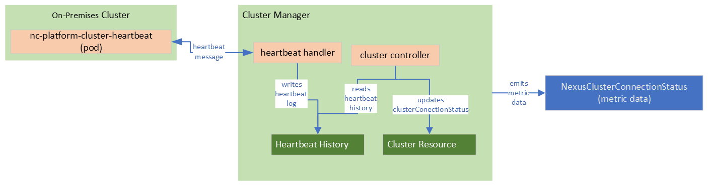

# Troubleshoot Cluster heartbeat connection status shows disconnected

This guide attempts to provide steps to troubleshoot a Cluster with a `ClusterConnectionStatus` in `Disconnected` state.
For a Cluster, the `ClusterConnectionStatus` represents the stability in the connection between the on-premises Cluster and its ability to reach the Cluster Manager.

> [!IMPORTANT]
> The `ClusterConnectionStatus` **doesn't** represent or is related to the health or connectivity of the Arc Connected Kubernetes Cluster.
> The `ClusterConnectionStatus` indicates that the Cluster is successful in sending heartbeats and receiving acknowledgment from the Cluster Manager.

[!include[prereqAzCLI](./includes/baremetal-machines/prerequisites-azure-cli-bare-metal-machine-actions.md)]

## Understanding the Cluster connection status signal

The `ClusterConnectionStatus` represents the ability of the on-premises Cluster to send heartbeats and receive acknowledgments from the Cluster Manager, indicating the health of the network connection between them.
`ClusterConnectionStatus` distinct from the connectivity of the Arc Connected Kubernetes Cluster, though network issues affect both.

A Cluster resource has the property `ClusterConnectionStatus` set to the value `Connected` as the heartbeats are continuously received and acknowledged.
The `ClusterConnectionStatus` becomes `Connected` once the Cluster is in a healthy state and network connectivity issues are resolved.
The Cluster shows `Timeout` only as a transitional state between `Connected` and `Disconnected`.
The Cluster `ClusterConnectionStatus` value becomes `Disconnected` as Cluster Manager detects continuously missed heartbeats.
Once the cluster is a healthy state and there no network connectivity issues, the `ClusterConnectionStatus` automatically moves to `Connected`

During the Cluster deployment process, the Cluster is in `Undefined` state until the Cluster is fully deployed and operational.

The following table shows the possible values of `ClusterConnectionStatus` and their definitions:

| Status         | Definition                                                                                                            |
|----------------|-----------------------------------------------------------------------------------------------------------------------|
| `Connected`    | Heartbeats received, indicates healthy cluster and cluster manager connectivity                                       |
| `Disconnected` | Heartbeats missed for **over 5 minutes**, indicates likely connectivity issue between Cluster Manager and Cluster     |
| `Timeout`      | Heartbeats missed for **over 2 minutes but less than 5 minutes**, cluster connectivity is uncertain possibly degraded |
| `Undefined`    | Cluster not yet deployed or running a version without the heartbeats feature                                          |

## Check the value of the Cluster's ClusterConnectionStatus property

The value of `ClusterConnectionStatus` is visible in the Azure portal in the Cluster resource view.

]

Or, you can use the Azure CLI to see the value of `ClusterConnectionStatus`:

```azurecli
az networkcloud cluster show \
  -g "$CLUSTER_RG" \
  -n "$CLUSTER_NAME" \
  --subscription "$SUBSCRIPTION_ID" \
  --query "{ClusterConnectionStatus:clusterConnectionStatus}" \
  --output table

ClusterConnectionStatus
-------------------------
Connected
```

## Understanding the NexusClusterConnectionStatus metric

Use Azure Resource Health to build alerts for cluster health, as it provides a comprehensive and supported view of resource status.
The `NexusClusterConnectionStatus` metric integrates into the Cluster's Azure Resource Health.
If you use the `NexusClusterConnectionStatus` metric directly, understand how it functions and what it represents.

The Cluster Manager, not the on-premises Cluster, emits the metric based on the `ClusterConnectionStatus` property.
A pod running on the on-premises Cluster sends heartbeat message to the Cluster Manager through the infrastructure proxy.
The metric emits a value of "1" for all time series. Starting from when the Cluster resource's connectionStatus is set for the first time.
The metric emitting process never sends "0" values. Any "0" values seen in graphs are due to graphing tools filling gaps.
The detection of state changes requires the Cluster Manager's reconciliation process to update the Cluster resource's `ClusterConnectionStatus` property accordingly.

There might be a delay between the actual loss of heartbeats and the metric reflecting the `Disconnected` state, due to the reconciliation loop and other operational factors.
The `NexusClusterConnectionStatus` metric is used as a health indicator for the cluster, but delays in status changes can occur due to reconciliation timing and operational constraints.
Timeout events can occur if heartbeats aren't received within a 2-minute threshold, but a single successful heartbeat resets the timer.
The status can transition between Connected, Timeout, and `Disconnected` based on heartbeat activity.

The image shows a general representation of the components responsible for emitting the `NexusClusterConnectionStatus` metric.

]

### ClusterConnectionStatus isn't the same as Arc Connected Cluster status

The Cluster's `ClusterConnectionStatus` and Arc Connected Cluster status are separate signals and shouldn't be treated interchangeably.
Although the two signals aren't related, both rely on network connectivity for the Cluster.
It's possible for a Cluster to be Arc `Disconnected` but still have a Heartbeat Status of `Connected`.
Both signals depend on network connectivity, but they serve different purposes and managed by different systems.

## Common investigation steps

Infrastructure networking issues, permission changes in the Managed Identity, or other issues that might not be obvious at first, affect the Cluster resource connection status.
The following sections provide some common investigation steps and references to help troubleshoot.

> [!IMPORTANT]
> The `ClusterConnectionStatus` indicates general instability, not the root cause.
> This guide provides general resource health checks that might help locate the problem or at least help collect information useful for customer support.

### Cluster Network Fabric health and connectivity

It's useful to start with the Network Fabric [controller][Network Fabric Controller] and [services][Network Fabric Services] resources.
Verify the [network configuration][How to Configure Network Fabric] or any other network-related settings that might be affecting the connectivity.
Verify the physical network setup including rack cabling, IP addresses, DNS settings, routing rules, firewall rules, etc.

[How to Configure Network Fabric]: ./howto-configure-network-fabric.md
[Network Fabric Controller]: ./concepts-network-fabric-controller.md
[Network Fabric Services]: ./concepts-network-fabric-services.md

Evaluate any configured monitoring or metrics for the Network Fabric resources.
For more information, see the following links:

- [Nexus Network Fabric configuration monitoring overview](./concepts-network-fabric-configuration-monitoring.md)
- [How to configure diagnostic settings and monitor configuration differences in Nexus Network Fabric](./howto-configure-diagnostic-settings-monitor-configuration-differences.md)
- [Azure Operator Nexus Network Fabric internal network BGP metrics](./concepts-internal-network-bgp-metrics.md)
- [How to monitor interface In and Out packet rate for network fabric devices](./howto-monitor-interface-packet-rate.md)

### Recent changes to the Managed Identity permissions

Changes to the Managed Identity permissions for the Cluster Manager or Cluster can affect the Cluster's ability to authenticate against the Cluster Manager.
The Managed Identities (MI) and their permissions are used for service-to-service authentication.
A change in the permissions results in authentication failures for the heartbeat messages.
Even when network connectivity is healthy the Cluster's `ClusterConnectionStatus` shows `Disconnected` when heartbeats aren't successfully received and acknowledged.

### Check control-plane BareMetal Machines health

The control-plane BareMetal Machines host the component that emits the heartbeats to the Cluster Manager.
In most cases, the pods running on the control-plane reschedule automatically to a different BareMetal Machine within the control-plane node pool.
However, if the BareMetal Machines aren't healthy, the pods can't reschedule and the Cluster is unable to send heartbeats.

To check the BareMetal Machines, use the following command:

```azurecli
az networkcloud baremetalmachine list \
  --resource-group "$CLUSTER_RG" \
  --cluster-name "$CLUSTER_NAME" \
  --subscription "$SUBSCRIPTION_ID" \
  --output table
```

Review the status of the control-plane BareMetal Machines. If any are unhealthy or unavailable, investigate further or contact support.

[!include[stillHavingIssues](./includes/contact-support.md)]
