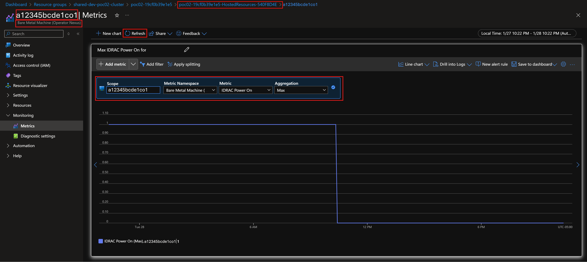

# Troubleshooting stuck (unable to reschedule) workloads in a Nexus Kubernetes Cluster

This guide provides detailed steps for troubleshooting issues related to stuck workloads on Nexus Kubernetes Cluster not-ready nodes. If you're experiencing these issues due to bare-metal node power failure, this guide helps you identify and resolve the problem.

## Prerequisites

* Permissions to view Azure resources in the subscription where the Nexus Kubernetes Cluster is deployed
* Access to Azure monitoring
* Necessary permissions to make changes using `kubectl` commands in Nexus Kubernetes Cluster (for example, deleting nodes)

## Symptoms

* Nexus Kubernetes Cluster nodes are not-ready
* Pods that aren't daemon-set pods stuck on the not-ready nodes

## Cause

Kubernetes, by design, doesn't move workloads that are stateful in nature if the node they're running on becomes not-ready. For more information, see [Kubernetes documentation](https://kubernetes.io/docs/concepts/cluster-administration/node-shutdown/#non-graceful-node-shutdown).

The Nexus Kubernetes Cluster not-ready node could be caused by a power failure on the bare-metal machine in the cluster. You can verify by checking the "Idrac Power On" metric in Azure monitoring. If you have alerts set up for this metric, you might have received an alert indicating that the bare-metal machines are powered off.

## Warning

### Nexus Kubernetes Cluster nodes Rack Spread

This guide requires deleting nodes from the Nexus Kubernetes Cluster. This action can cause Nexus Kubernetes Cluster nodes Rack Spread to be impacted.

### Host-Path storage

If the pods are configured to use host-path storage on the node, deleting the node deletes the data too.

## Solution

To resolve the issue, follow these steps:

1. Check the "Idrac Power On" metric in Azure monitoring to verify that the bare-metal machine is powered off. Following is an example screenshot of the metric in Azure monitoring:

   

2. If the "Idrac Power On" metric indicates that the bare-metal machine is powered on (showing a value of 1), **don't proceed with the following steps**.

3. If the "Idrac Power On" metric indicates that the bare-metal machine is powered off (showing a value of 0), take the following actions on all impacted Nexus Kubernetes Clusters within that environment:

   * Note down the name of the bare-metal machine that is powered off and managed-resource-group name. In the example screenshot in step 1, the machine name is `a12345bcde1co1` and managed-resource-group name is `poc02-19cf0b39e1e5-HostedResources-540F8D4E`. If this bare-metal machine is a compute node, then proceed with the following steps.
   * To find out impacted Nexus Kubernetes Clusters due to the powered-off bare-metal machine, run the following `az networkcloud` command:

     ```bash
     az networkcloud kubernetescluster list \
     --subscription <subscription-id> \
     --query "[?extendedLocation.name && contains(extendedLocation.name, '<managed-resource-group>') && nodes[? bareMetalMachineId == \`null\` || contains(bareMetalMachineId, '<powered-off-baremetal-machine-name>') && detailedStatus != 'Running']].{ClusterName: name}" \
     -o table
     ```
     Replace `<subscription-id>` with the subscription ID and `<managed-resource-group>` where the bare-metal machine is located and `<powered-off-baremetal-machine-name>` with the name of the powered-off bare-metal machine noted earlier.

     for example:
     ```bash
     az networkcloud kubernetescluster list \
     --subscription 00000000-0000-0000-0000-000000000000 \
     --query "[?extendedLocation.name && contains(extendedLocation.name, 'poc02-19cf0b39e1e5-HostedResources-540F8D4E') && nodes[? bareMetalMachineId == \`null\` || contains(bareMetalMachineId, 'a12345bcde1co1') && detailedStatus != 'Running']].{ClusterName: name}" \
     -o table
     ```
     **Note:** The prior command might return Nexus Kubernetes Clusters that aren't impacted by the powered-off bare-metal machine. Further steps help you identify the impacted Nexus Kubernetes Clusters.
   * If there are no Nexus Kubernetes Clusters in the list from prior command, then don't proceed with the next steps. However, if there are Nexus Kubernetes Clusters, run the following steps on each Nexus Kubernetes Cluster.
   * Run following `kubectl` command in the Nexus Kubernetes Cluster to get the list of all the nodes that are running on powered off bare-metal machines:

     ```bash
     kubectl get nodes -l topology.kubernetes.io/baremetalmachine=<powered-off-baremetal-machine-name>
     ```
      Replace `<powered-off-baremetal-machine-name>` with the name of the powered-off bare-metal machine noted earlier.

      for example:
      ```bash
      kubectl get nodes -l topology.kubernetes.io/baremetalmachine=a12345bcde1co1
      ```
      

      If prior command doesn't list any nodes, no further action is needed for the current Nexus Kubernetes Cluster.

      Don't proceed with the next steps until all of the nodes statuses are not-ready from prior command. If the nodes are ready, then wait and run the command again to check the status. When all the nodes statuses are not-ready, proceed to the next step.

   * Double check by refreshing the "Idrac Power On" metric in Azure monitoring to verify that the bare-metal machine is still powered off. If the machine is showing as **powered on, don't proceed with the next steps**. If the machine is still showing as powered off, proceed to the next step.
   * To delete the nodes that are not-ready, run following `kubectl` command in the Nexus Kubernetes Cluster:

      ```bash
      kubectl delete node -l topology.kubernetes.io/baremetalmachine=<powered-off-baremetal-machine-name>
      ```
      Replace `<powered-off-baremetal-machine-name>` with the name of the powered-off bare-metal machine noted earlier.

      for example:
      ```bash
      kubectl delete node -l topology.kubernetes.io/baremetalmachine=a12345bcde1co1
      ```
   * After you deleted the nodes, the workloads that were stuck on the not-ready nodes will be rescheduled to other nodes in the Nexus Kubernetes Cluster. **Note, this process might take upwards of 30 minutes to complete**. Additionally, new nodes are created to replace the deleted nodes automatically if there's enough capacity available in the cluster.
