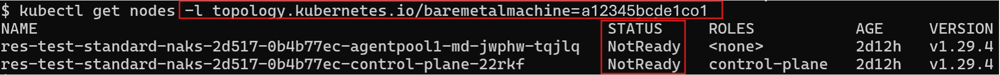
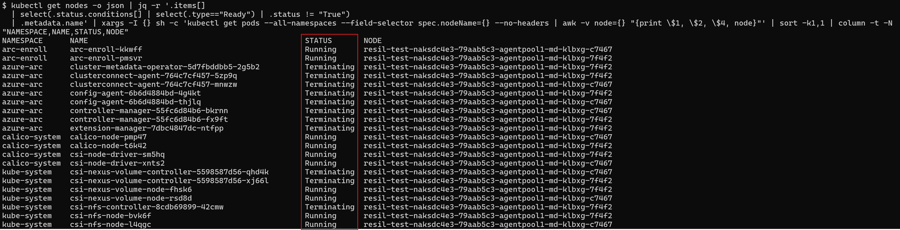
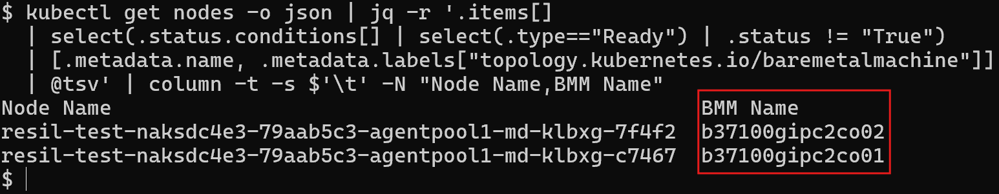
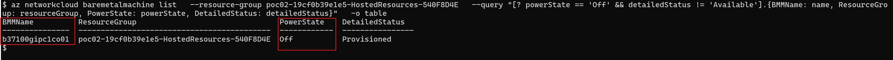

# Troubleshoot stuck (unable to reschedule) workloads in a Nexus Kubernetes Cluster due to power failure

What is a stuck workload?

A stuck workload is a pod that is unable to reschedule to another node in a Kubernetes Cluster due to the node being not-ready. This issue can happen due to many reasons, including node power failure.

Kubernetes, by design, doesn't move workloads that are stateful in nature if the node they're running on becomes not-ready (for example, due to power failure). For more information, see [Kubernetes documentation](https://kubernetes.io/docs/concepts/cluster-administration/node-shutdown/#non-graceful-node-shutdown).

This guide details troubleshooting steps for cases where workloads on a Nexus Kubernetes Cluster become stuck due to bare-metal machine power failures. It also explains how to restart a stuck pod so that it can be rescheduled on a different node.

## Prerequisites

* Permissions to view Azure resources in the subscription where the Nexus Kubernetes Cluster is deployed
* Necessary permissions to make changes using `kubectl` commands in Nexus Kubernetes Cluster (for example, deleting nodes)

## Diagnose stuck workloads

If you observe that your applications aren't responding as expected, your workloads might be stuck on the not-ready nodes. To diagnose stuck workloads on Nexus Kubernetes Cluster not-ready nodes, look for the following symptoms:

* To check if Nexus Kubernetes Cluster nodes are not-ready, run the following `kubectl` command in Nexus Kubernetes Cluster:

  ```bash
  kubectl get nodes | awk '$2 != "Ready" {print $1, $2}' | column -t
  ```
  

  If the command returns no results, then all the nodes are ready. Sometimes, nodes take a few minutes to become not-ready after the power failure, so you might need to run the command again after a few minutes. If nodes continue to show as ready even after reasonable time (5-10 mins) and your applications are still not responding, then the issue might be different, contact support for further assistance.

* To list pods stuck on the not-ready nodes, run the following `kubectl` command in Nexus Kubernetes Cluster:

   ```bash
   kubectl get nodes -o json | jq -r '.items[]
  | select(.status.conditions[] | select(.type=="Ready") | .status != "True")
  | .metadata.name' | xargs -I {} sh -c 'kubectl get pods --all-namespaces --field-selector spec.nodeName={} --no-headers | awk -v node={} "{print \$1, \$2, \$4, node}"' | sort -k1,1 | column -t -N "NAMESPACE,NAME,STATUS,NODE"
   ```
   This command returns pods (stateful and daemon-set) that are stuck on the not-ready nodes. Pods status might show `Pending`, `Terminating`, or `Running`.

   

## Diagnose power failure

Once you have confirmed that the workloads are stuck on the not-ready nodes, the next step will help you diagnose if Nexus Kubernetes Cluster nodes are not-ready due to power failure of one or more bare-metal machines.

To diagnose power failure on the bare-metal machine, look for the following symptoms:

* To list bare-metal machines where not-ready Nexus Kubernetes Cluster nodes are running, run the following `kubectl` command in the Nexus Kubernetes Cluster:

   ```bash
   kubectl get nodes -o json | jq -r '.items[]
  | select(.status.conditions[] | select(.type=="Ready") | .status != "True")
  | [.metadata.name, .metadata.labels["topology.kubernetes.io/baremetalmachine"]]
  | @tsv' | column -t -s $'\t' -N "Node Name,BMM Name"
   ```
   This command returns the list of nodes and the bare-metal machine name where the nodes are running.

   

* To list bare-metal machines in the cluster that are powered off, run the following command at cluster managed resource group level:

  ```bash
  az networkcloud baremetalmachine list \
  --subscription <subscription-id> \
  --resource-group <managed-resource-group> \
  --query "[? powerState == 'Off' && detailedStatus != 'Available'].{BMMName: name, ResourceGroup: resourceGroup, PowerState: powerState, DetailedStatus: detailedStatus}" \
  -o table
  ```
  Replace `<subscription-id>` with the subscription ID and `<managed-resource-group>` with the managed resource group of the cluster where bare-metal resources reside.

  for example:
  ```bash
  az networkcloud baremetalmachine list \
  --subscription 00000000-0000-0000-0000-000000000000 \
  --resource-group poc02-19cf0b39e1e5-HostedResources-540F8D4E \
  --query "[? powerState == 'Off' && detailedStatus != 'Available'].{BMMName: name, ResourceGroup: resourceGroup, PowerState: powerState, DetailedStatus: detailedStatus}" \
  -o table
  ```

  
  **Note:** This screenshot doesn't show subscription ID since it was already set in the Azure CLI session using `az account set --subscription <subscription-id>` command.

  If the command returns no results, rerun the command after a few minutes. If the command still returns no results after a reasonable time (5-10 mins) and your workloads are still stuck, then the issue might be different, contact support for further assistance.

Cross check the powered off bare-metal machines names with the list of bare-metal machines where not-ready nodes are running. If the bare-metal machines where not-ready nodes are running are powered off, then the issue is due to power failure. Now, you can proceed to the next section to resolve the issue.

## Warning

### Nexus Kubernetes Cluster virtual machine (VM) placement

This guide requires deleting nodes from the Nexus Kubernetes Cluster. This action can cause Nexus Kubernetes Cluster VMs rack placement to be impacted. For more information, see [how the Nexus platform schedules a Nexus Kubernetes Cluster VM](./concepts-nexus-kubernetes-placement.md#how-the-nexus-platform-schedules-a-nexus-kubernetes-cluster-vm).

### Host-Path storage

If the pods are configured to use host-path storage on the node, deleting the node deletes the data too.

## Solution

To move the stuck workloads to other nodes in the Nexus Kubernetes Cluster, you need to delete the Nexus Kubernetes Cluster nodes that are not-ready due to power failure. The workloads that are stuck on the not-ready nodes will be rescheduled to other nodes in the Nexus Kubernetes Cluster. Additionally, new nodes are created to replace the deleted nodes automatically if there's enough capacity available in the cluster.

   * From prior steps, note down the names of the powered-off bare-metal machines where the not-ready nodes are running.
   * To delete the nodes that are not-ready, run the following `kubectl` command in the Nexus Kubernetes Cluster **for each powered-off bare-metal machine**:

      ```bash
      kubectl delete node -l topology.kubernetes.io/baremetalmachine=<powered-off-baremetal-machine-name>
      ```
      Replace `<powered-off-baremetal-machine-name>` with the name of the powered-off bare-metal machine noted earlier.

      for example:
      ```bash
      kubectl delete node -l topology.kubernetes.io/baremetalmachine=b37100gipc1co01
      ```
   * After you deleted the nodes, the workloads that were stuck on the not-ready nodes should be rescheduled to other nodes in the Nexus Kubernetes Cluster. Run prior `kubectl` command for all remaining powered-off bare-metal machines noted earlier.
