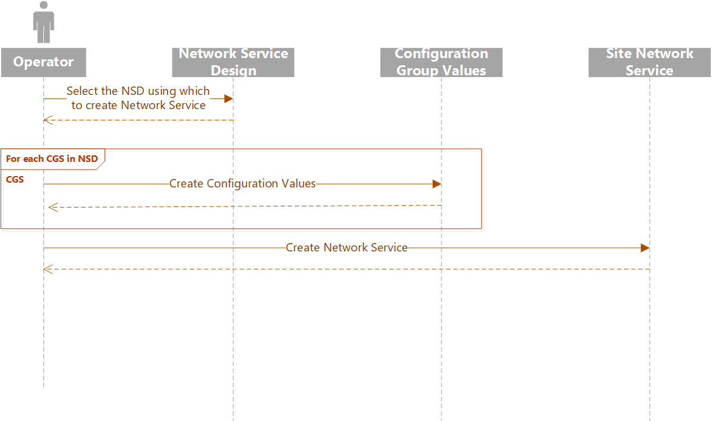

# Operator workflow

When telecom operators decide to instantiate a service within Azure, they must: 

- Choose the right version of the network service design (NSD) from the store available to them. 
- Supply the parameters required by the network service schema in configuration objects.
- Ask Azure Operator Service Manager to converge the system to match the specified version of the NSD together with the specified configuration objects, on each site.  

Azure Operator Service Manager validates that the parameters supplied match the configuration schemas referenced in the network service design. It then uses the mapping rules in the NSD to find out which resources should be created and instantiates them. 

 

## Operator workflow procedures
The operator workflow involves the following procedures:
- Operator selects the network service design version for creating the network service.
- Operator creates the configuration group values. Refer to [Define configurationGroupValues](./tutorial/create-site-network-service.md).
- Operator creates the site network service. Refer to the steps outlined in [Create a site network service](./tutorial/create-site-network-service.md).

## Next steps

- [Create a site](./tutorial/create-site.md)
- [Create a site network service](./tutorial/create-site-network-service.md)
