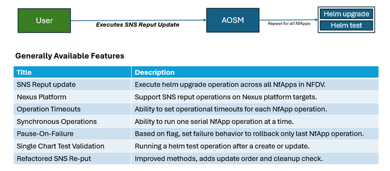
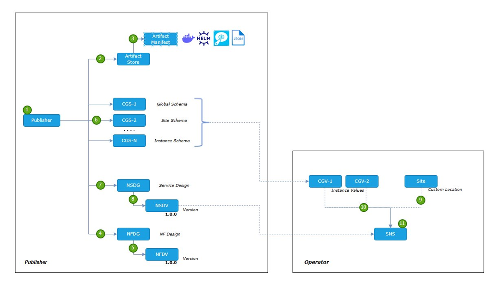
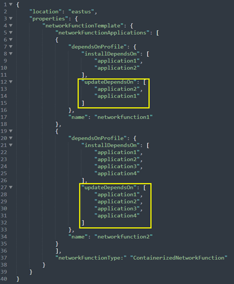
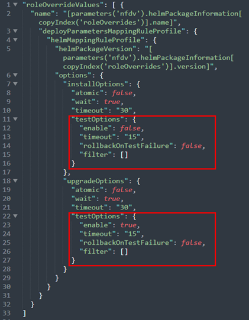
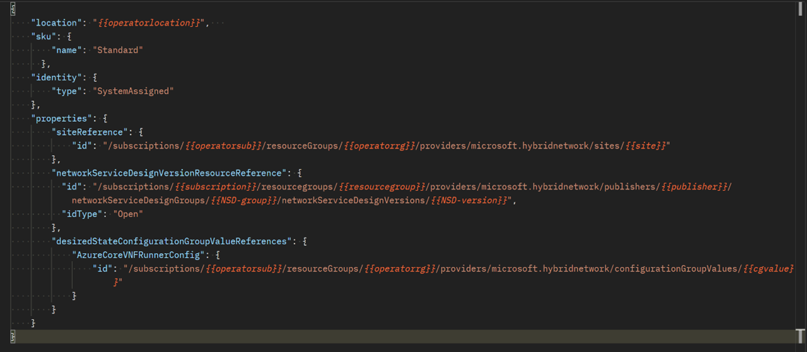
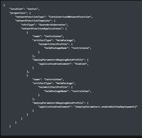
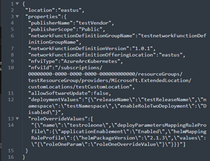

# Getting Started with Safe Upgrade Practices

This article introduces Azure Operator Service Manager (AOSM) safe upgrade practices (SUP). This feature-set enables an end-user to safely execute complex upgrades of CNF workloads hosted on Azure Operator Nexus, in compliance with partner ISSU requirements, where applicable. Look for future articles in these services to expand on SUP features and capabilities.

## What Are Safe Upgrade Practices 

A given network service supported by Azure Operator Service Manager will be composed of one-to-many container-based network functions (CNFs) which, over time, will require frequent software updates. For each CNF update, it is necessary to run one-to-many helm operations, upgrading dependent network function applications (NfApps), in a particular order, in a manner which least impacts the network service. At Azure Operator Service Manager, Safe Upgrade Practices represents a set of features, which can automate the CNF operations required to update a network service on Azure Operator Nexus.
  

## Safe Upgrade Practices Overview

To update an existing Azure Operator Service Manager site network service (SNS), the Operator executes a reput update request against the deployed SNS resource. Where the SNS contains CNFs with multiple NfApps, the request is fanned out across all NfApps defined in the network function definition version (NFDV). By default, in the order, which they appear, or optionally in the order defined by UpdateDependsOn parameter.

For each NfApp, the reput update request supports increasing a helm chart version, adding/removing helm values and/or adding/removing any NfApps. Timeouts can be set per NfApp, based on known allowable runtimes, but NfApps can only be processed in serial order, one after the other. When processing each NfApp, the reput update applies the following logic:

* For an NFApp with applicationEnablement set to false, skip.
* For an NFApp, which is common between old and new network function definition version (NFDV), trigger upgrade component.
* For an NFApp, which is added in new NFDV, trigger create component.

To ensure outcomes, NfApp testing is supported using helm, either helm upgrade pre/post tests, or standalone helm tests. For pre/post tests failures, the atomic parameter is honored. With atomic/true, the failed chart is rolled back. With atomic/false, no rollback is executed. For standalone helm tests, the rollbackOnTestFailure parameter us honored. With rollbackOnTestFailure/true, the failed chart is rolled back. With rollbackOnTestFailure/false, no rollback is executed.

## Safe Upgrade Practices - Prerequisites
When planning for an upgrade using Azure Operator Service Manager, address the following requirements in advance of upgrade execution to optimize the time spent attempting the upgrade.

- Onboard updated artifacts using publisher and/or designer workflows.
  - Publisher, store, network service design (NSDg), and network function design group (NFDg) are static and do not need to change.
    - A new artifact manifest is needed to store the new charts and images. For more information, see onboarding documentation for details on uploading new charts and images.
  - New NFDV and network service design version (NSDV) are needed, under existing NFDg and NSDg.
    - We cover basic changes to the NFDV in the step-by-step section.
    - New NSDV is only required if a new configuration group schema (CGS) version is being introduced.
  - If neccesary, new CGS.
    - Required if an upgrade introduces new exposed configuration parameters. 

- Create updated artifacts using Operator workflow.
  - If neccesary, create new configuration group values (CGVs) based on new CGS.
  - Reuse and craft payload by confirming the existing site and site network service objects.

- Update templates to ensure that upgrade parameters are set based on confidence in the upgrade and desired failure behavior.
  - Settings used for production may suppress failures details, while settings used for debugging, or testing, may choose to expose these details.

### Safe Upgrade Practices - Step-by-Step Upgrade Procedure
Follow the following process to trigger an upgrade with Azure Operator Service Manager.

#### Create new NFDV template with higher version.

When selecting a new NFDV version, it must be a valid SemVer format, where only incrementing values of patch and minor versions updates are allowed. A lower NFDV version is not allowed. Given a CNF deployed using NFDV 2.0.0, the new NFDV can be of version 2.0.1, or 2.1.0, but not 1.0.0, or 3.0.0. 

#### Update new NFDV Helm parameters to desired target version.

Helm chart versions can be updated, or Helm values can be updated or parameterized as necessary. New NfApps can also be added where they did not exist in deployed version.

#### Update NFDV for desired NfApp order using UpdateDependsOn

UpdateDependsOn is a NFDV parameter used to specify ordering of NfApps during update operations. If UpdateDependsOn is not provided, serial ordering of CNF applications, as appearing in the NFDV is used. See following dependsOnProfile example.

#### Update NFDV roleOverrideValues for desired upgrade behavior.

Make sure to set any desired CNF application timeouts, the atomic parameter, and rollbackOnTestFailure parameter. It may be useful to change these parameters over time as more confidence is gained in the upgrade.

#### Issue SNS Re-Put

With onboarding complete, the Re-Put operation is submitted. Depending on the number, size and complexity of the NfApps, the reput operation could take some time to complete (multiple hours).

#### Examine Re-Put Results

If the reput is reporting a successful result, the upgrade is complete and the user should validate the state and availability of the service. If the reput is reporting a failure, follow the steps in the upgrade failure recovery section to continue.

###  Safe Upgrade Practices - Step-by-Step Retry Procedure

In cases where a reput update fails, the following process can be followed to retry the operation.

#### In there is failure, diagnose failed NfApp.

Resolve the root cause for NfApp failure by analyzing logs and other debugging information.

#### Manually skip completed charts using applicationEnablement parameter.

After fixing the failed NfApp, but before attempting an upgrade retry, consider changing the applicationEnablement parameter to accelerate retry behavior. This parameter can be set false, where an NfApp should be skipped. This parameter can be usefuel where an NfApp does not require an upgraded. See the appendix for more information on manipulating the applicationEnablement flag.

#### Issue SNS Re-Put retry (repeat until success)

By default, the Re-Put retries NfApps in the declared update order, unless they are skipped using applicationEnablement flag.

## Safe Upgrade Practices - Next Steps

Azure Operator Service Manager continues to grow the Safe Upgrade Practice feature set and drive improvements into offered update services. The following features are presently under consideration for future availability:

* Improve Upgrade Options Control - Expose parameters more effectively.
* Skip NfApp on No Change - Skip processing of NfApps where no changes result.
* Exeute NFDV Rollback On Failure - Based on flag, rollback all completed NfApps on failure.
* Operate Asynchronously - Ability to run multiple NfApp operations at a time.
* Download Images- Ability to preload images to edge repository.
* Target Charts for Validation - Ability to run a helm test only on a specific NfApp.

## Appendix A - Using applicationEnablement

In the NFDV resource, under deployParametersMappingRuleProfile there is the property applicationEnablement of type enum, which take values: Unknown, Enabled, or disabled. It can be used to exclude NfApp operations during NF deployment.

### Publisher

For the applicationEnablement property, the publisher has two options: either provide a default value or parameterize it. In the following example, applicationEnablement is parameterized for the NfApp testroletwoso so that it's value is provided by the operator at run-time.

### Operator

Operators specify applicationEnablement as defined by the NFDV. If applicationEnablement for specific application is parameterized, then it must be passed through the deploymentValues property at run-time. The following example shows deploymentValues enableRoleTwoDeployment property set. Also show is how Operators can override any applicationEnablement value using the roleOverrideValues property.

## Appendix B - Support for In-Service upgrades (ISSU)

Azure Operator Service Manager, where possible, supports in-service upgrades, an upgrade method which advances a deployment version without interrupting the service. However, the ability for a given service to be upgraded without interruption is a feature of the service itself. Consult further with the service publisher to understand the in-service upgrade capabilities.
