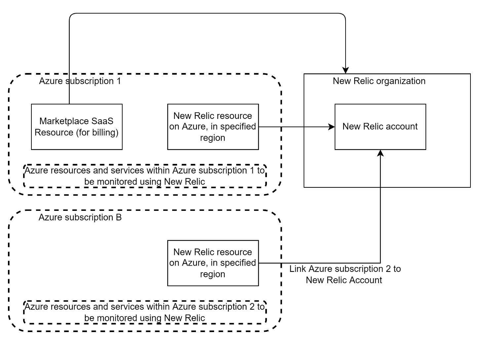
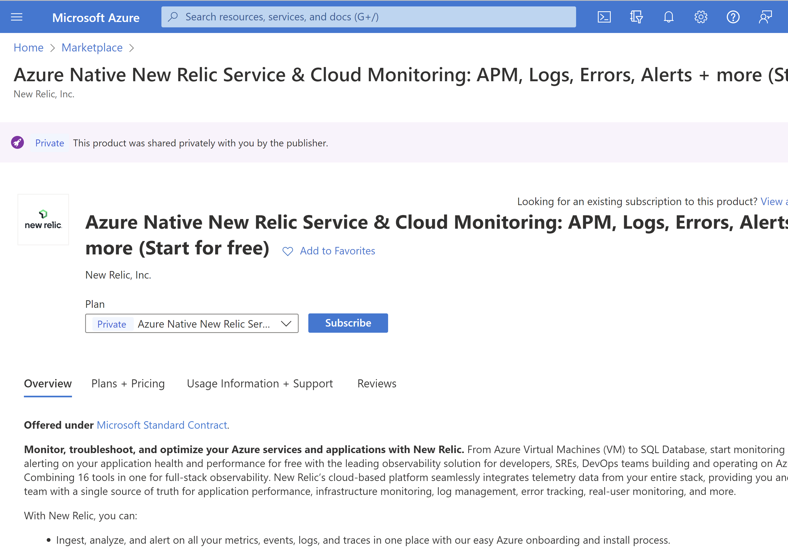
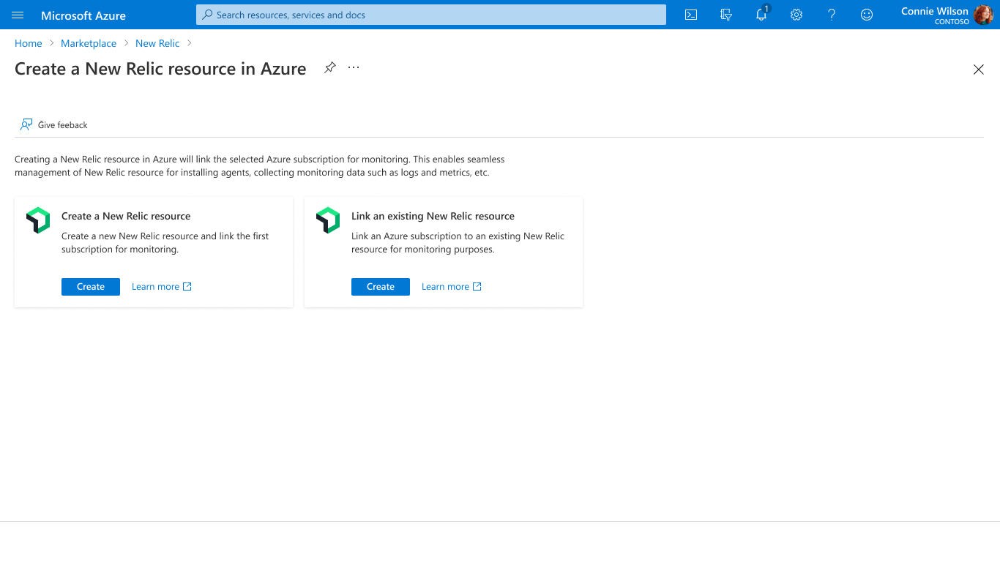
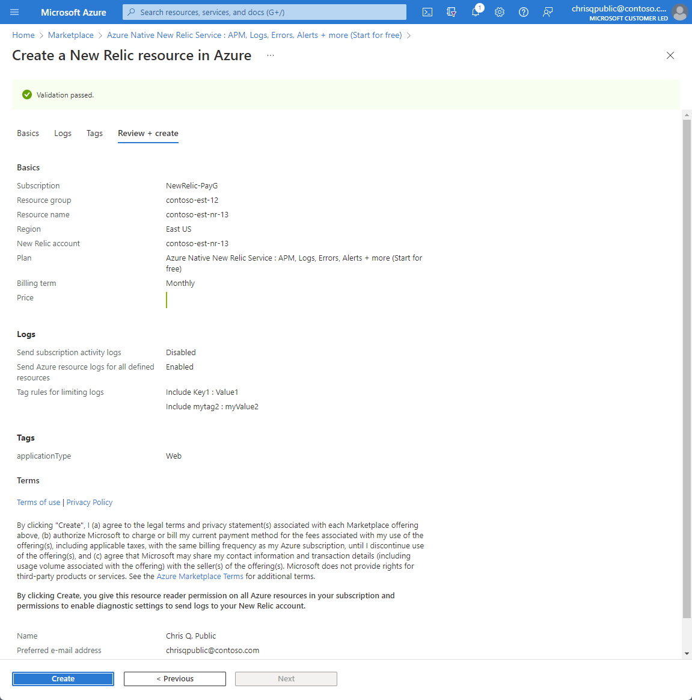
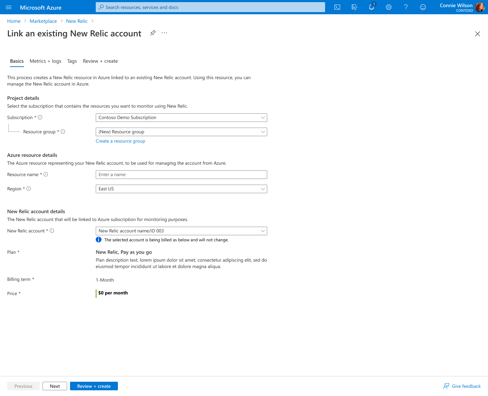
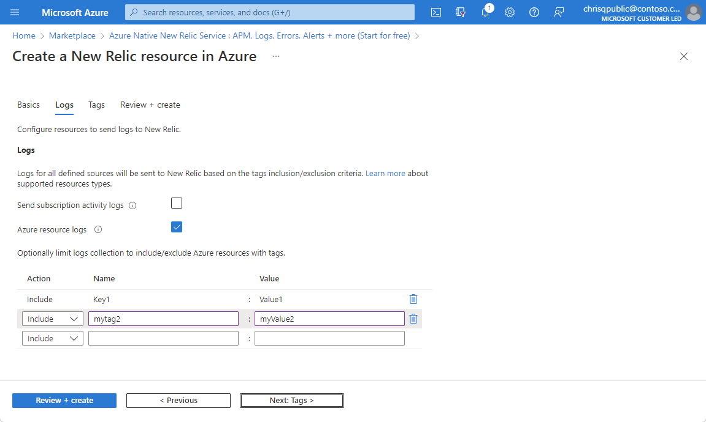
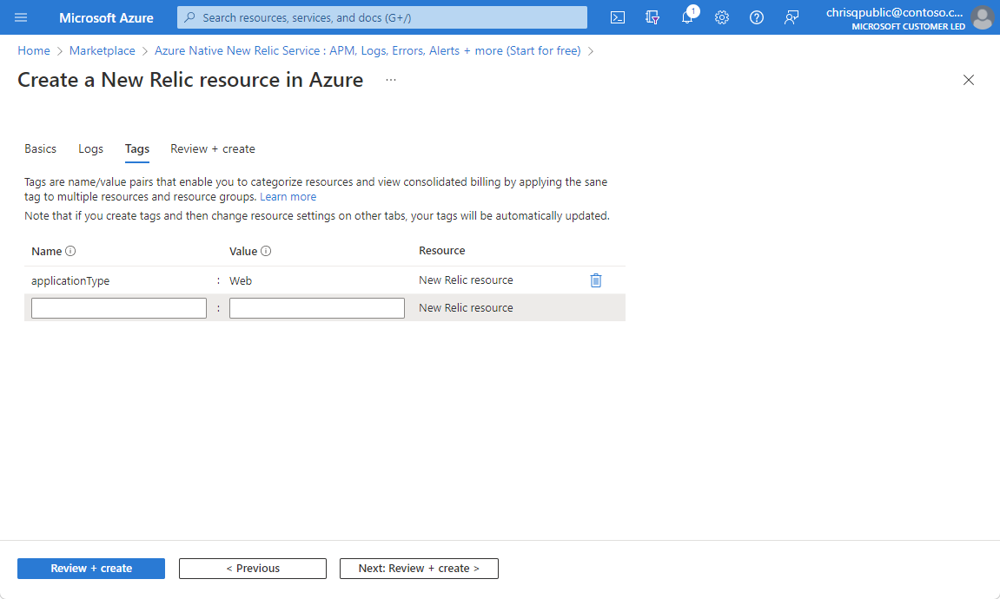
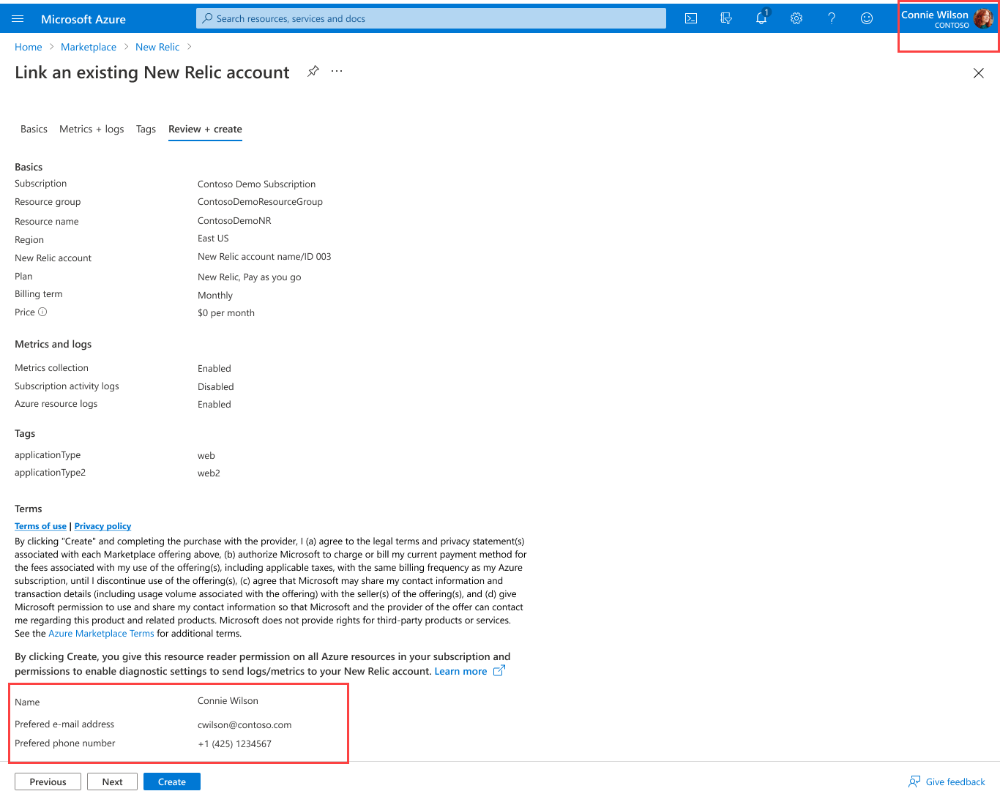

# QuickStart: Link to an existing New Relic account

In this QuickStart, you link an Azure subscription to an existing New Relic account. After linking to the New Relic account, you can monitor the linked Azure subscription and the resources in that subscription using the New Relic account.

> [!NOTE]
> You can link New Relic accounts that have been previously created via Azure Native New Relic Service or from the New Relic portal.

When you use Azure Native New Relic Service in the Azure portal to linking where both the organization and account at New Relic were created using the Azure Native New Relic Service, your billing and monitoring for the following entities is tracked in the portal.

- New Relic resource in Azure: Using the New Relic resource, you can manage the New Relic account in Azure. The resource is created in the Azure subscription and resource group that you select during the linking process.
- New Relic account: the New Relic account on New Relic SaaS. When you choose to link an existing account, a New Relic resource is created in Azure. The New Relic account and the New Relic resource must reside in the same region.
- New Relic organization: the New Relic organization on New Relic SaaS, which is used for user management and billing.
- Marketplace SaaS resource: the SaaS resource is used for billing purposes. The SaaS resource typically resides in a different Azure subscription from where the New Relic account was first created.

> [!NOTE]
> The Marketplace SaaS resource is only set up when the New Relic organization was created using the Azure Native New Relic Service. If your New Relic organization was created directly from New Relic portal, the Marketplace SaaS resource would not exist, and your billing would be managed by New Relic.

## Find Offer

1. Use the Azure portal to find Azure Native New Relic Service. Go to the [Azure portal](https://portal.azure.com/) and sign in.

1. If you've visited the Marketplace in a recent session, select the icon from the available options. Otherwise, search for Marketplace.

1. In the Marketplace, search for New Relic.
   

1. When you have found Azure Native New Relic Service In the working pane, select **Subscribe**.

   

## Link to existing New Relic account

1. When creating a New Relic resource, you see two options: **Create a New Relic account** and **Link an existing New Relic resource**. In this example, you're linking the Azure subscription to an existing New Relic account. Select **Link an existing New Relic resource** from the two options. 

   

1. The process creates a New Relic resource in Azure and links it to an existing New Relic account. You see a form to create the New Relic resource in the working pane.

    

1. Provide the following values.

   |Propert |  Description |
   |---|---|
   | **Subscription**  | Select the Azure subscription you want to use for creating the New Relic resource. This subscription will be linked to account for monitoring purposes.|
   | **Resource group**  | Specify whether you want to create a new resource group or use an existing one. A [resource group](/azure-resource-manager/management/overview) is a container that holds related resources for an Azure solution.|
   | **Resource name**  | Specify a name for the New Relic resource.|
   | **Region**  |Select the Azure region where the New Relic resource should be created.|
   | **New Relic account**  |The Azure portal displays a list of existing accounts that can be linked. Select the desired account from the available options.|

1. If the New Relic account you selected has a parent New Relic organization, then it was created using the Azure Native New Relic Service, and you see the New Relic account details for your reference.

    

   > [!NOTE]
   > Linking requires that the account and the New Relic resource reside in the same Azure region. 
   >
   > The user that is performing the linking action should have Global administrator permissions on the New Relic account being linked. If the account that you want to link to doesn't appear in the dropdown list, check t see if any of these conditions aren't satisfied.
    
1. Select **Next** to move to configure metrics and logs.

## Configure metrics and logs

Your next step is to configure metrics and logs. When linking an existing New Relic account, you can set up automatic log forwarding for two types of logs:

- **Subscription activity logs**: 
  - These logs provide insight into the operations on your resources at the [control plane](/azure-resource-manager/management/control-plane-and-data-plane). Updates on service-health events are also included. Use the activity log to determine what, who, and when for any write operations (PUT, POST, DELETE). There's a single activity log for each Azure subscription.

- **Azure resource logs**:
    -  These logs provide insight into operations that were taken on an Azure resource at the [data plane](/azure-resource-manager/management/control-plane-and-data-plane). For example, getting a secret from a Key Vault is a data plane operation. Or making a request to a database is also a data plane operation. The content of resource logs varies by the Azure service and resource type.

To send Azure resource logs to New Relic, select Send Azure resource logs for all defined resources. The types of Azure resource logs are listed in [Azure Monitor Resource Log categories](/azure-monitor/essentials/resource-logs-categories).

When the checkbox for Azure resource logs is selected, by default, logs are forwarded for all resources. To filter the set of Azure resources sending logs to New Relic, use inclusion and exclusion rules and set the Azure resource tags:

- All Azure resources with tags defined in include Rules send logs to New Relic.
- All Azure resources with tags defined in exclude rules don't send logs to New Relic.
- If there's a conflict between an inclusion and exclusion rule, the exclusion rule applies.

The logs sent to New Relic are charged by Azure. For more information, see the [pricing of platform logs](https://azure.microsoft.com/pricing/details/monitor/) sent to Azure Marketplace partners.

Metrics for virtual machines and App Services can be collected by installing the New Relic Agent after the New Relic resource has been created and an existing New Relic account has been linked to it.

Once you have completed configuring metrics and logs, select **Next** to add Tags.

## Add tags

1. You can add tags for your New Relic resource. Provide name and value pairs for the tags to apply to the New Relic resource.

    

1. When you have finished adding tags, select **Next** to proceed to **Review + Create**.

## Review and create

1. Review your selections and the terms of use. 

  

1. After validation completes, select **Create**. Azure deploys the New Relic resource. When the process completes, select **Go to resource** to see the New Relic resource.

## Next steps

- [Manage the New Relic resource](new-relic-how-to-manage.md)
- [QuickStart: Get started with New Relic](new-relic-create.md)

