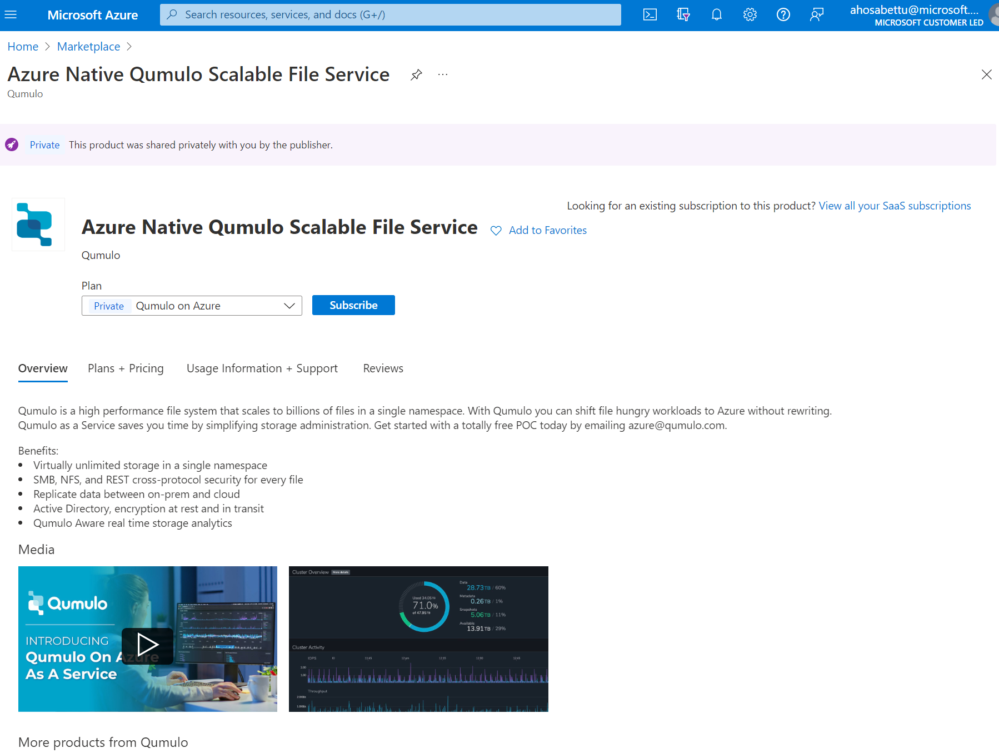

# QuickStart: Get started with Azure Native Qumulo Scalable File Service

In this quickstart, you create a new instance of Azure Native Qumulo Scalable File Service. When you create the service, the following entities are created and mapped to a Qumulo File System Namespace :

- Delegated subnet: The delegated subnet enables the Qumulo service to inject service endpoints (eNICs) into your virtual network.
- Managed resource group: Managed resource group contains internal networking and other resources required for Qumulo filesystem to work.
- Qumulo resource: Qumulo file system namespace created in the region of your choosing with your data stored and managed on this entity.
- Marketplace SaaS resource: The SaaS resource is created automatically, based on the plan you select from the Qumulo Marketplace offer. This resource is used for billing purposes.

## Prerequisites

1. You need to have Owner or Contributor access on the Azure Subscription. For custom roles, you need to have write access privileges on the following:

     1. Resource group where your delegated subnet is created
     1. Resource group where your Qumulo file system namespace is created.

 To [confirm that you have the appropriate access before starting the setup](/azure/role-based-access-control/check-access). For more details about exact permissions, see [Troubleshoot](qumulo-troubleshoot.md).

1. Create a delegated subnet.

 Delegated subnet: [Subnet delegation](/azure/virtual-network/subnet-delegation-overview) is an exercise that the virtual network owners need to perform to designate one of the subnets for a specific Azure Service such as Qumulo.

 1. Identify the region where you want to subscribe to the Qumulo service.
 1. Create a new virtual network or select an existing virtual network in the same region where you want to create the Qumulo service.
 1. Create a new subnet in the newly created virtual network. Use the default configuration or update the subnet network configuration based on your network policy.
 1. Delegate the newly created subnet as a Qumulo only subnet.

> [!NOTE]
>Subnet address range selected should have at lease 256 IP addresses (251 free + 5 Azure reserved addresses /24). Your Qumulo subnet should be in the same region as that of the Qumulo service.

## Find Offer

1. Go to the Azure portal and sign in.
1. If you've visited the Marketplace in a recent session, select the icon from the available options. Otherwise, search for Marketplace.
1. In the Marketplace, search for *Azure Native Qumulo Scalable File Service.*
1. Select Subscribe.

  

## Create a Qumulo resource in Azure

1. You are presented a form to create an Azure Native Qumulo Scalable File Service resource in the working pane.
    
    Screenshot

1. Provide the following values

| **Property** | **Description** |
|--|--|
|Subscription | From the drop down select your Azure subscription where you have owner access |
|Resource group | Specify whether you want to create a new resource group or use an existing one. A resource group is a container that holds related resources for an Azure solution. For more information, see [Azure Resource Group overview.](/azure/azure-resource-manager/management/overview) |
|Resource name |Name of the Qumulo file system. The resource name length should be less than 15 character and can contain only alphanumeric and hyphen symbol.|
|Region |Select one of the available regions from the dropdown. |
|Availability Zone | Select the availability zone to pin the Qumulo filesystem resources to an availability zone in a region. |
| Password | Initial password to set the Qumulo administrator access |
|Storage type | Choose between performance or standard storage configuration based on your workload requirements.|
|Storage Size | Specify the size of the filesystem that needs to be created.|
|Pricing Plan | Pay-as-you-go plan is selected by default. For upfront pricing plans or free trials contact azure@qumulo.com |

1. Configure networking

    
    SCREENSHOT

|**Property** |**Description** |
|--|--|
| Virtual network |Select the appropriate virtual network from your subscription where the Qumulo file system should be hosted.|
| Subnet |List of pre created delegated subnet created in the VNet. One delegated subnet can be associated with only one Qumulo file system.|

1. Click on Review + Create to create the resource.
