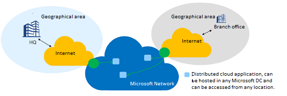
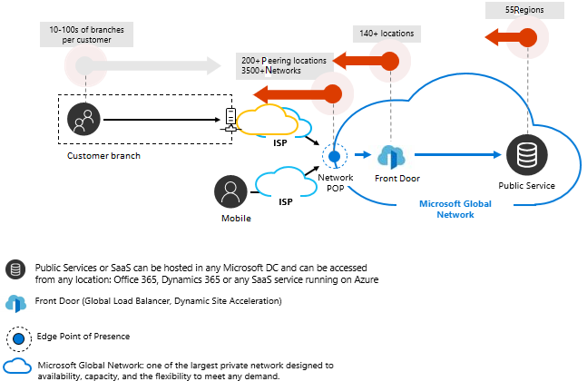
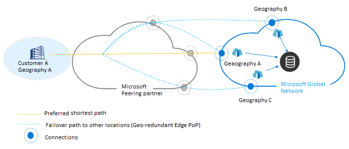
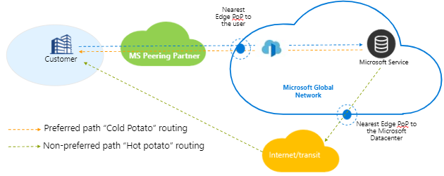
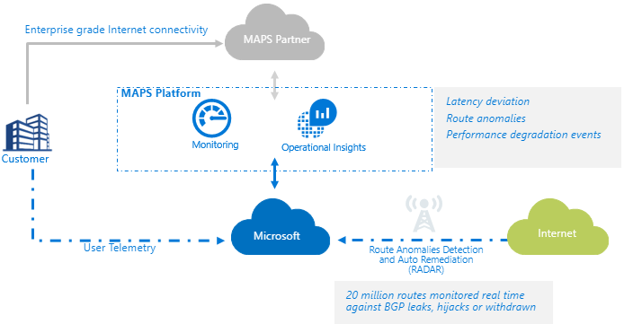

# Peering Service (Preview) Overview

Peering Service is a networking service that aims at enhancing customer connectivity to Microsoft Cloud services such as Office 365, Dynamics 365, SaaS services, Azure, or any Microsoft services accessible via the public Internet. Microsoft has partnered with Internet Service Providers (ISP), Internet Exchange Providers (IXP) and, Software Defined Cloud Interconnect (SDCI) providers, worldwide, to provide highly reliable, and performant public connectivity with optimal routing from the customer to the Microsoft network.

With “*Peering Service*”, customer can select a well connected partner Service Provider (SP) in a given region. Public connectivity is optimized for high reliability and minimal latency from cloud services to the end-user location.

Customers can also opt for Peering Service telemetry such as user latency measures to Microsoft network, BGP route monitoring, and alerts against leaks, and hijacks by registering the Peering Service connection into the Azure portal.  

To use Peering Service, customer isn't required to register with Microsoft. The only requirement is to reach out to a [Peering Service Partner](location-partners.md) to procure the service. However, to opt for Peering Service telemetry, customer must register for the same in the Azure portal.  

For instructions on how to register the Peering Service, refer [here](azure-portal.md).  

> [!Note]
> This article is intended for network architects in charge of Enterprise connectivity to the cloud and to the Internet.

>
> [!IMPORTANT]
> "Peering Service” is currently in public preview.
> This preview version is provided without a service level agreement, and it's not recommended for production workloads. Certain features might not be supported or might have constrained capabilities. 
> For more information, see [Supplemental Terms of Use for Microsoft Azure Previews](https://azure.microsoft.com/support/legal/preview-supplemental-terms/).

## What Peering Service isn't about?

**Peering Service is not a private connectivity product like ExpressRoute or a VPN product.**

- It’s an IP service that uses the public internet.  

- It’s a collaboration platform with SPs and a value-added service that is intended to offer optimal and reliable routing to the customer via Service Provider Partner to Microsoft Cloud over the public network.

> [!Note]
> For more information about **ExpressRoute**, refer [here](https://docs.microsoft.com/azure/expressroute/)
>

## Background

Office 365, Dynamics 365, and any other Microsoft SaaS services are hosted in multiple Microsoft data centers and can be accessed from any geographic location. The *Microsoft Global Network* has Microsoft Edge Point of Presence locations around the world where it can connect to an end user via their Service Provider (SP).  

Microsoft and Partner SPs ensure the traffic for the prefixes registered with Peering Service connection enters and exits the nearest Microsoft Edge PoP locations on the *Microsoft Global Network*. Microsoft ensures the networking traffic egressing from the prefixes registered with Peering Service connection takes the nearest Microsoft Edge PoP locations on the *Microsoft Global Network*.

> [!Note]
> For more information about the Microsoft Global Network, refer [here](https://docs.microsoft.com/azure/networking/microsoft-global-network).
>

## Why Peering Service?

Enterprises looking for “Internet first” access to the Cloud or considering SD-WAN architecture or with high usage of Microsoft SaaS services need robust and performant internet connectivity. Peering Service enables the customers to make that transition happen. Microsoft and Service Providers have partnered to deliver reliable and performance-centric public connectivity to the Microsoft Cloud. Some of the key customer features are listed below:

- Best public routing over internet to <i>Microsoft Cloud Services</i> for optimal performance and reliability.
- Ability to select the preferred SP to connect to Microsoft Cloud.
- Traffic insights such as latency reporting, and prefix monitoring.
- Optimum Network Hops (AS Hops) from Microsoft Cloud.
- **Route analytics and statistics** - Events for Border Gateway Protocol ([BGP](https://en.wikipedia.org/wiki/Border_Gateway_Protocol)) route anomalies (leak/hijack detection), and suboptimal routing.

### Robust, Reliable Peering

- **Local Redundancy**

   Microsoft and SP interconnect across multiple Microsoft Edge PoP locations to deliver Peering Service. In each location, interconnection must support failover across two routers.

   Each peering location is provisioned with redundant and diverse peering links.

- **Geo Redundancy**

   Microsoft has interconnected with the Service Provider at multiple metro locations so that if one of the edge nodes has degraded performance, the traffic routes to/from Microsoft via alternate sites. Microsoft routes traffic in its global network using SDN-based routing policies for optimal performance.

   Ensures to use the shortest routing path by always choosing the nearest Microsoft Edge POP to the end user and ensures the customer is one network hop (AS hops) away from Microsoft​.  

   

### Optimal Routing

-  **Cold-potato**

   Software defined cold-potato routing technique offers control over network traffic originating from the Microsoft Cloud. It ensures that traffic stays on the high capacity, low latency, and highly reliable Microsoft Global Network until it is as near to the destination as possible.
   
   Without such technique, routing is referred as "Hot-potato", traffic originating from Microsoft Cloud would go over the Internet.

   

### Monitoring platform

   Service monitoring is offered to analyze the end-user traffic and routing, and provides the following capabilities:  

-  **Internet BGP route anomalies detection**
          
   A service to detect and alert for any route anomaly events including route hijacks to the customer prefixes.

-  **End-user latency**

   Monitors the routing performance between the customer's location and Microsoft. 
   
   Routing performance is measured by validating the round-trip time taken from the client to reach the Microsoft Edge PoP. Customer can view the latency reports for different geographic locations.

   Captures the events in case of any service degradation.

   

### Traffic protection

Ensures routing happens only via a preferred path that is defined when registering the customer with peering Service.

Microsoft guarantees to route the traffic via preferred path even if there is any malicious activity detected.

BGP route anomalies are reported in the Azure portal, if any.

## Next steps

To learn about Peering Service connection, see [Peering Service connection](connection.md).

To learn about Peering Service connection telemetry, see [Peering Service connection telemetry](connection-telemetry.md).

To find a Service Provider partner, see [Peering Service partners and locations](location-partners.md).

To onboard Peering Service connection, see [Onboarding Peering Service model](onboarding-model.md).

To register a connection using the Azure portal, see [Register Peering Service connection using the Azure portal](azure-portal.md).

To measure telemetry, see [Measure connection telemetry](measure-connection-telemetry.md).
