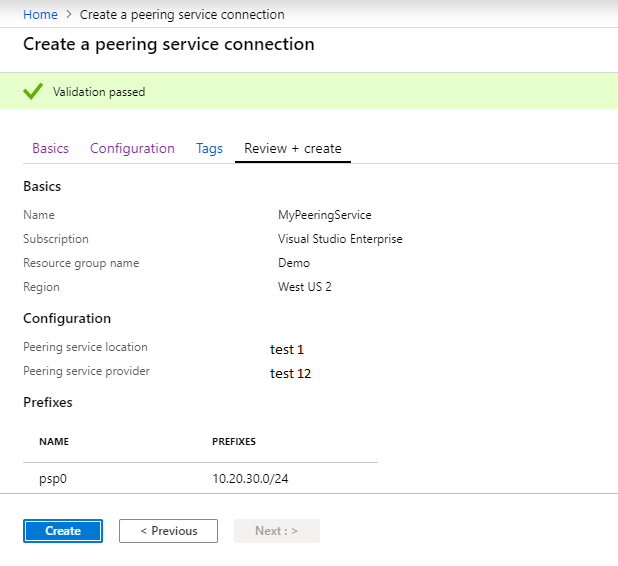

# Register Peering Service (Preview) using the Azure portal

Peering Service is a networking service that aims at enhancing customer connectivity to Microsoft Cloud services such as Office 365, Dynamics 365, SaaS services, Azure, or any Microsoft services accessible via the public Internet.

In this article, you will learn about how to register the Peering Service connection using the Azure portal.

If you don't have an Azure subscription, create an [account](https://azure.microsoft.com/free/?WT.mc_id=A261C142F) now.

> [!IMPORTANT]
> "Peering Service” is currently in public preview.
> This preview version is provided without a service level agreement, and it's not recommended for production workloads. Certain features might not be supported or might have constrained capabilities. 
> For more information, see [Supplemental Terms of Use for Microsoft Azure Previews](https://azure.microsoft.com/support/legal/preview-supplemental-terms/).

## Prerequisites  

### Azure account

A valid and active Microsoft Azure account. This account is required to set up the Peering Service connection. Peering Service is a resource within Azure subscriptions. 

### Connectivity provider

You can work with an Internet Service provider or Internet Exchange Partner to obtain Peering Service to connect your network with Microsoft network.

Ensure the connectivity providers are partnered with Microsoft.

### Register your subscription with the resource provider and feature flag

Before proceeding to the steps of registering the Peering Service, you need to register your subscription with the resource provider and feature flag either via the Azure PowerShell or Azure CLI. 

**Azure PowerShell**

```PowerShellCopy
Register-AzProviderFeature-FeatureName AllowPeeringService ProviderNamespace Microsoft.Peering 

Register-AzResourceProvider -ProviderNamespace Microsoft.Peering 

```

**Azure CLI**

```azurecli
az feature register --namespace Microsoft.Peering--name AllowPeeringService
```

## Sign into the Azure portal

From a browser, navigate to the Azure portal and sign in with your Azure account.

## Register the Peering Service connection

1. To register the Peering Service connection, click  **Create a resource > Peering Service** as depicted below:

    > [!div class="mx-imgBorder"]
    > 
 
2.	Now, provide the following details in the **Basics** tab of the **Create a peering service connection** page. 
 
3.	Choose the **Subscription** and the **Resource group** associated with the subscription as shown in the screen below:

    > [!div class="mx-imgBorder"]
    > 

4.	Next, provide a **Name** to which the Peering Service instance should be registered.
 
5.	Now, click on the **Next:Configuration** button at the bottom. **Configuration** page appears.

## Configure the Peering Service connection

1.	In the **Configuration**  page, choose the location to which the Peering Service must be enabled by choosing the same from the **Peering service location** drop-down list.

2.	Now, choose the service provider from whom the Peering Service must be obtained by choosing a provider name from the **Peering service provider**  drop-down list.
 
3.	Clicking on the **Create new prefix** at the bottom of the **Prefixes** section, text boxes appear. Now, provide **NAME** of the prefix resource and the **PREFIXES** associated with the Service Provider.

    > [!div class="mx-imgBorder"]
    > 

5.	Now, click on the **Review + create** button at the bottom right of the page. You're taken to the **Review + create** page and Azure validates your configuration.

    > [!div class="mx-imgBorder"]
    > 

6. When you see the **Validation passed message** as shown above, select **Create**.

7. After registering the Peering Service, additional validation is performed on the included prefixes. You can review the validation status under the **Prefixes** section of the resource name. If the validation fails, one of the following error messages is displayed:

   - Invalid Peering Service prefix, the prefix should be valid format, only Ipv4 prefix is supported.

   - Prefix was not received from Peering Service provider.

   - Prefix announcement does not have a valid BGP community, please contact Peering Service provider.

   - Backup route not found, please contact Peering Service provider.

   - Prefix received with longer AS path, please contact Peering Service provider.

   - Prefix received with private AS in the path, please contact Peering Service provider.

### Add or remove a Prefix

Click on **Add prefixes** in the **Prefixes** page to add prefixes.

Click on the ellipsis (...) next to the listed prefix and click on the **Delete** option.

### Delete a Peering Service

In the **All Resources** page, click the checkbox on the Peering Service and click on the **Delete** option on the top of the page.

> [!Note]
> You cannot modify an existing prefix.
>

## Next steps

To learn about Peering Service connection, see [Peering Service Connection](connection.md).

To learn about Peering Service connection telemetry, see [Peering Service connection telemetry](connection-telemetry.md).

To measure telemetry, see [Measure connection telemetry](measure-connection-telemetry.md).

To register the connection using the Azure PowerShell, see [Register Peering Service connection - Azure PowerShell](powershell.md).

To register the connection using the Azure CLI, see [Register Peering Service connection - Azure CLI](cli.md).
