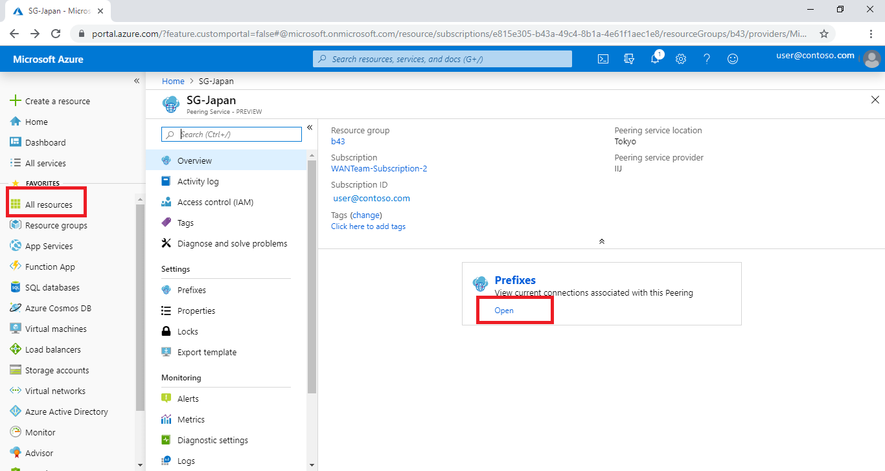
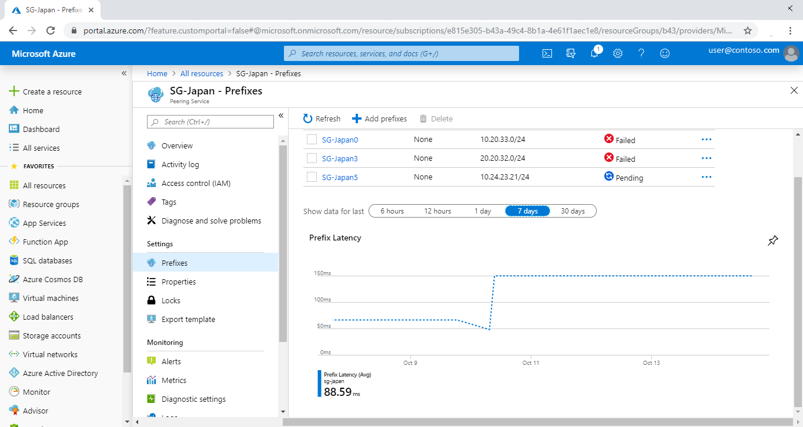
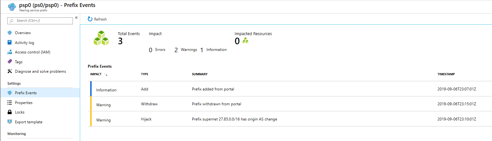

# Tutorial: Accessing Peering Service connection telemetry

 In this tutorial, you'll learn how to access telemetry for your Peering Service connections.
 
 Connection telemetry provides insights collected for the connectivity between the customer's location and the Microsoft network. In this article, you'll learn how to view the latency report and prefix states for a specific Azure Peering Service connection. 

To access Peering Service connection telemetry, you must create a Peering Service connection in the Azure portal. To learn how to create a connection, see [Create a Peering Service connection - Azure portal](azure-portal.md).

## View a latency report

To view a latency report for a specific Peering Service connection, follow these steps.

1. Select **All resources** in the left pane, and select the Peering Service connection. Then select **Open** under **Prefixes**. 

   

2. A latency report page for all the prefixes associated with that Peering Service connection appears. **The Peering service connections supports latency data for /24 or bigger prefixes only.**

      

3. By default, the report is updated for every hour that's displayed on this page. To view the report for different timelines, choose the appropriate option from **Show data for last**. 

## View Prefix state report

1. To view events for a specific prefix, select the prefix name and select **Prefix Events** in the left pane. The events that are captured are displayed.

   

 Some of the possible events that are captured in the **Prefix Events** list are shown here.

| **Prefix events** | **Event type**|**Reasoning**|
|-----------|---------|---------|
| PrefixAnnouncementEvent |Information|Prefix announcement was received|
| PrefixWithdrawalEvent|Warning| Prefix withdrawal was received |
| PrefixBackupRouteAnnouncementEvent |Information|Prefix backup route announcement was received |
| PrefixBackupRouteWithdrawalEvent|Warning|Prefix backup route withdrawal was received |
| PrefixActivePath |Information| Current prefix active route   |
| PrefixBackupPath | Information|Current prefix backup route   |
| PrefixOriginAsChangeEvent|Critical| Exact prefix received with different origin autonomous system number (for active route)| 
| PrefixBackupRouteOriginAsChangeEvent  | Error|Prefix received with different origin autonomous system number (for backup route)  |

## Next steps

- To learn about Peering Service connection, see [Peering Service connection](connection.md).
- To learn about Peering Service connection telemetry, see [Peering Service connection telemetry](connection-telemetry.md).
