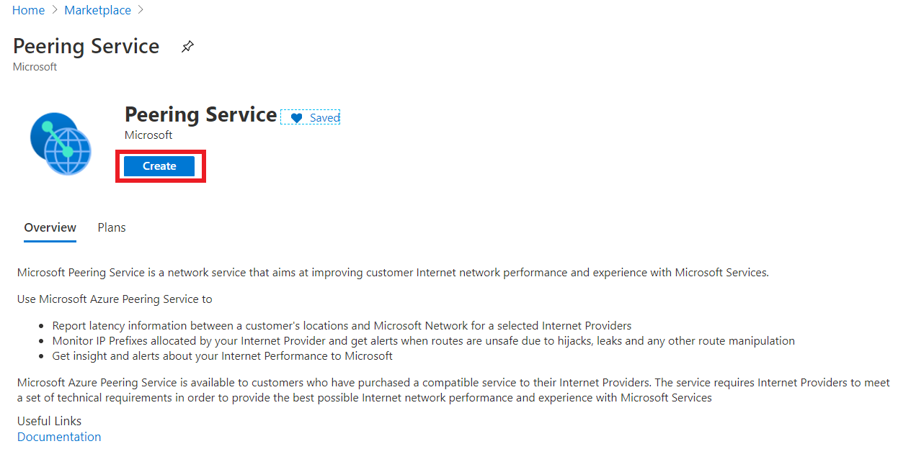
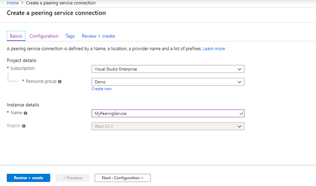
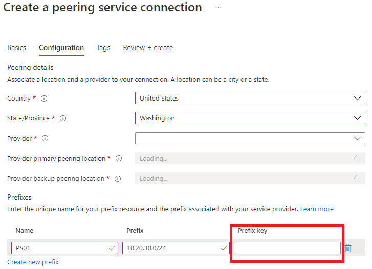

# Tutorial: Create a Peering Service Connection

This tutorial shows you how to create a Peering Service resource and how to configure a Peering Service connection. 

1. To register a Peering Service connection, select **Create a resource** > **Peering Service**.

 
    

2. Enter the following details on the **Basics** tab on the **Create a peering service connection** page.
 
3. Select the subscription and the resource group associated with the subscription.

    

4. Enter a **Name** to which the Peering Service instance should be registered.

5. Now, select the **Next:Configuration** button at the bottom of the page. The **Configuration** page appears.
## Configure the Peering Service connection

1. On the **Configuration** page, select the location to which the Peering Service must be enabled by selecting the same from the **Peering service location** drop-down list.

1. Select the service provider from whom the Peering Service must be obtained by selecting a provider name from the **Peering service provider** drop-down list.
 
1. Select **Create new prefix** at the bottom of the **Prefixes** section, and text boxes appear. Now, enter the name of the prefix resource and the prefixes that are associated with the service provider.

1. Select **Prefix Key** and add the Prefix Key that has been given to you by your provider (ISP or IXP). This key allows MS to validate the prefix and provider who have allocated your IP prefix.

    

1. Select the **Review + create** button at the lower left of the page. The **Review + create** page appears, and Azure validates your configuration.

 1. When you see the **Validation passed** message as shown, select **Create**.

> 

1. After you register a Peering Service connection, additional validation is performed on the included prefixes. You can review the validation status under the **Prefixes** section of the resource name. If the validation fails, one of the following error messages is displayed:

   - Invalid Peering Service prefix, the prefix should be valid format, only Ipv4 prefix is supported.
   - Prefix was not received from Peering Service provider.
   - Prefix announcement does not have a valid BGP community, please contact Peering Service provider.
   - Backup route not found, please contact Peering Service provider.
   - Prefix received with longer AS path, please contact Peering Service provider.
   - Prefix received with private AS in the path, please contact Peering Service provider.

### Add or remove a prefix

Select **Add prefixes** on the **Prefixes** page to add prefixes.

Select the ellipsis (...) next to the listed prefix, and select the **Delete** option.

### Delete a Peering Service connection

On the **All Resources** page, select the check box on the Peering Service and select the **Delete** option at the top of the page.
## Next steps

- To learn about Peering Service connection, see [Peering Service connection](connection.md).
- To learn about Peering Service connection telemetry, see [Peering Service connection telemetry](connection-telemetry.md).
- To measure telemetry, see [Measure connection telemetry](measure-connection-telemetry.md).
- To register the connection by using Azure PowerShell, see [Register a Peering Service connection - Azure PowerShell](powershell.md).
- To register the connection by using the Azure CLI, see [Register a Peering Service connection - Azure CLI](cli.md).