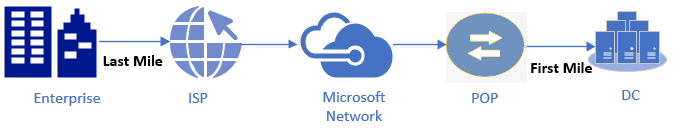
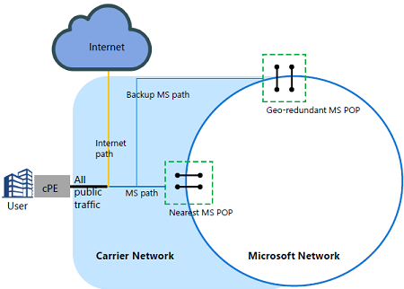
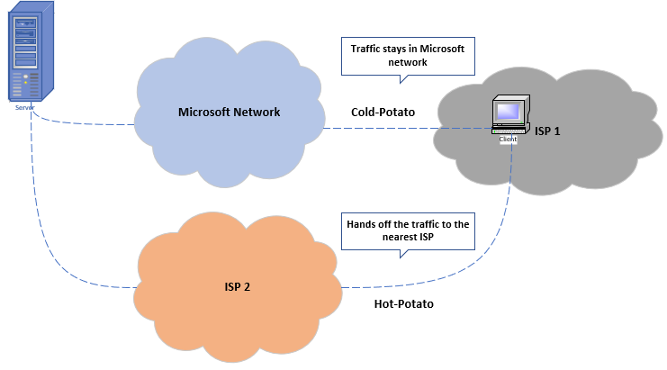
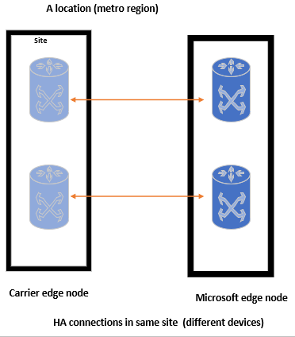
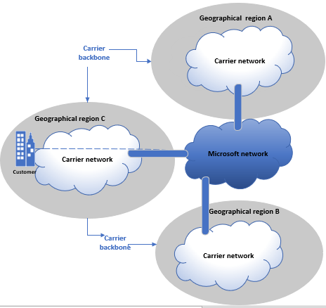
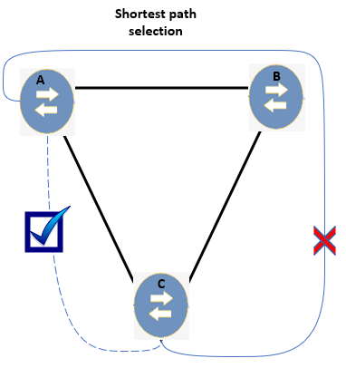

# Microsoft Azure Peering Service (MAPS) Overview
## What is Peering Service? 

Peering Service, also known as Microsoft Azure Peering Service [MAPS] is a networking service that aims at improving the customer’s internet experience. It provides better accessibility to Microsoft SAAS services such as Office 365 and Azure. Microsoft has partnered with Internet Service Providers and Internet Exchange Partners to provide reliable internet connectivity by meeting the technical requirements as listed below:
- Local redundancy
- Geo redundancy
- Shortest network path

By selecting MAPS, an end user is selecting a Service Provider [SP], which is well connected to Microsoft through high capacity connections. These high capacity connections are optimized for high throughput, better latency at an edge location that is closer to the user. Moreover, these high capacity connections are engineered for High Availability (HA).

Customers can on-board MAPS into Azure portal, optionally. By registering into the Azure portal, customers can get Internet telemetry, BGP route monitoring and alerts against leaks and hijacks.

## What MAPS isn't about?
**Not a private connectivity product.**

It is an IP service that follows the rules of the Internet routing. 

**Not an Express Route or a VPN product.**

It is a value-added service intended to offer optimized and reliable routing to public IPs or SaaS traffic such as Office.

## Background

Microsoft Global Network has edge locations around the world where it can connect to an end user via its Service Provider (SP). In the Networking traffic, the link connecting the end-user and SP is referred as Last-Mile and the link connecting the data center and edge site [POP] is referred as First-Mile. In this networking traffic background, there are considerable factors to focus on providing optimal internet routing.

### Prime Focus 

- How to prioritize networking traffic over global network?
- How to optimize last-mile portion in networking when it is bounded to SP?
- How to make cold-potato routing effective?
- How to ensure the networking traffic is routed to the nearest edge point [POP] in the exit path?
- Is there a possibility to monitor network latency?

Microsoft came up with ‘Peering Service/MAPS’ concept to eliminate mid-mile and to solve last-mile, first-mile portions of the networking traffic, aiming for a best-in-class internet experience.

## Key Customer Features
 -	Best Internet routing to Microsoft Cloud Services to achieve optimal performance. 
 -	Traffic insight such as latency, throughput, and so on.
 -	Route analytics and statistics. Events for route leak/hijack detection or non-optimal routing. 

## Why Peering Service?
From a business perspective, it is recommended for a large-scale enterprise to opt for a redefined technique to get well connected with Microsoft network. Microsoft offers such well-provisioned networks through Peering Services by partnering with respective SPs.  

### Nearest MS [POP]

The service provider will provide connectivity to Microsoft Cloud at a location nearest to user. Service Provider [SP] will route user traffic to Microsoft Edge, closest to user. Similarly, on traffic towards the user, Microsoft will route traffic to the edge location closest to the user and SP will deliver the traffic to the user.

High availability (port redundant), high throughput, geo-redundant connectivity is maintained with Microsoft Global Network. These features are automated by a software controller automated by Microsoft.  

### Cold-Potato Routing

On-boarding MAPS through SPs, networking traffic is guaranteed to use cold-potato routing technique. This helps the networking traffic to stay in the Microsoft network as much as possible. Otherwise, traffic can be routed via hot potato, by dropping off the traffic to the nearest edge point.

## What is Peering Service having to offer?

| **Technical Requirements |  Telemetry**|
|-----------|-------------------------------|
| **Local Redundancy**|**Latency optimization**|
Microsoft and carriers interconnect with the edge locations. In each location, interconnection must support fail over across two routers. Ideally, each peering location is provisioned with two redundant peering links.|Round-trip time taken from the client to reach the server is optimized by connecting the end users to the nearest possible Microsoft Edge.|
| **Geo Redundancy**|**Route Analytics**|
Replicates the instances of peering connectivity in different geographical locations. This supports fail over across multiple locations. Microsoft peers with career at multiple metro locations so that, if one of the Microsoft-Partner nodes goes down, the traffic routes to Microsoft via alternate sites.|Network monitoring technology is offered to analyze the routing techniques.|
| **Shortest Routing Path**|**1-hop connectivity**|
Assures to use the shortest routing path by choosing the nearest edge MS POP.|Last mile connectivity is provided to the end customer.|

