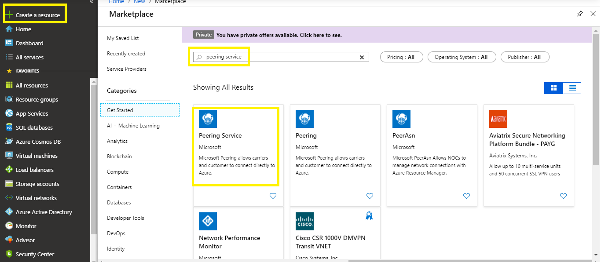
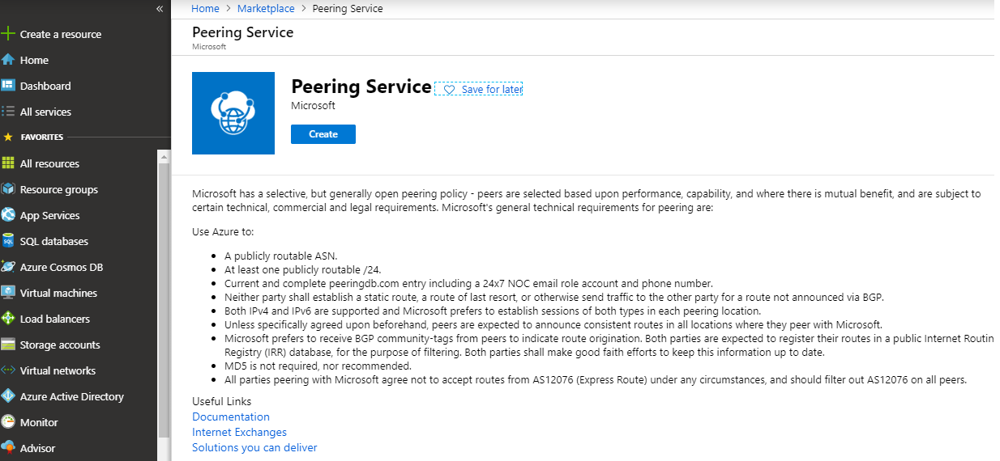
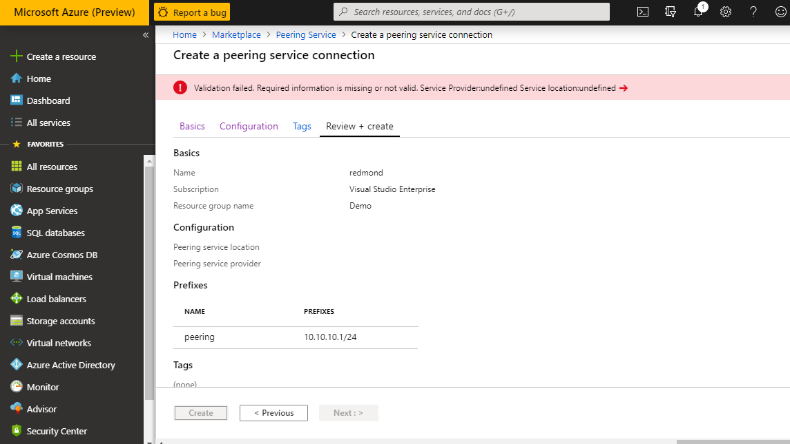

# Onboarding Peering Service

Onboarding process is basically categorized into the following:

- Onboarding Peering Service.
- Onboarding Peering Service telemetry.

You can onboard Peering Service by reaching out to the certified service Provider with no requirements from Microsoft. However, to onboard the Peering Service telemetry, customer must register the service connection into the Azure portal.

Action plans are described as below:

| **Step** | **Action**| **What you get**| **Costs**|
|-----------|---------|---------|---------|
|1|Customer to provision the connectivity from a certified partner (no interaction with Microsoft) ​ |An Internet provider who is well connected to Microsoft and meets the technical requirements for performant and reliable connectivity to Microsoft. ​ |Connectivity costs from the Service Provider offering​. No additional data transfer costs from Microsoft​ |
|2 (Optional)|Customer registers locations into the Azure Portal​ A location is defined by: ISP/IXP Name​, Physical location of the customer site (state level),IP Prefix allocated to the location by the Service Provider or the enterprise​  ​|Telemetry​: Internet Routes monitoring​,traffic prioritization from Microsoft to the user’s closest edge location​ . |15 per /24 prefix per month​ ​ |

## Onboarding Peering Service connection

**1. Objective**

To get best accessibility to Microsoft network.

**2. Steps required**

- Work with Internet Service provider or Internet Exchange Partner to obtain Peering Service to connect your network with Microsoft network.
- Ensure the connectivity providers are certified to provide Peering Service.

**3. Result**

- Well provisioned network to access Microsoft network.
- Better performance and reliable internet connectivity to Microsoft.

## Onboarding Peering Service connection telemetry

In addition to the Peering Service enabled service, customers can opt for its telemetry such as route analytics to monitor networking latency and performance when accessing Microsoft network. This can be achieved by registering MAPS into the Azure Portal.

**1. Objective**

In addition to the Peering Service enabled, to opt for telemetry metrics such as monitoring capabilities.

**2. Steps required**

- Register the Peering Service connection in the Azure Portal. To register the Peering Service in the Azure Portal following pre-requisites should be met.
- Step-by-step process are discussed below:

**Pre-requisites**

**Azure account**

A valid and active Microsoft Azure account. This account is required to set up the Peering Service connection. Peering Services are resources within Azure subscriptions. 

**Connectivity provider**

You can work with Internet Service provider or Internet Exchange Partner to obtain Peering Service to connect your network with Microsoft network.
Ensure the connectivity providers are Microsoft Azure Peering Service [MAPS] certified.

**Register your subscription with the resource provider and feature flag**

Before proceeding to the steps of registering the Peering Service, you need to register your subscription with the resource provider and feature flag. 

Register-AzProviderFeature-FeatureName AllowPeeringService ProviderNamespace Microsoft.Peering 

Register-AzResourceProvider -ProviderNamespace Microsoft.Peering 

## Register Peering Service connection

**Sign into the Azure portal**

From a browser, navigate to the Azure portal and sign in with your Azure account.

**Register the Peering Service**

1. To register the Peering Service connection, click *Create a resource > Peering Service* as depicted below:  

 
2.	Clicking on the **Peering Service**  from the **Marketplace**  page, **Peering Service**  page appears as shown below:

3.	Next, click on the **Create button**  below the Peering Service. By doing so, Create a peering service connection page appears as depicted below:

 
4.	Click on the **Basics**  tab at the left top of the **Create a peering service connection**  page.
5.	Choose the **Subscription**  and the **Resource group** associated with the subscription as shown in the screen below:

> [!Note]
> If you have a Resource group mapped to an existing region, you don’t need to specify the Region as depicted below. If you don’t have a Resource group, you must specify the Region to create the Peering Service. 
>

6. Click on the Basics tab at the left top of the Create a peering service connection page. 

7. Choose the Subscription and the Resource group associated with the subscription as shown in the screen below: 

> [!Note]
>Ensure existing resource group is chosen from the Resource group drop-down list, as Peering Service supports only existing ones.
>

6.	Next, provide a **Name** to which the Peering Service instance should be created.

 
7.	Now, click on the **Next: Configuration**  button at the bottom. Doing so, Configuration page appears.

## Configure the Peering Service connection

1.	In the **Configuration**  page, choose the location to which the **Peering Service** must be enabled by from the **Peering service location** drop-down list.

2.	Now, choose the service provider from whom the Peering Service must be procured by choosing provider name from the **Peering service provider**  drop-down list.

 
3.	**Prefixes –** 
Clicking on the **Create new**  under Prefixes, text boxes appear. Now, provide **Name** of the prefix resource and the **Prefix** that is associated with the Service Provider.

4.	Provide a name to the prefix resource in the Name text box and provide the prefix range in the Prefixes text box that is associated with the service provider.

 
5.	Now, click on the **Review + create** button at the bottom right of the page. Doing so, **Review + create**  page appears as depicted below:

## Next steps

- To learn about connection. See [Peering Service connection](peering-service-connection.md).
- To learn about connection telemetry. See [Peering Service connection](peering-service-connection-telemetry.md)
