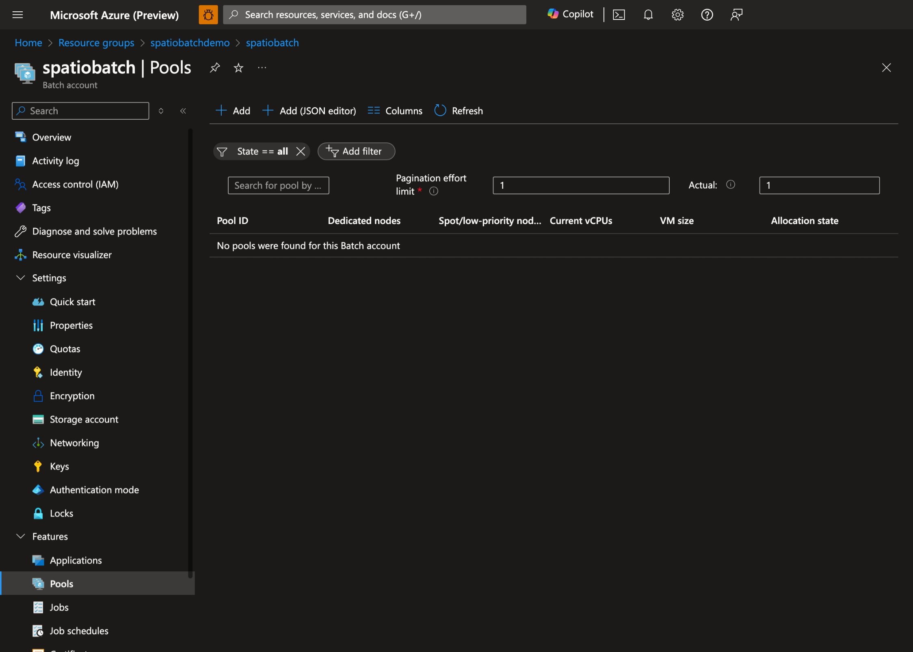
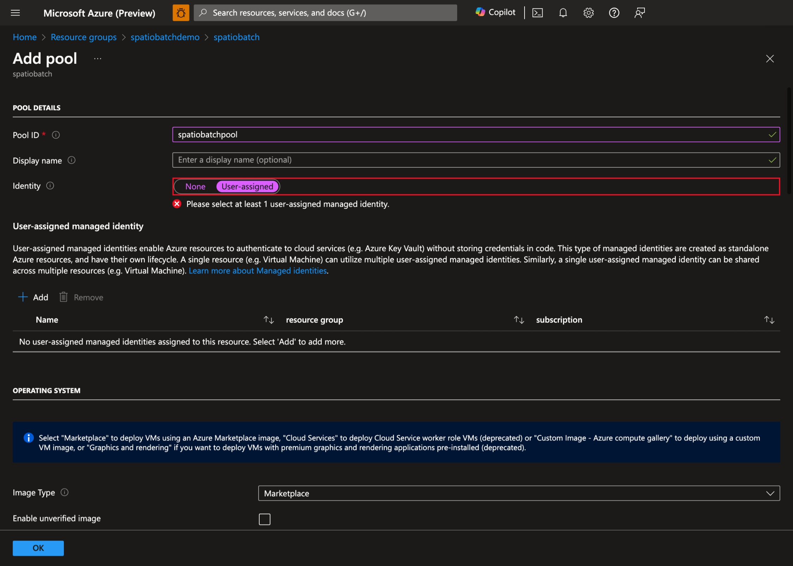
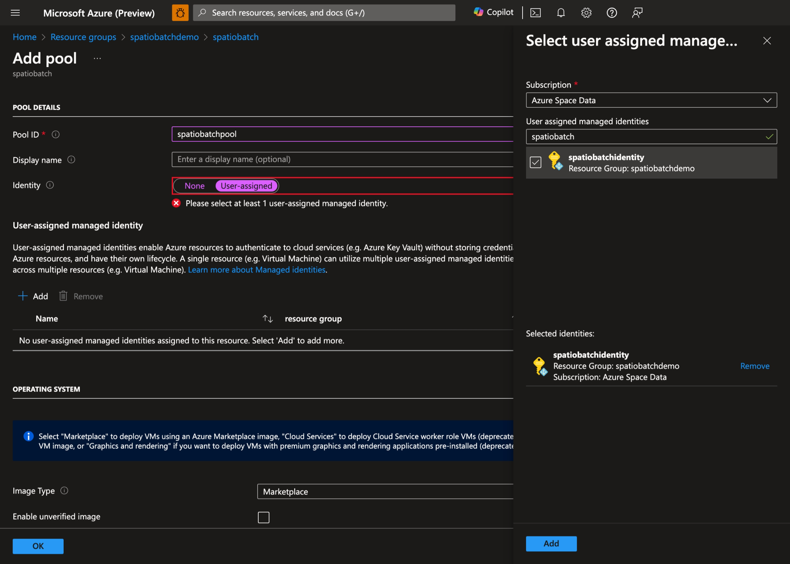
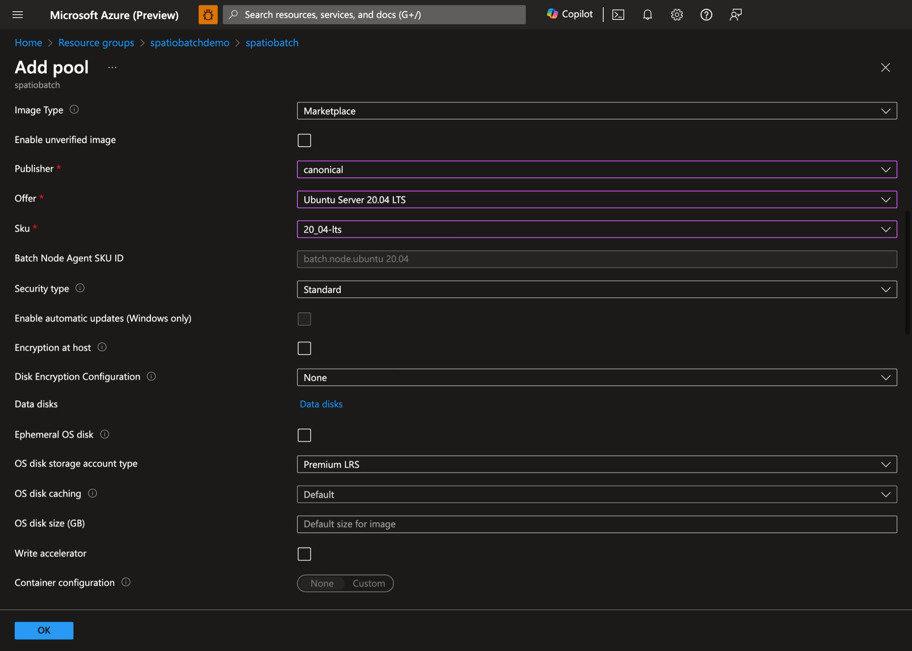
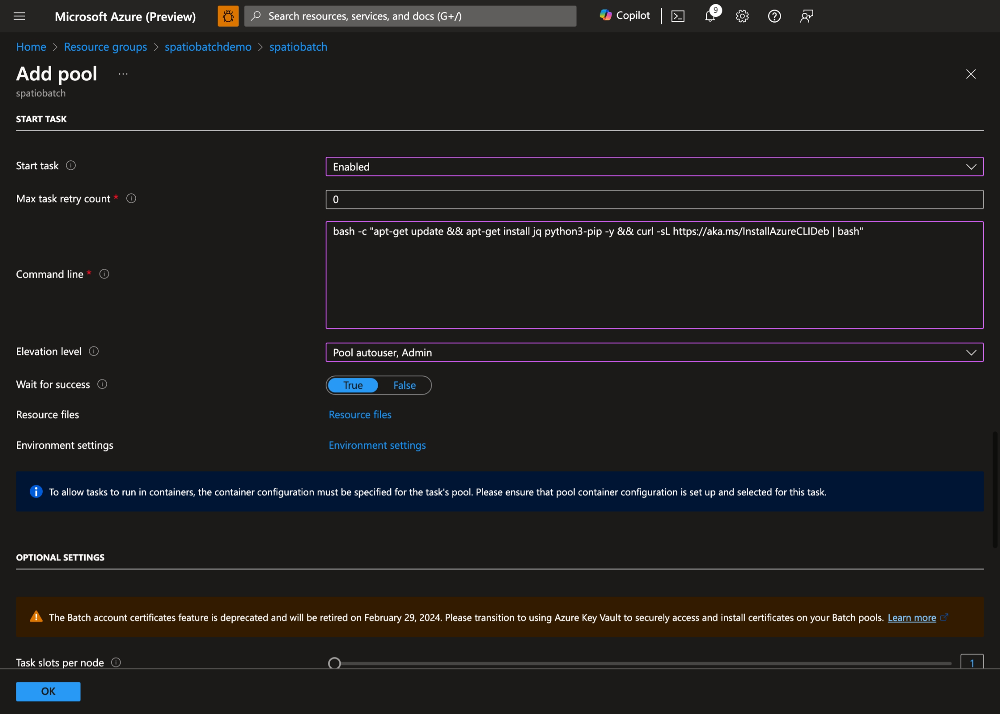
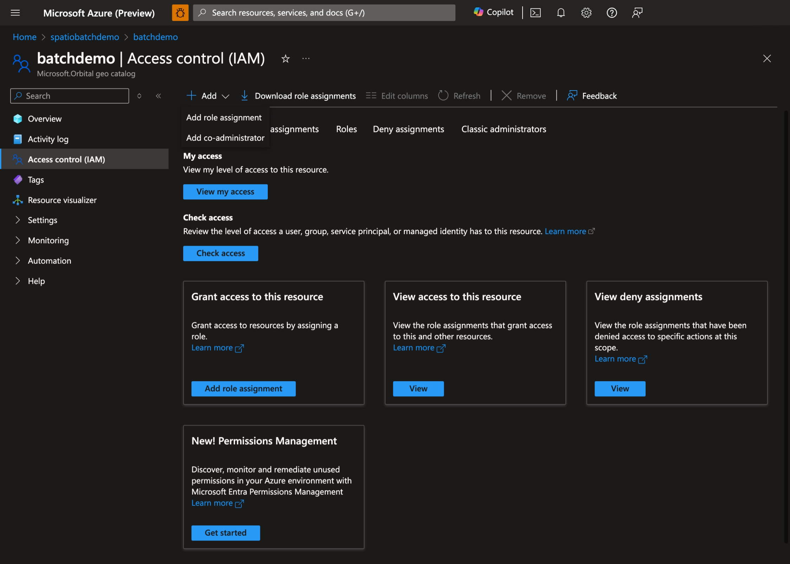

# Quickstart: Use Microsoft Planetary Computer Pro GeoCatalog in Azure Batch

In this quickstart, you learn how to use Microsoft Planetary Computer Pro GeoCatalog resource in Azure Batch to process geospatial data. Planetary Computer Pro GeoCatalog is a geospatial data catalog that provides a unified view of your geospatial data assets across your organization. You can use Planetary Computer Pro GeoCatalog to discover, manage, and analyze your geospatial data.

## Prerequisites

Before you begin, ensure you meet the following requirements to complete this quickstart:

- An Azure account with an active subscription. Use the link [Create an account for free](https://azure.microsoft.com/free/?WT.mc_id=A261C142F).
- A Microsoft Planetary Computer Pro GeoCatalog resource.
 A Linux machine with the following tools installed:
    - [Azure CLI](/cli/azure/install-azure-cli)
    - `perl` package.

## Create a batch account

Create a resource group:

```azurecli
az group create \
    --name spatiobatchdemo \
    --location uksouth
```

Create a storage account:

```azurecli
az storage account create \
    --resource-group spatiobatchdemo \
    --name spatiobatchstorage \
    --location uksouth \
    --sku Standard_LRS
```

Assign the `Storage Blob Data Contributor` to the current user to the storage account:

```azurecli
az role assignment create \
    --role "Storage Blob Data Contributor" \
    --assignee $(az account show --query user.name -o tsv) \
    --scope $(az storage account show --name spatiobatchstorage --resource-group spatiobatchdemo --query id -o tsv)
```

Create a Batch account:

```azurecli
az batch account create \
    --name spatiobatch \
    --storage-account spatiobatchstorage \
    --resource-group spatiobatchdemo \
    --location uksouth
```

> [!IMPORTANT]
> Ensure you have enough quota to create a pool of computer nodes. If you don't have enough quota, you can request an increase by following the instructions in the [Azure Batch quotas and limits](/azure/batch/batch-quota-limit) documentation.

Sign in to the new Batch account by running the following command:

```azurecli
az batch account login \
    --name spatiobatch \
    --resource-group spatiobatchdemo \
    --shared-key-auth
```

Once you authenticate your account with Batch, subsequent `az batch` commands in this session use the Batch account you created.

Create a User Assigned Managed Identity:

```azurecli
az identity create \
    --name spatiobatchidentity \
    --resource-group spatiobatchdemo
```

Create a pool of compute nodes using the Azure Portal:

1. In the Azure portal, navigate to your Batch account and select **Pools**:
    [  ](media/batch-pools-overview.png#lightbox)
1. Select **+ Add** to create a new pool and select **User-assigned** as the pool's identity:
    [  ](media/add-batch-pool.png#lightbox)
1. Select the User Assigned Managed Identity you created earlier:
    [  ](media/select-user-assigned-identity.png#lightbox)
1. Select your preferred operating system and VM size. In this demo, we use Ubuntu Server 20.04 LTS:
    [  ](media/select-pool-settings.png#lightbox)
1. Enable **Start Task**, set the following **Command line**: `bash -c "apt-get update && apt-get install jq python3-pip -y && curl -sL https://aka.ms/InstallAzureCLIDeb | bash"` and set **Elevation level** to **Pool autouser, Admin**:
    [  ](media/start-task-configuration-page.png#lightbox)
1. Select **OK** to create the pool.

## Assign Permissions to the Managed Identity

You need to provide the managed identity access to the GeoCatalog. Go to your GeoCatalog, select on **Access control (IAM)** and select **Add role assignment**:

[  ](media/add-role-assignment-page.png#lightbox)

Select the appropriate role based on your needs, `GeoCatalog Administrator` or `GeoCatalog Reader`, and select **Next**:

[  ](media/select-role.png#lightbox)

Select the managed identity you created and then select **Review + assign**.

[  ](media/select-review-assign.png#lightbox)

## Prepare the Batch Job

Create a container in the storage account:

```azurecli
az storage container create \
    --name scripts \
    --account-name spatiobatchstorage
```

Upload the script to the container:

```azurecli
az storage blob upload \
    --container-name scripts \
    --file src/task.py \
    --name task.py \
    --account-name spatiobatchstorage
```

## Run the Batch Jobs

There are two examples in this quickstart: a **Python script**, and a **Bash script**. You can use either of them to create a job.

### Python Script Job

To execute the Python script job, execute the following commands:

```bash
geocatalog_url="<geocatalog url>"
token_expiration=$(date -u -d "30 minutes" "+%Y-%m-%dT%H:%M:%SZ")
python_task_url=$(az storage blob generate-sas --account-name spatiobatchstorage --container-name scripts --name task.py --permissions r --expiry $token_expiration --auth-mode login --as-user --full-uri -o tsv)

cat src/pythonjob.json | perl -pe "s,##PYTHON_TASK_URL##,$python_task_url,g" | perl -pe "s,##GEOCATALOG_URL##,$geocatalog_url,g" | az batch job create --json-file /dev/stdin
```

The Python job executes the following Python script:

```python
import json
from os import environ
import requests
from azure.identity import DefaultAzureCredential

MPCPRO_APP_ID = "https://geocatalog.spatio.azure.com"
credential = DefaultAzureCredential()
access_token = credential.get_token(f"{MPCPRO_APP_ID}/.default")

geocatalog_url = environ["GEOCATALOG_URL"]

response = requests.get(
    f"{geocatalog_url}/stac/collections",
    headers={"Authorization": "Bearer " + access_token.token},
    params={"api-version": "2025-04-30-preview"},
)
print(json.dumps(response.json(), indent=2))
```

Which uses `DefaultAzureCredential` to authenticate with the managed identity and retrieves the collections from the GeoCatalog. To get the results of the job, execute the following command:

```azurecli
az batch task file download \
    --job-id pythonjob1 \
    --task-id task1 \
    --file-path "stdout.txt" \
    --destination /dev/stdout
```

### Bash Job

To execute the Bash script job, run the following commands:

```bash
geocatalog_url="<geocatalog url>"

cat src/bashjob.json | perl -pe "s,##GEOCATALOG_URL##,$geocatalog_url,g" | az batch job create --json-file /dev/stdin
```

The Bash job executes the following Bash script:

```bash
az login --identity --allow-no-subscriptions > /dev/null
token=$(az account get-access-token --resource https://geocatalog.spatio.azure.com --query accessToken --output tsv)
curl --header \"Authorization: Bearer $token\" $GEOCATALOG_URL/stac/collections | jq
```

Which uses `az login --identity` to authenticate with the managed identity and retrieves the collections from the GeoCatalog. To get the results of the job, run the following command:

```azurecli
az batch task file download \
    --job-id bashjob1 \
    --task-id task1 \
    --file-path "stdout.txt" \
    --destination /dev/stdout
```

## Related content

- For more information about managed identities in batch pools, see [Configure managed identities in Batch pools](/azure/batch/managed-identity-pools) documentation.

- For more information about how to deploy files to your Batch account, see [Copy applications and data to pool nodes](/azure/batch/batch-applications-to-pool-nodes), [Deploy applications to compute nodes with Batch application packages](/azure/batch/batch-application-packages), and [Creating and using resource files](/azure/batch/resource-files).
