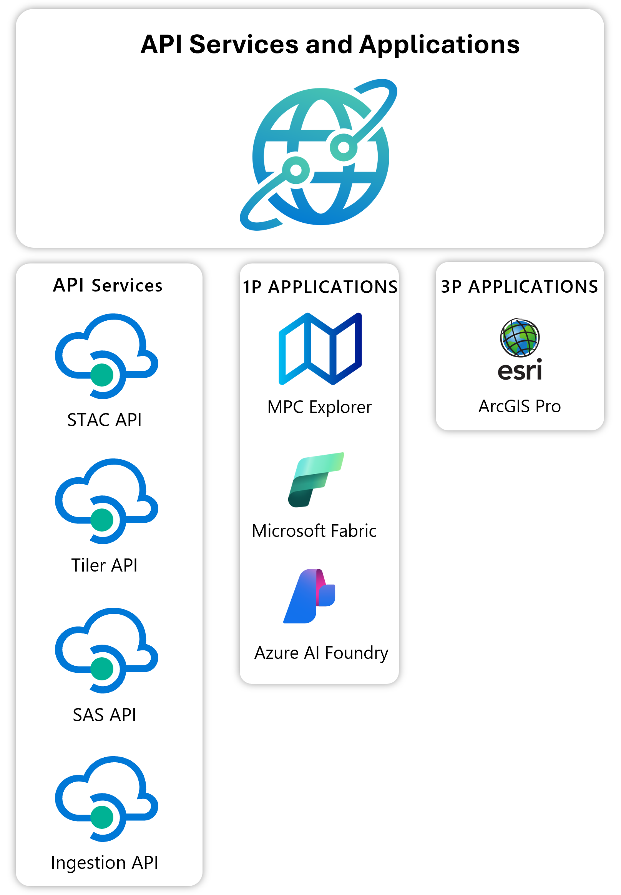

# Building applications with Microsoft Planetary Computer Pro

Microsoft Planetary Computer Pro offers APIs and connectors that enable developers to build applications that can access, analyze, and visualize large-scale geospatial datasets. This article provides an overview of the application development options available with Planetary Computer Pro and key concepts for integrating with its services.

## Prerequisites

- An Azure account and subscription [Create an account for free](https://azure.microsoft.com/free/?WT.mc_id=A261C142F).
- Access to a Microsoft Planetary Computer Pro [GeoCatalog resource](./deploy-geocatalog-resource.md)

## Application integration approaches

Planetary Computer Pro supports multiple integration approaches depending on your application's requirements. You can build applications that access Planetary Computer Pro's data and services in several ways:

### Direct API integration

The primary way to integrate with Planetary Computer Pro is through its REST APIs. Planetary Computer Pro provides a comprehensive set of APIs to build applications. These APIs are summarized in the next table:

| API Name      | Description                                                                                   |
|---------------|----------------------------------------------------------------------------------------------|
| STAC API      | Search, discover, and access geospatial data using the SpatioTemporal Asset Catalog (STAC) specification.                   |
| Tiler API     | Serve map tiles and imagery for visualization in web maps and GIS apps.                      |
| SAS API       | Generate secure, time-limited access tokens for sharing geospatial data.                     |
| Ingestion API | Ingest and transform new geospatial datasets into the GeoCatalog.      |

These APIs support [standard authentication through Microsoft Entra ID](/entra/architecture/guide-for-independent-software-developers), enabling secure access to your resources. Integrating your web application requires the use of [application authentication](./application-authentication.md). Once your app is registered with Microsoft Entra, it can securely use the APIs to access all data inside a GeoCatalog. 

The [REST API is detailed in the API reference](/rest/api/planetarycomputer).

### Fist Party Application Support

Planetary Computer Pro has a built-in application called Explorer which allows users to visualize ingested data in a GeoCatalog resource from their browser. Once the data is [configured for visualization](./collection-configuration-concept.md), it can be [used in the explorer](./use-explorer.md).

In more, by using [the API services](#direct-api-integration), data in Planetary Computer Pro can be integrated with first party Microsoft applications such as [Fabric](/fabric) and [Azure Machine Learning](/azure/machine-learning/overview-what-is-azure-machine-learning). 

### GIS application connectivity

Planetary Computer Pro integrates directly with the ESRI ArcGIS Pro desktop GIS application. 

Integrating Microsoft Planetary Computer Pro with ESRI ArcGIS Pro provides a seamless workflow for geospatial professionals who rely on industry-standard desktop GIS tools. By connecting Planetary Computer Pro data directly to ArcGIS Pro, users can:

- Access and analyze large-scale, cloud-hosted geospatial datasets without complex data transfers.
- Use ArcGIS Pro’s advanced visualization, editing, and analysis capabilities on authoritative data from Planetary Computer Pro.
- Streamline collaboration by combining enterprise GIS workflows with the latest planetary-scale datasets.
- Accelerate decision-making by integrating cloud-based data with local projects, enabling richer insights and more informed outcomes.

For more information on how to connect ArcGIS Pro to a GeoCatalog resource, see the [Configure ArcGIS Pro to access a GeoCatalog](./create-connection-arc-gis-pro.md).

## Authentication and authorization

All applications that interact with Planetary Computer Pro must authenticate properly using Microsoft Entra ID. 

### Authentication options and recommendations:

| Application Hosting Environment | Access Type Required | Recommended Identity Type        | Explanation                                                                                                                               |
| :------------------------------ | :------------------- | :------------------------------- | :-------------------------------------------------------------------------------------------------------------------------------------------------------- |
| **Running on Azure** (VM, App Service, Functions, Container Apps, etc.) | App-Only (Application acts as itself) | Managed Identity (User-assigned recommended) | **Security & Manageability:** Eliminates the need to store and manage credentials (secrets/certificates) in code or configuration. Azure handles credential rotation automatically. User-assigned is preferred for sharing across multiple resources. |
| **Running on Azure** (VM, App Service, Functions, Container Apps, etc.) | Delegated (Application acts on behalf of a user) | Managed Identity (User-assigned recommended) | **Leverages Azure Integration:** Combines the security benefits of Managed Identity for the application itself with standard user authentication flows. Simplifies infrastructure setup within Azure. |
| **Running Outside Azure** (On-premises, other cloud, developer machine) | App-Only (Application acts as itself) | Service Principal | **Standard for External Apps:** The established method for non-Azure applications to authenticate with Microsoft Entra ID. Requires managing credentials (secrets/certificates) securely. |
| **Running Outside Azure** (On-premises, other cloud, developer machine) | Delegated (Application acts on behalf of a user) | Service Principal | **Standard for External Apps:** Enables standard OAuth 2.0 flows for user sign-in and consent for applications outside Azure, using the application's registered identity in Entra ID. |
| **Running Outside Azure (Alternative)** | App-Only or Delegated | Managed Identity | **Brings Azure Benefits:** By hosting the application in an Azure compute service (like a VM or Container App), it can use the enhanced security and manageability of Managed Identities, avoiding credential management even though the *origin* might be considered non-Azure. |

For detailed authentication guidance, see [Set up application authentication for Planetary Computer Pro](./application-authentication.md).

## Related content

- [Connect ArcGIS Pro to Microsoft Planetary Computer Pro](./create-connection-arc-gis-pro.md)
- [Manage access to Microsoft Planetary Computer Pro](./manage-access.md)
