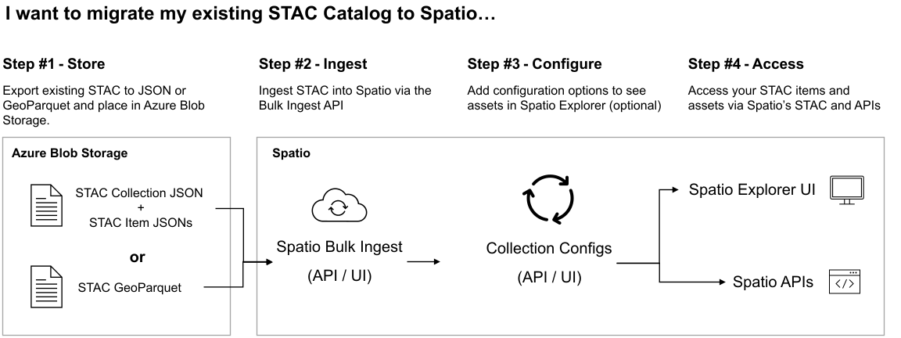

# Ingest data into GeoCatalog with the Bulk Ingestion API

This article shows you how to ingest many geospatial data assets at once into a GeoCatalog using the Bulk Ingestion API. First, we create and configure a GeoCatalog Ingestion Source. Creating an Ingestion Source establishes a secure connection between a GeoCatalog resource and the storage location for your existing geospatial data. Next, we create a SpatioTemporal Access Catalog (STAC) Collection within your GeoCatalog resource to store the data being ingested. Finally, we use the Bulk Ingestion API to initiate the ingestion workflow. When you're finished completing these steps, your geospatial data is ingested and accessible from the GeoCatalog UIs and APIs. 



## Prerequisites

In your Azure subscription:
1. [GeoCatalog](./deploy-geocatalog-resource.md)
1. [Azure Storage Account](/azure/storage/common/storage-account-create?tabs=azure-portal)

A geospatial dataset in your storage account blob container:
1. Geospatial data assets (for example, GeoTIFF files) 
1. The associated STAC Items [Create STAC Items](./create-stac-item.md) for these assets.
1. A STAC Collection JSON that references all the STAC Items and geospatial data assets.

In your local / development environment:

1. A Python environment running Python 3.8, or later.
1. [Azure CLI](/cli/azure/install-azure-cli)
1. You're [signed in to Azure](/cli/azure/authenticate-azure-cli-interactively)

Microsoft Planetary Computer (MPC) Pro must have access to the Azure Blob Storage container. In this article, we create and use a temporary SAS token credential to grant this access. Alternatively, you can use these guides to set up Managed Identity or hard-coded SAS Tokens.

- [Setup Ingestion Credentials for MPC Pro using managed identity](./setup-ingestion-credentials-managed-identity.md)
- [Setup Ingestion Credentials for MPC Pro using SAS Tokens](./setup-ingestion-credentials-sas-tokens.md)

## Create Ingestion Source

Creating an ingestion source defines for GeoCatalog which source to ingest geospatial data from, and which credential mechanism to use in the ingestion workflow.

1. Import the required Python Modules

    ```python
    import os
    import requests
    from azure.identity import AzureCliCredential
    from datetime import datetime, timedelta, timezone
    import azure.storage.blob
    from urllib.parse import urlparse
    import yaml
    ```

1. Set the required constants according to your environment

    ```python
    SPATIO_APP_ID = "https://geocatalog.spatio.azure.com"
    CONTAINER_URI = "<container_uri>" # The URI for the blob storage container housing your geospatial data
    GEOCATALOG_URI = "<geocatalog uri>" # The URI for your GeoCatalog can be found in the Azure portal resource overview 
    API_VERSION = "2024-01-31-preview"
    ```
1. Create the SAS Token

    ```python
    # Parse the container URL
    parsed_url = urlparse(CONTAINER_URI)
    account_url = f"{parsed_url.scheme}://{parsed_url.netloc}"
    account_name = parsed_url.netloc.split(".")[0]
    container_name = parsed_url.path.lstrip("/")
    
    credential = azure.identity.AzureCliCredential()
    blob_service_client = azure.storage.blob.BlobServiceClient(
        account_url=account_url,
        credential=credential,
    )

    now = datetime.now(timezone.utc).replace(microsecond=0)
    key = blob_service_client.get_user_delegation_key(
        key_start_time=now + timedelta(hours=-1),
        key_expiry_time=now + timedelta(hours=1),
    )

    sas_token = azure.storage.blob.generate_container_sas(
        account_name=account_name,
        container_name=container_name,
        user_delegation_key=key,
        permission=azure.storage.blob.ContainerSasPermissions(
            read=True,
            list=True,
        ),
        start=now + timedelta(hours=-1),
        expiry=now + timedelta(hours=1),
    )
    ```
1. Obtain GeoCatalog API access token

    ```python
    # Obtain an access token
    credential = AzureCliCredential()
    access_token = credential.get_token(f"{SPATIO_APP_ID}/.default")
    ```

1. Create POST payload for the ingestion source API

    ```python
    # Payload for the POST request
    payload = {
        "sourceType": "SasToken",
        "connectionInfo": {
            "containerUrl": CONTAINER_URI,
            "sasToken": sas_token,
        },
    }
    ```

1. Create the ingestion source by sending the POST payload to the ingestion source endpoint

    ```python
    # STAC Collection API endpoint
    endpoint = f"{GEOCATALOG_URI}/api/ingestion-sources"
    
    # Make the POST request
    response = requests.post(
        endpoint,
        json=payload,
        headers={"Authorization": f"Bearer {access_token.token}"},
        params={"api-version": API_VERSION},
    )
    ```
1. Verify the response

    ```python
    # Print the response
    if response.status_code == 201:
        print("Ingestion source created successfully")
        ingestion_source_id = response.json().get("id") #saved for later to enable resoource clean up
    else:
        print(f"Failed to create ingestion: {response.text}")
    ```
**Note**: Running these steps more than once back-to-back results in a 409 response: 

```Container url <container uri> already contains a SAS token ingestion source with id <sas token id>```      

The ingestion source API doesn't allow you to create more than one ingestion source for the same container URL. To avoid conflicts, ensure you clean up any existing ingestion sources before creating a new one. For details, see [Clean up resources](#clean-up-resources).
    
## Create Collection

A STAC collection is the high-level container for STAC Items and their associated geospatial assets. In this section, we're creating a STAC collection within our GeoCatalog to house the geospatial data we're ingesting in the next section.

1. Import the required modules
    ```python
    import os
    import requests
    import yaml
    from pprint import pprint
    from azure.identity import AzureCliCredential
    ```

1. Set the required constants according to your environment

    ```python
    SPATIO_APP_ID = "https://geocatalog.spatio.azure.com"
    GEOCATALOG_URI = "<geocatalog uri>" # The URI for your GeoCatalog can be found in the Azure portal resource overview 
    API_VERSION = "2024-01-31-preview"

    COLLECTION_ID = "example-collection" #You can your own collection ID
    COLLECTION_TITLE = "Example Collection" #You can your own collection title    
    ```
1. Obtain GeoCatalog API access token

    ```python
    # Obtain an access token
    credential = AzureCliCredential()
    access_token = credential.get_token(f"{SPATIO_APP_ID}/.default")
    ```

1. Create a basic STAC collection specification

    ```python
    collection = {
        "id": COLLECTION_ID,
        "type": "Collection",
        "title": COLLECTION_TITLE,
        "description": "An example collection",
        "license": "CC-BY-4.0",
        "extent": {
            "spatial": {"bbox": [[-180, -90, 180, 90]]},
            "temporal": {"interval": [["2018-01-01T00:00:00Z", "2018-12-31T23:59:59Z"]]},
        },
        "links": [],
        "stac_version": "1.0.0",
        "msft:short_description": "An example collection",
    }
    ```
    **Note**: This sample collection specification is a basic example of a collection. For more information on STAC collections and the STAC open standard, see the [STAC overview](./stac-overview.md). For a guide creating a complete STAC collection, see [Create STAC Collection](./create-stac-collection.md).

1. Create the new collection with the Collection API

    ```python
    response = requests.post(
        f"{GEOCATALOG_URI}/api/collections",
        json=collection,
        headers={"Authorization": "Bearer " + access_token.token},
        params={"api-version": API_VERSION},
    )
    ```

1. Verify the response result

    ```python
    if response.status_code == 201:
        print("Collection created successfully")
        pprint(response.json())
    else:
        print(f"Failed to create ingestion: {response.text}")
    ```

    
## Create Connection and Run Workflow

In this final step, we're using the ingestion API to initiate a bulk ingestion workflow.

1. Import required modules

    ```python
    import os
    import requests
    import yaml
    from azure.identity import AzureCliCredential
    ```
1. Set the required constants according to your environment

    ```python
    SPATIO_APP_ID = "https://geocatalog.spatio.azure.com"
    GEOCATALOG_URI = "<geocatalog uri>" # The URI for your GeoCatalog can be found in the Azure portal resource overview 
    API_VERSION = "2024-01-31-preview"

    COLLECTION_ID = "example-collection" #You can your own collection ID
    catalog_href = "<catalog_href>" #The blob storage location of the STAC Catalog JSON file
    
    skip_existing_items = False
    keep_original_assets = False
    timeout_seconds = 300
    ```
1. Obtain GeoCatalog API access token

    ```python
    # Obtain an access token
    credential = AzureCliCredential()
    access_token = credential.get_token(f"{SPATIO_APP_ID}/.default")
    ``` 

1. Create the POST payload for the Bulk Ingestion API

    ```python
    url = f"{GEOCATALOG_URI}/api/collections/{COLLECTION_ID}/ingestions"
    body = {
        "importType": "StaticCatalog",
        "sourceCatalogUrl": catalog_href,
        "skipExistingItems": skip_existing_items,
        "keepOriginalAssets": keep_original_assets,
    }
    ```
1. Send the payload to the Bulk Ingestion API.

    ```python
    ing_response = requests.post(
        url,
        json=body,
        timeout=timeout_seconds,
        headers={"Authorization": f"Bearer {access_token.token}"},
        params={"api-version": API_VERSION},
    )
    ```
1. Verify the response.

    ```python
    if ing_response.status_code == 201:
        print("Ingestion created successfully")
        ingestion_id = ing_response.json()["ingestionId"]
        print(f"Created ingestion with ID: {ingestion_id}")
    else:
        print(f"Failed to create ingestion: {ing_response.text}")
    ```

1. Verify the status of the ingestion workflow.    
        
    ```python
    runs_endpoint = (
        f"{geocatalog_url}/api/collections/{collection_id}/ingestions/{ingestion_id}/runs"
    )
    
    wf_response = requests.post(
        runs_endpoint,
        headers={"Authorization": f"Bearer {access_token.token}"},
        params={"api-version": API_VERSION},
    )
    
    if wf_response.status_code == 201:
        print("Workflow started successfully")
    else:
        print(f"Failed to create ingestion run: {wf_response.text}")

Once the workflow is complete, you can query, retrieve, or visualize your geospatial data using the GeoCatalog STAC or data APIs, or with the Data Explorer.
 
## Clean up resources

1. Delete ingestion source

    ```python
    del_is_endpoint = f"{GEOCATALOG_URI}/api/ingestion-sources/{ingestion_source_id}"
    del_is_response = requests.delete(
        del_is_endpoint,
        headers={"Authorization": f"Bearer {access_token.token}"},
        params={"api-version": API_VERSION},
    )
    
    if del_is_response.status_code == 200:
        print("Ingestion source deleted successfully")
    else:
        print(f"Failed to delete ingestion source")
    ```

## Related content

- [Deploy a GeoCatalog](./deploy-geocatalog-resource.md)
- [Create STAC Items](./create-stac-item.md)
- [Setup Ingestion Credentials for MPC Pro using managed identity](./setup-ingestion-credentials-managed-identity.md)
- [Setup Ingestion Credentials for MPC Pro using SAS Tokens](./setup-ingestion-credentials-sas-tokens.md)
- [STAC overview](./stac-overview.md)
- [Create STAC Collection](./create-stac-collection.md)
- [Use Data Explorer](./use-explorer.md)