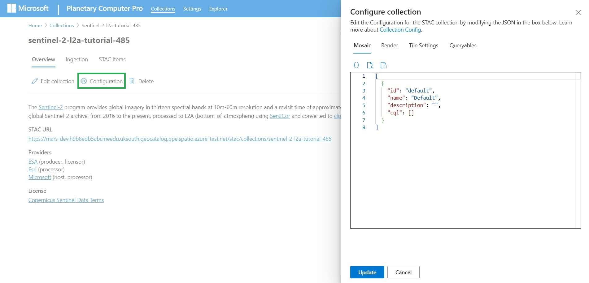

# Quickstart: Configure a collection with the Microsoft Planetary Computer Pro web interface

This quickstart explains how to configure a collection in Microsoft Planetary Computer Pro via the web interface.

## Prerequisites

To complete this quickstart, you need:

- An Azure account with an active subscription. Use the link [Create an account for free](https://azure.microsoft.com/free/?WT.mc_id=A261C142F).
- An active GeoCatalog instance. Use the link to [Create a GeoCatalog](./deploy-geocatalog-resource.md).
- An Azure blob storage container with:
  - A geospatial dataset in a supported format. For more information, see [Supported data types.](./supported-data-types.md)
  - Associated SpatioTemporal Asset Catalog (STAC) metadata for the dataset. For more information, see [Create STAC Item.](./create-stac-item.md)
- A web browser to access the Planetary Computer Pro web interface.
- A collection in Microsoft Planetary Computer Pro with at least one item in it. 

## Configure a collection

To configure a collection in the Microsoft Planetary Computer Pro web interface, follow these steps:

1. Navigate to the **Overview** tab of your collection, and select the **Configuration** button.
   
2. The **Configure collection** panel opens and there are tabs for **Mosaic**, **Render**, **Tile Settings**, and **Queryables**, each of which you can define in JSON format. You can either write your own JSON or load and modify a template. 

 

| Configuration | Purpose | Quick Start |
|--------------------|---------|-----------------|
| **Mosaic**         | Configure how items are mosaicked in your collection. | [Mosaic configuration](./mosaic-configurations-for-collections.md) |
| **Render**         | Specify how data is visualized in the Explorer. | [Render configuration](./render-configuration.md) |
| **Tile Settings**  | Set map tile parameters for your collection. | [Tile settings](./tile-settings.md) |
| **Queryables**     | Add custom search filters for Explorer. | [Queryables configuration](./queryables-for-explorer-custom-search-filter.md) |

> [!NOTE]
> While it's helpful to define configuration JSONs for all four tabs, only the [Render configuration](./render-configuration.md) is required to visualize your data in the Explorer. The other three tabs are optional and can be used to customize the behavior of your collection in the Explorer.

3. Once you define your configuration JSONs, select **Update** to save your changes.
   
4. When you successfully configure your collection, there's a selectable **Launch in Explorer** button below the **Spatial Extent** basemap on the right-hand side of your collection's **Overview** tab. Select this button to open the Explorer and visualize your data.
 
## Next steps

Now that your collection is ready to be visualized, it's time to view it in the Explorer.

> [!div class="nextstepaction"]
> [Quickstart: Use the Microsoft Planetary Computer Pro Explorer](./use-explorer.md)
