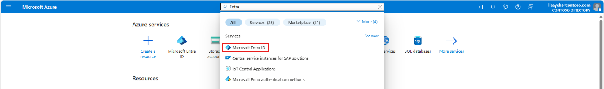
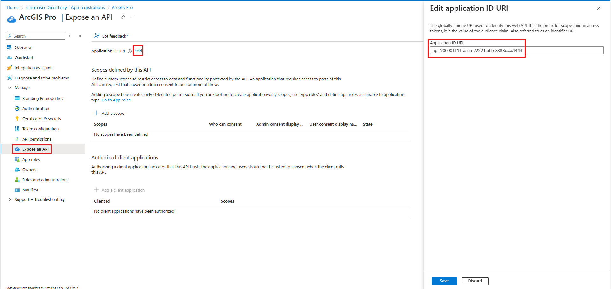
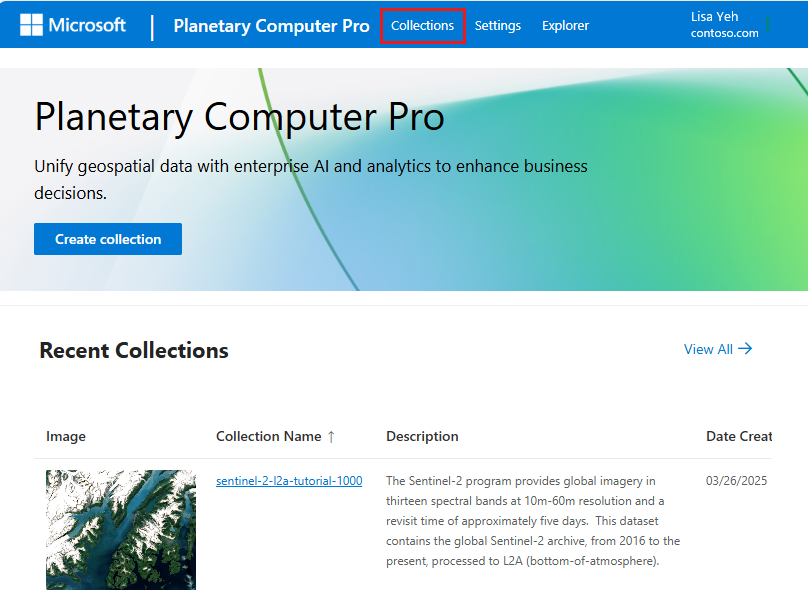

# Configure ArcGIS Pro to access a GeoCatalog

This guide demonstrates how to configure ArcGIS Pro to access geospatial datasets from the Microsoft Planetary Computer Pro GeoCatalog using OAuth 2.0 delegated authentication with Microsoft Entra ID. This requires registering two applications in Microsoft Entra ID (a Web API and a Desktop client), configuring delegated permissions with user_impersonation scope, and connecting ArcGIS Pro to Azure Blob Storage and SpatioTemporal Access Catalog (STAC) compliant datasets hosted in the Microsoft Planetary Computer Pro environment.

By the end of this guide, you'll be able to securely browse and access Microsoft Planetary Computer-hosted data directly in ArcGIS Pro using Microsoft Entra ID user impersonation.

## Prerequisites

- Access to a Microsoft Entra ID tenant
- Azure subscription with permissions to manage app registrations
- ArcGIS Pro installed on your machine

> [!TIP] 
> Before you begin, review [Register an application in Microsoft Entra ID](/entra/identity-platform/quickstart-register-app) for background information on app registration.

## Register web API application for ArcGIS Pro

1. Open the Azure Portal and go to **Microsoft Entra ID**.

    [  ](media/microsoft-entra-id.png#lightbox)

1. Navigate to **App registrations** \> **New registration**.

    [  ](media/new-app-registration.png#lightbox)

1. Register the Web API app. Suggested names:
    - ArcGISPro-GeoCatalog-WebAPI or 
    - ArcGIS Pro

1. Set **Multitenant** as the account type.
    [  ](media/register-an-app-arcgis-pro.png#lightbox)

    [  ](media/new-app-registration-arcgis-pro.png#lightbox)

1. After registration, complete the following configuration within the new app registration ArcGIS Pro.

   - Go to the **Authentication** tab.

   - Add platform: **Web**.

   [  ](media/add-web-platform.png#lightbox)

1. Set **Redirect URI**: <https://localhost>.
  
    [  ](media/add-redirect-uri.png#lightbox)

1. Add platform: **Mobile and Desktop applications**

    [  ](media/add-mobile-desktop-app.png#lightbox)
    
1. Set **Custom Redirect URI**: arcgis-pro://auth.

    [  ](media/configure-desktop-device.png#lightbox)

1. Enable **ID tokens** under **Implicit grant and hybrid flows**.

1. Select **Save**.

    [  ](media/enable-id-tokens.png#lightbox)

1. Go to **API Permissions**.

    - Add and grant admin consent for:
      - Azure Storage \> user_impersonation.
      - Microsoft Graph \> User.Read (This permission is enabled by default).
    
    [  ](media/add-api-permissions.png#lightbox)

1. **Grant admin consent** after permissions are added.

    [  ](media/grant-admin-consent.png#lightbox)

1. Go to **Expose an API**.

    - Add **App ID URI**.

    [  ](media/add-app-id-uri.png#lightbox)

1. Define scopes:

    - user_authentication (Display name: ArcGISPro-API-User-Auth)
    - user_impersonation (Display name: ArcGISPro-API-Impersonation)

    [  ](media/add-user-authentication-scope.png#lightbox)
    
    [  ](media/add-user-impersonation-scope.png#lightbox)

1. Select **Add a client application** and note the App ID.

    [  ](media/add-a-client-app.png#lightbox)

## Register desktop client application for ArcGIS Pro 

Register a second application (with a distinct name) to represent ArcGIS
Pro Desktop and configure its API permissions --- ensuring it includes
access to the web API exposed by the first application.

1. Create a second app registration for the ArcGIS Pro desktop client.

    - Suggested name: ArcGISPro-GeoCatalog-DesktopClient or GeoCatalog-ArcGIS.
    
    - Set account type: **Single tenant**.

    [  ](media/register-second-app-arcgis-pro-desktop-client.png#lightbox)

    [  ](media/new-app-registration-geocatalog-arcgis.png#lightbox)

1. Configure the Desktop Client App.

    Complete the following configuration within the new App registration GeoCatalog-ArcGIS.

    - For **Authentication**, repeat the same steps as in Step 1:
    
      - Add platform: **Web**.
      - Set **Redirect URI**: https://localhost.
      - Add platform.
      - Set **Redirect URI**: arcgis-pro://auth.
      - Enable **ID tokens** under **Implicit grant and hybrid flows**.
      - Select **Save**.

    - **API Permissions**: Adding Access to the Web API App.
    
      - In the **API permissions** tab, select **Add a permission**.
    
      - Go to the **APIs my organization uses** tab and search for the **Web
        API app** created in Step 1 (for example, ArcGIS Pro).
    
      - Select the app name to open the **Request API Permissions** screen.

   [  ](media/request-api-permissions.png#lightbox)

    - Select both user_authentication and user_impersonation; the delegated permissions defined in the first app.

    - Select **Add permissions**.

    [  ](media/add-api-permissions-arcgis-pro.png#lightbox)

    - Continue to add the following delegated permissions:
    
      - **Azure Storage** \> user_impersonation.
      - **Azure Orbital Spatio** \> user_impersonation.
      - **Microsoft Graph** \> User.Read (This permission is enabled by default).
      - Select **Add permissions**.
      - Select **Grant admin consent**.
    
    [  ](media/app-selection-on-request-api-permissions-screen.png#lightbox)
  
    [  ](media/grant-admin-consents-4.png#lightbox)

## Configure ArcGIS Pro (Desktop) for Microsoft Planetary Computer Pro GeoCatalog access

This section outlines how to configure authentication and data access in the **ArcGIS Pro desktop application**, using OAuth 2.0 integration with **Microsoft Entra ID** and access to the **Microsoft Planetary Computer Pro GeoCatalog**. It includes steps to add an authentication connection and create storage and STAC data connections.

## Add an authentication connection

1. Open the **ArcGIS Pro settings** page in one of the following ways:

    - From an open project, select the **Project** tab on the ribbon.
    - From the start page, select the **Settings** tab.

1. In the side menu, select **Options**.

1. In the **Options** dialog box, under **Application**, select **Authentication**.

1. Select **Add Connection** to add a new authentication connection.

1. In the **Add Connection** dialog box:

    - Enter a **Connection Name**.

    - For **Type**, select **Microsoft Entra ID**.

    - Enter your **Entra Domain** and **Client ID**.

    - Add the following **scopes**:

      - `https://storage.azure.com/.default`

      - `https://geocatalog.spatio.azure.com/.default`

    [  ](media/add-connection.png#lightbox)

    - Select **OK**.
    
    - Sign in through the Authentication dialog and complete the prompts.
    
    [  ](media/sign-in.png#lightbox)

> [!TIP] 
> For more information, see the official ArcGIS Pro documentation [Connect to authentication providers from ArcGIS Pro](https://pro.arcgis.com/en/pro-app/latest/get-started/connect-to-authentication-providers-from-arcgis-pro.htm).


## Prepare and record GeoCatalog information

1. Create an Microsoft Planetary Computer Pro GeoCatalog in your Azure subscription (for example,
     arcgisprogeocatalog), and locate it in the appropriate resource group.

    [  ](media/find-hidden-type-geocatalog.png#lightbox)

1. Select on the GeoCatalog. For example, **arcgisprogeocatalog**.

1. Record the **GeoCatalog URI**. For example, **https://arcgisprogeocatalog.\<unique-identity\>.\<cloud-region\>.geocatalog.spatio.azure.com**.

    [  ](media/get-geocatalog-uri.png#lightbox)

1. Open the link to your GeoCatalog URI in the browser and select on the
    **Collections** button

    [  ](media/media-processing-center-pro-collections.png#lightbox)

1. Record the **Collection Name**. For example, sentinel-2-l2a-tutorial-1000.

1. Construct the **Token API Endpoint** using this pattern:

      ```bash
    \<GeoCatalog URI\>/sas/token/\<Collection Name\api-version=2025-04-30-preview
      ```  
    
    Example:
    
    ```bash
    https://arcgisprogeocatalog.\<unique-identity\>.\<cloud-region\>.geocatalog.spatio.azure.com/sas/token/sentinel-2-l2a-tutorial-1000?api-version=2025-04-30-preview
    ```

1. Select the collection name.

    [  ](media/click-on-collection-name.png#lightbox)

1. Select the **Edit collection** button.

    [  ](media/edit-collection.png#lightbox)

1. In the resulting JSON display, locate the key "**title:assets:thumbnail:href**" and copy the corresponding value. For example:

    ```bash
    https://\<unique-storage\>.blob.core.windows.net/sentinel-2-l2a-tutorial-1000-\<unique-id\>/collection-assets/thumbnail/lulc.png
    ```

1. Record the value of Account Name and Container Name:

    - **Account Name**: for example \<unique-storage\>
    - **Container Name**: for example sentinel-2-l2a-tutorial-1000-\<unique-id\>

    [  ](media/collection-json-display.png#lightbox)

## Set up a connection to Azure Blob 

1. In ArcGIS Pro, open the **Create Cloud Storage Connection File** geoprocessing tool to create a new ACS connection file. This tool can be accessed in the main Ribbon on the Analysis Tab. Select the Tools Button, then search for the tool by typing its name.

1. Specify a Connection File Location for the ACS file.

1. Provide a Connection File Name. For example, **geocatalog_connection.acs**.

1. For Service Provider select Azure.

1. For **Authentication**, select the name of the auth profile that you created in previous steps.

1. For **Access Key ID (Account Name)**, use the **Account Name** value that you recorded earlier: \<unique-storage\>.

1. For **Bucket (Container) Name** use the **Container Name** value that you recorded earlier: sentinel-2-l2a-tutorial-1000-\<unique-id\>.

1. Add the provider option **ARC_TOKEN_SERVICE_API** and set the value to your **Token API Endpoint** that you constructed earlier. For example:

    ```bash
    https://arcgisprogeocatalog.\<unique-identity\>.\<cloud-region\>.geocatalog.spatio.azure.com/api/token/sentinel-2-l2a-tutorial-1000?api=version=2025-04-30-preview
    ```

1. Add the provider option **ARC_TOKEN_OPTION_NAME** and set the value **to AZURE_STORAGE_SAS_TOKEN**.

    [  ](media/create-cloud-storage-connection-file-sample.png#lightbox)

## Create a STAC connection to Microsoft Planetary Computer Pro

1. Create a new STAC connection in ArcGIS Pro (desktop).

    > [!TIP] 
    > Refer to ArcGIS Pro documentation to [Create a STAC connection](https://pro.arcgis.com/en/pro-app/latest/help/data/imagery/create-a-stac-connection.htm).

    [  ](media/create-new-stac-connection.png#lightbox)

    - Provide a name for the STAC Connection: For example, GeoCatalog_Connection.
    
    - For Connection use the form```\<GeoCatalog URI\>/api```. For example,
      ```bash
        https://arcgisprogeocatalog.\<unique-identity\>.\<cloud-storage\>.geocatalog.spatio.azure.com/api
        ```

    - Reference the Authentication settings made in previous step.
    
    - Add the ACS connection file that was created in previous step to the STAC connection.

    - Select **OK**.

    [  ](media/create-stac-connection.png#lightbox)

1. Explore the STAC connection.

    > [!TIP] 
    > Learn more about the ArcGIS [Explore STAC Pane](https://pro.arcgis.com/en/pro-app/latest/help/data/imagery/explore-stac.htm).

    [  ](media/explore-stac.png#lightbox)

    - Search, fetch extensive STAC metadata, and view the browse images.
    
    - Add selected images to Map or Scene.
    
    [  ](media/explore-stac-data.png#lightbox)


## Related content

- [Create cloud storage connection file](https://pro.arcgis.com/en/pro-app/latest/tool-reference/data-management/create-cloud-storage-connection-file.htm)
- [Create a new GeoCatalog](./deploy-geocatalog-resource.md)
- [Create a STAC collection](./create-stac-collection.md)
