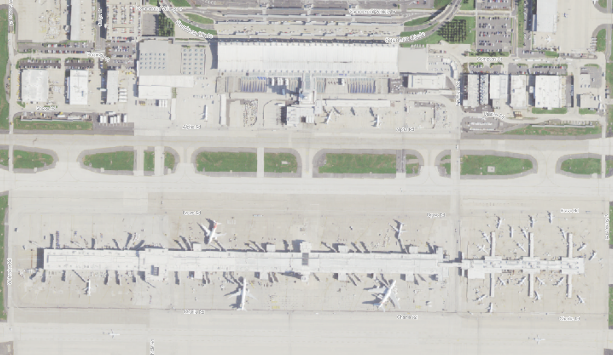
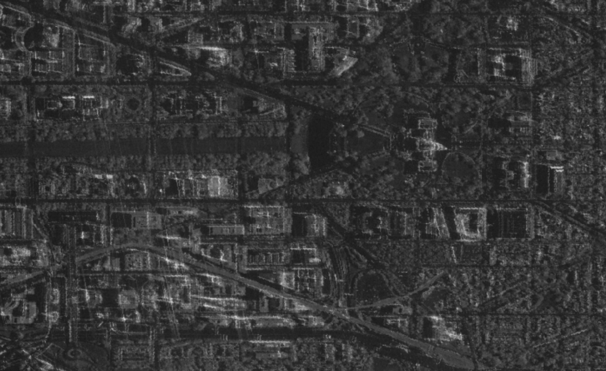
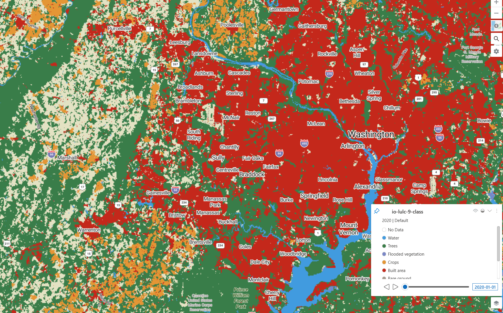

# Microsoft Planetary Computer Pro data visualization gallery

This gallery provides ready-to-use configuration examples for visualizing common geospatial data types in Microsoft Planetary Computer Pro. Each example includes comprehensive JSON configurations for [mosaics](./mosaic-configurations-for-collections.md), [render options](./render-configuration.md), [tile settings](./tile-settings.md), and [SpatioTemporal Asset Catalog (STAC) collection](./stac-overview.md) metadata that you can adapt for your own datasets.

## Table of contents

- [Prerequisites](#prerequisites)
- [How to use these examples](#how-to-use-these-examples)
- [Sentinel-2-l2a Multi-Spectral Imagery](#sentinel-2-l2a-collection-configuration)
- [The National Agriculture Imagery Program Aerial Imagery](#the-national-agriculture-imagery-program-collection-configuration)
- [Umbra Synthetic Aperture Radar Imagery](#umbra-sar-imagery-collection-configuration)
- [Impact Observatory Land Use/Land Cover 9-class](#impact-observatory-land-useland-cover-9-class-collection-configuration)

## Prerequisites

Before using these examples, you should have:

- A deployed [Microsoft Planetary Computer Pro GeoCatalog resource](./deploy-geocatalog-resource.md)
- Basic familiarity with [STAC concepts](./stac-overview.md) and [collection configuration](./collection-configuration-concept.md)
- Data [ingested into a STAC collection](./ingestion-overview.md)

## How to use these examples

Each example in this gallery includes:

- **Description and context** - Information about the data source and visualization approach
- **Visual example** - Screenshot of the rendered data in the Explorer
- **Complete configuration settings** organized in tabs:
   - **Mosaic** - How to filter and select items for display
   - **Render Options** - How to style and visualize the data
   - **Tile Settings** - How to optimize display parameters
   - **STAC Collection** - The underlying collection metadata structure

To apply these examples to your own data:

1. [Create a new collection](./create-collection-web-interface.md) in your GeoCatalog
2. [Ingest Data](./ingestion-overview.md) into the collection. 
2. Navigate to the [collection's configuration](./configure-collection-web-interface.md) page
3. Modify the example JSON to match your dataset's specific bands, assets, and properties
4. Apply the configurations to your collection
5. View the results in the [Explorer](./use-explorer.md)

## Sentinel-2-l2a collection configuration

[  ](media/sentinel-2-imagery.png#lightbox)

[Sentinel-2](https://planetarycomputer.microsoft.com/dataset/sentinel-2-l2) is a high-resolution, multi-spectral imaging mission from the European Space Agency (ESA) as part of the Copernicus Program.

## Sentinel-2 configuration details

# [Mosaic](#tab/sentinel-2-l2a-grindavik-mosaics)

## Mosaic configuration

This mosaic configuration tells the Explorer to display the most recent Sentinel-2 images from the collection, but only those images with cloud cover less than or equal to 40%. The Common Query Language (CQL) filter ensures that only relatively clear images are included, making the visualization more useful for most applications. Each mosaic entry can define different criteria for selecting and combining images, and this mosaic example uses a single "default" mosaic focused on recent, low-cloud imagery.

```json
[
  {
    "id": "default",
    "name": "Most recent available",
    "description": "Most recent available imagery in this Sentinel-2 collection",
    "cql": [
      {
        "op": "<=",
        "args": [
          {
            "property": "eo:cloud_cover"
          },
          40
        ]
      }
    ]
  }
]
```

# [Render Options](#tab/sentinel-2-l2a-grindavik-render-options)

## Render options configuration

This render configuration defines several ways to visualize Sentinel-2 satellite imagery in the Explorer. Each entry describes a different style or scientific product, such as **Natural color** (what you’d see with your eyes), **Color infrared** (to highlight vegetation), or **Normalized Difference Vegetation Index (NDVI)** (a vegetation health index).

The `options` string specifies how to visualize the data:

- `assets=B04&assets=B03&assets=B02`:  
  This assets parameter tells the system which bands (layers of satellite data) to use for the image. For example, B04 is red, B03 is green, and B02 is blue—together, they make a true-color image.

- `nodata=0`:  
  Any pixel with a value of 0 is treated as missing or transparent.

- `color_formula=Gamma RGB 3.2 Saturation 0.8 Sigmoidal RGB 25 0.35`:  
  This gamma adjustment applies color corrections to make the image look more natural or visually appealing.  
  - **Gamma** adjusts brightness  
  - **Saturation** changes color intensity  
  - **Sigmoidal** adjusts contrast

- `expression=(B08-B04)/(B08+B04)`:  
  For NDVI and NDWI, this expression parameter calculates a mathematical formula using the bands to create a new image that highlights vegetation or moisture.

- `rescale=-1,1`:  
  This rescale parameter stretches the calculated values to fit a color scale, so the results are easy to interpret.

- `colormap_name=rdylgn`:  
  This colormap parameter applies a color palette (red-yellow-green) to the result, making it easier to see differences.

```json
[
  {
    "id": "natural-color",
    "name": "Natural color",
    "description": "True color composite of visible bands (B04, B03, B02)",
    "type": "raster-tile",
    "options": "assets=B04&assets=B03&assets=B02&nodata=0&color_formula=Gamma RGB 3.2 Saturation 0.8 Sigmoidal RGB 25 0.35",
    "minZoom": 9
  },
  {
    "id": "natural-color-pre-feb-2022",
    "name": "Natural color (pre Feb, 2022)",
    "description": "Pre-Feb 2022 true color composite of visible bands (B04, B03, B02)",
    "type": "raster-tile",
    "options": "assets=B04&assets=B03&assets=B02&nodata=0&color_formula=Gamma RGB 3.7 Saturation 1.5 Sigmoidal RGB 15 0.35",
    "minZoom": 9
  },
  {
    "id": "color-infrared",
    "name": "Color infrared",
    "description": "Highlights healthy (red) and unhealthy (blue/gray) vegetation (B08, B04, B03).",
    "type": "raster-tile",
    "options": "assets=B08&assets=B04&assets=B03&nodata=0&color_formula=Gamma RGB 3.7 Saturation 1.5 Sigmoidal RGB 15 0.35",
    "minZoom": 9
  },
  {
    "id": "short-wave-infrared",
    "name": "Short wave infrared",
    "description": "Darker shades of green indicate denser vegetation. Brown is indicative of bare soil and built-up areas (B12, B8A, B04).",
    "type": "raster-tile",
    "options": "assets=B12&assets=B8A&assets=B04&nodata=0&color_formula=Gamma RGB 3.7 Saturation 1.5 Sigmoidal RGB 15 0.35",
    "minZoom": 9
  },
  {
    "id": "agriculture",
    "name": "Agriculture",
    "description": "Darker shades of green indicate denser vegetation (B11, B08, B02).",
    "type": "raster-tile",
    "options": "assets=B11&assets=B08&assets=B02&nodata=0&color_formula=Gamma RGB 3.7 Saturation 1.5 Sigmoidal RGB 15 0.35",
    "minZoom": 9
  },
  {
    "id": "normalized-difference-veg-inde",
    "name": "Normalized Difference Veg. Index (NDVI)",
    "description": "Normalized Difference Vegetation Index (B08-B04)/(B08+B04), darker green indicates healthier vegetation.",
    "type": "raster-tile",
    "options": "nodata=0&expression=(B08-B04)/(B08+B04)&rescale=-1,1&colormap_name=rdylgn&asset_as_band=true",
    "minZoom": 9
  },
  {
    "id": "moisture-index-ndwi",
    "name": "Moisture Index (NDWI)",
    "description": "Index indicating water stress in plants (B8A-B11)/(B8A+B11)",
    "type": "raster-tile",
    "options": "nodata=0&expression=(B8A-B11)/(B8A+B11)&rescale=-1,1&colormap_name=rdbu&asset_as_band=true",
    "minZoom": 9
  },
  {
    "id": "atmospheric-penetration",
    "name": "Atmospheric penetration",
    "description": "False color rendering with non-visible bands to reduce effects of atmospheric particles (B12, B11, B8A).",
    "type": "raster-tile",
    "options": "nodata=0&assets=B12&assets=B11&assets=B8A&color_formula=Gamma RGB 3.7 Saturation 1.5 Sigmoidal RGB 15 0.35",
    "minZoom": 9
  }
]
```

# [Tile Settings](#tab/sentinel-2-l2a-grindavik-tile-settings)

## Tile settings configuration

The tile settings configuration controls the display behavior and performance characteristics of the Sentinel-2 imagery in the Explorer.

**Key Parameters:**

* **`minZoom: 8`**: Sets the minimum zoom level at which the Sentinel-2 imagery becomes visible. This moderate zoom level setting is appropriate for Sentinel-2's resolution (10 meter for most bands, 20 meter for some bands, 60 meter for atmospheric bands), allowing the imagery to be useful for regional to local-scale analysis starting around zoom levels 8-12.

* **`maxItemsPerTile: 35`**: Controls how many individual Sentinel-2 scenes can be composited together in each tile. This compositing setting balances performance with temporal coverage completeness, ensuring multiple scenes can be combined for better coverage while maintaining rendering performance.

* **`defaultLocation: null`**: No default location is specified, allowing users to navigate to any area of interest globally.

This tile settings configuration optimizes the balance between data visibility and performance for Sentinel-2's moderate resolution imagery, making it suitable for a wide range of applications from regional monitoring to detailed local analysis. 

```json
{
  "minZoom": 8,
  "maxItemsPerTile": 35,
  "defaultLocation": null
}
```

# [STAC Collection](#tab/sentinel-2-l2a-grindavik-stac)

## STAC collection configuration

The STAC Collection configuration defines the core metadata for this Sentinel-2 collection.

The `item_assets` section in the STAC Collection JSON serves as a critical catalog of all available data assets in the collection. It defines each spectral band (B01-B12, B8A, etc.) and its properties, including:

* Asset keys (like "B04", "B03") that are referenced by the render configuration
* Metadata about each band (resolution, data type, roles)
* Band descriptions that explain what each band represents (B04 is "red", B08 is "near infrared")
* Wavelength information useful for scientific applications

The render configuration directly references these asset keys to create different visualizations. For example, when the render configuration specifies `assets=B04&assets=B03&assets=B02`, it's pulling the red, green, and blue bands defined in item_assets to create a natural color image. 

```json
{
  "id": "sentinel-2-l2a_Grindavik",
  "type": "Collection",
  "links": [
    {
      "rel": "items",
      "type": "application/geo+json",
      "href": "https://{geocatalog_id}/stac/collections/sentinel-2-l2a_Grindavik/items"
    },
    {
      "rel": "parent",
      "type": "application/json",
      "href": "https://{geocatalog_id}/stac/"
    },
    {
      "rel": "root",
      "type": "application/json",
      "href": "https://{geocatalog_id}/stac/"
    },
    {
      "rel": "self",
      "type": "application/json",
      "href": "https://{geocatalog_id}/stac/collections/sentinel-2-l2a_Grindavik"
    },
    {
      "rel": "license",
      "href": "https://scihub.copernicus.eu/twiki/pub/SciHubWebPortal/TermsConditions/Sentinel_Data_Terms_and_Conditions.pdf",
      "title": "Copernicus Sentinel data terms"
    },
    {
      "rel": "describedby",
      "href": "https://planetarycomputer.microsoft.com/dataset/sentinel-2-l2a",
      "type": "text/html",
      "title": "Human readable dataset overview and reference"
    }
  ],
  "title": "Sentinel-2-l2a",
  "assets": {
    "thumbnail": {
      "href": "https://{storage_account}.blob.core.windows.net/{blob_container}/collection-assets/thumbnail/blob",
      "type": "image/png",
      "roles": [
        "thumbnail"
      ],
      "title": "sentinel-2-l2a_Grindavik thumbnail"
    }
  },
  "extent": {
    "spatial": {
      "bbox": [
        [
          -180,
          -90,
          180,
          90
        ]
      ]
    },
    "temporal": {
      "interval": [
        [
          "2015-06-27T10:25:31Z",
          null
        ]
      ]
    }
  },
  "license": "proprietary",
  "keywords": [
    "Sentinel",
    "Copernicus",
    "ESA",
    "Satellite",
    "Global",
    "Imagery",
    "Reflectance"
  ],
  "providers": [
    {
      "url": "https://sentinel.esa.int/web/sentinel/missions/sentinel-2",
      "name": "ESA",
      "roles": [
        "producer",
        "licensor"
      ]
    },
    {
      "url": "https://www.esri.com/",
      "name": "Esri",
      "roles": [
        "processor"
      ]
    },
    {
      "url": "https://planetarycomputer.microsoft.com",
      "name": "Microsoft",
      "roles": [
        "host",
        "processor"
      ]
    }
  ],
  "summaries": {
    "gsd": [
      10,
      20,
      60
    ],
    "eo:bands": [
      {
        "name": "AOT",
        "description": "aerosol optical thickness"
      },
      {
        "gsd": 60,
        "name": "B01",
        "common_name": "coastal",
        "description": "coastal aerosol",
        "center_wavelength": 0.443,
        "full_width_half_max": 0.027
      },
      {
        "gsd": 10,
        "name": "B02",
        "common_name": "blue",
        "description": "visible blue",
        "center_wavelength": 0.49,
        "full_width_half_max": 0.098
      },
      {
        "gsd": 10,
        "name": "B03",
        "common_name": "green",
        "description": "visible green",
        "center_wavelength": 0.56,
        "full_width_half_max": 0.045
      },
      {
        "gsd": 10,
        "name": "B04",
        "common_name": "red",
        "description": "visible red",
        "center_wavelength": 0.665,
        "full_width_half_max": 0.038
      },
      {
        "gsd": 20,
        "name": "B05",
        "common_name": "rededge",
        "description": "vegetation classification red edge",
        "center_wavelength": 0.704,
        "full_width_half_max": 0.019
      },
      {
        "gsd": 20,
        "name": "B06",
        "common_name": "rededge",
        "description": "vegetation classification red edge",
        "center_wavelength": 0.74,
        "full_width_half_max": 0.018
      },
      {
        "gsd": 20,
        "name": "B07",
        "common_name": "rededge",
        "description": "vegetation classification red edge",
        "center_wavelength": 0.783,
        "full_width_half_max": 0.028
      },
      {
        "gsd": 10,
        "name": "B08",
        "common_name": "nir",
        "description": "near infrared",
        "center_wavelength": 0.842,
        "full_width_half_max": 0.145
      },
      {
        "gsd": 20,
        "name": "B8A",
        "common_name": "rededge",
        "description": "vegetation classification red edge",
        "center_wavelength": 0.865,
        "full_width_half_max": 0.033
      },
      {
        "gsd": 60,
        "name": "B09",
        "description": "water vapor",
        "center_wavelength": 0.945,
        "full_width_half_max": 0.026
      },
      {
        "gsd": 20,
        "name": "B11",
        "common_name": "swir16",
        "description": "short-wave infrared, snow/ice/cloud classification",
        "center_wavelength": 1.61,
        "full_width_half_max": 0.143
      },
      {
        "gsd": 20,
        "name": "B12",
        "common_name": "swir22",
        "description": "short-wave infrared, snow/ice/cloud classification",
        "center_wavelength": 2.19,
        "full_width_half_max": 0.242
      }
    ],
    "platform": [
      "Sentinel-2A",
      "Sentinel-2B"
    ],
    "instruments": [
      "msi"
    ],
    "constellation": [
      "sentinel-2"
    ],
    "view:off_nadir": [
      0
    ]
  },
  "description": "The [Sentinel-2](https://sentinel.esa.int/web/sentinel/missions/sentinel-2) program provides global imagery in thirteen spectral bands at 10m-60m resolution and a revisit time of approximately five days.  This dataset represents the global Sentinel-2 archive, from 2016 to the present, processed to L2A (bottom-of-atmosphere) using [Sen2Cor](https://step.esa.int/main/snap-supported-plugins/sen2cor/) and converted to [cloud-optimized GeoTIFF](https://www.cogeo.org/) format.",
  "item_assets": {
    "AOT": {
      "gsd": 10,
      "type": "image/tiff; application=geotiff; profile=cloud-optimized",
      "roles": [
        "data"
      ],
      "title": "Aerosol optical thickness (AOT)"
    },
    "B01": {
      "gsd": 60,
      "type": "image/tiff; application=geotiff; profile=cloud-optimized",
      "roles": [
        "data"
      ],
      "title": "Band 1 - Coastal aerosol - 60m",
      "eo:bands": [
        {
          "name": "B01",
          "common_name": "coastal",
          "description": "Band 1 - Coastal aerosol",
          "center_wavelength": 0.443,
          "full_width_half_max": 0.027
        }
      ]
    },
    "B02": {
      "gsd": 10,
      "type": "image/tiff; application=geotiff; profile=cloud-optimized",
      "roles": [
        "data"
      ],
      "title": "Band 2 - Blue - 10m",
      "eo:bands": [
        {
          "name": "B02",
          "common_name": "blue",
          "description": "Band 2 - Blue",
          "center_wavelength": 0.49,
          "full_width_half_max": 0.098
        }
      ]
    },
    "B03": {
      "gsd": 10,
      "type": "image/tiff; application=geotiff; profile=cloud-optimized",
      "roles": [
        "data"
      ],
      "title": "Band 3 - Green - 10m",
      "eo:bands": [
        {
          "name": "B03",
          "common_name": "green",
          "description": "Band 3 - Green",
          "center_wavelength": 0.56,
          "full_width_half_max": 0.045
        }
      ]
    },
    "B04": {
      "gsd": 10,
      "type": "image/tiff; application=geotiff; profile=cloud-optimized",
      "roles": [
        "data"
      ],
      "title": "Band 4 - Red - 10m",
      "eo:bands": [
        {
          "name": "B04",
          "common_name": "red",
          "description": "Band 4 - Red",
          "center_wavelength": 0.665,
          "full_width_half_max": 0.038
        }
      ]
    },
    "B05": {
      "gsd": 20,
      "type": "image/tiff; application=geotiff; profile=cloud-optimized",
      "roles": [
        "data"
      ],
      "title": "Band 5 - Vegetation red edge 1 - 20m",
      "eo:bands": [
        {
          "name": "B05",
          "common_name": "rededge",
          "description": "Band 5 - Vegetation red edge 1",
          "center_wavelength": 0.704,
          "full_width_half_max": 0.019
        }
      ]
    },
    "B06": {
      "gsd": 20,
      "type": "image/tiff; application=geotiff; profile=cloud-optimized",
      "roles": [
        "data"
      ],
      "title": "Band 6 - Vegetation red edge 2 - 20m",
      "eo:bands": [
        {
          "name": "B06",
          "common_name": "rededge",
          "description": "Band 6 - Vegetation red edge 2",
          "center_wavelength": 0.74,
          "full_width_half_max": 0.018
        }
      ]
    },
    "B07": {
      "gsd": 20,
      "type": "image/tiff; application=geotiff; profile=cloud-optimized",
      "roles": [
        "data"
      ],
      "title": "Band 7 - Vegetation red edge 3 - 20m",
      "eo:bands": [
        {
          "name": "B07",
          "common_name": "rededge",
          "description": "Band 7 - Vegetation red edge 3",
          "center_wavelength": 0.783,
          "full_width_half_max": 0.028
        }
      ]
    },
    "B08": {
      "gsd": 10,
      "type": "image/tiff; application=geotiff; profile=cloud-optimized",
      "roles": [
        "data"
      ],
      "title": "Band 8 - NIR - 10m",
      "eo:bands": [
        {
          "name": "B08",
          "common_name": "nir",
          "description": "Band 8 - NIR",
          "center_wavelength": 0.842,
          "full_width_half_max": 0.145
        }
      ]
    },
    "B09": {
      "gsd": 60,
      "type": "image/tiff; application=geotiff; profile=cloud-optimized",
      "roles": [
        "data"
      ],
      "title": "Band 9 - Water vapor - 60m",
      "eo:bands": [
        {
          "name": "B09",
          "description": "Band 9 - Water vapor",
          "center_wavelength": 0.945,
          "full_width_half_max": 0.026
        }
      ]
    },
    "B11": {
      "gsd": 20,
      "type": "image/tiff; application=geotiff; profile=cloud-optimized",
      "roles": [
        "data"
      ],
      "title": "Band 11 - SWIR (1.6) - 20m",
      "eo:bands": [
        {
          "name": "B11",
          "common_name": "swir16",
          "description": "Band 11 - SWIR (1.6)",
          "center_wavelength": 1.61,
          "full_width_half_max": 0.143
        }
      ]
    },
    "B12": {
      "gsd": 20,
      "type": "image/tiff; application=geotiff; profile=cloud-optimized",
      "roles": [
        "data"
      ],
      "title": "Band 12 - SWIR (2.2) - 20m",
      "eo:bands": [
        {
          "name": "B12",
          "common_name": "swir22",
          "description": "Band 12 - SWIR (2.2)",
          "center_wavelength": 2.19,
          "full_width_half_max": 0.242
        }
      ]
    },
    "B8A": {
      "gsd": 20,
      "type": "image/tiff; application=geotiff; profile=cloud-optimized",
      "roles": [
        "data"
      ],
      "title": "Band 8A - Vegetation red edge 4 - 20m",
      "eo:bands": [
        {
          "name": "B8A",
          "common_name": "rededge",
          "description": "Band 8A - Vegetation red edge 4",
          "center_wavelength": 0.865,
          "full_width_half_max": 0.033
        }
      ]
    },
    "SCL": {
      "gsd": 20,
      "type": "image/tiff; application=geotiff; profile=cloud-optimized",
      "roles": [
        "data"
      ],
      "title": "Scene classfication map (SCL)"
    },
    "WVP": {
      "gsd": 10,
      "type": "image/tiff; application=geotiff; profile=cloud-optimized",
      "roles": [
        "data"
      ],
      "title": "Water vapour (WVP)"
    },
    "visual": {
      "gsd": 10,
      "type": "image/tiff; application=geotiff; profile=cloud-optimized",
      "roles": [
        "data"
      ],
      "title": "True color image",
      "eo:bands": [
        {
          "name": "B04",
          "common_name": "red",
          "description": "Band 4 - Red",
          "center_wavelength": 0.665,
          "full_width_half_max": 0.038
        },
        {
          "name": "B03",
          "common_name": "green",
          "description": "Band 3 - Green",
          "center_wavelength": 0.56,
          "full_width_half_max": 0.045
        },
        {
          "name": "B02",
          "common_name": "blue",
          "description": "Band 2 - Blue",
          "center_wavelength": 0.49,
          "full_width_half_max": 0.098
        }
      ]
    },
    "preview": {
      "type": "image/tiff; application=geotiff; profile=cloud-optimized",
      "roles": [
        "thumbnail"
      ],
      "title": "Thumbnail"
    },
    "safe-manifest": {
      "type": "application/xml",
      "roles": [
        "metadata"
      ],
      "title": "SAFE manifest"
    },
    "granule-metadata": {
      "type": "application/xml",
      "roles": [
        "metadata"
      ],
      "title": "Granule metadata"
    },
    "inspire-metadata": {
      "type": "application/xml",
      "roles": [
        "metadata"
      ],
      "title": "INSPIRE metadata"
    },
    "product-metadata": {
      "type": "application/xml",
      "roles": [
        "metadata"
      ],
      "title": "Product metadata"
    },
    "datastrip-metadata": {
      "type": "application/xml",
      "roles": [
        "metadata"
      ],
      "title": "Datastrip metadata"
    }
  },
  "msft:region": "westeurope",
  "stac_version": "1.0.0",
  "msft:_created": "2024-04-05T19:04:14.168175Z",
  "msft:_updated": "2024-08-26T18:24:05.194898Z",
  "msft:container": "sentinel2-l2",
  "stac_extensions": [
    "https://stac-extensions.github.io/item-assets/v1.0.0/schema.json",
    "https://stac-extensions.github.io/table/v1.2.0/schema.json"
  ],
  "msft:storage_account": "sentinel2l2a01",
  "msft:short_description": "The Sentinel-2 program provides global imagery in thirteen spectral bands at 10m-60m resolution and a revisit time of approximately five days.  This dataset contains the global Sentinel-2 archive, from 2016 to the present, processed to L2A (bottom-of-atmosphere)."
}
```

---


## The National Agriculture Imagery Program collection configuration

[  ](media/aerial-imagery.png#lightbox)
[The National Agriculture Imagery Program](https://planetarycomputer.microsoft.com/dataset/naip) (NAIP) provides high-resolution aerial imagery across the United States. The USDA Farm Service Agency captures this NAIP imagery at least every three years.

NAIP data offers excellent detail with spatial resolutions ranging from 0.3 meter to 1 meter per pixel. The imagery is stored in cloud-optimized GeoTIFF format for efficient access and processing.

Each NAIP image contains four spectral bands:
- Red
- Green  
- Blue
- Near-Infrared (NIR)

All four bands are stored together as a single multi-band asset. This band structure enables several types of analysis:

- **Natural color visualization** uses the RGB bands (1-3) to create images that look similar to what the human eye sees
- **Color infrared analysis** combines NIR, Red, and Green bands to assess vegetation health
- **NDVI calculations** use the formula (NIR-Red)/(NIR+Red) to measure vegetation density and health

## NAIP configuration details

# [Mosaic](#tab/naip-airports-mosaics)

## Mosaic configuration

The mosaic configuration defines how images are combined when displayed in the Explorer, this NAIP collection uses the default settings.

```json
[
  {
    "id": "default",
    "name": "Default",
    "description": "",
    "cql": []
  }
]
```

# [Render Options](#tab/naip-airports-render-options)

## Render options configuration

This render configuration defines three different ways to visualize NAIP aerial imagery in the Explorer. Each entry describes a different visualization technique, such as **Natural color** (what you'd see with your eyes), **Color infrared** (to highlight vegetation), or **Normalized Difference Vegetation Index (NDVI)** (to measure vegetation health).

NAIP imagery contains four spectral bands stored in a single multi-band asset called "image":
- **Band 1**: Red
- **Band 2**: Green  
- **Band 3**: Blue
- **Band 4**: Near Infrared (NIR)

The `options` string specifies how to visualize the data:

- `assets=image`:  
  This asset parameter specifies which asset to use from the STAC item. For NAIP, all bands are stored in the single "image" asset.

- `asset_bidx=image|1,2,3`:  
  This bidx parameter selects which bands from the multi-band image to use and how to map them to color channels. For example, `1,2,3` maps bands 1, 2, and 3 to red, green, and blue channels respectively.

- `color_formula=Sigmoidal RGB 15 0.35`:  
  This gamma parameter applies color corrections to improve visual appearance and contrast.

- `expression=(image_b4 - image_b1)/(image_b4 + image_b1)`:  
  For NDVI calculations, this expression formula uses the bands to create a vegetation index that highlights plant health.

- `rescale=-1,1`:  
  This rescale parameter stretches the calculated NDVI values to fit a standard color scale for easier interpretation.

- `colormap_name=rdylgn`:  
  This colormap parameter applies a red-yellow-green color palette to the NDVI result, making vegetation patterns easy to identify.

### Natural color (true color)

- **Configuration**: `"options": "assets=image&asset_bidx=image|1,2,3"`
- **How it works**: This natural color option maps the first three bands of the NAIP imagery to the corresponding Red, Green, and Blue channels for display.
  - **Red channel**: Band 1 (Red)
  - **Green channel**: Band 2 (Green)
  - **Blue channel**: Band 3 (Blue)
- **Result**: This natural color mapping produces a "true color" image that approximates what the human eye would see.

### Color infrared

- **Configuration**: `"options": "assets=image&asset_bidx=image|4,1,2&color_formula=Sigmoidal RGB 15 0.35"`
- **How it works**: This color infrared option is a "false color" composite that is useful for vegetation analysis. It maps the bands as follows:
  - **Red channel**: Band 4 (Near Infrared)
  - **Green channel**: Band 1 (Red)
  - **Blue channel**: Band 2 (Green)
- **Result**: Healthy vegetation reflects strongly in the near-infrared spectrum, so it appears as bright red in the resulting image. Urban areas or bare soil appear blue or gray. The `color_formula` is used to increase the contrast and visual appeal of the image.

### Normalized Difference Vegetation Index (NDVI)

- **Configuration**: `"options": "expression=(image_b4 - image_b1)/(image_b4 + image_b1)&rescale=-1,1&colormap_name=rdylgn"`
- **How it works**: This NDVI option doesn't display the source imagery directly. Instead, it calculates the NDVI for each pixel using a mathematical formula: `(NIR - Red) / (NIR + Red)`. In this case, that calculation corresponds to `(Band 4 - Band 1) / (Band 4 + Band 1)`.
- **Result**: The result of the NDVI calculation is a value between -1 and 1, which is a measure of vegetation health and density. The `rescale=-1,1` parameter scales the output colors to this NDVI range, and the `colormap_name=rdylgn` parameter applies a "Red-Yellow-Green" color map. Areas with dense, healthy vegetation appear green, while areas with little or no vegetation appear red or yellow.

```json
[
  {
    "id": "natural-color",
    "name": "Natural color",
    "description": "RGB from visual assets",
    "type": "raster-tile",
    "options": "assets=image&asset_bidx=image|1,2,3",
    "minZoom": 11
  },
  {
    "id": "color-infrared",
    "name": "Color infrared",
    "description": "Highlights healthy (red) and unhealthy (blue/gray) vegetation.",
    "type": "raster-tile",
    "options": "assets=image&asset_bidx=image|4,1,2&color_formula=Sigmoidal RGB 15 0.35",
    "minZoom": 12
  },
  {
    "id": "ndvi",
    "name": "Normalized Difference Veg. Index (NDVI)",
    "description": "Normalized Difference Vegetation Index (NIR-Red)/(NIR+Red), darker green indicates healthier vegetation.",
    "type": "raster-tile",
    "options": "expression=(image_b4 - image_b1)/(image_b4 + image_b1)&rescale=-1,1&colormap_name=rdylgn",
    "minZoom": 12
  }
]
```

# [Tile Settings](#tab/naip-airports-tile-settings)

## Tile settings configuration

The tile settings configuration controls the display behavior and performance characteristics of the NAIP aerial imagery in the Explorer.

**Key Parameters:**

* **`minZoom: 4`**: Sets the minimum zoom level at which the NAIP data becomes visible. While this low zoom setting allows visibility at broad zoom levels, high-resolution imagery like NAIP (0.3-1m ground sample distance) is most effective at zoom levels 12-18 where individual features become clearly distinguishable.

* **`maxItemsPerTile: 35`**: Limits the number of NAIP image tiles that can be composited together in a single map tile. This limit setting balances performance with coverage completeness, ensuring that multiple overlapping images can be combined without overwhelming the rendering process.

* **`defaultLocation: null`**: No default location is specified, allowing users to navigate to any area of interest within the United States where NAIP coverage is available.

This tile settings configuration optimizes the balance between broad accessibility and detailed visualization, allowing users to discover NAIP data at low zoom levels while providing maximum detail when zoomed in to appropriate scales for high-resolution analysis.


```json
{
  "minZoom": 4,
  "maxItemsPerTile": 35,
  "defaultLocation": null
}
```

# [STAC Collection](#tab/naip-airports-stac)

## STAC collection configuration

The STAC Collection configuration defines the core metadata for this NAIP collection.

```json
{
  "id": "naip-airports",
  "type": "Collection",
  "links": [
    {
      "rel": "items",
      "type": "application/geo+json",
      "href": "https://{geocatalog_id}/stac/collections/naip-airports/items"
    },
    {
      "rel": "parent",
      "type": "application/json",
      "href": "https://{geocatalog_id}/stac/"
    },
    {
      "rel": "root",
      "type": "application/json",
      "href": "https://{geocatalog_id}/stac/"
    },
    {
      "rel": "self",
      "type": "application/json",
      "href": "https://{geocatalog_id}/stac/collections/naip-airports"
    },
    {
      "rel": "license",
      "href": "https://www.fsa.usda.gov/help/policies-and-links/",
      "title": "Public Domain"
    },
    {
      "rel": "describedby",
      "href": "https://planetarycomputer.microsoft.com/dataset/naip",
      "type": "text/html",
      "title": "Human readable dataset overview and reference"
    }
  ],
  "title": "naip-airports",
  "assets": {
    "thumbnail": {
      "href": "https://{storage_account}.blob.core.windows.net/{blob_container}/collection-assets/thumbnail/blob",
      "type": "image/png",
      "roles": [
        "thumbnail"
      ],
      "title": "naip-airports thumbnail"
    }
  },
  "extent": {
    "spatial": {
      "bbox": [
        [
          -124.784,
          24.744,
          -66.951,
          49.346
        ],
        [
          -156.003,
          19.059,
          -154.809,
          20.127
        ],
        [
          -67.316,
          17.871,
          -65.596,
          18.565
        ],
        [
          -64.94,
          17.622,
          -64.56,
          17.814
        ]
      ]
    },
    "temporal": {
      "interval": [
        [
          "2010-01-01T00:00:00Z",
          "2022-12-31T00:00:00Z"
        ]
      ]
    }
  },
  "license": "proprietary",
  "keywords": [
    "NAIP",
    "Aerial",
    "Imagery",
    "USDA",
    "AFPO",
    "Agriculture",
    "United States"
  ],
  "providers": [
    {
      "url": "https://www.fsa.usda.gov/programs-and-services/aerial-photography/imagery-programs/naip-imagery/",
      "name": "USDA Farm Service Agency",
      "roles": [
        "producer",
        "licensor"
      ]
    },
    {
      "url": "https://www.esri.com/",
      "name": "Esri",
      "roles": [
        "processor"
      ]
    },
    {
      "url": "https://planetarycomputer.microsoft.com",
      "name": "Microsoft",
      "roles": [
        "host",
        "processor"
      ]
    }
  ],
  "summaries": {
    "gsd": [
      0.3,
      0.6,
      1
    ],
    "eo:bands": [
      {
        "name": "Red",
        "common_name": "red",
        "description": "visible red"
      },
      {
        "name": "Green",
        "common_name": "green",
        "description": "visible green"
      },
      {
        "name": "Blue",
        "common_name": "blue",
        "description": "visible blue"
      },
      {
        "name": "NIR",
        "common_name": "nir",
        "description": "near-infrared"
      }
    ]
  },
  "description": "The [National Agriculture Imagery Program](https://www.fsa.usda.gov/programs-and-services/aerial-photography/imagery-programs/naip-imagery/) (NAIP) \nprovides U.S.-wide, high-resolution aerial imagery, with four spectral bands (R, G, B, IR). \nNAIP is administered by the [Aerial Field Photography Office](https://www.fsa.usda.gov/programs-and-services/aerial-photography/) (AFPO) \nwithin the [US Department of Agriculture](https://www.usda.gov/) (USDA). \nData are captured at least once every three years for each state. \nThis dataset represents NAIP data from 2010-present, in [cloud-optimized GeoTIFF](https://www.cogeo.org/) format.\nYou can visualize the coverage of current and past collections [here](https://naip-usdaonline.hub.arcgis.com/). \n",
  "item_assets": {
    "image": {
      "type": "image/tiff; application=geotiff; profile=cloud-optimized",
      "roles": [
        "data"
      ],
      "title": "RGBIR COG tile",
      "eo:bands": [
        {
          "name": "Red",
          "common_name": "red"
        },
        {
          "name": "Green",
          "common_name": "green"
        },
        {
          "name": "Blue",
          "common_name": "blue"
        },
        {
          "name": "NIR",
          "common_name": "nir",
          "description": "near-infrared"
        }
      ]
    },
    "metadata": {
      "type": "text/plain",
      "roles": [
        "metadata"
      ],
      "title": "FGDC Metdata"
    },
    "thumbnail": {
      "type": "image/jpeg",
      "roles": [
        "thumbnail"
      ],
      "title": "Thumbnail"
    }
  },
  "msft:region": "westeurope",
  "stac_version": "1.0.0",
  "msft:_created": "2024-08-02T13:19:22.446214Z",
  "msft:_updated": "2024-08-21T17:21:13.132140Z",
  "stac_extensions": [
    "https://stac-extensions.github.io/item-assets/v1.0.0/schema.json",
    "https://stac-extensions.github.io/table/v1.2.0/schema.json"
  ],
  "msft:short_description": "NAIP provides US-wide, high-resolution aerial imagery.  This dataset includes NAIP images from 2010 to the present."
}
```

---

## Umbra SAR imagery collection configuration

[  ](media/radar-imagery.png#lightbox)

[Umbra's Synthetic Aperture Radar (SAR) imagery](https://umbra.space/open-data/) uses radar signals transmitted from satellites to create high-resolution images of the Earth's surface, capable of seeing through clouds, darkness, and weather conditions that would block traditional optical satellites. This SAR technology is valuable for monitoring infrastructure, detecting changes in urban areas, tracking ships and vehicles, and assessing damage after natural disasters, as it can capture detailed images at any time of day or night regardless of weather conditions.

## SAR configuration details

# [Mosaic](#tab/umbra-sar-mosaics)

## Mosaic configuration

This SAR collection is the default mosaic configuration. 

```json
[
  {
    "id": "default",
    "name": "Default",
    "description": "",
    "cql": []
  }
]
```

# [Render Options](#tab/umbra-sar-render-options)

## Render options configuration

This render configuration defines how to visualize Umbra SAR imagery in the Explorer. SAR imagery uses radar signals to detect surface features and structures, displayed as grayscale intensity data where brighter areas represent stronger radar returns.

The configuration focuses on **VV polarization** data, which refers to "Vertical transmit, Vertical receive" radar signals that are effective for detecting artificial structures and surface roughness.

The `options` string specifies how to visualize the data:

- `assets=GEC`:  
  This asset parameter selects the geocoded ellipsoid corrected (GEC) asset from the STAC item, which contains the processed SAR backscatter data.

- `rescale=0,255`:  
  This rescale parameter transforms the radar backscatter values to an 8-bit range (0-255) for proper visualization, converting the raw radar data into displayable intensity values.

- `colormap_name=gray`:  
  This colormap parameter applies a grayscale color palette appropriate for SAR intensity data, where darker areas represent weaker radar returns and brighter areas represent stronger returns.

The visualization creates a grayscale image where buildings, rough terrain, and other surfaces that strongly reflect radar signals appear bright, while smooth surfaces like water appear dark. 

```json
[
  {
    "id": "vv-polarization",
    "name": "VV polarization",
    "description": "VV asset scaled to `0,.20`.",
    "type": "raster-tile",
    "options": "assets=GEC&rescale=0,255&colormap_name=gray",
    "minZoom": 8,
    "conditions": [
      {
        "property": "sar:polarizations",
        "value": [
          "VV"
        ]
      }
    ]
  }
]
```

# [Tile Settings](#tab/umbra-sar-tile-settings)

## Tile settings configuration

The tile settings configuration controls the display behavior and performance characteristics of the Umbra SAR imagery in the Explorer.

**Key Parameters:**

* **`minZoom: 12`**: Sets the minimum zoom level at which the SAR imagery becomes visible. This relatively high zoom level setting is appropriate for Umbra's sub-meter resolution data (approximately 0.48 meter ground sample distance), ensuring that users can see meaningful detail when the data is displayed. At lower zoom levels, the high-resolution SAR data would be too detailed to be useful and could impact performance.

* **`maxItemsPerTile: 35`**: Limits the number of SAR images that can be composited together in a single map tile. For SAR data, this limit setting ensures that multiple overlapping acquisitions don't overwhelm the tile generation process while allowing for temporal compositing when needed.

* **`defaultLocation: null`**: No default location is specified, allowing users to navigate to any area of interest where Umbra SAR coverage is available.

This tile settings configuration optimizes the balance between data visibility and performance, ensuring that the high-resolution SAR imagery is displayed effectively when users zoom in to appropriate scales where individual buildings, vehicles, and infrastructure elements become clearly distinguishable.

```json
{
  "minZoom": 12,
  "maxItemsPerTile": 35,
  "defaultLocation": null
}
```

# [STAC Collection](#tab/umbra-sar-stac)

## STAC collection configuration

The `item_assets` section is a critical component of the STAC Collection JSON that defines the assets (data files) available within each item of this Umbra SAR collection. For this Umbra SAR collection:

This GEC asset section tells us:

1. **Asset Key**: `GEC` is the key identifier used to reference this asset in render configurations (`assets=GEC`)

2. **Data Format**: The asset is a cloud-optimized GeoTIFF, which allows efficient access to portions of the imagery

3. **Radar Properties**: 
   - This GEC image contains VV polarization data (vertical transmit, vertical receive)
   - Contains terrain-corrected gamma naught values with radiometric correction

4. **Technical Specifications**:
   - `nodata` value of `-32768` indicates pixels with no data
   - Data is stored as 8-bit unsigned integers (`uint8`)
   - The spatial resolution is approximately 0.48 meters per pixel

This GEC asset definition is directly referenced in the render configuration via `assets=GEC`, and the rendering parameters (`rescale=0,255&colormap_name=gray`) are designed to properly visualize the SAR backscatter values in this specific data asset.
```json
{
  "id": "umbra-sar",
  "type": "Collection",
  "links": [
    {
      "rel": "items",
      "type": "application/geo+json",
      "href": "https://{geocatalog_id}/stac/collections/umbra-sar/items"
    },
    {
      "rel": "parent",
      "type": "application/json",
      "href": "https://{geocatalog_id}/stac/"
    },
    {
      "rel": "root",
      "type": "application/json",
      "href": "https://{geocatalog_id}/stac/"
    },
    {
      "rel": "self",
      "type": "application/json",
      "href": "https://{geocatalog_id}/stac/collections/umbra-sar"
    }
  ],
  "title": "Umbra SAR Imagery",
  "assets": {
    "thumbnail": {
      "href": "https://{storage_account}.blob.core.windows.net/{blob_container}/collection-assets/thumbnail/blob",
      "type": "image/png",
      "roles": [
        "thumbnail"
      ],
      "title": "umbra-sar thumbnail"
    }
  },
  "extent": {
    "spatial": {
      "bbox": [
        [
          -180,
          -90,
          180,
          90
        ]
      ]
    },
    "temporal": {
      "interval": [
        [
          "2018-01-01T00:00:00Z",
          null
        ]
      ]
    }
  },
  "license": "CC-BY-4.0",
  "keywords": [
    "Umbra",
    "X-Band",
    "SAR",
    "RTC"
  ],
  "providers": [
    {
      "url": "https://umbra.space/",
      "name": "Umbra",
      "roles": [
        "processor"
      ]
    },
    {
      "url": "https://planetarycomputer.microsoft.com",
      "name": "Microsoft",
      "roles": [
        "host"
      ]
    }
  ],
  "description": "Umbra satellites offer the highest commercially available SAR imagery, surpassing 25 cm resolution. Capable of capturing images day or night, through clouds, smoke, and rain, our technology enables all-weather monitoring.",
  "item_assets": {
    "GEC": {
      "type": "image/tiff; application=geotiff; profile=cloud-optimized",
      "roles": [
        "data"
      ],
      "title": "VV: vertical transmit, vertical receive",
      "description": "Terrain-corrected gamma naught values of signal transmitted with vertical polarization and received with vertical polarization with radiometric terrain correction applied.",
      "raster:bands": [
        {
          "nodata": -32768,
          "data_type": "uint8",
          "spatial_resolution": 0.4770254115
        }
      ]
    }
  },
  "stac_version": "1.0.0",
  "msft:_created": "2024-04-05T17:55:17.930092Z",
  "msft:_updated": "2024-04-05T18:30:16.587869Z",
  "stac_extensions": [
    "https://{storage_account}.blob.core.windows.net/{blob_container}/json-schemas/json-schemas/msft/v0.1/schema.json"
  ],
  "msft:short_description": "Umbra Synthetic Aperture Radar (SAR) Imagery"
}
```

---


## Impact Observatory Land Use/Land Cover 9-class collection configuration

[  ](media/land-cover-map.png#lightbox)

The [Impact Observatory Land Use/Land Cover 9-Class dataset](https://www.impactobservatory.com/) provides annual global maps of land use and land cover (LULC). [This dataset](https://planetarycomputer.microsoft.com/dataset/group/io-land-cover) was generated using billions of human-labeled pixels to train a deep learning model for land classification, applied to Sentinel-2 imagery at 10-meter resolution.

The 9-class system includes: Water, Trees, Flooded vegetation, Crops, Built area, Bare ground, Snow/ice, Clouds, and Rangeland. This updated classification model combines the previously separate Grass and Scrub classes into a single Rangeland class, providing more consistent classification across the time series.

Each annual map represents a composite of LULC predictions throughout the year, with an assessed average accuracy of over 75%. The data is valuable for monitoring land use changes, tracking deforestation, urban expansion, and agricultural patterns at a global scale.

## Land use/land cover configuration details

# [Mosaic](#tab/io-lulc-9-class-mosaics)

## Mosaic configuration

The mosaic configuration for this collection provides temporal filtering options, allowing users to view land cover data for specific years. Each mosaic definition filters the data to show only items from a particular year using Common Query Language (CQL) expressions. This temporal filtering allows users to compare land cover changes year-over-year or focus on a specific time period of interest

The configuration includes six separate mosaic options covering 2017-2022:

* **Temporal Filtering**: Each mosaic uses the `anyinteracts` operator to filter items where the `datetime` property intersects with a specific year's date range
* **Date Ranges**: Each year's filter spans from January 1 to December 31 of that specific year (`2022-01-01T23:59:59Z` to `2022-12-31T23:59:59Z`)

This temporal filtering approach is valuable for land cover analysis, as it enables users to track changes in land use patterns, monitor deforestation or reforestation, observe urban expansion, and assess the impact of natural disasters or human activities over time.

```json
[
  {
    "id": "2022",
    "name": "2022",
    "description": "2022 Use/Land Cover",
    "cql": [
      {
        "op": "anyinteracts",
        "args": [
          {
            "property": "datetime"
          },
          {
            "interval": [
              "2022-01-01T23:59:59Z",
              "2022-12-31T23:59:59Z"
            ]
          }
        ]
      }
    ]
  },
  {
    "id": "2021",
    "name": "2021",
    "description": "2021 Use/Land Cover",
    "cql": [
      {
        "op": "anyinteracts",
        "args": [
          {
            "property": "datetime"
          },
          {
            "interval": [
              "2021-01-01T23:59:59Z",
              "2021-12-31T23:59:59Z"
            ]
          }
        ]
      }
    ]
  },
  {
    "id": "2020",
    "name": "2020",
    "description": "2020 Use/Land Cover",
    "cql": [
      {
        "op": "anyinteracts",
        "args": [
          {
            "property": "datetime"
          },
          {
            "interval": [
              "2020-01-01T23:59:59Z",
              "2020-12-31T23:59:59Z"
            ]
          }
        ]
      }
    ]
  },
  {
    "id": "2019",
    "name": "2019",
    "description": "2019 Use/Land Cover",
    "cql": [
      {
        "op": "anyinteracts",
        "args": [
          {
            "property": "datetime"
          },
          {
            "interval": [
              "2019-01-01T23:59:59Z",
              "2019-12-31T23:59:59Z"
            ]
          }
        ]
      }
    ]
  },
  {
    "id": "2018",
    "name": "2018",
    "description": "2018 Land Use/Land Cover",
    "cql": [
      {
        "op": "anyinteracts",
        "args": [
          {
            "property": "datetime"
          },
          {
            "interval": [
              "2018-01-01T23:59:59Z",
              "2018-12-31T23:59:59Z"
            ]
          }
        ]
      }
    ]
  },
  {
    "id": "2017",
    "name": "2017",
    "description": "2017 Land Use/Land Cover",
    "cql": [
      {
        "op": "anyinteracts",
        "args": [
          {
            "property": "datetime"
          },
          {
            "interval": [
              "2017-01-01T23:59:59Z",
              "2017-12-31T23:59:59Z"
            ]
          }
        ]
      }
    ]
  }
]
```

# [Render Options](#tab/io-lulc-9-class-render-options)

## Render options configuration

This render configuration defines three different ways to visualize Impact Observatory land cover classification data in the Explorer. Each entry describes a different visualization approach, such as **ESA CCI classification** (using standard scientific colormaps), **Default IO 9-class** (using custom Impact Observatory colors), or **ESA colormap alternative** (combining ESA colors with enhanced processing). For more information about color maps, review the [supported colormaps guide](./supported-colormaps.md). 

The land cover data contains classified values representing nine different land cover types, stored in a single "data" asset that requires colormap application to visualize the categories effectively.

The `options` string specifies how to visualize the data:

- `assets=data`:  
  This asset parameter selects the classification data asset from the STAC item, which contains the categorical land cover values for each pixel.

- `colormap_name=esa-cci-lc` or `colormap_name=io-lulc-9-class`:  
  This colormap parameter applies a predefined color palette to map the numeric classification values to colors. The ESA colormap follows scientific standards, while the IO colormap is optimized for the 9-class system.

- `exitwhenfull=False`:  
  This unwind parameter continues tile processing even when the tile cache is full, ensuring complete coverage.

- `skipcovered=False`:  
  This `skipcovered` parameter processes all pixels, including those pixels already covered by other tiles, ensuring no gaps in the visualization.

The visualization creates a colored map where each of the nine land cover classes (Water, Trees, Crops, Built areas, etc.) is displayed in a distinct color for easy identification and analysis.

### ESA CCI land cover classification
- **Configuration**: `"options": "assets=data&colormap_name=esa-cci-lc"`
- **Purpose**: Uses the standard ESA CCI (European Space Agency Climate Change Initiative) colormap for land cover visualization
- **Best for**: Consistency with other ESA land cover products and scientific publications
- **Zoom level**: Available from zoom level 3, suitable for global and continental-scale viewing

### Default (IO 9-class colormap)
- **Configuration**: `"options": "assets=data&exitwhenfull=False&skipcovered=False&colormap_name=io-lulc-9-class"`
- **Purpose**: Uses a custom colormap designed for the Impact Observatory 9-class system
- **Technical details**:
  - `exitwhenfull=False`: Continues processing even when tile cache is full
  - `skipcovered=False`: Processes all pixels, including those already covered by other tiles
- **Best for**: Optimal visualization of the 9-class land cover categories with colors chosen for this classification system

### Default (ESA colormap alternative)
- **Configuration**: `"options": "assets=data&exitwhenfull=False&skipcovered=False&colormap_name=esa-cci-lc"`
- **Purpose**: Combines the ESA colormap with the same processing options as the default configuration
- **Best for**: Users who prefer ESA color schemes but want the enhanced processing options

All render options use the `data` asset, which contains the classified land cover values, and apply different colormaps to visualize the 9 land cover classes in distinct colors.

```json
[
  {
    "id": "esa-cci-class",
    "name": "Classification",
    "description": "ESA CCI land cover classification",
    "type": "raster-tile",
    "options": "assets=data&colormap_name=esa-cci-lc",
    "minZoom": 3
  },
  {
    "id": "default",
    "name": "Default",
    "description": "Land cover classification using 9 class custom colormap",
    "type": "raster-tile",
    "options": "assets=data&exitwhenfull=False&skipcovered=False&colormap_name=io-lulc-9-class",
    "minZoom": 4
  },
  {
    "id": "default-esa-colormap",
    "name": "Default",
    "description": "Land cover classification using 9 class custom colormap",
    "type": "raster-tile",
    "options": "assets=data&exitwhenfull=False&skipcovered=False&colormap_name=esa-cci-lc",
    "minZoom": 4
  }
]
```

# [Tile Settings](#tab/io-lulc-9-class-tile-settings)

## Tile settings configuration

The tile settings configuration controls the display behavior and performance characteristics of the land cover data in the Explorer.

**Key Parameters:**

* **`minZoom: 3`**: Sets the minimum zoom level at which the land cover data becomes visible.

* **`maxItemsPerTile: 35`**: Limits the number of STAC items that can be composited together in a single map tile. For annual land cover data, this limit setting ensures that multiple overlapping items (if they exist) don't overwhelm the tile generation process.

* **`defaultLocation: null`**: No default location is specified, allowing users to navigate to any area of interest globally.

This configuration optimizes the balance between data visibility and performance, ensuring that the 10-meter resolution land cover classifications are displayed effectively when users zoom in to appropriate scales for analysis.

```json
{
  "minZoom": 3,
  "maxItemsPerTile": 35,
  "defaultLocation": null
}
```

# [STAC Collection](#tab/io-lulc-9-class-stac)

## STAC collection configuration

The STAC Collection configuration defines the core metadata and structure for the Impact Observatory Land Use/Land Cover 9-Class collection.

**Key Components:**

**Item Assets - Data Asset:**
The most important part of this configuration is the `item_assets.data` section, which defines how the land cover classification data is structured:

* **Asset Type**: Cloud-optimized GeoTIFF format for efficient access and processing
* **Spatial Resolution**: 10 meters per pixel, derived from Sentinel-2 imagery
* **Classification Values**: The `file:values` section defines the 9 land cover classes:
  - **0**: No Data
  - **1**: Water (oceans, lakes, rivers)
  - **2**: Trees (forests, woody vegetation)
  - **4**: Flooded vegetation (wetlands, marshes)
  - **5**: Crops (agricultural areas)
  - **7**: Built area (urban, buildings, infrastructure)
  - **8**: Bare ground (soil, rock, sand)
  - **9**: Snow/ice (permanent and seasonal snow cover)
  - **10**: Clouds (cloud cover)
  - **11**: Rangeland (grasslands, shrublands - combines former Grass and Scrub classes)

**Temporal Coverage:**
* **Extent**: Global coverage from 2017-2022
* **Update Frequency**: Annual maps, each representing a composite of predictions throughout the year

**Data Lineage:**
* **Source**: ESA Sentinel-2 imagery
* **Processing**: Deep learning model trained on billions of human-labeled pixels
* **Accuracy**: Average accuracy over 75%
* **Producer**: Impact Observatory in partnership with Esri and Microsoft

This STAC configuration enables the render configurations to reference the `data` asset and apply appropriate colormaps to visualize the classified land cover values effectively in the Explorer.

```json
{
  "id": "io-9-class-collection",
  "type": "Collection",
  "links": [
    {
      "rel": "items",
      "type": "application/geo+json",
      "href": "https://{geocatalog_id}/stac/collections/IO-lulc-9-class-collection/items"
    },
    {
      "rel": "parent",
      "type": "application/json",
      "href": "https://{geocatalog_id}/stac/"
    },
    {
      "rel": "root",
      "type": "application/json",
      "href": "https://{geocatalog_id}/stac/"
    },
    {
      "rel": "self",
      "type": "application/json",
      "href": "https://{geocatalog_id}/stac/collections/IO-lulc-9-class-collection"
    },
    {
      "rel": "related",
      "href": "https://livingatlas.arcgis.com/landcover/"
    },
    {
      "rel": "license",
      "href": "https://creativecommons.org/licenses/by/4.0/",
      "type": "text/html",
      "title": "CC BY 4.0"
    },
    {
      "rel": "describedby",
      "href": "https://planetarycomputer.microsoft.com/dataset/io-lulc-9-class",
      "type": "text/html",
      "title": "Human readable dataset overview and reference"
    }
  ],
  "title": "IO-lulc-9-class-io-lulc-9-class",
  "extent": {
    "spatial": {
      "bbox": [
        [
          -180,
          -90,
          180,
          90
        ]
      ]
    },
    "temporal": {
      "interval": [
        [
          "2017-01-01T00:00:00Z",
          "2023-01-01T00:00:00Z"
        ]
      ]
    }
  },
  "license": "CC-BY-4.0",
  "keywords": [
    "Global",
    "Land Cover",
    "Land Use",
    "Sentinel"
  ],
  "providers": [
    {
      "url": "https://www.esri.com/",
      "name": "Esri",
      "roles": [
        "licensor"
      ]
    },
    {
      "url": "https://www.impactobservatory.com/",
      "name": "Impact Observatory",
      "roles": [
        "processor",
        "producer",
        "licensor"
      ]
    },
    {
      "url": "https://planetarycomputer.microsoft.com",
      "name": "Microsoft",
      "roles": [
        "host"
      ]
    }
  ],
  "summaries": {
    "raster:bands": [
      {
        "nodata": 0,
        "spatial_resolution": 10
      }
    ]
  },
  "description": "Time series of annual global maps of land use and land cover (LULC). It currently has data from 2017-2022. The maps are derived from ESA Sentinel-2 imagery at 10m resolution. Each map is a composite of LULC predictions for 9 classes throughout the year in order to generate a representative snapshot of each year.\n\nThis dataset was generated by [Impact Observatory](http://impactobservatory.com/), who used billions of human-labeled pixels (curated by the National Geographic Society) to train a deep learning model for land classification. The global map was produced by applying this model to the Sentinel-2 annual scene collections on the Planetary Computer. Each of the maps has an assessed average accuracy of over 75%.\n\nThis map uses an updated model from the [10-class model](https://planetarycomputer.microsoft.com/dataset/io-lulc) and combines Grass(formerly class 3) and Scrub (formerly class 6) into a single Rangeland class (class 11). The original Esri 2020 Land Cover collection uses 10 classes (Grass and Scrub separate) and an older version of the underlying deep learning model.  The Esri 2020 Land Cover map was also produced by Impact Observatory.  The map remains available for use in existing applications. New applications should use the updated version of 2020 once it is available in this collection, especially when using data from multiple years of this time series, to ensure consistent classification.\n\nAll years are available under a Creative Commons BY-4.0.",
  "item_assets": {
    "data": {
      "type": "image/tiff; application=geotiff; profile=cloud-optimized",
      "roles": [
        "data"
      ],
      "title": "Global land cover data",
      "file:values": [
        {
          "values": [
            0
          ],
          "summary": "No Data"
        },
        {
          "values": [
            1
          ],
          "summary": "Water"
        },
        {
          "values": [
            2
          ],
          "summary": "Trees"
        },
        {
          "values": [
            4
          ],
          "summary": "Flooded vegetation"
        },
        {
          "values": [
            5
          ],
          "summary": "Crops"
        },
        {
          "values": [
            7
          ],
          "summary": "Built area"
        },
        {
          "values": [
            8
          ],
          "summary": "Bare ground"
        },
        {
          "values": [
            9
          ],
          "summary": "Snow/ice"
        },
        {
          "values": [
            10
          ],
          "summary": "Clouds"
        },
        {
          "values": [
            11
          ],
          "summary": "Rangeland"
        }
      ]
    }
  },
  "msft:region": "westeurope",
  "stac_version": "1.0.0",
  "msft:_created": "2024-10-15T15:38:42.009851Z",
  "msft:_updated": "2024-10-15T15:38:42.009851Z",
  "msft:group_id": "io-land-cover",
  "msft:container": "io-lulc",
  "stac_extensions": [
    "https://stac-extensions.github.io/item-assets/v1.0.0/schema.json",
    "https://stac-extensions.github.io/raster/v1.0.0/schema.json",
    "https://stac-extensions.github.io/label/v1.0.0/schema.json",
    "https://stac-extensions.github.io/file/v2.1.0/schema.json",
    "https://stac-extensions.github.io/table/v1.2.0/schema.json",
    "https://{storage_account}.blob.core.windows.net/{blob_container}/json-schemas/json-schemas/msft/v0.1/schema.json"
  ],
  "msft:storage_account": "ai4edataeuwest",
  "msft:short_description": "Global land cover information with 9 classes for for 2017-2022 at 10m resolution"
}
```

---

## Related content

- [Mosaic configurations for collections in Microsoft Planetary Computer Pro](./mosaic-configurations-for-collections.md)
- [Render configuration for Microsoft Planetary Computer Pro](./render-configuration.md)
- [Tile settings for Microsoft Planetary Computer Pro](./tile-settings.md)