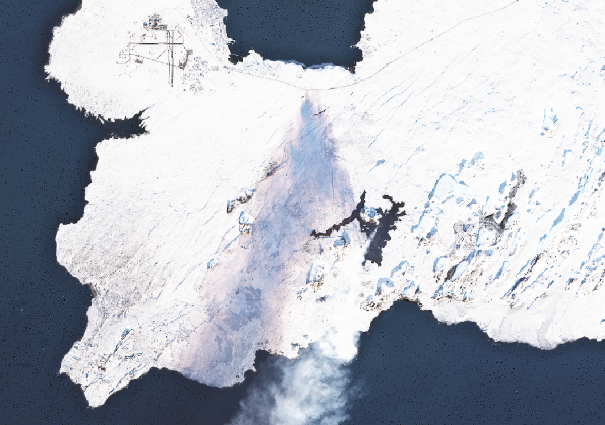

# Microsoft Planetary Computer Pro Data Visualization Gallery

This gallery provides ready-to-use configuration examples for visualizing common geospatial data types in Microsoft Planetary Computer Pro. Each example includes comprehensive JSON configurations for mosaics, render options, tile settings, and STAC collection metadata that you can adapt for your own datasets.

## Prerequisites

Before using these examples, you should have:

- A deployed [Microsoft Planetary Computer Pro GeoCatalog resource](./deploy-geocatalog-resource.md)
- Basic familiarity with [STAC concepts](./stac-overview.md) and [collection configuration](./collection-configuration-concept.md)
- Data [ingested into a STAC collection](./ingestion-overview.md)

## How to use these examples

Each example in this gallery includes:

1. **Description and context** - Information about the data source and visualization approach
2. **Visual example** - Screenshot of the rendered data in the Explorer
3. **Complete configuration settings** organized in tabs:
   - **Mosaic** - How to filter and select items for display
   - **Render Options** - How to style and visualize the data
   - **Tile Settings** - How to optimize display parameters
   - **STAC Collection** - The underlying collection metadata structure

To apply these examples to your own data:

1. Create a new collection in your GeoCatalog
2. Navigate to the collection's configuration page
3. Modify the example JSON to match your dataset's specific bands, assets, and properties
4. Apply the configurations to your collection
5. View the results in the Explorer

## Sentinel-2-l2a Collection Configuration

[  ](media/sentinel-2-imagery.png#lightbox)

[Sentinel-2](https://planetarycomputer.microsoft.com/dataset/sentinel-2-l2) is a high-resolution, multi-spectral imaging mission from the European Space Agency (ESA) as part of the Copernicus Program.

## Configuration details

# [Mosaic](#tab/sentinel-2-l2a-grindavik-mosaics)

## Mosaic Configuration

The mosaic configuration shown below tells the Explorer to display the most recent Sentinel-2 images from the collection, but only those with cloud cover less than or equal to 40%. The cql (Common Query Language) filter ensures that only relatively clear images are included, making the visualization more useful for most applications. Each mosaic entry can define different criteria for selecting and combining images, and this example uses a single "default" mosaic focused on recent, low-cloud imagery.

```json
[
  {
    "id": "default",
    "name": "Most recent available",
    "description": "Most recent available imagery in this collection",
    "cql": [
      {
        "op": "<=",
        "args": [
          {
            "property": "eo:cloud_cover"
          },
          40
        ]
      }
    ]
  }
]
```

# [Render Options](#tab/sentinel-2-l2a-grindavik-render-options)

## Render Options Configuration

This render configuration defines several ways to visualize Sentinel-2 satellite imagery in the Explorer. Each entry describes a different style or scientific product, such as **Natural color** (what you’d see with your eyes), **Color infrared** (to highlight vegetation), or **NDVI** (a vegetation health index).

The `options` string specifies how to visualize the data:

- `assets=B04&assets=B03&assets=B02`:  
  This tells the system which bands (layers of satellite data) to use for the image. For example, B04 is red, B03 is green, and B02 is blue—together, they make a true-color image.

- `nodata=0`:  
  Any pixel with a value of 0 is treated as missing or transparent.

- `color_formula=Gamma RGB 3.2 Saturation 0.8 Sigmoidal RGB 25 0.35`:  
  This applies color corrections to make the image look more natural or visually appealing.  
  - **Gamma** adjusts brightness  
  - **Saturation** changes color intensity  
  - **Sigmoidal** adjusts contrast

- `expression=(B08-B04)/(B08+B04)`:  
  For NDVI and NDWI, this calculates a mathematical formula using the bands to create a new image that highlights vegetation or moisture.

- `rescale=-1,1`:  
  This stretches the calculated values to fit a color scale, so the results are easy to interpret.

- `colormap_name=rdylgn`:  
  This applies a color palette (red-yellow-green) to the result, making it easier to see differences.

```json
[
  {
    "id": "natural-color",
    "name": "Natural color",
    "description": "True color composite of visible bands (B04, B03, B02)",
    "type": "raster-tile",
    "options": "assets=B04&assets=B03&assets=B02&nodata=0&color_formula=Gamma RGB 3.2 Saturation 0.8 Sigmoidal RGB 25 0.35",
    "minZoom": 9
  },
  {
    "id": "natural-color-pre-feb-2022",
    "name": "Natural color (pre Feb, 2022)",
    "description": "Pre-Feb 2022 true color composite of visible bands (B04, B03, B02)",
    "type": "raster-tile",
    "options": "assets=B04&assets=B03&assets=B02&nodata=0&color_formula=Gamma RGB 3.7 Saturation 1.5 Sigmoidal RGB 15 0.35",
    "minZoom": 9
  },
  {
    "id": "color-infrared",
    "name": "Color infrared",
    "description": "Highlights healthy (red) and unhealthy (blue/gray) vegetation (B08, B04, B03).",
    "type": "raster-tile",
    "options": "assets=B08&assets=B04&assets=B03&nodata=0&color_formula=Gamma RGB 3.7 Saturation 1.5 Sigmoidal RGB 15 0.35",
    "minZoom": 9
  },
  {
    "id": "short-wave-infrared",
    "name": "Short wave infrared",
    "description": "Darker shades of green indicate denser vegetation. Brown is indicative of bare soil and built-up areas (B12, B8A, B04).",
    "type": "raster-tile",
    "options": "assets=B12&assets=B8A&assets=B04&nodata=0&color_formula=Gamma RGB 3.7 Saturation 1.5 Sigmoidal RGB 15 0.35",
    "minZoom": 9
  },
  {
    "id": "agriculture",
    "name": "Agriculture",
    "description": "Darker shades of green indicate denser vegetation (B11, B08, B02).",
    "type": "raster-tile",
    "options": "assets=B11&assets=B08&assets=B02&nodata=0&color_formula=Gamma RGB 3.7 Saturation 1.5 Sigmoidal RGB 15 0.35",
    "minZoom": 9
  },
  {
    "id": "normalized-difference-veg-inde",
    "name": "Normalized Difference Veg. Index (NDVI)",
    "description": "Normalized Difference Vegetation Index (B08-B04)/(B08+B04), darker green indicates healthier vegetation.",
    "type": "raster-tile",
    "options": "nodata=0&expression=(B08-B04)/(B08+B04)&rescale=-1,1&colormap_name=rdylgn&asset_as_band=true",
    "minZoom": 9
  },
  {
    "id": "moisture-index-ndwi",
    "name": "Moisture Index (NDWI)",
    "description": "Index indicating water stress in plants (B8A-B11)/(B8A+B11)",
    "type": "raster-tile",
    "options": "nodata=0&expression=(B8A-B11)/(B8A+B11)&rescale=-1,1&colormap_name=rdbu&asset_as_band=true",
    "minZoom": 9
  },
  {
    "id": "atmospheric-penetration",
    "name": "Atmospheric penetration",
    "description": "False color rendering with non-visible bands to reduce effects of atmospheric particles (B12, B11, B8A).",
    "type": "raster-tile",
    "options": "nodata=0&assets=B12&assets=B11&assets=B8A&color_formula=Gamma RGB 3.7 Saturation 1.5 Sigmoidal RGB 15 0.35",
    "minZoom": 9
  }
]
```

# [Tile Settings](#tab/sentinel-2-l2a-grindavik-tile-settings)

## Tile Settings Configuration

The tile settings configuration defines how data is tiled and displayed at different zoom levels.

```json
{
  "minZoom": 8,
  "maxItemsPerTile": 35,
  "defaultLocation": null
}
```

# [STAC Collection](#tab/sentinel-2-l2a-grindavik-stac)

## STAC Collection configuration

The STAC Collection configuration defines the core metadata for this collection.

The `item_assets` section in the STAC Collection JSON serves as a critical catalog of all available data assets in the collection. It defines each spectral band (B01-B12, B8A, etc.) and its properties, including:

* Asset keys (like "B04", "B03") that are referenced by the render configuration
Metadata about each band (resolution, data type, roles)
* Band descriptions that explain what each band represents (e.g., B04 is "red", B08 is "near infrared")
* Wavelength information useful for scientific applications

The render configuration directly references these asset keys to create different visualizations. For example, when the render configuration specifies `assets=B04&assets=B03&assets=B02`, it's pulling the red, green, and blue bands defined in item_assets to create a natural color image. 

```json
{
  "id": "sentinel-2-l2a_Grindavik",
  "type": "Collection",
  "links": [
    {
      "rel": "items",
      "type": "application/geo+json",
      "href": "https://{geocatalog_id}/stac/collections/sentinel-2-l2a_Grindavik/items"
    },
    {
      "rel": "parent",
      "type": "application/json",
      "href": "https://{geocatalog_id}/stac/"
    },
    {
      "rel": "root",
      "type": "application/json",
      "href": "https://{geocatalog_id}/stac/"
    },
    {
      "rel": "self",
      "type": "application/json",
      "href": "https://{geocatalog_id}/stac/collections/sentinel-2-l2a_Grindavik"
    },
    {
      "rel": "license",
      "href": "https://scihub.copernicus.eu/twiki/pub/SciHubWebPortal/TermsConditions/Sentinel_Data_Terms_and_Conditions.pdf",
      "title": "Copernicus Sentinel data terms"
    },
    {
      "rel": "describedby",
      "href": "https://planetarycomputer.microsoft.com/dataset/sentinel-2-l2a",
      "type": "text/html",
      "title": "Human readable dataset overview and reference"
    }
  ],
  "title": "Sentinel-2-l2a",
  "assets": {
    "thumbnail": {
      "href": "https://{storage_account}.blob.core.windows.net/{blob_container}/collection-assets/thumbnail/blob",
      "type": "image/png",
      "roles": [
        "thumbnail"
      ],
      "title": "sentinel-2-l2a_Grindavik thumbnail"
    }
  },
  "extent": {
    "spatial": {
      "bbox": [
        [
          -180,
          -90,
          180,
          90
        ]
      ]
    },
    "temporal": {
      "interval": [
        [
          "2015-06-27T10:25:31Z",
          null
        ]
      ]
    }
  },
  "license": "proprietary",
  "keywords": [
    "Sentinel",
    "Copernicus",
    "ESA",
    "Satellite",
    "Global",
    "Imagery",
    "Reflectance"
  ],
  "providers": [
    {
      "url": "https://sentinel.esa.int/web/sentinel/missions/sentinel-2",
      "name": "ESA",
      "roles": [
        "producer",
        "licensor"
      ]
    },
    {
      "url": "https://www.esri.com/",
      "name": "Esri",
      "roles": [
        "processor"
      ]
    },
    {
      "url": "https://planetarycomputer.microsoft.com",
      "name": "Microsoft",
      "roles": [
        "host",
        "processor"
      ]
    }
  ],
  "summaries": {
    "gsd": [
      10,
      20,
      60
    ],
    "eo:bands": [
      {
        "name": "AOT",
        "description": "aerosol optical thickness"
      },
      {
        "gsd": 60,
        "name": "B01",
        "common_name": "coastal",
        "description": "coastal aerosol",
        "center_wavelength": 0.443,
        "full_width_half_max": 0.027
      },
      {
        "gsd": 10,
        "name": "B02",
        "common_name": "blue",
        "description": "visible blue",
        "center_wavelength": 0.49,
        "full_width_half_max": 0.098
      },
      {
        "gsd": 10,
        "name": "B03",
        "common_name": "green",
        "description": "visible green",
        "center_wavelength": 0.56,
        "full_width_half_max": 0.045
      },
      {
        "gsd": 10,
        "name": "B04",
        "common_name": "red",
        "description": "visible red",
        "center_wavelength": 0.665,
        "full_width_half_max": 0.038
      },
      {
        "gsd": 20,
        "name": "B05",
        "common_name": "rededge",
        "description": "vegetation classification red edge",
        "center_wavelength": 0.704,
        "full_width_half_max": 0.019
      },
      {
        "gsd": 20,
        "name": "B06",
        "common_name": "rededge",
        "description": "vegetation classification red edge",
        "center_wavelength": 0.74,
        "full_width_half_max": 0.018
      },
      {
        "gsd": 20,
        "name": "B07",
        "common_name": "rededge",
        "description": "vegetation classification red edge",
        "center_wavelength": 0.783,
        "full_width_half_max": 0.028
      },
      {
        "gsd": 10,
        "name": "B08",
        "common_name": "nir",
        "description": "near infrared",
        "center_wavelength": 0.842,
        "full_width_half_max": 0.145
      },
      {
        "gsd": 20,
        "name": "B8A",
        "common_name": "rededge",
        "description": "vegetation classification red edge",
        "center_wavelength": 0.865,
        "full_width_half_max": 0.033
      },
      {
        "gsd": 60,
        "name": "B09",
        "description": "water vapor",
        "center_wavelength": 0.945,
        "full_width_half_max": 0.026
      },
      {
        "gsd": 20,
        "name": "B11",
        "common_name": "swir16",
        "description": "short-wave infrared, snow/ice/cloud classification",
        "center_wavelength": 1.61,
        "full_width_half_max": 0.143
      },
      {
        "gsd": 20,
        "name": "B12",
        "common_name": "swir22",
        "description": "short-wave infrared, snow/ice/cloud classification",
        "center_wavelength": 2.19,
        "full_width_half_max": 0.242
      }
    ],
    "platform": [
      "Sentinel-2A",
      "Sentinel-2B"
    ],
    "instruments": [
      "msi"
    ],
    "constellation": [
      "sentinel-2"
    ],
    "view:off_nadir": [
      0
    ]
  },
  "description": "The [Sentinel-2](https://sentinel.esa.int/web/sentinel/missions/sentinel-2) program provides global imagery in thirteen spectral bands at 10m-60m resolution and a revisit time of approximately five days.  This dataset represents the global Sentinel-2 archive, from 2016 to the present, processed to L2A (bottom-of-atmosphere) using [Sen2Cor](https://step.esa.int/main/snap-supported-plugins/sen2cor/) and converted to [cloud-optimized GeoTIFF](https://www.cogeo.org/) format.",
  "item_assets": {
    "AOT": {
      "gsd": 10,
      "type": "image/tiff; application=geotiff; profile=cloud-optimized",
      "roles": [
        "data"
      ],
      "title": "Aerosol optical thickness (AOT)"
    },
    "B01": {
      "gsd": 60,
      "type": "image/tiff; application=geotiff; profile=cloud-optimized",
      "roles": [
        "data"
      ],
      "title": "Band 1 - Coastal aerosol - 60m",
      "eo:bands": [
        {
          "name": "B01",
          "common_name": "coastal",
          "description": "Band 1 - Coastal aerosol",
          "center_wavelength": 0.443,
          "full_width_half_max": 0.027
        }
      ]
    },
    "B02": {
      "gsd": 10,
      "type": "image/tiff; application=geotiff; profile=cloud-optimized",
      "roles": [
        "data"
      ],
      "title": "Band 2 - Blue - 10m",
      "eo:bands": [
        {
          "name": "B02",
          "common_name": "blue",
          "description": "Band 2 - Blue",
          "center_wavelength": 0.49,
          "full_width_half_max": 0.098
        }
      ]
    },
    "B03": {
      "gsd": 10,
      "type": "image/tiff; application=geotiff; profile=cloud-optimized",
      "roles": [
        "data"
      ],
      "title": "Band 3 - Green - 10m",
      "eo:bands": [
        {
          "name": "B03",
          "common_name": "green",
          "description": "Band 3 - Green",
          "center_wavelength": 0.56,
          "full_width_half_max": 0.045
        }
      ]
    },
    "B04": {
      "gsd": 10,
      "type": "image/tiff; application=geotiff; profile=cloud-optimized",
      "roles": [
        "data"
      ],
      "title": "Band 4 - Red - 10m",
      "eo:bands": [
        {
          "name": "B04",
          "common_name": "red",
          "description": "Band 4 - Red",
          "center_wavelength": 0.665,
          "full_width_half_max": 0.038
        }
      ]
    },
    "B05": {
      "gsd": 20,
      "type": "image/tiff; application=geotiff; profile=cloud-optimized",
      "roles": [
        "data"
      ],
      "title": "Band 5 - Vegetation red edge 1 - 20m",
      "eo:bands": [
        {
          "name": "B05",
          "common_name": "rededge",
          "description": "Band 5 - Vegetation red edge 1",
          "center_wavelength": 0.704,
          "full_width_half_max": 0.019
        }
      ]
    },
    "B06": {
      "gsd": 20,
      "type": "image/tiff; application=geotiff; profile=cloud-optimized",
      "roles": [
        "data"
      ],
      "title": "Band 6 - Vegetation red edge 2 - 20m",
      "eo:bands": [
        {
          "name": "B06",
          "common_name": "rededge",
          "description": "Band 6 - Vegetation red edge 2",
          "center_wavelength": 0.74,
          "full_width_half_max": 0.018
        }
      ]
    },
    "B07": {
      "gsd": 20,
      "type": "image/tiff; application=geotiff; profile=cloud-optimized",
      "roles": [
        "data"
      ],
      "title": "Band 7 - Vegetation red edge 3 - 20m",
      "eo:bands": [
        {
          "name": "B07",
          "common_name": "rededge",
          "description": "Band 7 - Vegetation red edge 3",
          "center_wavelength": 0.783,
          "full_width_half_max": 0.028
        }
      ]
    },
    "B08": {
      "gsd": 10,
      "type": "image/tiff; application=geotiff; profile=cloud-optimized",
      "roles": [
        "data"
      ],
      "title": "Band 8 - NIR - 10m",
      "eo:bands": [
        {
          "name": "B08",
          "common_name": "nir",
          "description": "Band 8 - NIR",
          "center_wavelength": 0.842,
          "full_width_half_max": 0.145
        }
      ]
    },
    "B09": {
      "gsd": 60,
      "type": "image/tiff; application=geotiff; profile=cloud-optimized",
      "roles": [
        "data"
      ],
      "title": "Band 9 - Water vapor - 60m",
      "eo:bands": [
        {
          "name": "B09",
          "description": "Band 9 - Water vapor",
          "center_wavelength": 0.945,
          "full_width_half_max": 0.026
        }
      ]
    },
    "B11": {
      "gsd": 20,
      "type": "image/tiff; application=geotiff; profile=cloud-optimized",
      "roles": [
        "data"
      ],
      "title": "Band 11 - SWIR (1.6) - 20m",
      "eo:bands": [
        {
          "name": "B11",
          "common_name": "swir16",
          "description": "Band 11 - SWIR (1.6)",
          "center_wavelength": 1.61,
          "full_width_half_max": 0.143
        }
      ]
    },
    "B12": {
      "gsd": 20,
      "type": "image/tiff; application=geotiff; profile=cloud-optimized",
      "roles": [
        "data"
      ],
      "title": "Band 12 - SWIR (2.2) - 20m",
      "eo:bands": [
        {
          "name": "B12",
          "common_name": "swir22",
          "description": "Band 12 - SWIR (2.2)",
          "center_wavelength": 2.19,
          "full_width_half_max": 0.242
        }
      ]
    },
    "B8A": {
      "gsd": 20,
      "type": "image/tiff; application=geotiff; profile=cloud-optimized",
      "roles": [
        "data"
      ],
      "title": "Band 8A - Vegetation red edge 4 - 20m",
      "eo:bands": [
        {
          "name": "B8A",
          "common_name": "rededge",
          "description": "Band 8A - Vegetation red edge 4",
          "center_wavelength": 0.865,
          "full_width_half_max": 0.033
        }
      ]
    },
    "SCL": {
      "gsd": 20,
      "type": "image/tiff; application=geotiff; profile=cloud-optimized",
      "roles": [
        "data"
      ],
      "title": "Scene classfication map (SCL)"
    },
    "WVP": {
      "gsd": 10,
      "type": "image/tiff; application=geotiff; profile=cloud-optimized",
      "roles": [
        "data"
      ],
      "title": "Water vapour (WVP)"
    },
    "visual": {
      "gsd": 10,
      "type": "image/tiff; application=geotiff; profile=cloud-optimized",
      "roles": [
        "data"
      ],
      "title": "True color image",
      "eo:bands": [
        {
          "name": "B04",
          "common_name": "red",
          "description": "Band 4 - Red",
          "center_wavelength": 0.665,
          "full_width_half_max": 0.038
        },
        {
          "name": "B03",
          "common_name": "green",
          "description": "Band 3 - Green",
          "center_wavelength": 0.56,
          "full_width_half_max": 0.045
        },
        {
          "name": "B02",
          "common_name": "blue",
          "description": "Band 2 - Blue",
          "center_wavelength": 0.49,
          "full_width_half_max": 0.098
        }
      ]
    },
    "preview": {
      "type": "image/tiff; application=geotiff; profile=cloud-optimized",
      "roles": [
        "thumbnail"
      ],
      "title": "Thumbnail"
    },
    "safe-manifest": {
      "type": "application/xml",
      "roles": [
        "metadata"
      ],
      "title": "SAFE manifest"
    },
    "granule-metadata": {
      "type": "application/xml",
      "roles": [
        "metadata"
      ],
      "title": "Granule metadata"
    },
    "inspire-metadata": {
      "type": "application/xml",
      "roles": [
        "metadata"
      ],
      "title": "INSPIRE metadata"
    },
    "product-metadata": {
      "type": "application/xml",
      "roles": [
        "metadata"
      ],
      "title": "Product metadata"
    },
    "datastrip-metadata": {
      "type": "application/xml",
      "roles": [
        "metadata"
      ],
      "title": "Datastrip metadata"
    }
  },
  "msft:region": "westeurope",
  "stac_version": "1.0.0",
  "msft:_created": "2024-04-05T19:04:14.168175Z",
  "msft:_updated": "2024-08-26T18:24:05.194898Z",
  "msft:container": "sentinel2-l2",
  "stac_extensions": [
    "https://stac-extensions.github.io/item-assets/v1.0.0/schema.json",
    "https://stac-extensions.github.io/table/v1.2.0/schema.json"
  ],
  "msft:storage_account": "sentinel2l2a01",
  "msft:short_description": "The Sentinel-2 program provides global imagery in thirteen spectral bands at 10m-60m resolution and a revisit time of approximately five days.  This dataset contains the global Sentinel-2 archive, from 2016 to the present, processed to L2A (bottom-of-atmosphere)."
}
```

---


## naip-airports Collection Configuration

[Collection description to be added here]

[  ](media/naip-imagery.png#lightbox)

[Description of data source and link to where to get the data]

## Configuration details

# [Mosaic](#tab/naip-airports-mosaics)

## Mosaic Configuration

The mosaic configuration defines how images are combined when displayed in the Explorer.

```json
[
  {
    "id": "default",
    "name": "Default",
    "description": "",
    "cql": []
  }
]
```

# [Render Options](#tab/naip-airports-render-options)

## Render Options Configuration

This render configuration offers three different ways to visualize the National Agriculture Imagery Program (NAIP) data. NAIP imagery contains four spectral bands stored in a single multi-band asset called "image":

1. **Band 1**: Red
2. **Band 2**: Green
3. **Band 3**: Blue
4. **Band 4**: Near Infrared (NIR)

Each visualization option uses these bands differently:

### Natural Color (True Color)

- **Configuration**: `"options": "assets=image&asset_bidx=image|1,2,3"`
- **How it works**: This option maps the first three bands of the NAIP imagery to the corresponding Red, Green, and Blue channels for display.
  - **Red channel**: Band 1 (Red)
  - **Green channel**: Band 2 (Green)
  - **Blue channel**: Band 3 (Blue)
- **Result**: This produces a "true color" image that approximates what the human eye would see.

### Color Infrared

- **Configuration**: `"options": "assets=image&asset_bidx=image|4,1,2&color_formula=Sigmoidal RGB 15 0.35"`
- **How it works**: This is a "false color" composite that is particularly useful for vegetation analysis. It maps the bands as follows:
  - **Red channel**: Band 4 (Near Infrared)
  - **Green channel**: Band 1 (Red)
  - **Blue channel**: Band 2 (Green)
- **Result**: Healthy vegetation reflects strongly in the near-infrared spectrum, so it appears as bright red in the resulting image. Urban areas or bare soil appear blue or gray. The `color_formula` is used to increase the contrast and visual appeal of the image.

### Normalized Difference Vegetation Index (NDVI)

- **Configuration**: `"options": "expression=(image_b4 - image_b1)/(image_b4 + image_b1)&rescale=-1,1&colormap_name=rdylgn"`
- **How it works**: This option doesn't display the source imagery directly. Instead, it calculates the NDVI for each pixel using a mathematical formula: `(NIR - Red) / (NIR + Red)`. In this case, that corresponds to `(Band 4 - Band 1) / (Band 4 + Band 1)`.
- **Result**: The result of the NDVI calculation is a value between -1 and 1, which is a measure of vegetation health and density. The `rescale=-1,1` parameter scales the output colors to this range, and the `colormap_name=rdylgn` parameter applies a "Red-Yellow-Green" color map. Areas with dense, healthy vegetation appear green, while areas with little or no vegetation appear red or yellow.

```json
[
  {
    "id": "natural-color",
    "name": "Natural color",
    "description": "RGB from visual assets",
    "type": "raster-tile",
    "options": "assets=image&asset_bidx=image|1,2,3",
    "minZoom": 11
  },
  {
    "id": "color-infrared",
    "name": "Color infrared",
    "description": "Highlights healthy (red) and unhealthy (blue/gray) vegetation.",
    "type": "raster-tile",
    "options": "assets=image&asset_bidx=image|4,1,2&color_formula=Sigmoidal RGB 15 0.35",
    "minZoom": 12
  },
  {
    "id": "ndvi",
    "name": "Normalized Difference Veg. Index (NDVI)",
    "description": "Normalized Difference Vegetation Index (NIR-Red)/(NIR+Red), darker green indicates healthier vegetation.",
    "type": "raster-tile",
    "options": "expression=(image_b4 - image_b1)/(image_b4 + image_b1)&rescale=-1,1&colormap_name=rdylgn",
    "minZoom": 12
  }
]
```

# [Tile Settings](#tab/naip-airports-tile-settings)

## Tile Settings Configuration

The tile settings configuration defines how data is tiled and displayed at different zoom levels.

```json
{
  "minZoom": 4,
  "maxItemsPerTile": 35,
  "defaultLocation": null
}
```

# [STAC Collection](#tab/naip-airports-stac)

## STAC Collection configuration

The STAC Collection configuration defines the core metadata for this collection.

```json
{
  "id": "naip-airports",
  "type": "Collection",
  "links": [
    {
      "rel": "items",
      "type": "application/geo+json",
      "href": "https://{geocatalog_id}/stac/collections/naip-airports/items"
    },
    {
      "rel": "parent",
      "type": "application/json",
      "href": "https://{geocatalog_id}/stac/"
    },
    {
      "rel": "root",
      "type": "application/json",
      "href": "https://{geocatalog_id}/stac/"
    },
    {
      "rel": "self",
      "type": "application/json",
      "href": "https://{geocatalog_id}/stac/collections/naip-airports"
    },
    {
      "rel": "license",
      "href": "https://www.fsa.usda.gov/help/policies-and-links/",
      "title": "Public Domain"
    },
    {
      "rel": "describedby",
      "href": "https://planetarycomputer.microsoft.com/dataset/naip",
      "type": "text/html",
      "title": "Human readable dataset overview and reference"
    }
  ],
  "title": "naip-airports",
  "assets": {
    "thumbnail": {
      "href": "https://{storage_account}.blob.core.windows.net/{blob_container}/collection-assets/thumbnail/blob",
      "type": "image/png",
      "roles": [
        "thumbnail"
      ],
      "title": "naip-airports thumbnail"
    }
  },
  "extent": {
    "spatial": {
      "bbox": [
        [
          -124.784,
          24.744,
          -66.951,
          49.346
        ],
        [
          -156.003,
          19.059,
          -154.809,
          20.127
        ],
        [
          -67.316,
          17.871,
          -65.596,
          18.565
        ],
        [
          -64.94,
          17.622,
          -64.56,
          17.814
        ]
      ]
    },
    "temporal": {
      "interval": [
        [
          "2010-01-01T00:00:00Z",
          "2022-12-31T00:00:00Z"
        ]
      ]
    }
  },
  "license": "proprietary",
  "keywords": [
    "NAIP",
    "Aerial",
    "Imagery",
    "USDA",
    "AFPO",
    "Agriculture",
    "United States"
  ],
  "providers": [
    {
      "url": "https://www.fsa.usda.gov/programs-and-services/aerial-photography/imagery-programs/naip-imagery/",
      "name": "USDA Farm Service Agency",
      "roles": [
        "producer",
        "licensor"
      ]
    },
    {
      "url": "https://www.esri.com/",
      "name": "Esri",
      "roles": [
        "processor"
      ]
    },
    {
      "url": "https://planetarycomputer.microsoft.com",
      "name": "Microsoft",
      "roles": [
        "host",
        "processor"
      ]
    }
  ],
  "summaries": {
    "gsd": [
      0.3,
      0.6,
      1
    ],
    "eo:bands": [
      {
        "name": "Red",
        "common_name": "red",
        "description": "visible red"
      },
      {
        "name": "Green",
        "common_name": "green",
        "description": "visible green"
      },
      {
        "name": "Blue",
        "common_name": "blue",
        "description": "visible blue"
      },
      {
        "name": "NIR",
        "common_name": "nir",
        "description": "near-infrared"
      }
    ]
  },
  "description": "The [National Agriculture Imagery Program](https://www.fsa.usda.gov/programs-and-services/aerial-photography/imagery-programs/naip-imagery/) (NAIP) \nprovides U.S.-wide, high-resolution aerial imagery, with four spectral bands (R, G, B, IR). \nNAIP is administered by the [Aerial Field Photography Office](https://www.fsa.usda.gov/programs-and-services/aerial-photography/) (AFPO) \nwithin the [US Department of Agriculture](https://www.usda.gov/) (USDA). \nData are captured at least once every three years for each state. \nThis dataset represents NAIP data from 2010-present, in [cloud-optimized GeoTIFF](https://www.cogeo.org/) format.\nYou can visualize the coverage of current and past collections [here](https://naip-usdaonline.hub.arcgis.com/). \n",
  "item_assets": {
    "image": {
      "type": "image/tiff; application=geotiff; profile=cloud-optimized",
      "roles": [
        "data"
      ],
      "title": "RGBIR COG tile",
      "eo:bands": [
        {
          "name": "Red",
          "common_name": "red"
        },
        {
          "name": "Green",
          "common_name": "green"
        },
        {
          "name": "Blue",
          "common_name": "blue"
        },
        {
          "name": "NIR",
          "common_name": "nir",
          "description": "near-infrared"
        }
      ]
    },
    "metadata": {
      "type": "text/plain",
      "roles": [
        "metadata"
      ],
      "title": "FGDC Metdata"
    },
    "thumbnail": {
      "type": "image/jpeg",
      "roles": [
        "thumbnail"
      ],
      "title": "Thumbnail"
    }
  },
  "msft:region": "westeurope",
  "stac_version": "1.0.0",
  "msft:_created": "2024-08-02T13:19:22.446214Z",
  "msft:_updated": "2024-08-21T17:21:13.132140Z",
  "stac_extensions": [
    "https://stac-extensions.github.io/item-assets/v1.0.0/schema.json",
    "https://stac-extensions.github.io/table/v1.2.0/schema.json"
  ],
  "msft:short_description": "NAIP provides US-wide, high-resolution aerial imagery.  This dataset includes NAIP images from 2010 to the present."
}
```

---

## Umbra SAR Imagery Collection Configuration

[Collection description to be added here]

[  ](media/umbra-sar-imagery.png#lightbox)

[Description of data source and link to where to get the data]

## Configuration details

# [Mosaic](#tab/umbra-sar-mosaics)

## Mosaic Configuration

This is the default mosaic configuration. 

```json
[
  {
    "id": "default",
    "name": "Default",
    "description": "",
    "cql": []
  }
]
```

# [Render Options](#tab/umbra-sar-render-options)

## Render Options Configuration

The render configuration works as follows:

**VV polarization**: Refers to "Vertical transmit, Vertical receive" radar signals, which are effective for detecting man-made structures and surface roughness

* **Key parameters**:
  * `assets=GEC`: Selects the geocoded ellipsoid corrected (GEC) asset from the STAC item
  * `rescale=0,255`: Transforms the radar backscatter values to an 8-bit range for proper visualization
  * `colormap_name=gray`: Applies a grayscale color palette appropriate for intensity data
* **Conditions**: Only applies this rendering to items that specifically have VV polarization data
* **minZoom:** Sets the minimum map zoom level (8) at which this layer becomes visible

This configuration creates a grayscale visualization where brighter areas represent stronger radar returns, typically indicating buildings, rough terrain, or other surfaces that strongly reflect radar signals. 

```json
[
  {
    "id": "vv-polarization",
    "name": "VV polarization",
    "description": "VV asset scaled to `0,.20`.",
    "type": "raster-tile",
    "options": "assets=GEC&rescale=0,255&colormap_name=gray",
    "minZoom": 8,
    "conditions": [
      {
        "property": "sar:polarizations",
        "value": [
          "VV"
        ]
      }
    ]
  }
]
```

# [Tile Settings](#tab/umbra-sar-tile-settings)

## Tile Settings Configuration

The tile settings configuration defines how data is tiled and displayed at different zoom levels.

```json
{
  "minZoom": 12,
  "maxItemsPerTile": 35,
  "defaultLocation": null
}
```

# [STAC Collection](#tab/umbra-sar-stac)

## STAC Collection configuration

The `item_assets` section is a critical component of the STAC Collection JSON that defines the assets (data files) available within each item of this collection. For this Umbra SAR collection:

This section tells us:

1. **Asset Key**: `GEC` is the key identifier used to reference this asset in render configurations (`assets=GEC`)

2. **Data Format**: The asset is a cloud-optimized GeoTIFF, which allows efficient access to portions of the imagery

3. **Radar Properties**: 
   - This is VV polarization data (vertical transmit, vertical receive)
   - Contains terrain-corrected gamma naught values with radiometric correction

4. **Technical Specifications**:
   - `nodata` value of `-32768` indicates pixels with no data
   - Data is stored as 8-bit unsigned integers (`uint8`)
   - The spatial resolution is approximately 0.48 meters per pixel

This asset definition is directly referenced in the render configuration via `assets=GEC`, and the rendering parameters (`rescale=0,255&colormap_name=gray`) are designed to properly visualize the SAR backscatter values in this specific data asset.
```json
{
  "id": "umbra-sar",
  "type": "Collection",
  "links": [
    {
      "rel": "items",
      "type": "application/geo+json",
      "href": "https://{geocatalog_id}/stac/collections/umbra-sar/items"
    },
    {
      "rel": "parent",
      "type": "application/json",
      "href": "https://{geocatalog_id}/stac/"
    },
    {
      "rel": "root",
      "type": "application/json",
      "href": "https://{geocatalog_id}/stac/"
    },
    {
      "rel": "self",
      "type": "application/json",
      "href": "https://{geocatalog_id}/stac/collections/umbra-sar"
    }
  ],
  "title": "Umbra SAR Imagery",
  "assets": {
    "thumbnail": {
      "href": "https://{storage_account}.blob.core.windows.net/{blob_container}/collection-assets/thumbnail/blob",
      "type": "image/png",
      "roles": [
        "thumbnail"
      ],
      "title": "umbra-sar thumbnail"
    }
  },
  "extent": {
    "spatial": {
      "bbox": [
        [
          -180,
          -90,
          180,
          90
        ]
      ]
    },
    "temporal": {
      "interval": [
        [
          "2018-01-01T00:00:00Z",
          null
        ]
      ]
    }
  },
  "license": "CC-BY-4.0",
  "keywords": [
    "Umbra",
    "X-Band",
    "SAR",
    "RTC"
  ],
  "providers": [
    {
      "url": "https://umbra.space/",
      "name": "Umbra",
      "roles": [
        "processor"
      ]
    },
    {
      "url": "https://planetarycomputer.microsoft.com",
      "name": "Microsoft",
      "roles": [
        "host"
      ]
    }
  ],
  "description": "Umbra satellites offer the highest commercially available SAR imagery, surpassing 25 cm resolution. Capable of capturing images day or night, through clouds, smoke, and rain, our technology enables all-weather monitoring.",
  "item_assets": {
    "GEC": {
      "type": "image/tiff; application=geotiff; profile=cloud-optimized",
      "roles": [
        "data"
      ],
      "title": "VV: vertical transmit, vertical receive",
      "description": "Terrain-corrected gamma naught values of signal transmitted with vertical polarization and received with vertical polarization with radiometric terrain correction applied.",
      "raster:bands": [
        {
          "nodata": -32768,
          "data_type": "uint8",
          "spatial_resolution": 0.4770254115
        }
      ]
    }
  },
  "stac_version": "1.0.0",
  "msft:_created": "2024-04-05T17:55:17.930092Z",
  "msft:_updated": "2024-04-05T18:30:16.587869Z",
  "stac_extensions": [
    "https://{storage_account}.blob.core.windows.net/{blob_container}/json-schemas/json-schemas/msft/v0.1/schema.json"
  ],
  "msft:short_description": "Umbra Synthetic Aperture Radar (SAR) Imagery"
}
```

---
