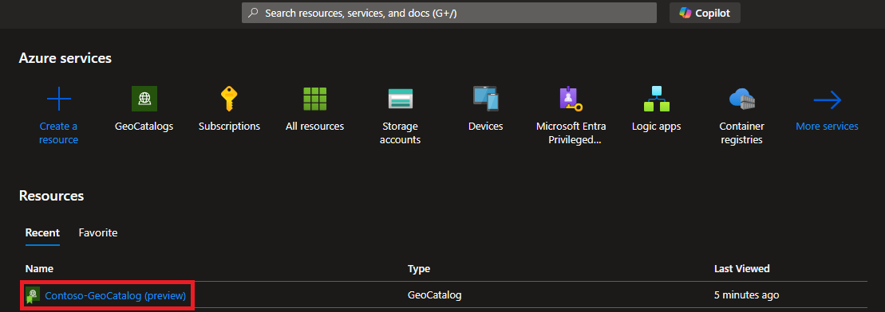

# Delete a GeoCatalog resource

In this article, you'll delete a GeoCatalog resource. There are two ways to deploy a Microsoft Planetary Computer GeoCatalog:

1. Using the Azure Portal.
1. Using the Azure Rest API.

## Prerequisites

- An existing GeoCatalog resource.

## Delete a GeoCatalog instance

Before deleting your GeoCatalog resource, make sure you downloaded any data, assets, SpatioTemporal Asset Catalog (STAC) Items, or render configurations that you wish to preserve. After deletion is complete, it won't be possible to access any data within your GeoCatalog Configuration or Collections.

Before you continue with the deletion steps, make sure you're ready to delete the resource.

### Delete a Geocatalog with the Azure Portal

1. Navigate to your GeoCatalog resource within the Azure Portal. Remember to [reveal the GeoCatalog hidden resource type](https://aka.ms/geocatalogsprod).



1. From within the GeoCatalog Azure portal page, select "Delete". You'll be presented with a "Delete resource" confirmation dialog box. 

   **Selecting "Yes" will *immediately* begin deleting this resource.**


### Delete a GeoCatalog with the Rest API

1. Login to your Azure portal and open up the cloud shell. Select Bash mode.

1. Run the following command:

   **Running this command will *immediately* begin deleting this resource.**

   ```bash
   az rest --method DELETE --uri "/subscriptions/$SUBSCRIPTION_ID/resourceGroups/$RESOURCE_GROUP/providers/Microsoft.Orbital/geoCatalogs/$CATALOG_NAME?api-version=2024-01-31-preview"
   ```