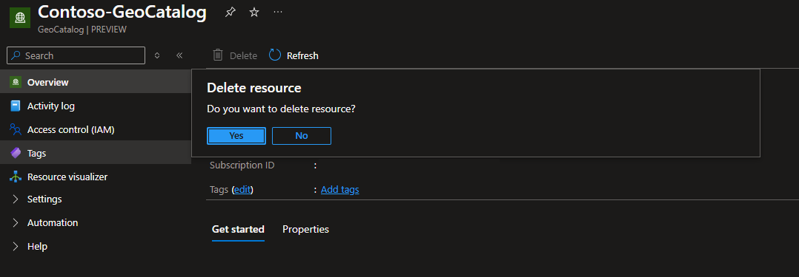

# Delete a GeoCatalog resource

This article documents the two methods you can use to delete an existing Microsoft Planetary Computer Pro GeoCatalog resource.

- Using the Azure portal.
- Using the Azure Rest API.
 
Before you proceed with deleting your GeoCatalog resource, download a backup of any data, assets, SpatioTemporal Asset Catalog (STAC) Items, or render configurations that you wish to preserve. After deletion is complete, it won't be possible to access any data within your GeoCatalog Configuration or Collections.

Before you continue with the deletion steps, make sure you're ready to delete the resource.

## Prerequisites

- A Deployed GeoCatalog resource. Refer to [Deploy a GeoCatalog resource](./deploy-geocatalog-resource.md) for deployment instructions.
- [Azure CLI](/cli/azure/install-azure-cli) (For using the REST API) 


# [Azure portal](#tab/azureportal)
## Delete a GeoCatalog with the Azure portal

1. Navigate to your GeoCatalog resource within the Azure portal.

1. From within the GeoCatalog Azure portal page, select **Delete**. You're presented with a **Delete resource** confirmation dialog box. 

   > [!NOTE]
   > **Selecting "Yes" will *immediately* begin deleting this resource.**
  
    [  ](media/delete-geocatalog-resource.png#lightbox)

## Next Steps
- [Get Started With Microsoft Planetary Computer Pro](./get-started-planetary-computer.md)

## Related Content
- [Deploy a GeoCatalog resource](./deploy-geocatalog-resource.md)

# [REST API](#tab/restapi)
## Delete a GeoCatalog with the REST API

1. Sign in to your Azure portal
1. Open up a cloud shell. 
1. Select Bash mode.
1. Run the following command:

   > [!NOTE]
   > **Running this command will *immediately* begin deleting this resource.**

   ```bash
   # Replace the placeholder values below with your specific data
   SUBSCRIPTION_ID="<your-subscription-id>"
   RESOURCE_GROUP="<your-resource-group>"
   CATALOG_NAME="<your-GeoCatalog-name>"

   az rest --method DELETE --uri "/subscriptions/$SUBSCRIPTION_ID/resourceGroups/$RESOURCE_GROUP/providers/Microsoft.Orbital/geoCatalogs/$CATALOG_NAME?api-version=2025-02-11-preview"
   ```

## Next Steps
- [Get Started With Microsoft Planetary Computer Pro](./get-started-planetary-computer.md)

## Related Content
- [Deploy a GeoCatalog resource](./deploy-geocatalog-resource.md)
