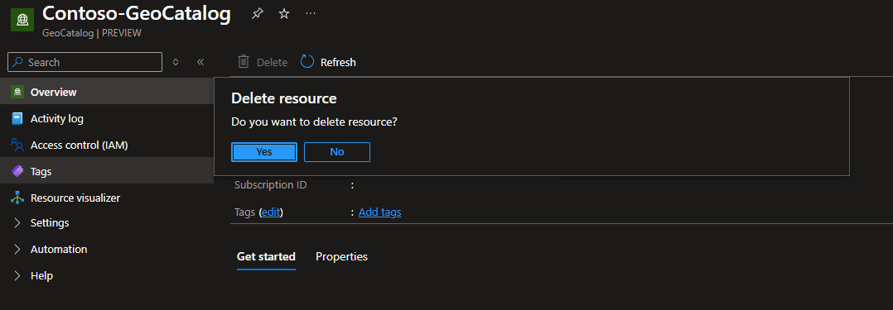

# Delete a GeoCatalog resource

This article documents the methods you can use to delete an existing Microsoft Planetary Computer Pro GeoCatalog resource.

- Using the Azure portal.
- Using the Azure REST API.
- Using the Azure SDKs (.NET, Java, JavaScript, Python, Go).
 
Before you proceed with deleting your GeoCatalog resource, download a backup of any data, assets, SpatioTemporal Asset Catalog (STAC) Items, or render configurations that you wish to preserve. After deletion is complete, it won't be possible to access any data within your GeoCatalog Configuration or Collections.

Before you continue with the deletion steps, make sure you're ready to delete the resource.

> [!NOTE]
> Due to the recovery from recent [Azure Front Door issues](https://azure.status.microsoft/status/history/?trackingId=YKYN-BWZ), users can expect deletions to take up to 2 hours.

## Prerequisites

- A Deployed GeoCatalog resource. Refer to [Deploy a GeoCatalog resource](./deploy-geocatalog-resource.md) for deployment instructions.
- [Azure CLI](/cli/azure/install-azure-cli) (For using the REST API) 


# [Azure portal](#tab/azureportal)
## Delete a GeoCatalog with the Azure portal

1. Navigate to your GeoCatalog resource within the Azure portal.

1. From within the GeoCatalog Azure portal page, select **Delete**. You're presented with a **Delete resource** confirmation dialog box. 

   > [!NOTE]
   > **Selecting "Yes" will *immediately* begin deleting this resource.**
  
    [  ](media/delete-geocatalog-resource.png#lightbox)

## Next Steps
- [Get Started With Microsoft Planetary Computer Pro](./get-started-planetary-computer.md)

## Related Content
- [Deploy a GeoCatalog resource](./deploy-geocatalog-resource.md)

# [REST API](#tab/restapi)
## Delete a GeoCatalog with the REST API

1. Sign in to your Azure portal
1. Open up a cloud shell. 
1. Select Bash mode.
1. Run the following command:

   > [!NOTE]
   > **Running this command will *immediately* begin deleting this resource.**

   ```bash
   # Replace the placeholder values below with your specific data
   SUBSCRIPTION_ID="<your-subscription-id>"
   RESOURCE_GROUP="<your-resource-group>"
   CATALOG_NAME="<your-GeoCatalog-name>"

   az rest --method DELETE --uri "/subscriptions/$SUBSCRIPTION_ID/resourceGroups/$RESOURCE_GROUP/providers/Microsoft.Orbital/geoCatalogs/$CATALOG_NAME?api-version=2026-04-15"
   ```

## Next Steps
- [Get Started With Microsoft Planetary Computer Pro](./get-started-planetary-computer.md)

## Related Content
- [Deploy a GeoCatalog resource](./deploy-geocatalog-resource.md)

# [.NET](#tab/dotnet)
## Delete a GeoCatalog with the .NET SDK

> [!NOTE]
> **Running this code will *immediately* begin deleting this resource.**

```csharp
using Azure.Identity;
using Azure.ResourceManager;
using Azure.ResourceManager.PlanetaryComputer;

var client = new ArmClient(new DefaultAzureCredential());

string subscriptionId = "<your-subscription-id>";
string resourceGroupName = "<your-resource-group>";
string catalogName = "<your-geocatalog-name>";

var geoCatalogResourceId = PlanetaryComputerGeoCatalogResource.CreateResourceIdentifier(
    subscriptionId, resourceGroupName, catalogName);
var geoCatalog = client.GetPlanetaryComputerGeoCatalogResource(geoCatalogResourceId);

var operation = await geoCatalog.DeleteAsync(Azure.WaitUntil.Completed);
Console.WriteLine("GeoCatalog deleted successfully.");
```

For more information, see the [.NET SDK reference](/dotnet/api/azure.resourcemanager.planetarycomputer).

## Next Steps
- [Get Started With Microsoft Planetary Computer Pro](./get-started-planetary-computer.md)

## Related Content
- [Deploy a GeoCatalog resource](./deploy-geocatalog-resource.md)

# [Java](#tab/java)
## Delete a GeoCatalog with the Java SDK

> [!NOTE]
> **Running this code will *immediately* begin deleting this resource.**

```java
import com.azure.identity.DefaultAzureCredentialBuilder;
import com.azure.resourcemanager.planetarycomputer.PlanetaryComputerManager;

PlanetaryComputerManager manager = PlanetaryComputerManager.authenticate(
    new DefaultAzureCredentialBuilder().build(),
    "<your-subscription-id>");

manager.geoCatalogs().deleteByResourceGroup(
    "<your-resource-group>",
    "<your-geocatalog-name>");

System.out.println("GeoCatalog deleted successfully.");
```

For more information, see the [Java SDK reference](/java/api/overview/azure/planetarycomputer-readme).

## Next Steps
- [Get Started With Microsoft Planetary Computer Pro](./get-started-planetary-computer.md)

## Related Content
- [Deploy a GeoCatalog resource](./deploy-geocatalog-resource.md)

# [JavaScript](#tab/javascript)
## Delete a GeoCatalog with the JavaScript SDK

> [!NOTE]
> **Running this code will *immediately* begin deleting this resource.**

```javascript
import { SpatioClient } from "@azure/arm-planetarycomputer";
import { DefaultAzureCredential } from "@azure/identity";

const credential = new DefaultAzureCredential();
const client = new SpatioClient(credential, "<your-subscription-id>");

const result = await client.geoCatalogs.delete(
  "<your-resource-group>",
  "<your-geocatalog-name>"
);
console.log("GeoCatalog deleted successfully.");
```

For more information, see the [JavaScript SDK reference](/javascript/api/@azure/arm-planetarycomputer).

## Next Steps
- [Get Started With Microsoft Planetary Computer Pro](./get-started-planetary-computer.md)

## Related Content
- [Deploy a GeoCatalog resource](./deploy-geocatalog-resource.md)

# [Python](#tab/python)
## Delete a GeoCatalog with the Python SDK

> [!NOTE]
> **Running this code will *immediately* begin deleting this resource.**

```python
from azure.identity import DefaultAzureCredential
from azure.mgmt.planetarycomputer import PlanetaryComputerMgmtClient

credential = DefaultAzureCredential()
client = PlanetaryComputerMgmtClient(
    credential=credential,
    subscription_id="<your-subscription-id>"
)

client.geo_catalogs.begin_delete(
    resource_group_name="<your-resource-group>",
    catalog_name="<your-geocatalog-name>"
).wait()

print("GeoCatalog deleted successfully.")
```

For more information, see the [Python SDK reference](/python/api/overview/azure/mgmt-planetarycomputer-readme).

## Next Steps
- [Get Started With Microsoft Planetary Computer Pro](./get-started-planetary-computer.md)

## Related Content
- [Deploy a GeoCatalog resource](./deploy-geocatalog-resource.md)

# [Go](#tab/go)
## Delete a GeoCatalog with the Go SDK

> [!NOTE]
> **Running this code will *immediately* begin deleting this resource.**

```go
package main

import (
	"context"
	"fmt"
	"log"

	"github.com/Azure/azure-sdk-for-go/sdk/azidentity"
	"github.com/Azure/azure-sdk-for-go/sdk/resourcemanager/planetarycomputer/armplanetarycomputer"
)

func main() {
	cred, err := azidentity.NewDefaultAzureCredential(nil)
	if err != nil {
		log.Fatalf("failed to create credential: %v", err)
	}

	clientFactory, err := armplanetarycomputer.NewClientFactory(
		"<your-subscription-id>", cred, nil)
	if err != nil {
		log.Fatalf("failed to create client factory: %v", err)
	}

	client := clientFactory.NewGeoCatalogsClient()

	poller, err := client.BeginDelete(context.Background(),
		"<your-resource-group>",
		"<your-geocatalog-name>",
		nil)
	if err != nil {
		log.Fatalf("failed to start deletion: %v", err)
	}

	_, err = poller.PollUntilDone(context.Background(), nil)
	if err != nil {
		log.Fatalf("failed to delete: %v", err)
	}

	fmt.Println("GeoCatalog deleted successfully.")
}
```

For more information, see the [Go SDK source](https://github.com/Azure/azure-sdk-for-go/tree/main/sdk/resourcemanager/planetarycomputer/armplanetarycomputer).

## Next Steps
- [Get Started With Microsoft Planetary Computer Pro](./get-started-planetary-computer.md)

## Related Content
- [Deploy a GeoCatalog resource](./deploy-geocatalog-resource.md)

---
