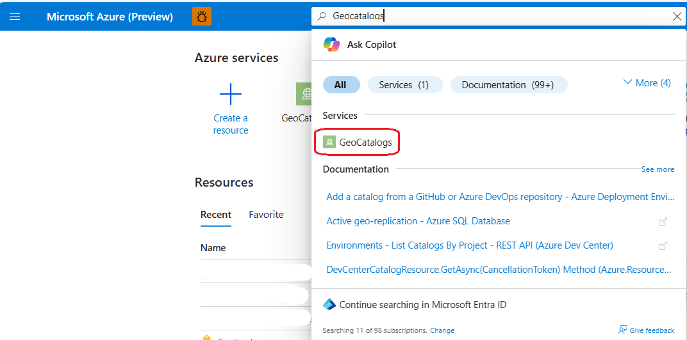
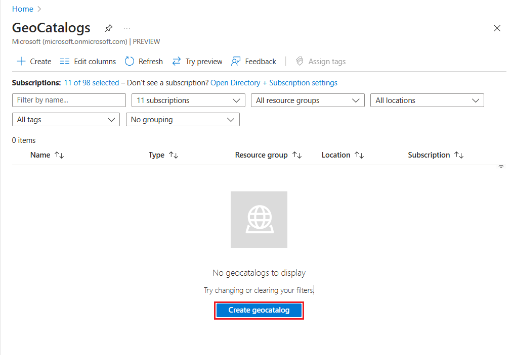
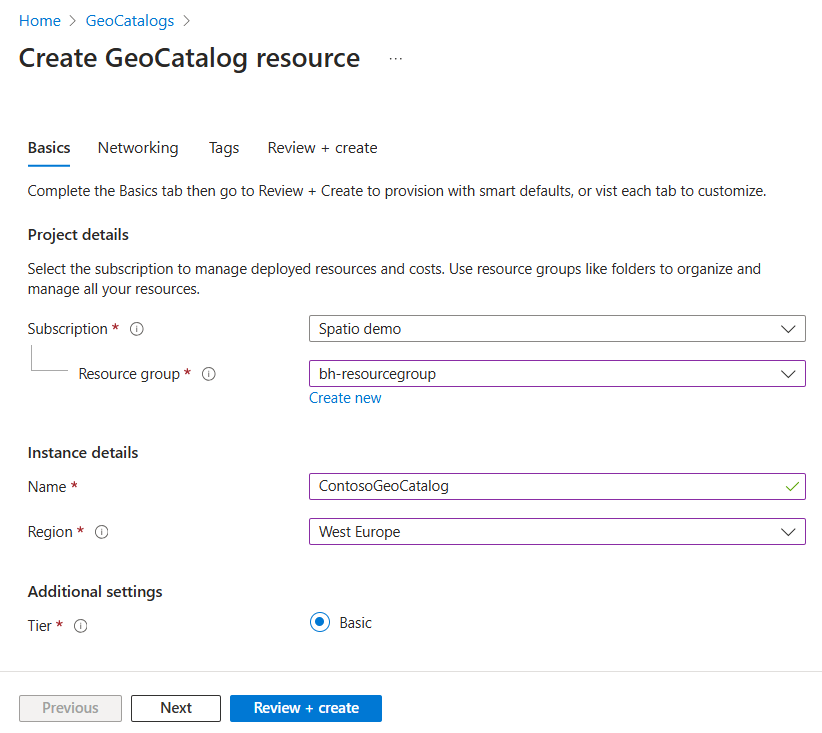
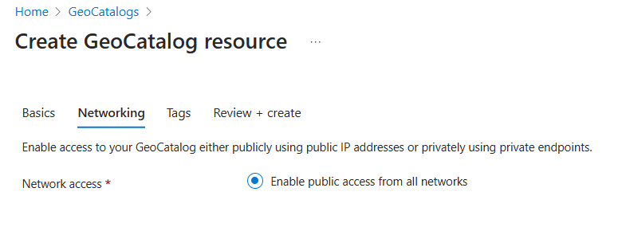
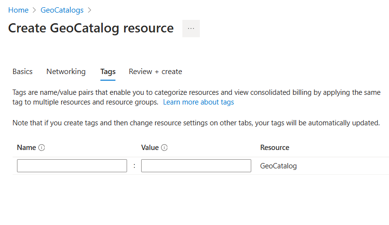
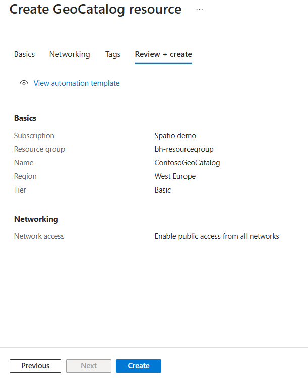
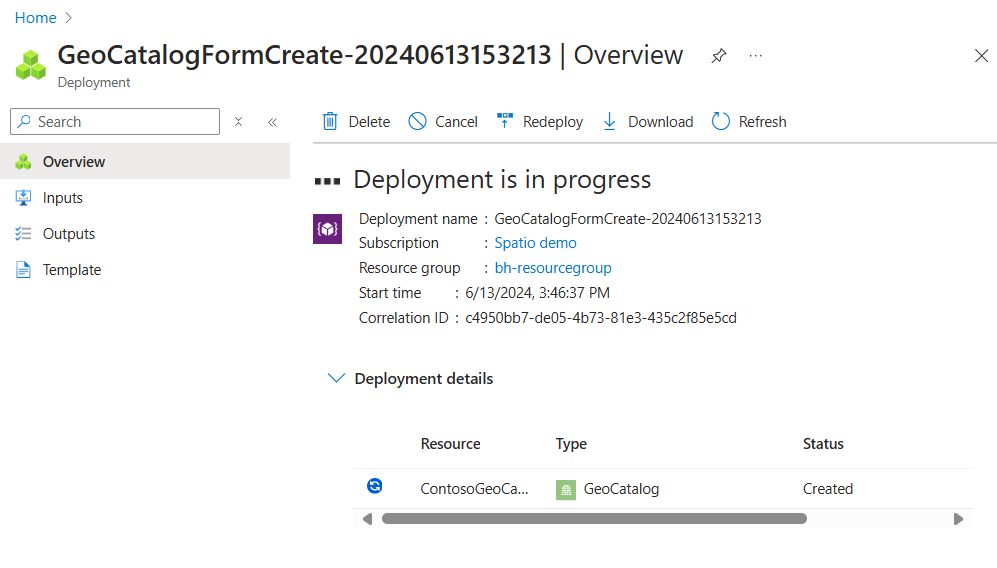
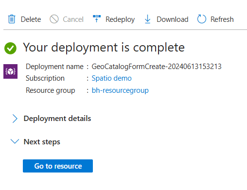

# Deploy a GeoCatalog resource

This article guides the reader through the process of deploying a GeoCatalog resource. The GeoCatalog resource is the top-level container for Geospatial data stored using Microsoft Planetary Computer Pro. Once a GeoCatalog resource is deployed, the user can begin to ingest geospatial data into Planetary Computer Pro. Geospatial data stored in a GeoCatalog is indexed, queried, and retrieved using the SpatioTemporal Access Catalog (STAC) open-standard. For more information on STAC, see [STAC overview](./stac-overview.md).

> [!NOTE]
> Due to the recovery from recent  [Azure Front Door issues](https://azure.status.microsoft/status/history/?trackingId=YKYN-BWZ), users can expect deployments to take up to 2 hours.

## Prerequisites

- An Azure account and subscription [Create an account for free](https://azure.microsoft.com/pricing/purchase-options/azure-account?cid=msft_learn).
- [Azure CLI](/cli/azure/install-azure-cli) (For using the REST API) 

## Methods

This article describes several methods for deploying a Planetary Computer Pro GeoCatalog:

- Using the Azure portal.
- Using the Azure REST API.
- Using the Azure SDKs (.NET, Java, JavaScript, Python, Go).

# [Azure portal](#tab/azureportal)
## Deploy GeoCatalog with the Azure portal

1. Navigate to the [Azure portal](https://portal.azure.com/)

1. Find the **GeoCatalogs** resource type use the Azure portal search bar at the top of the page; select "GeoCatalogs" from under the list of Services.

   [  ](media/search-for-geocatalogs.png#lightbox)

1. Start the GeoCatalog creation process by either 1) selecting the **Create** button at the top left of the screen, or 2) selecting the **Create geo catalog** button in the lower center of the screen. The **Create geocatalog** button doesn't appear if you have one or more existing GeoCatalogs.

   [  ](media/create-geocatalogs-button.png#lightbox)

1. From the "Basics" tab of the "Create GeoCatalog Resource" workflow, select the Subscription and Resource Group to which you would like to deploy your GeoCatalog. Provide a unique Name for your GeoCatalog resource, and select the Azure Region you wish to deploy into. Select "Next" to proceed to the next tab.

   > [!NOTE]
      > We support deployment to the following regions in Preview:
      >
      > - East US
      > - North Central US
      > - West Europe
      > - Canada Central
      > - UK South
      > - [US Gov Virginia](us-government-cloud-support.md)

      [  ](media/complete-basics-tab-geocatalog.png#lightbox)

1. From the "Networking" tab, select your networking options. Select "Next" to proceed to the next tab.

   > [!NOTE]
      > Only **Enable public access from all networks** option is supported in Preview.

      [  ](media/enable-public-access-from-networks.png#lightbox)

1. From the "Tags" tab, add any desired Tags to your new GeoCatalog resource. Tags are optional; refer to [Naming and Tagging Best Practices](/azure/cloud-adoption-framework/ready/azure-best-practices/naming-and-tagging) for guidance on how to use Azure Tags. Select "Next" to proceed to the next tab.

   [  ](media/create-geocatalog-tags.png#lightbox)

1. From the "Review and create" tab, review selections made in the previous step. Make necessary corrections in previous sections by selecting the **Previous** button at the bottom of the page. You can also directly navigate to a tab in the workflow by selecting that tab's name. Once you're satisfied with your settings and selections, select the **Create** button.

   [  ](media/review-create-geocatalog-resource.png#lightbox)

1. You see a "Deployment is in progress" page while you wait for your GeoCatalog deployment to complete. This process can take **10 or more minutes**. The "Status" of the resource deployment shows "Created" even before the deployment is complete.

   [  ](media/geocatalog-deployment-in-progress.png#lightbox)

1. The deployment page updates to "Your deployment is complete" when the deployment finishes. You can select "Go to resource" to navigate directly to your newly created GeoCatalog resource.

   [  ](media/geocatalog-deployment-complete.png#lightbox)

## Next Steps
- [Create a STAC Collection](./create-collection-web-interface.md)
- [Create a STAC Collection from the API](./create-stac-collection.md)
- [Manage Access to your GeoCatalog resource](./manage-access.md)
- [Assign a user-assigned managed identity to a GeoCatalog resource](./assign-managed-identity-geocatalog-resource.md)

## Related Content

- [Delete a GeoCatalog](./delete-geocatalog-resource.md)

# [REST API](#tab/restapi)
## Deploy GeoCatalog with the Azure REST API

1. Sign in to your Azure portal and open up Cloud Shell.

1. Create an instance of GeoCatalog by selecting Bash mode, and run the following commands:

   ```bash
   # Change the active subscription using the subscription name or id, which has been allowed for GeoCatalog preview
   az account set --subscription "sub_name or sub_id"

   # Register Microsoft.Orbital resource provider even if it's already registered to take effect for GeoCatalog.
   az provider register -n Microsoft.Orbital

   # Set up the parameters of subscription_id, resource_group, target Azure region/location, and Spatio catalog name to be created. Note the subscription_id and resource_group need to be existing resources. Update Location and Catalog_name accordingly.
   export SUBSCRIPTION_ID="sub_id"
   export RESOURCE_GROUP="rg_name"
   export LOCATION=northcentralus
   export CATALOG_NAME="catalog_name"

   # Kick off the GeoCatalog deployment process, which may take 10-20 minutes
   az rest --method PUT --uri "/subscriptions/$SUBSCRIPTION_ID/resourceGroups/$RESOURCE_GROUP/providers/Microsoft.Orbital/geoCatalogs/$CATALOG_NAME?api-version=2026-04-15" --body '{"location": "'$LOCATION'", "Properties":{"tier":"Basic"}}'

   # Check the status of the deployment
   az rest --method GET --uri "/subscriptions/$SUBSCRIPTION_ID/resourceGroups/$RESOURCE_GROUP/providers/Microsoft.Orbital/geoCatalogs/$CATALOG_NAME?api-version=2026-04-15"

   # Get catalog uri
   az resource show -g $RESOURCE_GROUP -n $CATALOG_NAME --namespace Microsoft.Orbital --resource-type "geocatalogs"
   ```

1. Once the deployment status shows succeeded, you should be able to see the created GeoCatalog instance on the portal under the specified resource group.

## Next Steps
- [Create a STAC Collection](./create-collection-web-interface.md)
- [Create a STAC Collection from the API](./create-stac-collection.md)
- [Manage Access to your GeoCatalog resource](./manage-access.md)
- [Assign a user-assigned managed identity to a GeoCatalog resource](./assign-managed-identity-geocatalog-resource.md)

## Related Content

- [Delete a GeoCatalog](./delete-geocatalog-resource.md)

# [.NET](#tab/dotnet)
## Deploy GeoCatalog with the .NET SDK

### Prerequisites

- [.NET 8.0 or later](https://dotnet.microsoft.com/download)
- Install the SDK package:

   ```bash
   dotnet add package Azure.ResourceManager.PlanetaryComputer
   ```

### Deploy a GeoCatalog

```csharp
using Azure.Identity;
using Azure.ResourceManager;
using Azure.ResourceManager.PlanetaryComputer;
using Azure.ResourceManager.Resources;
using Azure.Core;

// Authenticate using DefaultAzureCredential
var client = new ArmClient(new DefaultAzureCredential());

// Get the resource group
string subscriptionId = "<your-subscription-id>";
string resourceGroupName = "<your-resource-group>";
string catalogName = "<your-geocatalog-name>";
string location = "northcentralus";

ResourceGroupResource resourceGroup = client.GetResourceGroupResource(
    ResourceGroupResource.CreateResourceIdentifier(subscriptionId, resourceGroupName));

// Get the GeoCatalogs collection
var geoCatalogs = resourceGroup.GetPlanetaryComputerGeoCatalogs();

// Define the GeoCatalog resource
var catalogData = new PlanetaryComputerGeoCatalogData(new AzureLocation(location))
{
    Properties = new PlanetaryComputerGeoCatalogProperties
    {
        Tier = PlanetaryComputerGeoCatalogTier.Basic
    }
};

// Create the GeoCatalog (this is a long-running operation)
var operation = await geoCatalogs.CreateOrUpdateAsync(
    Azure.WaitUntil.Completed,
    catalogName,
    catalogData);

var catalog = operation.Value;
Console.WriteLine($"GeoCatalog '{catalog.Data.Name}' deployed successfully.");
```

For more information, see the [.NET SDK reference](/dotnet/api/azure.resourcemanager.planetarycomputer).

## Next Steps
- [Create a STAC Collection](./create-collection-web-interface.md)
- [Create a STAC Collection from the API](./create-stac-collection.md)
- [Manage Access to your GeoCatalog resource](./manage-access.md)
- [Assign a user-assigned managed identity to a GeoCatalog resource](./assign-managed-identity-geocatalog-resource.md)

## Related Content

- [Delete a GeoCatalog](./delete-geocatalog-resource.md)

# [Java](#tab/java)
## Deploy GeoCatalog with the Java SDK

### Prerequisites

- Java 8 or later
- Add the Maven dependency:

   ```xml
   <dependency>
       <groupId>com.azure.resourcemanager</groupId>
       <artifactId>azure-resourcemanager-planetarycomputer</artifactId>
       <version>1.0.0</version>
   </dependency>
   ```

### Deploy a GeoCatalog

```java
import com.azure.identity.DefaultAzureCredentialBuilder;
import com.azure.resourcemanager.planetarycomputer.PlanetaryComputerManager;
import com.azure.resourcemanager.planetarycomputer.models.GeoCatalog;
import com.azure.resourcemanager.planetarycomputer.models.GeoCatalogProperties;
import com.azure.resourcemanager.planetarycomputer.models.CatalogTier;

public class DeployGeoCatalog {
    public static void main(String[] args) {
        PlanetaryComputerManager manager = PlanetaryComputerManager.authenticate(
            new DefaultAzureCredentialBuilder().build(),
            "<your-subscription-id>");

        GeoCatalog catalog = manager.geoCatalogs()
            .define("<your-geocatalog-name>")
            .withRegion("northcentralus")
            .withExistingResourceGroup("<your-resource-group>")
            .withProperties(new GeoCatalogProperties()
                .withTier(CatalogTier.BASIC))
            .create();

        System.out.println("GeoCatalog deployed: " + catalog.name());
    }
}
```

For more information, see the [Java SDK reference](/java/api/overview/azure/planetarycomputer-readme).

## Next Steps
- [Create a STAC Collection](./create-collection-web-interface.md)
- [Create a STAC Collection from the API](./create-stac-collection.md)
- [Manage Access to your GeoCatalog resource](./manage-access.md)
- [Assign a user-assigned managed identity to a GeoCatalog resource](./assign-managed-identity-geocatalog-resource.md)

## Related Content

- [Delete a GeoCatalog](./delete-geocatalog-resource.md)

# [JavaScript](#tab/javascript)
## Deploy GeoCatalog with the JavaScript SDK

### Prerequisites

- [Node.js 18 or later](https://nodejs.org/)
- Install the SDK packages:

   ```bash
   npm install @azure/arm-planetarycomputer @azure/identity
   ```

### Deploy a GeoCatalog

```javascript
import { SpatioClient } from "@azure/arm-planetarycomputer";
import { DefaultAzureCredential } from "@azure/identity";

const subscriptionId = "<your-subscription-id>";
const resourceGroupName = "<your-resource-group>";
const catalogName = "<your-geocatalog-name>";

const credential = new DefaultAzureCredential();
const client = new SpatioClient(credential, subscriptionId);

async function deployGeoCatalog() {
  const catalog = await client.geoCatalogs.create(
    resourceGroupName,
    catalogName,
    {
      location: "northcentralus",
      properties: {
        tier: "Basic"
      }
    }
  );

  console.log(`GeoCatalog '${catalog.name}' deployed successfully.`);
}

deployGeoCatalog().catch(console.error);
```

For more information, see the [JavaScript SDK reference](/javascript/api/@azure/arm-planetarycomputer).

## Next Steps
- [Create a STAC Collection](./create-collection-web-interface.md)
- [Create a STAC Collection from the API](./create-stac-collection.md)
- [Manage Access to your GeoCatalog resource](./manage-access.md)
- [Assign a user-assigned managed identity to a GeoCatalog resource](./assign-managed-identity-geocatalog-resource.md)

## Related Content

- [Delete a GeoCatalog](./delete-geocatalog-resource.md)

# [Python](#tab/python)
## Deploy GeoCatalog with the Python SDK

### Prerequisites

- Python 3.10 or later
- Install the SDK packages:

   ```bash
   pip install azure-mgmt-planetarycomputer azure-identity
   ```

### Deploy a GeoCatalog

```python
from azure.identity import DefaultAzureCredential
from azure.mgmt.planetarycomputer import PlanetaryComputerMgmtClient
from azure.mgmt.planetarycomputer.models import GeoCatalog, GeoCatalogProperties

credential = DefaultAzureCredential()
client = PlanetaryComputerMgmtClient(
    credential=credential,
    subscription_id="<your-subscription-id>"
)

catalog = client.geo_catalogs.begin_create(
    resource_group_name="<your-resource-group>",
    catalog_name="<your-geocatalog-name>",
    resource=GeoCatalog(
        location="northcentralus",
        properties=GeoCatalogProperties(tier="Basic")
    )
).result()

print(f"GeoCatalog '{catalog.name}' deployed successfully.")
```

For more information, see the [Python SDK reference](/python/api/overview/azure/mgmt-planetarycomputer-readme).

## Next Steps
- [Create a STAC Collection](./create-collection-web-interface.md)
- [Create a STAC Collection from the API](./create-stac-collection.md)
- [Manage Access to your GeoCatalog resource](./manage-access.md)
- [Assign a user-assigned managed identity to a GeoCatalog resource](./assign-managed-identity-geocatalog-resource.md)

## Related Content

- [Delete a GeoCatalog](./delete-geocatalog-resource.md)

# [Go](#tab/go)
## Deploy GeoCatalog with the Go SDK

### Prerequisites

- Go 1.21 or later
- Install the SDK module:

   ```bash
   go get github.com/Azure/azure-sdk-for-go/sdk/resourcemanager/planetarycomputer/armplanetarycomputer
   ```

### Deploy a GeoCatalog

```go
package main

import (
	"context"
	"fmt"
	"log"

	"github.com/Azure/azure-sdk-for-go/sdk/azcore/to"
	"github.com/Azure/azure-sdk-for-go/sdk/azidentity"
	"github.com/Azure/azure-sdk-for-go/sdk/resourcemanager/planetarycomputer/armplanetarycomputer"
)

func main() {
	cred, err := azidentity.NewDefaultAzureCredential(nil)
	if err != nil {
		log.Fatalf("failed to create credential: %v", err)
	}

	clientFactory, err := armplanetarycomputer.NewClientFactory(
		"<your-subscription-id>", cred, nil)
	if err != nil {
		log.Fatalf("failed to create client factory: %v", err)
	}

	client := clientFactory.NewGeoCatalogsClient()

	poller, err := client.BeginCreate(context.Background(),
		"<your-resource-group>",
		"<your-geocatalog-name>",
		armplanetarycomputer.GeoCatalog{
			Location: to.Ptr("northcentralus"),
			Properties: &armplanetarycomputer.GeoCatalogProperties{
				Tier: to.Ptr(armplanetarycomputer.CatalogTierBasic),
			},
		}, nil)
	if err != nil {
		log.Fatalf("failed to start deployment: %v", err)
	}

	result, err := poller.PollUntilDone(context.Background(), nil)
	if err != nil {
		log.Fatalf("failed to deploy: %v", err)
	}

	fmt.Printf("GeoCatalog '%s' deployed successfully.\n", *result.Name)
}
```

For more information, see the [Go SDK source](https://github.com/Azure/azure-sdk-for-go/tree/main/sdk/resourcemanager/planetarycomputer/armplanetarycomputer).

## Next Steps
- [Create a STAC Collection](./create-collection-web-interface.md)
- [Create a STAC Collection from the API](./create-stac-collection.md)
- [Manage Access to your GeoCatalog resource](./manage-access.md)
- [Assign a user-assigned managed identity to a GeoCatalog resource](./assign-managed-identity-geocatalog-resource.md)

## Related Content

- [Delete a GeoCatalog](./delete-geocatalog-resource.md)

---
